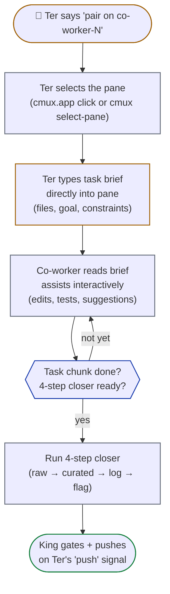

# co-workers.md — Co-worker (Ter-paired) lanes

Co-worker lanes (`co-worker-1`, `co-worker-2`, …) are the **interactive Ter-paired** track. Same Claude-teammate spawn mechanics as workers, but the dispatch flow is different: **Ter drives, the co-worker assists**.

See [`workers.md`](workers.md) for the shared 4-step closer / dispatch / spawn-rights protocol (everything below builds on it). See [`kings.md`](kings.md) for King-only operations (push, gates). See [`git.md`](git.md) for branch model.

---

## Co-worker role

- **Dormant by default.** No autonomous task picking. The pane exists in the kingdom layout but stays idle until Ter signals.
- **Activates when Ter says** "pair on co-worker-1", "UI work on co-worker", "I'll drive co-worker-1", or similar.
- **Co-worker master is interactive:** Ter drives the editing (typing into the lane pane, selecting which files to touch, making design calls); the Claude session inside the lane assists (suggests, refactors, runs tests, reads context).
- **Co-worker lane master runs Opus** (same default as autonomous workers). Sub-agents it spawns follow the P1/P2/P3 chain (Sonnet default).
- **4-step closer still applies** for any reasoning/output the co-worker session produces — same artifact layout as workers, just with slug `co-worker-N`.

---

## Lane setup (pre-spawned at kingdom startup)

The co-worker's pane and worktree are created as part of the kingdom spawn checklist (see [`kings.md`](kings.md) → Spawning the kingdom). At session start:

- `.worktrees/co-worker-N/` exists (created via `git worktree add -b "co-worker-N" "$PROJ/.worktrees/co-worker-N" "origin/develop"`), branch `co-worker-N` checked out.
- A Claude session is running in that pane (via `cmux claude-teams` teammate slot in primary mode, or a raw tmux pane in fallback mode).
- The pane is idle — the King does NOT inject autonomous TODO prompts into it.

Ter activates the lane by:
- Selecting the pane (clicking it in cmux.app, or switching to it in tmux).
- Typing directly into the pane to start a conversation with that lane's Claude session.

---

## Activation flow

When Ter signals "pair on co-worker-1":

1. **Ter selects the co-worker pane** (manually in cmux.app, or via `cmux select-pane`).
2. **Ter types a task brief directly** into the pane — describing what to work on, which files, what the goal is.
3. **The co-worker session reads the brief** and starts assisting interactively.
4. **King may also dispatch a TER-AUTHORED brief** into the pane via `cmux send` if Ter explicitly asks ("King, send my plan to co-worker-1"). But the King does NOT pick task content for co-workers — that's Ter's call.

Activation: how a co-worker lane goes from dormant to active.



---

## Task file (same as workers, with Ter-dictated briefs)

Co-workers follow the same task file convention as autonomous workers (see [`workers.md`](workers.md) → "Task file template"). One file per task; lane master is sole writer; sub-agents read only.

**Path:** `<workspace>/.kingdom/<project>/tasks/<UTC>__co-worker-N__<sub-task-id>.md`

The only difference from autonomous workers:

- **Brief source:** Ter typically dictates the brief verbatim (typing into the pane or via `cmux send` from the King at Ter's request). The co-worker captures what Ter said into the task file's "Brief" section, then proceeds with planning.
- **Sub-task ID:** may be informal — co-worker work isn't always tied to a sub-task in `TODO_Master.csv`. Use a descriptive slug if no formal ID exists: `<UTC>__co-worker-1__navbar-redesign.md`.
- **Multi-layer planning is OPTIONAL** for co-workers. If Ter is driving (e.g., live UI iteration), the task file may be a single layer with checkboxes for the agreed-upon work. If the co-worker is doing autonomous follow-up (Ter set scope, then walked away), full multi-layer planning applies — same as a worker.

Other than that, the schema, lifecycle, and read/write rules are identical to workers.

---

## Dispatch differences from autonomous workers

| Aspect | Workers (autonomous) | Co-workers (Ter-paired) |
|---|---|---|
| Task source | `kingdom.json.taskSource` — King picks claimable sub-tasks | Ter dictates the task directly |
| Claim files | Yes — King writes `<LOGS>/claims/<id>.lane` before dispatch | **No** — co-worker work is Ter-directed; may intentionally overlap with autonomous lanes |
| Dispatch mechanism | King sends a 4-step-closer prompt via `cmux send` / `tmux send-keys` | Ter types directly; King mediates only if asked |
| `/compact` between tasks | King sends `/compact` after each task closer | Ter manages context manually (or asks King to send `/compact`) |
| Autonomous TODO picking | Yes — King iterates from project's task source | **Never** — co-workers don't claim from TODO |

---

## 4-step closer still applies

Even though dispatch is interactive, the **artifact protocol is unchanged**. When the co-worker produces any reasoning, file edits, or analysis, it runs the 4-step closer:

```text
<LOGS>/raw/<ID>__opus-co-worker-N.md      ← raw output
<LOGS>/<ID>.md                              ← curated digest (## TL;DR top)
<LOGS>/master_agent.log                     ← appended 1-line status
<LOGS>/done/<ID>__opus-co-worker-N.flag    ← sentinel
```

Slug = `co-worker-N`. Master polls the flag the same way it does for autonomous workers.

When Ter says "we're done with this UI task on co-worker-1", the co-worker fires the closer and signals the King. Then Ter can ask for the pre-commit gate + push.

---

## PR / push gates identical to autonomous workers

When Ter declares a co-worker's work ready:

1. King runs the pre-commit gate inside `.worktrees/co-worker-N/` — same checks (typecheck + tests + dry-merge + cross-lane overlap). See [`kings.md`](kings.md) → Pre-commit gate.
2. King writes the test report to `<project>/docs/test-reports/KING_<UTC>__co-worker-N__<topic>.md`.
3. King reports to Ter: "co-worker-N ready. Test report at … Push?"
4. Ter says "push" → King carves `feature/<topic>` from `co-worker-N` + FINAL conflict check + `git push` + `gh pr create`. See [`git.md`](git.md) → Push approval gate.
5. After PR merge: King cleans up — `git worktree remove "$PROJ/.worktrees/co-worker-N" --force; git branch -D "co-worker-N" 2>/dev/null || true` + then `git worktree add -b "co-worker-N" "$PROJ/.worktrees/co-worker-N" "origin/develop"` (reset for next pair-up).

The King is still the sole pusher. Co-worker masters never push, just like workers don't.

---

## Conflict with autonomous lanes

Because co-workers DON'T consume claims from `<LOGS>/claims/`, their file edits may intentionally (or accidentally) overlap with autonomous workers' work.

The King's pre-commit gate **detects overlap** when running the cross-lane file-overlap check (see [`kings.md`](kings.md) → Pre-commit gate, step d). If overlap is detected, the King reports it:

```text
Test report — co-worker-1 — <task>
  ...
  Cross-lane overlap: files=apps/swt-frontend/.../page.tsx with lane=worker-2
  Next action: Ter decides — push co-worker-1 first then rebase worker-2, OR push worker-2 first then rebase co-worker-1
```

Resolution is **always Ter's call**. Co-worker work has no automatic priority — Ter decides the merge order. Common patterns:
- Co-worker is doing a tightly-scoped UI iteration → push co-worker-1 first, dispatch a rebase task to worker-2.
- Co-worker is exploratory → land worker-2 first, ask co-worker to integrate worker-2's changes locally before its own PR.

---

## When to use multiple co-workers

`kingdom.json.shape.co-workers` can be >1 if Ter wants multiple parallel paired tracks. Examples:

- **co-worker-1** = UI exploration (Figma → React iteration)
- **co-worker-2** = content editing (copy review, marketing landing tweaks)

Each gets its own slot in the cmux layout + its own worktree on a separate `co-worker-N` branch. Ter switches between them as needed.

---

## What co-workers DO

Same as workers (see [`workers.md`](workers.md) → Spawn rights inside a lane):

- Read project files.
- Edit + commit locally to `co-worker-N`.
- Lane master itself runs **Opus** (high-quality coding inside the lane). Sub-agents it spawns follow the P1/P2/P3 chain: **Sonnet** by default (P1), **Haiku** for bulk reads (P2), **Opus** for sensitive files (P3). The lane master's model is separate from the sub-agent chain. No eco cap; parallel allowed.
- Run the 4-step closer when the task chunk is complete.
- Use `cmux notify` to ping King/Ter when something needs attention.
- Write the task file (mandatory, Step 0 of any task).

## What co-workers DO NOT do

Same forbidden list as workers (see [`workers.md`](workers.md) → What workers DO NOT do):

- ❌ No `git push` — King is the sole pusher.
- ❌ No `feature/*` branch creation.
- ❌ No `gh pr create`.
- ❌ No FINAL conflict check.
- ❌ No authoritative pre-commit gate.
- ❌ Reuse task files across tasks. New task = new task file.

All remote-touching git operations remain King-only.
