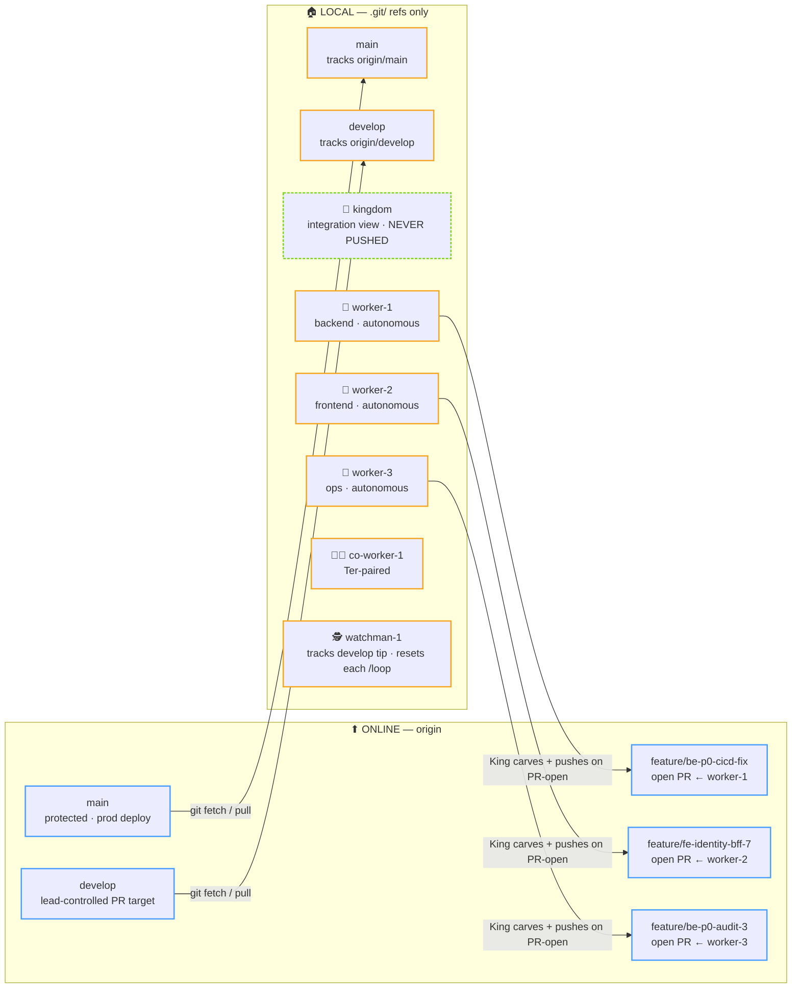
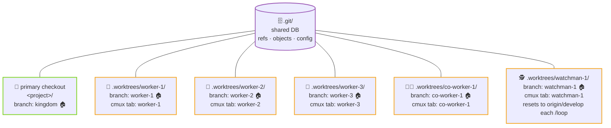
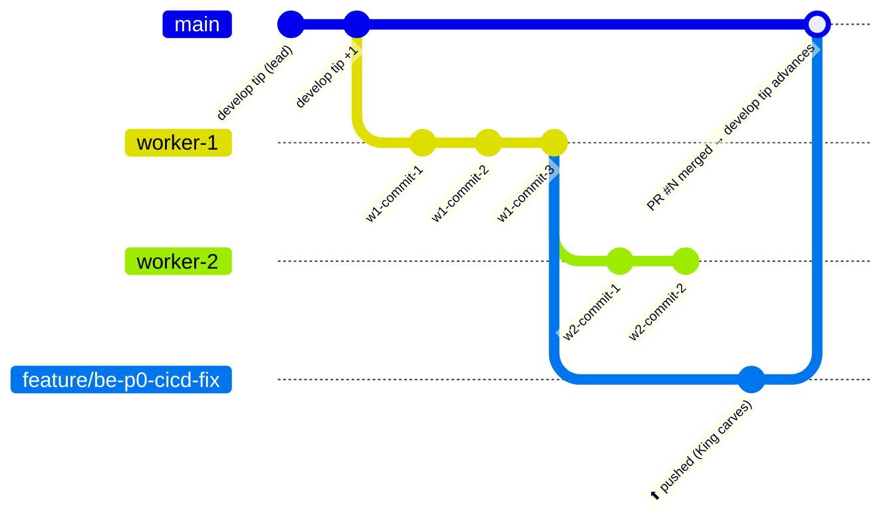
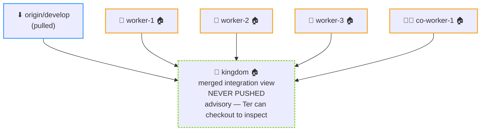

# git.md — Branch model + commit flow + PR conventions

Git workflow for the kingdom. See [`index.md`](index.md) for the entry-point overview and [`kings.md`](kings.md) for who actually runs each git operation.

---

## Four branch tiers (all lane branches + `kingdom` are local-only)

| Branch | Lives in | Role |
|---|---|---|
| `worker-1..N` / `co-worker-1..M` / `watchman-1..K` | `.worktrees/<role>-<n>/` | 🏠 **LOCAL-ONLY** lane work surfaces. Never pushed. Persistent identities (e.g., `worker-1` always = worker-1; reset between PR batches). |
| `kingdom` | primary checkout | 🏠 **LOCAL-ONLY** King-maintained integration view (merge of `develop` + all `worker-N` / `co-worker-N` tips). Never pushed. Advisory only — the user can `git checkout kingdom` for combined state. Does NOT participate in PRs. Watchman branches NOT merged in (they just track develop). |
| `feature/<topic>` | (ref only, no worktree) | ⬆ **PUSHED.** PR branch — carved fresh from the relevant lane branch tip at PR-open time. Pushed to origin, PR opened, branch deleted after merge. One-shot. |
| `main` / `develop` | tracked from origin | ⬇ pulled-from-origin only. the user never pushes. Lead controls. |

**The PR surface is decoupled from the work surface.** Lanes always work on `<role>-<n>` (local, persistent identities, configurable count). PRs always live on `feature/<topic>` (remote, descriptive, one-shot). Separation means lane local history is never polluted by remote-branch hygiene, and `feature/*` names can be chosen per-PR for clarity without disturbing the lane.

---

## Reference figure — branch + worktree topology

Concrete example with one PR in flight from worker-1.

**Branch visibility (online vs local):**



**Worktree layout (all share one `.git/` database):**



**Commit flow — lane finishes → PR opens → develop tip advances:**



**Local `kingdom` integration view (advisory only — NEVER PUSHED):**



### Key invariants

- Five 🏠 branches never leave the laptop (in the default 3-1-1 shape): `kingdom` + `worker-1..3` + `co-worker-1` + `watchman-1`. With other shapes, more.
- Three branches participate in the local↔remote boundary: `main` (read-only for the user), `develop` (pulled, never pushed by the user), `feature/*` (push-on-PR-open, delete-after-merge).
- Lane numbers are slot identities — local-only branches have no historical meaning across PR batches; they reset after every merge.
- `kingdom` is a snapshot view, not a history. Its merge graph rebuilds on every refresh; nothing depends on `kingdom`'s history surviving.

---

## Commit flow (sequence)

1. Lane works on `<role>-<n>` (in its git worktree at `.worktrees/<role>-<n>/`). Sub-agents spawn freely per the P1/P2/P3 chain — see [`workers.md`](workers.md) → Spawn rights.
2. Lane completes a sub-task → 4-step closer fires (raw + curated + log + sentinel flag). Task file at `.kingdom/<project>/tasks/<UTC>__<lane>__<sub-task-id>.md` is updated with final summary (lane master wrote it before dispatch; sub-agents read only).
3. King polls the sentinel flag → reads the curated TL;DR → decides.
4. King runs the **pre-commit gate** inside the lane's worktree — typecheck + tests + dry-merge vs `origin/develop` + cross-lane file-overlap. See [`kings.md`](kings.md) → Pre-commit gate. Commands come from `kingdom.json.gate.*`.
5. King writes a `KING_<UTC>__<lane-name>__<sub-task-id>.md` test report to `<project>/docs/test-reports/`.
6. King reports to chat: "Lane ready. Test report at … Proposed PR title: … Proposed PR branch: feature/<topic>. Push?"
7. The user says **push** (or holds with reasoning).
8. King runs **FINAL conflict check** — `git merge-tree --write-tree --no-messages origin/develop <role>-<n>`. If clean → continue; if conflicts → dispatch rebase to lane, re-run gate, re-request approval.
9. King carves + pushes (from the primary checkout, **not** the lane worktree):
   ```bash
   cd <project>
   git branch feature/<topic> <role>-<n>
   git push -u origin feature/<topic>
   gh pr create --base develop --head feature/<topic> --title "..." --body "..."
   ```
10. King logs the push to `master_agent.log`.
11. After PR merge (lead clicks Merge or manually closes): King cleans up:
    ```bash
    cd <project>
    git checkout kingdom
    git branch -D feature/<topic>
    git push origin --delete feature/<topic> 2>/dev/null || true
    git worktree remove "$PROJ/.worktrees/<role>-<n>" --force
    git branch -D <role>-<n> 2>/dev/null || true
    git worktree add -b <role>-<n> "$PROJ/.worktrees/<role>-<n>" origin/develop    # lane reset, back at develop tip
    ```

---

## Push approval gate (King-only)

**Push authority lives with the King alone. Lane masters NEVER push.** Lane masters do their work, run the 4-step closer, drop the sentinel flag — that's it. No `git push`, no `feature/*` branch creation, no `gh pr create`. All remote-touching git operations are King-only, gated by the user's explicit approval and the King's FINAL conflict check.

Full sequence in [`kings.md`](kings.md) → Push approval gate.

**Why not push lane branches directly?** Lane branches are persistent identities (`worker-1` always = worker-1) — pushing them would mix lane-rotation hygiene with remote-branch hygiene. Carving `feature/<topic>` keeps the PR surface descriptive and one-shot, and lets you reset lanes between PR batches without any remote-side cleanup.

---

## FINAL conflict check (King-only)

Runs AFTER the user's approval, BEFORE actual push. Catches `origin/develop` drift during the approval window.

```bash
cd <project>                                          # King's cwd = primary checkout
git fetch origin
# Plumbing-only dry-merge — no working-tree side effects, no branch checkout.
if git merge-tree --write-tree --no-messages origin/develop "<role>-<n>" \
     | grep -qE '^<<<<<<<|^=======|^>>>>>>>'; then
  echo "CONFLICT: origin/develop moved while waiting for approval."
  echo "Lane needs rebase before push. NOT pushing."
  # → dispatch rebase to lane, re-run pre-commit gate, re-request approval
fi
```

`git merge-tree` is plumbing — computes the merge result without modifying any branch ref, working tree, or index. Pure probe; no side effects.

---

## Refreshing the `kingdom` integration branch (advisory only)

King keeps `kingdom` (in the primary checkout) merged-up so the user can `git checkout kingdom` and see all lanes' combined state at any time:

```bash
cd <project>
BASE=develop                                          # from kingdom.json.git.base
git checkout kingdom
git merge --no-edit "origin/$BASE"
for LANE in worker-1 worker-2 worker-3 co-worker-1; do  # active workers + co-workers
  git merge --no-edit "$LANE" 2>/dev/null || true
done
# watchman-* are NOT merged in — they just track develop.
# NEVER push kingdom.
```

**Refresh cadence:** after every lane completion, on the user's request, or whenever the merge graph might be stale.

**`kingdom` does NOT participate in PRs.** PRs are carved from `<role>-<n>` directly into `feature/<topic>`. The integration view is purely advisory; if it gets tangled, delete it (`git branch -D kingdom`) and recreate by re-running the loop above. Nothing depends on `kingdom`'s history surviving — lane history lives on the lane branches.

---

## PR conventions

Per-project conventions live in the project's own `CLAUDE.md` and (optionally, Tier 5 schema) in `kingdom.json.pr.*`. Defaults:

| Field | Default |
|---|---|
| Base branch | `develop` |
| Head branch | `feature/<topic>` (carved fresh at push time) |
| Title pattern | `feat(scope): subject` (Conventional Commits) |
| Body | Summary / Test plan / Out of scope sections; `cc @<reviewer>` |
| Reviewer | per project (e.g., `@eruditus-vir` for bfg-swt) |
| Labels | per project (tier / component / type) |
| Merge style | per project (merge-commit or squash) |
| Force-push | `--force-with-lease` only, never bare `--force` |

---

## Stacked PRs (when a lane depends on another open PR)

If `worker-2`'s work depends on `worker-1`'s not-yet-merged feature branch:

1. King spawns `worker-2` from the dep's PR branch: `git worktree add -b worker-2 "$PROJ/.worktrees/worker-2" feature/be-p0-cicd-fix` (instead of `origin/develop`).
2. When opening `worker-2`'s PR, body declares `## Depends on #N` (the dep's PR number).
3. After dep merges to develop, King rebases `worker-2` onto develop and force-pushes (`--force-with-lease`) the dep PR's branch — or retargets the dep's PR base in GitHub if branch was deleted.

Avoid deep stacks (>2 levels) — they get painful when middle PRs change.
