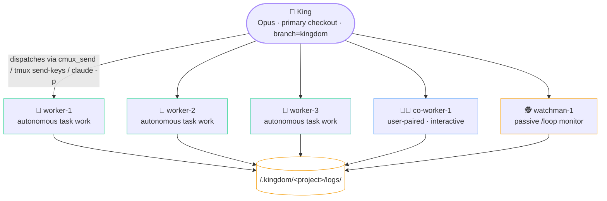

# index.md — The Kingdom (entry point)

> **ORCHESTRATOR.md was retired on 2026-05-17.** Its content is split into role-specific files in this directory. Start here.

The kingdom is a workspace-level AI-agent orchestration model: a single **King** (Opus) coordinates multiple **lanes** (workers / co-workers / watchmen, each in its own `git worktree` on its own branch). Each project's shape and conventions live in `<workspace-root>/.kingdom/<project>/kingdom.json`; runtime artifacts (logs, claims, sentinel flags) live next to it in `<workspace-root>/.kingdom/<project>/logs/`.

## File map — where to find what

| File | Owns |
|---|---|
| **`index.md`** (this file) | Workspace layout, per-project file conventions, operating rules, bootstrap procedure, session-start mode detection, sub-agent priority chain, agent-roles summary, project registry |
| [`rules/`](rules/) | **Priority-tiered rules (v0.34.0: one rule per file)** — start at [`rules/index.md`](rules/index.md) (Tier-1 legend + registry of `R01`…`R55`), open only the rule files you need. King reads the index **FIRST** at session start per R14. (`rules.md` is now a pointer to this folder.) |
| [`king.md`](roles/king.md) | King role: planning fan-out, dispatch (cmux_send / tmux / claude -p), pre-commit gate, push authority, FINAL conflict check, `kingdom` integration refresh, idle policy, reading the database |
| [`worker.md`](roles/worker.md) | Worker role: 4-step closer (5-step for tab-spawned sub-agents), dispatch templates, spawn rights (no eco mode), task sequencing, slug convention, sub-agent lifecycle |
| [`co-worker.md`](roles/co-worker.md) | Co-worker (user-paired) interactive protocol |
| [`watchman.md`](roles/watchman.md) | Watchman `/loop` body, WATCH_*.md report naming, smoke + PR babysitting, cross-story drift scan, lifecycle, dual-view layout |
| [`senior.md`](roles/senior.md) | **Senior role (v0.32.0+)** — per-story sub-orchestrator + sole within-story reviewer. Owns a worker pod, merges into the story branch, runs the review loop, marks push-eligible. Governed by R46-R50 + the R30 delegated-dispatch amendment. |
| [`git.md`](reference/git.md) | Four branch tiers, reference figure (branch + worktree tree), commit flow, push approval gate, kingdom integration view, story integration branch, PR conventions |
| [`cmux.md`](reference/cmux.md) | **Central cmux.app reference** — three-tier hierarchy (Workspace → Tab → Split), every cmux command the kingdom uses, env vars, common pitfalls. All roles point here for cmux details. |
| [`functions/`](functions/) | **Shared bash helpers (one function per file)** — 105 helpers (57 core + 23 cmux + 8 browser + 17 tmux), one `.sh` each, with [`functions/index.md`](functions/index.md) as the registry and [`functions/_load.sh`](functions/_load.sh) the loader. Function names are action-based (v0.40.0) — any role loads any helper. `core` loads BOTH the cmux + tmux backends; `kingdom_backend_init` picks the live one (v0.41.0). (`_primitives.md` is now a pointer to this folder.) |
| [`manifest.json`](manifest.json) | **Feature registry (v0.40.0)** — features group by BACKEND/CAPABILITY, not role: `core` (always; every backend-agnostic helper) deps `cmux` (always; the cmux.app wrappers); `browser` (on-demand). Function names are action-based, so **any role loads any helper** it needs (`source functions/_load.sh; load <names>`). `load_feature browser` adds the on-demand browser wrappers; core+cmux load by default. |
| [`cards/`](cards/) | **Card display library** (v0.22.0+) — 26 reusable display templates the kingdom prints to the user. Each card wraps a box-drawn body in a GitHub alert for coloured rendering. See [`cards/README.md`](cards/README.md) for the index. |
| [`skill-routing.md`](reference/skill-routing.md) | **Per-task skill routing** (v0.23.0+) — keyword → Claude Code skill mapping table King uses to pick 0-3 skills per dispatch-brief. Skills are per-task, not per-lane-lifetime. |
| [`role-bootstrap.md`](reference/role-bootstrap.md) | **Role re-grounding procedure** (v0.39.0, R52) — the shared read-order + per-role summary behind `/kingdom:self-king` / `:self-worker` / `:self-co-worker` / `:self-watchman` / `:self-senior`. King injects `/kingdom:self-<role>` as a fresh lane's FIRST message so the lane pulls its rules from disk, not from the King's (drifted) prompt. Any role re-runs it to re-ground. |
| [`workflow-fanout.md`](reference/workflow-fanout.md) | **Sub-agent fan-out via the Workflow tool** (v0.43.0, R53) — when the session exposes the Claude Code Workflow tool, a role's heavy fan-out runs through it (the live `/workflows` view, one run per task), falling back to bounded `Agent()`/cmux-tabs otherwise. The self-detect → fall-back decision, a Discover→Execute→Verify script skeleton, and per-role shapes. |

---

## Role Control (authoritative — overrides any conflicting prose in role files)

| Role | Writes | Reads | Spawns | Pushes | Edits code | Plans (task files) |
|---|---|---|---|---|---|---|
| 👑 King | claims, test reports, push log lines, own task files (for planning sessions) | everything | sub-agents (any model), lane masters via `claude-teams` | ✅ sole pusher | ❌ never | ✅ for own planning sessions |
| 🎓 Senior | story task file, `SENIOR_*` reports, push-eligible sentinel, story-branch merges | everything (its story + pod) | its pod's workers (in-pod, visible only) + sub-agents (review fan-out) | ❌ (marks push-eligible; King pushes) | ❌ never (routes fixes to workers) | ✅ writes the story task file; assigns sub-tasks |
| 👷 Worker | own task file, raw, curated, log entry, sentinel flag | everything (logs + tasks + project tree) | sub-agents (P1/P2/P3 chain — Sonnet/Haiku/Opus) | ❌ | ✅ on its `worker-N` branch within scope assigned by King or its Senior per-task (no preset `ownsPaths`) | ✅ creates one per assigned task |
| 🧑‍💼 Co-worker | own task file, raw, curated, log entry, sentinel flag | everything | sub-agents (P1/P2/P3 chain) | ❌ | ✅ on its `co-worker-N` branch within scope assigned by King per-task | ✅ creates one per task (the user often dictates the brief) |
| 🕵️ Watchman | WATCH_*.md reports, `WATCH_DOCS_AUDIT.md`, `watchman_state.json`, `cmux notify` events, low-risk fixes in own project's `tasks/`+`logs/` during idle docs audit (see `watchman.md` § Docs audit duty) | logs, tasks (for situational awareness + audit scan), `gh pr list` state, develop tip | none (read-only role) | ❌ | ❌ on project source | ❌ no per-task work |
| 🐱 Sub-agent | own raw + curated + log + flag (4-step closer) | logs, tasks (for context from parent lane master) | none (one-shot leaf) | ❌ | ✅ via Edit/Write tools when assigned | ❌ executes against the task file its parent wrote |

If any role file's procedural section contradicts this table, **this table wins.** Role files document HOW each role does its job; this table defines WHAT each role can do.

### Role emoji convention

| Role | Emoji | Used in |
|---|---|---|
| King | 👑 | cmux/tmux tab title (`👑 King`); chat replies relaying King decisions; dispatch templates; log line prefixes |
| Senior | 🎓 | cmux/tmux tab title (`🎓 senior-1`); `SENIOR_*.md` report headers (filenames stay ASCII); story-pod chat |
| Worker | 👷 | cmux/tmux tab title (`👷 worker-1`); dispatch templates; chat status when describing worker activity |
| Co-worker | 🧑‍💼 | cmux/tmux tab title (`🧑‍💼 co-worker-1`); dispatch templates; paired-work chat |
| Watchman | 🕵️ | cmux/tmux tab title (`🕵️ watchman-1`); `WATCH_*.md` report headers (filenames stay ASCII); alert chat |
| Sub-agent | 🐱 | Sub-agent spawn lines; chat status (`🐱 Sonnet · code`); short-lived — no cmux tab |

Emojis are used **without** skin-tone modifiers (`🏻` `🏼` `🏽` `🏾` `🏿`) for cross-terminal compatibility — some terminals strip ZWJ sequences and render variant-selector glyphs inconsistently.

---

## Task files

Every task assigned to a lane master (Worker or Co-worker) gets its own **task file** — a markdown checkbox doc with the lane's multi-layer plan, in-progress progress, and final summary. Task files fill the gap between `claims/<id>.lane` ("started") and `logs/done/<id>__<lane>.flag` ("finished") — they're the audit trail for HOW the work happened.

**Path:** `<workspace>/.kingdom/<project>/tasks/<UTC>__<lane>__<sub-task-id>.md`

Example: `2026-05-17T1430Z__worker-1__BE-P0-CICD.1.md`

- `<UTC>` = `YYYY-MM-DDTHHMMZ`, sortable by recency
- `<lane>` = lane name (`worker-1`, `co-worker-1`, `king-plan` for King's planning sessions)
- `<sub-task-id>` = matches the project's task source (CSV ID, GH issue, etc.); for King planning sessions, use a short slug

**Writer:** lane master only (one writer per file — avoids race conditions). Sub-agents read but never write to task files.

**Schema:** title + status checkboxes + brief + multi-layer plan + progress notes + final summary. See [`worker.md`](roles/worker.md) → "Task file template" for the canonical schema.

**Lifecycle:**
- **Created** by the lane master immediately after receiving a task brief from King (before any sub-agent dispatch).
- **Updated** continuously as the lane works through layers — check boxes off, append dated progress notes.
- **Finalised** when status reaches `done` or `blocked` — lane writes the summary section before triggering the 4-step closer.
- **Never deleted, never reused.** New task = new task file. Audit history grows.
- **Archive** to `tasks/archive/<YYYY-Qn>/` if `tasks/` ever exceeds ~50 MB (same retention pattern as logs).

---

## Workspace Layout

```text
<workspace-root>/                              ← workspace root
├── .kingdom/                                  ← centralised kingdom artifacts (workspace-level, OUTSIDE any project's git)
│   ├── .setting/                              ← these docs (.md role files)
│   ├── <project-a>/
│   │   ├── kingdom.json                       ← static config: shape, per-worker focus, gate commands
│   │   ├── tasks/                             ← task files (one .md per lane per assigned task)
│   │   └── logs/                              ← dynamic state, agent-written
│   │       ├── master_agent.log               ← index — workers append, master only reads
│   │       ├── raw/                           ← worker raw outputs (one .md per worker per task)
│   │       ├── done/                          ← sentinel flags
│   │       ├── claims/                        ← per-sub-task claim files (King-written)
│   │       └── <UTC>__*.md                    ← curated artifacts (TL;DR top, mandatory every task)
│   ├── <project-b>/
│   │   ├── kingdom.json
│   │   └── logs/…
│   └── <project-c>/…
│
├── <project-a>/                               ← one project per directory (its own git remote)
│   ├── CLAUDE.md                              ← per-project rules
│   └── <NAME>.md                              ← owner's personal notes
└── <project-b>/…
```

> **Why `.kingdom/` lives at workspace root:** the workspace root is not a git repo, so `.kingdom/` is automatically outside every project's version-control surface — no `.gitignore` entry needed per project, no risk of committing orchestration artifacts. It also keeps static config (`kingdom.json`) and dynamic state (`logs/`) co-located per project. Cross-project observability is one command away: `tail -n 20 <workspace>/.kingdom/*/logs/master_agent.log`.

### Per-project file conventions

| File | Audience | Purpose |
|---|---|---|
| `<project>/CLAUDE.md` | Claude / agents | Local stack, architecture, commands, env vars, commit style (project-internal). |
| `<project>/<NAME>.md` | Owner (personal) | Owner's notes, TODOs, decisions. **Personal — agents must not paste verbatim, only summarise.** |
| `<workspace-root>/.kingdom/<project>/kingdom.json` | King | Shape (workers/co-workers/watchman counts), per-worker focus + ownsPaths, gate command lists. Static config; static editing only. |
| `<workspace-root>/.kingdom/<project>/logs/master_agent.log` | Agents (runtime) | Append-only index. Workers append; master only reads. |
| `<workspace-root>/.kingdom/<project>/logs/raw/` | Workers | Raw worker outputs, one `.md` per worker. Never read by master directly. |
| `<workspace-root>/.kingdom/<project>/logs/<ID>.md` | Worker / archivist | Curated digest with `## TL;DR` top. Mandatory every task. Master reads via `Read(limit=15)` first. |
| `<workspace-root>/.kingdom/<project>/logs/done/` | Workers | Sentinel flag files — touched as worker's last action; master polls. |
| `<workspace-root>/.kingdom/<project>/logs/claims/` | King | Per-sub-task claim files; cleared on PR merge. |
| `<workspace-root>/.kingdom/<project>/tasks/<UTC>__<lane>__<sub-task-id>.md` | lane master (writer), everyone (reader) | Multi-layer plan + checkbox progress + final summary. Mandatory for every task. |

---

## Operating rules for agents

1. **`index.md` (this file) controls everything cross-cutting** — workspace layout, priority chain, mode detection, agent roles. Read first when entering a session. Re-read role-specific files (`king.md` / `worker.md` / `co-worker.md` / `watchman.md` / `git.md`) before the first dispatch.
2. **Inside a project, the per-project `CLAUDE.md` wins** for local rules (stack, commands, project-internal conventions). Re-read whenever switching projects.
3. **Don't mix conventions across projects** unless explicitly told.
4. **The owner's personal notes file (`<NAME>.md` or `NOTES.md`) is private** — only append, never delete, never paste verbatim into chat unless asked.
5. **No per-project `AGENTS.md`.** Claude-only fleet; the Codex-mirror pattern is retired.
6. **Master read budget — strict tiers.** Master reads in this order:
   - **Tier 1 (always):** `<workspace-root>/.kingdom/<project>/logs/master_agent.log` — 1 line per task. Decide from here whether to open anything else.
   - **Tier 2 (on demand):** `<workspace-root>/.kingdom/<project>/logs/<ID>.md` — curated digest. Use `Read(file_path, limit=15)` to peek `## TL;DR` first.
   - **Tier 3 (banned):** `<workspace-root>/.kingdom/<project>/logs/raw/*` — never read directly. Spawn a digester sub-agent (Sonnet by default, Haiku for bulk reads) if needed.
7. **4-step closer is mandatory.** Every worker task ends with four writes (raw, curated, log, flag), all under `<workspace-root>/.kingdom/<project>/logs/`. Master writes nothing under that path. See [`worker.md`](roles/worker.md) → 4-step closer.

### Bootstrap a new project — inject pointer into project CLAUDE.md

Each project's `CLAUDE.md` auto-loads when a session starts in that directory. Inject this pointer block once per project:

```bash
PROJ=/path/to/workspace/<project-name>
grep -q "kingdom/.setting/index.md" "$PROJ/CLAUDE.md" 2>/dev/null || \
  cat >> "$PROJ/CLAUDE.md" <<'POINTER'

---

## Multi-Agent Orchestration (auto-load pointer)

When acting as master-agent in this project, before dispatching any worker:

1. `Read(/path/to/workspace/.kingdom/.setting/index.md)` — workspace rules + role file map
2. Read the relevant role file per the task at hand (`roles/king.md` / `roles/worker.md` / `roles/co-worker.md` / `roles/watchman.md` / `roles/senior.md`; reference guides in `reference/git.md` / `reference/cmux.md`)

The kingdom is a Claude-only fleet. Don't reconstruct prompts from memory — re-read each session before first dispatch.
POINTER
```

Don't auto-create `AGENTS.md`. Claude-only fleet.

---

## Session start — detect kingdom mode

At session start, master decides mode first:

- **Kingdom mode — PRIMARY (cmux.app + `cmux claude-teams`):** entered when ALL of these hold:
  - `cmux.app` (manaflow) is installed (`/Applications/cmux.app/` or `which cmux` resolves under it)
  - `$CMUX_CLAUDE_PID` is set (we're inside a cmux.app-hosted Claude session)
  - the user says "start the kingdom" / "spawn worker-N" / "King" / names a sub-task

  Master takes the King role. Spawns via `cmux claude-teams`; per-lane worktrees via `git worktree add`; dispatch via `cmux send`; lanes signal via `<LOGS>/done/*.flag` + optional `cmux notify`.

- **Kingdom mode — FALLBACK (raw tmux):** entered when:
  - NOT inside cmux.app (no `$CMUX_CLAUDE_PID`)
  - tmux is available
  - the user wants the watch-panes UX

  Spawns a tmux session named `kingdom` whose **windows are the lanes** — the status-bar window list is the cmux colored sidebar (one entry per lane, per-role colour). Activate the backend so every `cmux_*` call routes to tmux with no call-site changes:
  ```bash
  load_feature tmux && export KINGDOM_BACKEND=tmux   # functions/tmux/
  ```
  Per-lane worktrees via `git worktree add`. Same `<LOGS>/` artifact protocol (`cmux_notify` falls back to a durable message in the flat `inbox/` feed under tmux (shared broker inbox, R55)). The tmux wrappers mirror `cmux/` one-for-one — see [`functions/index.md`](functions/index.md) § tmux.

- **Standalone mode:** default for everything else. No worktrees, no teammates. Master spawns parallel sub-agents via the `Agent` tool — multiple Agent calls in one message run concurrently.

**Detection + activation (one call, at session start — before any spawn or `cmux_*` call):**

```bash
source .kingdom/.setting/functions/_load.sh
load_feature core          # loads BOTH backends (cmux + tmux) + the detector
kingdom_backend_init        # detect cmux.app vs other → export KINGDOM_BACKEND, activate, print which
```

`kingdom_backend_init` (→ `kingdom_detect_backend`) picks the backend by the actual host app:
- **cmux** (PRIMARY) — `$CMUX_CLAUDE_PID` set AND the `cmux` CLI present (we're inside a cmux.app session).
- **tmux** (FALLBACK) — any OTHER terminal (Ghostty, iTerm2, Terminal.app, Linux) with tmux available. `cmux_*`/`spawn_*` are transparently routed to the tmux backend (`kingdom_use_tmux_backend`), so every role/command works unchanged. Wrappers: [`functions/index.md`](functions/index.md) § tmux.
- **standalone** — neither: no lane workspaces (in-process `Agent()` sub-agents only).

Requiring BOTH the cmux env var and the `cmux` binary means a stray `$CMUX_*` var alone never mis-routes the King to a missing CLI — it cleanly falls to tmux.

### Multi-session — why it's robust (both apps open, 2 kingdoms, 2 Kings)

**Detection is PER-PROCESS, not a global scan.** `kingdom_detect_backend` reads only THIS King's own environment (`$CMUX_CLAUDE_PID`, inherited from the app that launched it). cmux.app sets that var only in the sessions IT spawns; a Claude launched from Ghostty never has it — even if cmux.app is open in another window. So "which app is also running" is irrelevant; only "which app launched ME" decides.

| Your setup | What each King detects / how it isolates |
|---|---|
| cmux.app + Ghostty both open, **King in cmux.app** | That King's env has `$CMUX_CLAUDE_PID` + `cmux` CLI → **cmux**. The other app being open changes nothing. |
| cmux.app + Ghostty both open, **King in Ghostty** | That King's env has NO `$CMUX_CLAUDE_PID` → **tmux**. cmux.app open elsewhere is ignored. |
| **Two kingdoms — one in cmux.app, one in Ghostty** | Each King detects its own host independently (separate processes, separate env). The cmux King drives cmux workspaces; the Ghostty King drives its own tmux session `kingdom-<project>`. No crosstalk. |
| **Two Kings both in cmux.app (2 windows)** | Both detect cmux. Each `cmux_identify` returns ITS OWN window/workspace (per-process socket context); `spawnWindow="current"` keeps each King's lanes in its own window. |
| **Two Kings both in Ghostty (2 windows)** | Both detect tmux. Each uses a **project-scoped session** `kingdom-<project>` (set by `commands/work.md`), so two *different projects* never share one tmux session. |

**The isolation boundary is the PROJECT.** Runtime state lives in `<workspace>/.kingdom/<project>/logs/` (`workspace-refs.env`, `watchman_state.json`, sentinels) and the tmux session is `kingdom-<project>`. **Invariant: one King per project per workspace.** Two Kings on the *same* project would collide on those per-project files regardless of backend — that's not a supported configuration (run the 2nd King on a different project, or a different workspace clone).

---

## Sub-agent model priority — two-tier model selection

Model selection in the kingdom is a two-tier decision:

**Tier 1 — Lane masters (persistent identities running the actual work):**

| Role | Default model | Rationale |
|---|---|---|
| King | Opus | Orchestrator; plans, reviews cross-story, gates, pushes. |
| Senior | Opus | Per-story sub-orchestrator + sole within-story reviewer; deep judgment needs the heavy model. |
| Worker | Opus | Autonomous task work; quality over speed. |
| Co-worker | Opus | user-paired interactive work; same quality bar. |
| Watchman | Sonnet | Passive monitor only; lighter model is fine. |

**Tier 2 — Sub-agents** (spawned by a lane master or by the King for planning) pick their model at spawn time from the P1/P2/P3 chain below. This is what `Agent(model=…)` calls use.

| Priority | Model | Use it for |
|---|---|---|
| **P1** | **Sonnet** (`Agent(model="sonnet")`) | Standard work — edits, reads, audits, refactors, debugging. Default for everything that isn't P2 or P3. |
| **P2** | **Haiku** (`Agent(model="haiku")`) | Massive file reads / parallel doc-digest fan-outs (≥3 files, or any file >500 lines being skimmed). |
| **P3** | **Opus** (`Agent(model="opus")`) | **Sensitive files only.** Production secrets, security-critical auth code, compliance-flagged code. Narrow scope. |

**Picking N (parallel count):** spawn as many sub-agents as the WORK STRUCTURE needs — not 1:1 with files. Sometimes 1-2 agents handling 12 files with shared context gives better coherence than 12 isolated agents. All three models support unbounded parallel spawn; coherence > raw parallelism when work has cross-file dependencies. See [`worker.md`](roles/worker.md) → Spawn rights for examples.

**Picking P3 (Opus as worker):** default answer is "no, use Sonnet." Reach for Opus only when the file is (a) production secrets/credentials, (b) authentication / authorization / cryptography boundary, or (c) the user explicitly flags as sensitive.

**Multi-layer planning:** Lane masters plan BEFORE executing. A typical task has 2-4 layers in its task file — Discovery (read files via Haiku fan-out), Strategy (synthesise findings, decide approach), Execution (parallel Sonnet edits), Verification (typecheck + self-review). Each layer is a fan-out + synthesise step. Depth >4 is usually a sign of unclear scope. Full pattern in [`worker.md`](roles/worker.md) → "Multi-layer planning."

---

## The King + 4-lane model — overview

Hierarchy: the King orchestrates five default lanes; every lane writes artifacts to the shared workspace-level logs directory.



- **King** runs in the project's primary checkout on branch `kingdom` (a local-only integration view that merges develop + all lane tips). King never edits files; orchestrates only. See [`king.md`](roles/king.md).
- **Workers** run autonomous task work picked from the project's task source (CSV / GH issues / TODO doc — declared in `kingdom.json.taskSource` once Tier 4 is enabled). See [`worker.md`](roles/worker.md).
- **Co-workers** are user-paired interactive lanes. Dormant until the user signals. See [`co-worker.md`](roles/co-worker.md).
- **Watchmen** are `/loop` agents that continuously track `origin/develop` + babysit open PRs. See [`watchman.md`](roles/watchman.md).
- **Branches & PRs** — lane branches are local-only; only `feature/<topic>` is pushed. King is the sole pusher. See [`git.md`](reference/git.md).

### Lane count is N-configurable (per project)

Counts come from `<workspace-root>/.kingdom/<project>/kingdom.json`:

```json
{
  "shape": { "workers": 3, "co-workers": 1, "watchman": 1, "sanityCap": 10 }
}
```

Lane numbering: workers fill `worker-1..W`, co-workers fill `co-worker-1..C`, watchmen fill `watchman-1..K`. Total ≤ `sanityCap` (default 10).

### Auto-create kingdom.json on first launch

`/kingdom:work project=<name> workers=N co-workers=M watchman=K` will:
1. Read `<workspace-root>/.kingdom/<name>/kingdom.json` if it exists.
2. If absent: create it with the args + sane defaults (base=develop, integrationBranch=kingdom, pushPolicy=always-ask). Then proceed with the spawn.

---

## Projects

Workspace project registry. Keep current — agents read it to know which projects exist.

| Project | Path | Per-project rules | Kingdom config |
|---|---|---|---|
| Project A | `<workspace-root>/<project-a>/` | `<project-a>/CLAUDE.md` | `<workspace-root>/.kingdom/<project-a>/kingdom.json` |
| Project B | `<workspace-root>/<project-b>/` | `<project-b>/CLAUDE.md` | `<workspace-root>/.kingdom/<project-b>/kingdom.json` |
| Project C | `<workspace-root>/<project-c>/` | `<project-c>/CLAUDE.md` | `<workspace-root>/.kingdom/<project-c>/kingdom.json` |

---

## Agent Roles — summary

| Role | Tool / spawn mechanism | What it does | Detail |
|---|---|---|---|
| **King (Opus)** | Primary Claude session in the project's primary checkout. Dispatches via `cmux send` (primary) / `tmux send-keys -l` (fallback) / `claude -p` (headless). | Orchestration; holds the user's conversation; runs pre-commit gate; cross-story coordination; SOLE PUSHER. | [`king.md`](roles/king.md) |
| **Senior (Opus)** | Long-lived Claude session in `.worktrees/senior-N/` on its `story/<id>` branch; runs a story-scoped `/loop`. | Per-story sub-orchestrator: owns a worker pod, merges into the story branch, sole within-story reviewer, marks push-eligible. Never pushes, never writes feature code. | [`senior.md`](roles/senior.md) |
| **Worker (Opus)** | Long-lived Claude teammate in `.worktrees/worker-N/`, spawned via `cmux claude-teams` (primary) or raw tmux (fallback); worktree created via `git worktree add`. | Autonomous task work; 4-step closer per task; spawns own sub-agents (no eco cap). | [`worker.md`](roles/worker.md) |
| **Co-worker (Opus)** | Same spawn as worker, in `.worktrees/co-worker-N/`; worktree created via `git worktree add`. | user-paired interactive work; dormant by default. | [`co-worker.md`](roles/co-worker.md) |
| **Watchman (Sonnet)** | Long-lived Claude session in `.worktrees/watchman-N/`, worktree via `git worktree add`; runs `/loop` continuously. | Passive monitor — smoke + PR babysitting; writes WATCH_*.md; no edits, no push. | [`watchman.md`](roles/watchman.md) |
| **Sub-agent (Sonnet/Haiku/Opus)** | `Agent(model="...")` invoked by King or a lane master. | One-shot work per call; 4-step closer; slug `<sub>-<lane-name>.<tag>`. | [`worker.md`](roles/worker.md) → Slug convention |
