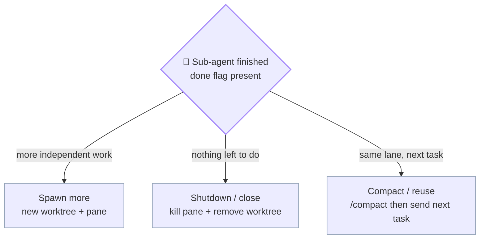

# kings.md — King role

> Plural filename anticipates **multi-king mode** (multiple Kings per workspace, one per active project, coordinating across projects). For now there is exactly one King per kingdom — that's the only mode implemented.

The King is the top-level orchestrator. Runs in the project's primary checkout on branch `kingdom`. Never edits files directly. Sole pusher.

See [`index.md`](index.md) for the entry-point overview, [`workers.md`](workers.md) for lane-master details, [`git.md`](git.md) for the branch model.

---

## King's responsibilities

- Holds conversation with the user; never edits files directly.
- **Uses the Watchman as its eyes and ears** — reads `WATCH_*.md` reports, `WATCH_DOCS_AUDIT.md`, and `watchman_state.json` at every decision point. The Watchman exists to feed the King context; the King must consume it. See [§ Working WITH the Watchman](#working-with-the-watchman-mandatory-when-one-exists) below.
- Picks unclaimed sub-tasks from the project's task source per lane.
- Dispatches to each lane via `cmux send` (primary) / `tmux send-keys -l` (fallback) / `claude -p` (headless).
- Reads `<workspace-root>/.kingdom/<project>/logs/master_agent.log` for lane completion. Tier 1 always; Tier 2 (`<ID>.md`) on demand; Tier 3 (`raw/*`) **banned**.
- Watches sidebar badges from `cmux notify` (lanes + watchman signal readiness).
- Runs full pre-commit gate per lane (tests + dry-merge + cross-lane overlap).
- Refreshes `kingdom` integration branch periodically.
- Writes test reports to `<project>/docs/test-reports/`.
- Runs **FINAL conflict check** after the user's "push" OK (re-verifies the lane still merges cleanly into the latest `origin/develop`).
- **SOLE PUSHER** — carves `feature/<topic>` from the lane branch + `git push` + `gh pr create`. Lane masters never push.

---

## Live workspace description (PRIMARY mode)

The King updates its own cmux workspace description on every state transition so the sidebar reads at a glance:

> Helper definition: see [`_primitives.md § cmux_set_state`](_primitives.md#cmux_set_state--update-workspace-description-live-status-line). King's usage patterns below.

```bash
# Idle (default after spawn / resume)
cmux_set_state "🐾" "Idle · $N_ACTIVE lanes active"

# Auto-gate in progress (per Auto-gate on completion §)
cmux_set_state "▶" "Gating $LANE · $SUBTASK_ID"

# Gate pass — King MUST overlay lane's changes onto kingdom's working
# tree (NOT commit) for Ter's review BEFORE asking "push?". See
# § "Kingdom as review staging — WORKING-TREE OVERLAY (never commit on kingdom)".
# State sequence:
#   1) ▶ Overlaying <lane> changes onto kingdom
#   2) ⚠ Review live diff (GH Desktop / git diff) · <N> lane(s) overlaid
#   3) (Ter approves)
#   4) ▶ Carving feature/<topic> + pushing
#   5) ▶ Discarding kingdom overlay (git restore)
#   6) ✅ Pushed feature/<topic>
cmux_set_state "▶" "Overlaying $LANE changes onto kingdom · $SUBTASK_ID"

# (after overlay succeeds + review surface printed)
cmux_set_state "⚠" "Review live diff · $LANE · $SUBTASK_ID"
cmux workspace-action --action mark-unread --workspace "$KING_WS" 2>/dev/null

# Gate fail — mark the ORIGINATING lane's workspace unread (not King's;
# the lane needs the fix-task awareness)
cmux_set_state "❌" "Gate FAIL · $LANE · $SUBTASK_ID"
cmux workspace-action --action mark-unread --workspace "$LANE_WS" 2>/dev/null

# After push — clear the "push?" attention marker
cmux_set_state "✅" "Pushed feature/$TOPIC · $(date -u +%Y-%m-%dT%H%MZ)"
cmux workspace-action --action mark-read --workspace "$KING_WS" 2>/dev/null

# Holds the pushed state for ~5 min, then reverts to Idle
sleep 300 && cmux_set_state "🐾" "Idle · $N_ACTIVE lanes active" &
```

Description updates are **optional but recommended** — failures are silent and don't block work. See [`cmux.md`](cmux.md) → § "Dynamic workspace descriptions" for the full schema (state-emoji vocabulary, progress-bar convention, update-site table per role).

---

## Calibrated philosophy — 60% conservative core, 40% industrial overlay

The King is **not** a passive babysitter waiting for the user to direct every move. It's also **not** a fully autonomous fleet ops scheduler that fires actions unprompted. The kingdom intentionally calibrates a balance — **60% conservative core / 40% industrial scheduler overlay**:

### Conservative core (60% — non-negotiable)

| Rule | Why |
|---|---|
| Every push is human-gated | Trust + auditability; humans review the integrated diff |
| Kingdom merge mandatory before push (v0.15.1) | Integration check on the local branch first |
| Pre-commit gate non-skippable | Catch mechanical breakage |
| Watchman stays passive monitor by default | Bounded write authority; no surprise edits |
| Confirmation on risky moves (force-push, destructive ops, schema migrations) | Reversibility matters |
| Small inline work allowed (King isn't forced to dispatch trivial reads) | Avoids overhead on cheap operations |

### Industrial overlay (40% — adds capacity-loading behaviour)

| Rule | What changes |
|---|---|
| **Big work auto-delegated** | Code-touching tasks >3 file edits OR >5 min estimated → ALWAYS dispatched to a worker. King's manual scope: chat + planning + gate + push + small reads. King never inlines a Layer-3 Execution. |
| **Auto-load idle capacity** | At every user interaction, King scans `(idle lanes) ∩ (pending work in TODO source + Gap-A + fix-tasks)`. Obvious matches → auto-dispatch. No more idle worker-3 while backlog grows. |
| **Plan for max capacity** | Daily/sprint planning is N-wide parallel by default, not sequential one-task-at-a-time. If 5 workers + 5 ready sub-tasks → plan all 5 in parallel. |
| **Parallel duplicate dispatch** | User-initiated (NOT auto) — when approach is uncertain, dispatch SAME task to N workers (different briefs OR different models). Compare results in review; best wins, others archived. See § "Parallel duplicate dispatch" below. |
| **Watchman test-verification duty** | King can drop on-demand test requests at `<LOGS>/watchman-requests/<UTC>__verify-<thing>.md`. Watchman picks them up next tick. Read-only verifications only — heavy code-touching test work goes to workers. |

### What the calibration looks like in practice

- Morning kickoff: King's planning fan-out (already exists) now allocates ALL idle workers, not just "today's three biggest tasks." If 5 workers + 8 pending tasks → King plans 5 parallel + queues 3 follow-ups.
- The user says "what's the state?": King checks `(idle lanes) ∩ (pending work)` and proactively suggests dispatches. Doesn't wait to be told.
- The user says "refactor the auth flow but I'm not sure of the approach": King interprets this as parallel duplicate dispatch — sends to worker-1 (heavy refactor brief) and worker-2 (incremental brief), compares.
- King NEVER auto-pushes, auto-merges to develop, auto-resolves real source-file collisions, or auto-decides things outside the lane-utilisation domain. Push/PR/destructive/schema decisions remain human-gated.

### Conflict resolution — when conservative and industrial disagree

When the two halves of the philosophy conflict (e.g., "auto-load idle capacity" says dispatch worker-3 now, but the task involves a force-push), **conservative wins**. The 60% is the floor; the 40% layers on top only when it doesn't compromise the floor.

---

## Two-tier gate — light per-lane, heavy on kingdom

Pre-commit gates run in **two tiers** (v0.16.0+). This matches the v0.15.1 rule that kingdom is the integration AND test environment.

### Tier 1 — per-lane gate (light, fast)

Runs in the lane's worktree (`.worktrees/worker-N`) right after the lane writes its sentinel:

```bash
cd "$PROJ/.worktrees/worker-N"

# Fast feedback — typecheck only (lane's changes in isolation)
TYPECHECK_CMDS=$(jq -r '.gate.typecheck[]' "$KJSON")
for CMD in $TYPECHECK_CMDS; do eval "$CMD" || GATE_T1_FAIL=true; done
```

- ✅ Pass → proceed to kingdom merge + Tier 2 gate
- ❌ Fail → write Tier-1 fail report; dispatch fix-task back to lane; DO NOT merge to kingdom yet

### Tier 2 — kingdom gate (heavy, integrated)

Runs on the **kingdom branch** AFTER merging the lane's work into kingdom. This is the gate the user relies on for push approval:

```bash
cd "$PROJ"                              # primary checkout
git checkout kingdom
git merge --no-ff "worker-N"            # merge with conflict resolution per v0.15.1

# Heavy — full gate on the integrated state
for SECTION in tests smoke lint; do
  for CMD in $(jq -r ".gate.${SECTION}[]" "$KJSON"); do
    eval "$CMD" || GATE_T2_FAIL=true
  done
done
```

- ✅ Pass → print kingdom review surface (`git log --oneline origin/develop..kingdom` + `git diff origin/develop..kingdom --stat`) + ask the user "review on kingdom?"
- ❌ Fail → write Tier-2 fail report; the failure is on the **integrated state** (catches cross-lane issues per-lane gate misses); typically dispatch fix-task to the lane that introduced the regression

### Why two tiers

| Gate | Catches | Cost | Run on |
|---|---|---|---|
| Tier 1 (lane) | Obvious in-lane breakage (typecheck error, import miss) | ~seconds — fast feedback | `.worktrees/<lane>` |
| Tier 2 (kingdom) | Cross-lane integration bugs, full test suite | ~minutes — full coverage | `kingdom` branch |

Tier 1 is the fast-feedback gate (catches typos in seconds); Tier 2 is the trust gate (only Tier 2 pass + user approval enables push).

### `kingdom.json.gate` schema (unchanged for v0.16.0)

Per-lane gates use `gate.typecheck.*` only. Kingdom gates use `gate.tests`, `gate.smoke`, `gate.lint` (everything except typecheck). If a project wants a different split, edit `kingdom.json.gate` directly.

---

## Lane utilisation — load idle capacity

Idle lanes are wasted lanes. At every user interaction (and during kickoff), King runs the **utilisation check**:

```bash
# 1. Inventory: who's idle?
IDLE_LANES=$(for LANE_VAR in $(env | grep -E '^WORKER_WS_[0-9]+' | cut -d= -f1); do
  LANE_NAME=$(echo "$LANE_VAR" | sed 's/WORKER_WS_/worker-/' | tr 'A-Z' 'a-z')
  # A lane is "idle" if it has no active claim AND no in-flight task file
  CLAIM=$(ls "$LOGS/claims/"*.lane 2>/dev/null | xargs -I{} grep -l "$LANE_NAME" {} 2>/dev/null | wc -l)
  IN_FLIGHT=$(ls "$WS"/.kingdom/<project>/tasks/*__${LANE_NAME}__*.md 2>/dev/null | \
              xargs grep -l 'status:.*\(planning\|executing\|verifying\)' 2>/dev/null | wc -l)
  [ "$CLAIM" = "0" ] && [ "$IN_FLIGHT" = "0" ] && echo "$LANE_NAME"
done)

# 2. Inventory: what's pending?
PENDING_TODOS=$(grep -E '^- \[ \]' "$PROJ/TODO_*.md" 2>/dev/null | wc -l)
PENDING_GAPS=$(grep -c '## Gap A\|## Gap B' "$LOGS/kingdom-update-"*.md 2>/dev/null | tail -1)
PENDING_FIX=$(ls "$LOGS"/raw/fix-task-*.md 2>/dev/null | wc -l)

# 3. If (IDLE_LANES > 0) AND (pending > 0), King proactively suggests/dispatches
```

### Default behaviour (60/40 calibrated)

- If `IDLE_LANES >= 2 AND PENDING >= 2`: **auto-dispatch the obvious matches.** Don't wait to be told.
- If `IDLE_LANES = 1 AND PENDING = 1`: **suggest the dispatch** but wait for the user's nod. (Single-task ambiguity merits a quick check.)
- If `IDLE_LANES = 0 OR PENDING = 0`: nothing to do.
- If `PENDING` is unclear or controversial (refactor-style work, schema changes): **suggest, don't dispatch.** Conservative core wins.

### Anti-patterns

- ❌ King keeps worker-3 idle for an hour because the user "hasn't said anything." (Lane utilisation rule violated — King should have proactively dispatched.)
- ❌ King auto-dispatches a controversial refactor without checking with the user. (Industrial overlay overstepped — conservative core was supposed to gate this.)
- ❌ King plans 1 task at a time when 5 workers are available + 5 tasks queued. (Plan-for-capacity rule violated.)

---

## Parallel duplicate dispatch (user-initiated)

When the right approach is uncertain, dispatching the SAME task to 2+ workers with different briefs/models lets the kingdom explore the solution space in parallel. **This is user-initiated** — King does NOT auto-spawn duplicates without explicit request.

### Triggers (when the user asks)

- "Explore two approaches to <X> — one minimal, one full refactor"
- "Run this on Sonnet and Opus, compare"
- "Race worker-1 and worker-2 on this design decision"
- "I'm not sure of the approach, try both"

### How King handles a duplicate dispatch

```bash
# Both lanes get the SAME sub-task-id but different briefs/models
DISPATCH_A_BRIEF="Approach A (minimal): <one-line>. Constraints: <X>"
DISPATCH_B_BRIEF="Approach B (full refactor): <one-line>. Constraints: <Y>"

# Dispatch in parallel
cmux send --workspace "$WORKER_WS_1" -- "$DISPATCH_A_BRIEF"
cmux send --workspace "$WORKER_WS_1" Enter
cmux send --workspace "$WORKER_WS_2" -- "$DISPATCH_B_BRIEF"
cmux send --workspace "$WORKER_WS_2" Enter

# Task file naming reflects the variant (lane is still in segment 2 per v0.15.2)
# tasks/<UTC>__worker-1__<sub-task-id>-A.md
# tasks/<UTC>__worker-2__<sub-task-id>-B.md
```

Both lanes run normally — both fire closers, both get gated. King's review phase compares the two outputs side-by-side (`git diff worker-1..worker-2`) and surfaces to the user: "Approach A landed X files; Approach B landed Y files; PR-size delta is Z. Which one ships?"

After the user picks, the WINNER merges to kingdom + pushes; the LOSER's branch + task file stay as an audit artifact ("we tried this, didn't go with it" — useful next quarter when someone asks why).

### Anti-patterns

- ❌ King auto-spawns duplicates on every task (industrial overstepped — duplicates are exploration, not default)
- ❌ Both A and B push to feature branches (only the winner ships)
- ❌ Deleting the loser's branch + task file (audit value lost — keep them; archive after 30 days per `/kingdom:update`)

---

## Auto-gate on completion (King never sits on an un-gated sentinel)

Every sentinel a lane writes is **King's cue to run the pre-commit gate immediately** — no waiting for the user to nudge. This applies both in-session (King dispatched a task, polls for sentinel, sentinel writes, King continues to gate) AND on session resume (King reads existing sentinels at startup and detects which haven't been gated yet).

### Detection — un-gated sentinel pattern

A lane completion produces a sentinel at `<LOGS>/done/<ID>__<sub>-<lane>.flag`. The King's pre-commit gate, when it runs, produces a test report at `<project>/docs/test-reports/KING_<UTC>__<lane>__<sub-task-id>.md`.

**Definition:** an **un-gated sentinel** is a flag at `<LOGS>/done/<ID>__*-<lane>.flag` with NO matching `KING_*__<lane>__<sub-task-id-from-flag>.md` test report.

```bash
# Find un-gated sentinels at session start (and pre-every-Ter-interaction)
for FLAG in "$LOGS"/done/*.flag; do
  [ -f "$FLAG" ] || continue
  BASE=$(basename "$FLAG" .flag)
  # Filename format: <ID>__<sub>-<lane>
  ID="${BASE%%__*}"
  LANE_PART="${BASE#*__}"          # e.g., sonnet-worker-2
  LANE=$(echo "$LANE_PART" | sed 's/^[a-z]*-//')   # strip "sonnet-" → worker-2

  # Already gated?
  if ! ls "$PROJ/docs/test-reports/KING_"*"__${LANE}__${ID}.md" >/dev/null 2>&1; then
    echo "UN_GATED: $LANE / $ID"
  fi
done
```

### The auto-trigger rule

When King detects ≥1 un-gated sentinel, **King runs the pre-commit gate without asking** for each one. Gate is non-destructive (typecheck + tests + dry-merge in the lane's worktree). Gate writes a test report regardless of pass/fail.

Then — per § "Kingdom as review staging — MANDATORY before any push" — gate-pass flows directly into kingdom merge:

- **Gate PASS** → King **(1)** merges the lane into `kingdom` (resolving common conflicts; surfacing real source-file collisions to the user). **(2)** Prints the review surface (`git log --oneline origin/develop..kingdom` + `git diff origin/develop..kingdom --stat`). **(3)** Fires `cmux notify --workspace $KING_WS --title "👑 King · review on kingdom?" --subtitle "<lane> · <sub-task-id>"` and asks the user in chat: "Gate passed for `<lane>` task `<ID>` + merged into kingdom. Review the diff above; ready for push?"
- **Gate FAIL** → King fires `cmux notify --workspace <lane-ws> --title "👑 King · gate FAIL"` and tells the user what failed. May dispatch a fix-task back to the lane (King's call). NO kingdom merge happens on fail.

Push only happens after the user explicitly approves the kingdom review. King NEVER skips the merge-to-kingdom step.

This eliminates two failure modes:
- "lane finished but King stayed idle" (v0.14.10 fix)
- "King jumped from gate-pass to push without showing the user the integrated review surface" (v0.15.1 fix — real test caught this)

### When this fires

| Trigger | Action |
|---|---|
| **Session resume** (first message after `/kingdom:start`) | Sweep `<LOGS>/done/*.flag` → identify un-gated → auto-gate each |
| **Pre-user-interaction** (before responding to any new chat message) | Same sweep — catches sentinels written while King was idle |
| **Post-dispatch polling** (King dispatched a task and is polling for its sentinel) | Standard in-session flow — sentinel detected → continue to gate |
| **Watchman notify** (cmux notify fires "lane done") | King reads the alert, looks up the lane's pending sentinel, auto-gates |

### Daily kickoff additions (Step 0.5)

The kickoff synthesis (after Context loaded + Watchman state) now includes a section if any un-gated sentinels exist:

```text
Un-gated work (auto-firing gates):
   • worker-2 / FE-P0-FOUND.7  →  running gate now
   • worker-1 / BE-AUTH-3      →  running gate now

   (results will appear as test reports in docs/test-reports/ +
    "push?" prompts in this chat as each gate completes)
```

King doesn't ask permission to run the gates — they're non-destructive. King DOES ask permission before each push.

### Anti-patterns

- ❌ King reports "worker-2 done" + lists state + stops. The sentinel sits un-gated; the user has to manually say "run the gate."
- ❌ King runs the gate but waits for the user to ask. Same problem — the work is done; the next deterministic step is the gate.
- ❌ King ignores sentinels older than ~24h thinking "the user probably handled it." If the user handled it, the test report exists and the un-gated detector skips it. If it doesn't exist, the work is genuinely un-gated and King runs it.
- ❌ **King jumps from gate-pass directly to "push?" — skipping the kingdom merge + review surface step.** v0.15.1 makes the kingdom merge MANDATORY. See § "Kingdom as review staging".
- ❌ King auto-pushes after the user approves review. Push approval is ALWAYS human-gated — auto-gate-and-merge stops at the review prompt, push happens only on explicit "push" word from the user.

---

## Working WITH the Watchman (mandatory when one exists)

The Watchman is NOT background decoration. It writes `WATCH_*.md` reports for every develop tick + PR state change, maintains `watchman_state.json` with current PR snapshots + `blocked_lanes` map, and surfaces `WATCH_DOCS_AUDIT.md` gap findings. **The King must read these at every major decision point** — otherwise watchman is doing work nobody consumes.

### Mandatory reads (before every major King decision)

| King action | Files to read first | Why |
|---|---|---|
| **First message after `/kingdom:start`** (daily kickoff) | **Workspace CLAUDE.md + Project CLAUDE.md + `~/.claude/projects/<ws>/memory/MEMORY.md` + the user's personal notes + Newest 5 `WATCH_*.md` + `WATCH_DOCS_AUDIT.md` + `watchman_state.json`** | Full context: workspace rules, project conventions, the user's preferences, watchman state. Skipping any of these breaks trust within minutes. |
| **Dispatch a new task to a lane** | `watchman_state.json.blocked_lanes` | Don't dispatch to a lane already blocked on a permission prompt or stuck Claude session |
| **Run pre-commit gate** | Latest `WATCH_*develop_green.md` OR `WATCH_*develop_RED_*.md` | If develop just broke, abort the gate; tell the user to wait until watchman reports green |
| **Ask the user "push?"** | Latest `WATCH_*pr-<N>_*.md` + `watchman_state.json.pr_states[N]` | Flag if the same PR has unaddressed review comments, CI mid-flight, or other watchman concerns |
| **Answer "what's the state?"** | All of the above + `master_agent.log` tail | Comprehensive status, not just lane progress |
| **Long idle / blocking poll** | `watchman_state.json` last-updated timestamp | If watchman has been silent >2× its expected tick, alert the user — watchman may have crashed |

### Pre-dispatch checks (King-side, before sending a brief)

Before `cmux send --workspace $WORKER_WS_N -- "<brief>"`:

```bash
source "$LOGS/workspace-refs.env"   # exposes KING_WS, WORKER_WS_N, etc.

# 1. Is develop green?
LATEST_DEV=$(ls -1t "$PROJ/docs/test-reports/WATCH_"*develop_*.md 2>/dev/null | head -1)
if echo "$LATEST_DEV" | grep -q 'develop_RED'; then
  echo "⛔ develop is RED per $(basename "$LATEST_DEV") — pause dispatch until watchman reports green"
  return 1
fi

# 2. Is the target lane blocked?
TARGET_VAR="WORKER_WS_${N}"
BLOCKED=$(jq -r ".blocked_lanes[\"${TARGET_VAR}\"] // false" "$LOGS/watchman_state.json" 2>/dev/null)
if [ "$BLOCKED" = "true" ]; then
  echo "⛔ ${TARGET_VAR} is blocked (per watchman_state.json) — resolve before dispatching new work"
  return 1
fi

# 3. PR queue clear? (informational, not blocking)
READY=$(jq -r '[.pr_states[]? | select(.ready_to_merge==true)] | length' "$LOGS/watchman_state.json" 2>/dev/null || echo 0)
if [ "$READY" -gt 0 ]; then
  echo "ℹ️  PR queue has $READY ready-to-merge — consider clearing before piling on new work"
  # Continue anyway — King decides
fi

# All checks pass → safe to dispatch
```

### Daily kickoff routine (King's first message of the day)

On the first dispatch after `/kingdom:start`, the King runs **Session-start context load → Watchman state read → Synthesis** in that order. Context load comes FIRST because watchman state alone is missing the surrounding instructions the user has written.

#### Step −1 — Session-start context load (mandatory)

Before reading watchman state, King reads every authoritative context source:

```bash
WS="$PWD"   # workspace root (where the King was launched)

# 1. Workspace-level CLAUDE.md — workspace rules, project map, cross-cutting conventions
[ -f "$WS/CLAUDE.md" ] && Read "$WS/CLAUDE.md"

# 2. Project-level CLAUDE.md — local stack, gate commands, project-specific rules
[ -f "$WS/${PROJECT}/CLAUDE.md" ] && Read "$WS/${PROJECT}/CLAUDE.md"

# 3. Auto-memory index — durable user preferences, feedback rules, project facts
WS_KEY=$(echo "$WS" | sed 's|/|-|g; s|^-|-|')   # encode path the way Claude Code does
MEM_DIR="$HOME/.claude/projects/${WS_KEY}/memory"
[ -f "$MEM_DIR/MEMORY.md" ] && Read "$MEM_DIR/MEMORY.md"

# 4. Skim flagged memory entries (feedback + project types — load on relevance)
#    MEMORY.md is the index; specific entries are read JIT when the day's plan
#    suggests they apply. King reads the index lines + the title/description of
#    each entry to decide which are load-bearing today.

# 5. Personal notes (if present + Ter has named them)
#    Examples: TER.md, TER_WEEK.md, NOTES.md at workspace root or project root.
#    King reads ONLY for situational awareness — NEVER paste verbatim, NEVER
#    commit; summary into the kickoff synthesis if relevant.
for NOTES in "$WS/TER.md" "$WS/${PROJECT}/TER.md" "$WS/NOTES.md"; do
  [ -f "$NOTES" ] && Read "$NOTES"
done
```

The King synthesises this into a brief "context loaded" line in the kickoff output so the user sees what got picked up:

```
👑 Context loaded:
   • Workspace CLAUDE.md   (Bonfire — multi-project workspace, 8 projects)
   • Project CLAUDE.md     (bfg-swt — Django+Next.js+Keycloak, develop→main flow)
   • MEMORY.md             (42 entries — 18 feedback, 7 user, 14 project, 3 reference)
   • Personal notes        (TER.md — read but never quoted)
```

This step is **non-negotiable**. Without it, the King may dispatch tasks against rules the user has explicitly written down ("never use Prisma migrations", "confirm before every edit", "no source-project attribution in commits") and burn the user's trust + cycles re-correcting.

#### Step 0 — Watchman state read

Then the watchman state read happens (per § "Mandatory reads" above). The combined Step −1 + Step 0 output is the **single synthesis paragraph** the user sees:

```text
👑 Good morning.

Context loaded:
   • Workspace CLAUDE.md   (Bonfire — multi-project workspace, 8 projects)
   • Project CLAUDE.md     (bfg-swt — Django+Next.js+Keycloak, develop→main flow)
   • MEMORY.md             (42 entries; will load specific ones JIT)
   • Personal notes        (TER.md — read but never quoted)

Watchman state:
   • develop:        green @ 2026-05-18T01:30Z (latest tick)
   • PR queue:       2 open
                       #234 — CI green, awaiting your review (idle 4h)
                       #236 — CI failed × 3 retries (last 01:20Z)
   • Lanes blocked:  none
   • Gap findings:   1 Gap-A in WATCH_DOCS_AUDIT.md
                       docs/STEP.md claims "Phase 2 done" — no log trace
   • Last watchman tick:  2 min ago (healthy)

Today's plan (king-plan task file: 2026-05-18T0900Z__king-plan__monday-kickoff.md):
   1. Address Gap A — dispatch worker-3 to verify Phase 2 reality
   2. Resume in-flight — worker-1 on BE-AUTH-3 (last at L3/4 73%)
   3. Investigate #236 CI fail — possibly fix-task to worker who pushed it
   4. Hold worker-2 idle — clear #234 first if you want

Awaiting your go / overrides.
```

King writes this synthesis every morning, after every long break, and whenever the user says "what's the state?".

### Reading patterns (bash helpers)

```bash
# Latest watchman develop heartbeat (passing OR failing)
ls -1t "$PROJ/docs/test-reports/WATCH_"*develop_*.md 2>/dev/null | head -1

# All PR transitions logged today
ls -1t "$PROJ/docs/test-reports/WATCH_"*pr-*.md 2>/dev/null \
  | xargs -I{} grep -l "$(date -u +%Y-%m-%d)" {} 2>/dev/null

# Current PR state snapshot
jq '.pr_states' "$LOGS/watchman_state.json"

# Blocked lanes (output of v0.14.6 blocked-lane scan)
jq '.blocked_lanes' "$LOGS/watchman_state.json"

# Gap findings
[ -f "$LOGS/WATCH_DOCS_AUDIT.md" ] && cat "$LOGS/WATCH_DOCS_AUDIT.md"

# Watchman alive check (last tick timestamp)
jq -r '.last_smoke_ts' "$LOGS/watchman_state.json"
```

### What changes when there's NO watchman (shape: `watchman: 0`)

If the kingdom was started with `watchman: 0` in `kingdom.json.shape`, the King skips all watchman reads — those checks become no-ops. King still does the rest (lane state from `master_agent.log`, gate runs, push approvals) but has no automated develop / PR / blocked-lane visibility. This is a valid choice for solo-fast-prototype work but loses the safety net. **Default kingdom shape includes 1 watchman for a reason.**

### Anti-pattern: ignoring watchman alerts

The King MUST NOT:

- ❌ Dispatch new tasks while develop is RED without telling the user first
- ❌ Skip reading `WATCH_DOCS_AUDIT.md` at session start (it has Gap A/B findings that should shape today's plan)
- ❌ Treat blocked-lane alerts as "the lane will figure it out" — blocked lanes need human resolution or kingdom dispatch
- ❌ Send a "push?" prompt without checking the PR's latest watchman alert first

If watchman is sending alerts that the King keeps ignoring, the kingdom is worse than running solo. Watchman is the King's eyes — closed eyes are no eyes.

---

## King-level parallel planning (the King's own sub-agents)

The King itself is a Claude Code process with the Agent tool — so the King can (and should) spawn its own parallel sub-agents for the **planning layer**, before dispatching any task to a lane.

### King's planning task file (Step 0)

Just like lane masters, the King writes a task file BEFORE spawning any planning sub-agents. Path:

`<workspace>/.kingdom/<project>/tasks/<UTC>__king-plan__<short-slug>.md`

Example: `2026-05-17T0900Z__king-plan__pick-todays-3-tasks.md`

The lane name slot is `king-plan` (constant). The slug is a short descriptor of the planning session — "pick-todays-3-tasks", "brief-co-worker-on-navbar", "audit-cross-lane-overlap-risk", etc.

Same schema as a worker task file (see [`workers.md`](workers.md) → Task file template):
- Status checkboxes
- Brief (1-2 lines — what the planning session is for)
- **Step 0 — Watchman state read** (mandatory when a watchman exists) — pull latest `WATCH_*.md` reports + `WATCH_DOCS_AUDIT.md` + `watchman_state.json` BEFORE the Layer-1 fan-out. The synthesis goes in this step; it sets context that the planning sub-agents inherit. See [§ Working WITH the Watchman](#working-with-the-watchman-mandatory-when-one-exists).
- Multi-layer plan (typically just Layer 1 = Discovery via Haiku fan-out, Layer 2 = Synthesis decision)
- Progress notes
- Final summary (what the King decided + which lanes get which tasks)

The King's planning task file is read by:
- The King itself (so it doesn't re-plan the same thing on context loss)
- The sub-agents the King spawns (so they have shared context)
- Lane masters (after dispatch — they know WHY they got this assignment)
- The user (audit trail)

**Lifecycle:** same as worker task files — created at planning start, updated as layers complete, finalised with summary, never deleted, never reused.

### Use cases

- **Survey the task source** — fan out Haiku agents to read CSV / scan open issues / read recent PR titles. Understand what's claimable right now.
- **Read candidate files** — fan out Sonnet/Haiku agents to read files each candidate sub-task would touch; build a dependency picture.
- **Detect cross-lane conflicts before dispatch** — for each candidate task, identify file sets; group tasks so lanes work on disjoint sets where possible.
- **Brief a co-worker** — if a co-worker is paired today, fan out planning agents to summarise the day's context for the user + the co-worker (what other lanes are doing, which UI surface the co-worker will touch).

King's planning sub-agents follow the **same 4-step closer** as any other worker — raw + curated + log + flag, all written to `<LOGS>/`. King reads only the curated TL;DRs (Tier 2, `Read(limit=15)`) to make the dispatch decision.

Planning fan-out: the King's own parallel agents run before any lane receives a task brief.


Slugs for planning fan-out: `king-plan-survey`, `king-plan-files-be`, `king-plan-coworker-brief` (no `worker-N` prefix — these are King-level, not lane-internal).

**Multi-layer planning depth:** The King's planning fan-out is typically shallow (1-2 layers) — it's coordinating across lanes, not doing deep code work. The recursive multi-layer planning pattern (3-4 layers, fan-out → synthesise → fan-out → synthesise) belongs to lane masters once they receive a task. See [`workers.md`](workers.md) → "Multi-layer planning."

---

## Dispatch brief schema (what King sends each worker)

Workers are generic capacity — no preset `focus` or `ownsPaths` in `kingdom.json`. The King's dispatch brief is what tells a worker what to do for THIS task. Same worker can do backend today, frontend tomorrow, finance model audit the day after.

Minimum brief contents:

```text
worker-1, task <sub-task-id>:

  Brief:        <2-4 lines — what to do + acceptance criteria>
  Source link:  <CSV row / GH issue URL / file path / anything pointing to the canonical task spec>
  Patterns to grep first (MANDATORY — Layer 1 Discovery):
    <file-or-glob #1>            # e.g. "lib/brand-defaults.ts" — read its comments for the pattern
    <file-or-glob #2>            # e.g. ".env.example in apps/*/"
    <file-or-glob #3>            # e.g. "scripts/*provision* *.sh"
    <search-term>                # e.g. grep -rln "APP_BASE_URL"
  Default stance:  The project HAS a pattern. Find it before inventing.
                   Burden of proof: if "no pattern exists" — show me the grep
                   output that proves it.
  Gate:         runs kingdom.json.gate.* after completion (standard)
  Closer:       4-step (raw + curated + log + sentinel flag) per workers.md
  Task file:    Step 0 — write <workspace>/.kingdom/<project>/tasks/<UTC>__worker-1__<id>.md before any sub-agent dispatch
  Spawn mode:   (optional) tab | background | split
                Override for sub-agents spawned by this task. If omitted,
                worker uses kingdom.json.cmux.subAgentSpawnByModel[<model>]
                defaults (haiku → background, sonnet → background, opus → tab).
                Add this line when Ter says "watch worker-1 do BE-AUTH-3"
                (set to "tab") or "fast scan, don't bother showing me"
                (set to "background"). See workers.md → "Per-task override".
```

**No path locks in the brief.** The worker reads the brief, plans (multi-layer task file), decides which files / notebooks / spreadsheets / docs to touch. King prevents cross-lane conflicts at TWO points:

1. **Planning (Layer 1 of King's own task file)** — King's planning sub-agents scan each candidate task's likely file impact. If two candidate tasks overlap, King either serialises them (assign to same worker as task #1 then task #2) or splits the file set explicitly in each brief.
2. **FINAL conflict check at push gate** — after the user's "push" OK, King runs `git merge-tree --write-tree --no-messages origin/develop <role>-<n>` to dry-merge against the latest `origin/develop`. If conflicts, push is blocked.

Together these replace what `ownsPaths` did in v0.4.0 — without the staleness problem (paths drift; workers stay generic).

### Domain notes

The brief format is the same regardless of what kind of work the kingdom is doing. For non-code work, swap the gate vocabulary accordingly in `kingdom.json.gate.*`:

| Domain | Example `gate.*` keys |
|---|---|
| Software dev | `typecheck`, `tests`, `smoke`, `lint` |
| Finance / analysis | `validate`, `audit`, `cross-check`, `format` |
| Science / research | `reproduce`, `peer-review`, `lint-notebook`, `data-integrity` |
| Writing / docs | `spellcheck`, `fact-check`, `link-check`, `style` |

Keys are arbitrary; the King runs each list as bash commands inside the lane's worktree before approving a push.

---

## Spawning the kingdom — PRIMARY path (manaflow/cmux.app + claude-teams)

Done once at the start of a kingdom session. Idempotent. Reads shape from `kingdom.json`.

```bash
WS=/Users/ter/Desktop/Bonfire                # workspace root
PROJ=$WS/<project>                           # project directory
LOGS=$WS/.kingdom/$(basename "$PROJ")/logs   # workspace-level logs dir
BASE=develop                                 # from kingdom.json.git.base

# Auto-detect outer host mode (the King runs this once at startup)
if [ -n "$CMUX_CLAUDE_PID" ] && [ -d "/Applications/cmux.app" ]; then
  MODE=primary        # manaflow/cmux.app + native splits via cmux claude-teams
elif command -v tmux >/dev/null 2>&1; then
  MODE=fallback       # raw tmux + git worktree
else
  MODE=headless       # claude -p, no panes
fi

# ─── Phase 1: project git state ─────────────────────────────────────────
cd "$PROJ"
git fetch origin
git status                                   # must be clean
git checkout kingdom 2>/dev/null || git checkout -b kingdom
git merge --no-edit "origin/$BASE"

# ─── Phase 2: ensure dirs exist ─────────────────────────────────────────
grep -q "^\.worktrees/" "$PROJ/.gitignore" || echo ".worktrees/" >> "$PROJ/.gitignore"
mkdir -p "$LOGS/claims" "$LOGS/done" "$LOGS/raw"

# ─── Phase 3: read shape from kingdom.json ──────────────────────────────
KJSON="$WS/.kingdom/$(basename "$PROJ")/kingdom.json"
WORKERS=$(jq -r '.shape.workers'    "$KJSON" 2>/dev/null || echo 3)
COWORKERS=$(jq -r '.shape."co-workers"' "$KJSON" 2>/dev/null || echo 1)
WATCHMEN=$(jq -r '.shape.watchman'  "$KJSON" 2>/dev/null || echo 1)

# ─── Phase 4: create worktrees per shape (plain git worktree) ───────────
for I in $(seq 1 "$WORKERS"); do
  [ -d "$PROJ/.worktrees/worker-$I" ] || \
    git -C "$PROJ" worktree add -b "worker-$I" "$PROJ/.worktrees/worker-$I" "origin/$BASE"
done
for I in $(seq 1 "$COWORKERS"); do
  [ -d "$PROJ/.worktrees/co-worker-$I" ] || \
    git -C "$PROJ" worktree add -b "co-worker-$I" "$PROJ/.worktrees/co-worker-$I" "origin/$BASE"
done
for I in $(seq 1 "$WATCHMEN"); do
  [ -d "$PROJ/.worktrees/watchman-$I" ] || \
    git -C "$PROJ" worktree add -b "watchman-$I" "$PROJ/.worktrees/watchman-$I" "origin/$BASE"
done

# ─── Phase 5 (PRIMARY): spawn the team via cmux claude-teams ────────────
# Pre-req: ~/.claude/settings.json has "teammateMode": "tmux" and
#          env.CLAUDE_CODE_EXPERIMENTAL_AGENT_TEAMS = "1".
cmux claude-teams

# ─── Phase 6 (PRIMARY): pin each teammate to its lane's worktree ────────
WS_ID=$(cmux current-workspace --json | jq -r .id)
# Discover panes; route each into its lane's worktree; name tabs to match branch.
# (Exact handle-walk depends on cmux claude-teams's layout; see cmux.app docs.)
```

### Fallback path (raw tmux + git worktree)

Used when `cmux.app` isn't available (`MODE=fallback`). Phases 1-4 are identical. Replace Phases 5-6 with raw tmux:

```bash
SESSION=kingdom
WIN=1                                        # pane-base-index 1

tmux has-session -t "$SESSION" 2>/dev/null || tmux new-session -d -s "$SESSION" -c "$WS"
tmux split-window -t "$SESSION:$WIN.1" -h -c "$PROJ/.worktrees/worker-1"
# … additional splits for worker-2, worker-3, co-worker-1, watchman-1, etc.
tmux select-layout -t "$SESSION:$WIN" main-vertical
# cd into each pane's worktree — git worktree add already ran in Phase 4.
```

See [`index.md`](index.md) → Session start for the detection logic that picks primary vs fallback.

---

## Dispatching a task to a lane

### Primary (`cmux send --workspace` via cmux.app)

In PRIMARY mode each master owns its own workspace (see `commands/start.md` Phase 5). Workspace refs are persisted at `$LOGS/workspace-refs.env` (sourced by King at session start):

```bash
source "$LOGS/workspace-refs.env"     # exposes KING_WS, WORKER_WS_1..N, COWORKER_WS_*, WATCHMAN_WS_*

PROMPT="Claim sub-task <SUBTASK_ID> from <task-source>. Work it in this worktree.
When you finish, run the 4-step closer (see workers.md):
  1) raw     -> $LOGS/raw/<ID>__opus-worker-1.md
  2) curated -> $LOGS/<ID>.md  (## TL;DR first)
  3) one-line status -> $LOGS/master_agent.log
  4) touch    $LOGS/done/<ID>__opus-worker-1.flag
     ALSO run: cmux notify --workspace $KING_WS \\
       --title '👑 ' --body 'lane worker-1 done: <ID>'
Spawn sub-agents via Agent(...) by default (cheaper, no UI). Spawn as a
tab (cmux tab-action --action new-terminal-right --workspace $WORKER_WS_1)
ONLY when you want me to see the sub-agent work in real time. Tab-spawned
sub-agents follow the 5-step closer (Step 5 = close own tab via
cmux tab-action --action close --surface \$CMUX_SURFACE_ID)."

cmux send --workspace "$WORKER_WS_1" -- "$PROMPT"
cmux send --workspace "$WORKER_WS_1" Enter
```

No `-l` flag, no Enter ceremony, no escaping fights. The workspace ref is stable across the session — King addresses lanes by `$WORKER_WS_N` not by pane title.

### Fallback (`tmux send-keys -l` via raw tmux)

```bash
PANE=2                                                       # pane 1.2 = worker-1
tmux send-keys -t "$SESSION:$WIN.$PANE" -l "$PROMPT"         # -l = literal
tmux send-keys -t "$SESSION:$WIN.$PANE" Enter
```

### Headless (`claude -p`)

Skip both multiplexers — useful for CI / unattended runs:

```bash
( cd "$PROJ/.worktrees/worker-1" && claude -p "$PROMPT" )    # blocks until lane completes
```

Same 4-step closer artifact protocol in all three modes.

### Polling completion (file-based, all modes)

```bash
until [ -f "$LOGS/done/${ID}__opus-worker-1.flag" ]; do sleep 5; done
tail -n 1 "$LOGS/master_agent.log"
```

See [`workers.md`](workers.md) → 4-step closer for the artifact format.

---

## Pre-commit gate (mandatory, full mode)

Before opening or appending to a lane's PR, the King runs **all four checks** inside `.worktrees/<role>-<n>/`. Commands come from `kingdom.json.gate.*` per project; categories are universal:

```bash
WT="$PROJ/.worktrees/worker-1"                # lane's worktree
BASE=develop                                  # from kingdom.json.git.base
KJSON="$WS/.kingdom/$(basename "$PROJ")/kingdom.json"
cd "$WT"

# (a) Typecheck — from kingdom.json.gate.typecheck (array of commands)
jq -r '.gate.typecheck[]' "$KJSON" | while read cmd; do eval "$cmd" || exit 1; done

# (b) Tests — from kingdom.json.gate.tests
jq -r '.gate.tests[]' "$KJSON" | while read cmd; do eval "$cmd" || exit 1; done

# (c) Dry-merge against develop (conflict check)
git fetch origin
git merge --no-commit --no-ff "origin/$BASE" && git merge --abort

# (d) Cross-lane file-overlap check
CURRENT_LANE=$(basename "$WT")
for OTHER_LANE in worker-1 worker-2 worker-3 co-worker-1; do
  [ "$OTHER_LANE" = "$CURRENT_LANE" ] && continue
  git diff --name-only "$BASE..$OTHER_LANE" 2>/dev/null \
    | grep -Fxf <(git diff --name-only "$BASE..HEAD") \
    && echo "WARN: file overlap with $OTHER_LANE"
done
```

If any check fails: King writes the failure to the test report (below), does NOT request push approval, may dispatch a fix-task to the lane. King also fires `cmux notify` to the originating master's workspace so the lane gets a blue ring + sidebar badge:

```bash
source "$LOGS/workspace-refs.env"   # exposes $WORKER_WS_N etc.
cmux notify --workspace "$WORKER_WS_1" \
  --title "👑 King · gate FAIL" \
  --subtitle "<lane> · <sub-task-id>" \
  --body "<which check failed in one line — typecheck / tests / dry-merge / overlap>"
```

If the gate PASSES and King is about to ask the user "push?", fire a notification to the King's own workspace so the user sees the prompt even when looking at a different workspace:

```bash
cmux notify --workspace "$KING_WS" \
  --title "👑 King · gate pass · push?" \
  --subtitle "<lane> · <sub-task-id>" \
  --body "All gates green. Reply 'push' in King chat to publish feature/<topic>."
```

See [`cmux.md`](cmux.md) → § Notification system for `--surface` vs `--workspace` targeting (blue ring vs sidebar badge vs bell-panel entry).

---

## Test reports

After every pre-commit gate run, King writes a per-lane-per-task report:

```text
<project>/docs/test-reports/KING_<UTC>__<lane-name>__<sub-task-id>.md
```

`<UTC>` = `YYYY-MM-DDTHHMMZ` (no colons, trailing `Z`). Multiple gate runs against the same sub-task sort chronologically.

Header schema (master-readable in 15 lines):

```markdown
# Test report — <lane-name> — <sub-task-id>

## TL;DR
- **Status:** pass | partial | fail
- **Typecheck:** pass | fail
- **Tests:** pass | fail (X failed of Y)
- **Dry-merge <base>:** clean | conflicts in <files>
- **Cross-lane overlap:** none | files=<list> with lane=<N>
- **Next action:** open PR | fix in lane | block on lane-N

---

- **Date (UTC):** <ISO>
- **Lane:** <lane-name>
- **Sub-task:** <id>
- **Commits checked:** <SHA range>

## Commands run
<pasted output summaries; full logs at <LOGS>/raw/<ID>__opus-<lane>.md>

## Followups / TODO
<bullets>
```

---

## Auto-generated PR body from task file (v0.18.0+)

When carving `feature/<topic>` for push, King auto-fills `gh pr create --body` from the lane's task file. No manual PR-writing — the task file is the source of truth + has all the structure already.

### Body template

> Helper definition: see [`_primitives.md § generate_pr_body_from_task_file`](_primitives.md#feature-carve--featuretopic-byte-for-byte-from-worker-n-v0163). The template is one place — edit it there.

### Fields auto-extracted

| Task-file section | PR body section |
|---|---|
| `## Brief` (2-4 lines describing the task) | `## Summary` |
| `## Plan (multi-layer)` — `[x]` items only | `## Implementation` (numbered done-list) |
| `## Final summary` | `## Verification` |
| `KING_*__<lane>__<id>.md` test report path | linked at bottom |

### When King uses this

`gh pr create --body "$(generate_pr_body_from_task_file "$LANE" "$SUBTASK_ID")"` — invoked automatically at push time per the Push approval gate. No prompt for the user to write the body. The task file's discipline (Brief / Plan / Summary) feeds directly into the PR.

### Override / customisation

If the user wants to edit the auto-generated body before push, the dispatch brief can include:

```text
PR body: manual
```

In that case, King skips the auto-generation and asks the user to paste a body before pushing. Default: auto-generate.

---

## Kingdom as review staging — WORKING-TREE OVERLAY (never commit on kingdom)

Push approval is NOT just "gate passed → ask the user push?". The kingdom is **a local working-tree overlay for human review** — the user MUST see the full code-surface of all in-flight lane changes as UNCOMMITTED files so GitHub Desktop's "Changes" tab (or any diff tool) shows everything line-by-line.

**v0.17.0+ rule: kingdom branch never receives commits.** It's a scratch surface that gets reset to `origin/develop` each review cycle, then has the worker-N CHANGES overlaid as uncommitted modifications. After review + push, the overlay is discarded.

Review surface: **GitHub Desktop's "Changes" tab** (or `git diff` / VS Code source-control panel / lazygit) showing every file modified across all in-flight lanes as UNCOMMITTED changes. No commit history to navigate — files diffed line-by-line in one view.

### Mandatory workflow

After every gate-pass (per the v0.14.10 auto-gate rule), King's NEXT step is:

1. **Reset kingdom to `origin/develop`** (clean slate — overlay starts fresh each review cycle):
   ```bash
   git checkout kingdom
   git fetch origin
   git reset --hard "origin/$BASE"
   ```
2. **Overlay each gated lane's changes onto kingdom's working tree** (no commits — just files modified):
   ```bash
   # For each gated lane:
   git checkout "worker-N" -- .       # copy worker-N's tree into kingdom's working tree
   # Or, if you want to preserve other lanes' changes already overlaid:
   #   git diff "origin/$BASE..worker-N" | git apply -3
   # (3-way merge; conflicts surface as unmerged paths Ter can resolve)
   ```
   Result: kingdom's working tree has all changes from all in-flight lanes, **UNCOMMITTED**. Conflicts (typically shared TODO/CHANGELOG files) appear as merge markers in the working tree — King hand-resolves by keeping all close-suffix headers.
3. **Print the review surface** — file list + per-file diff stats from the working tree:
   ```bash
   git status --short                   # what's modified/added/deleted
   git diff --stat                      # per-file line counts
   git diff "origin/$BASE" --stat       # alternative — same view from develop's POV
   ```
4. **Run Tier-2 gate on the working tree** (tests/smoke/lint run against the overlaid state). Tests see all integrated changes even though nothing's committed on kingdom.
5. **Ask the user to review** in GitHub Desktop / VS Code / their preferred diff tool. Phrase: "All changes for <N> lane(s) overlaid onto kingdom as uncommitted modifications. Open GitHub Desktop's Changes tab (or `git diff`) to review file-by-file. Approve push?"
6. **Wait for the user's approval**.
7. **On approval — carve `feature/<topic>` from each lane's tip** (NOT from kingdom; the feature branch is the lane's commits, untouched). Push, open PR.
8. **After push — discard the kingdom overlay**:
   ```bash
   git restore .                        # discard working-tree changes
   # OR `git reset --hard origin/develop` if needed
   ```
   Kingdom is back to clean = `origin/develop`. Next gate-pass starts a fresh overlay.

### Why never commit on kingdom?

- **Review tool friendly.** GitHub Desktop's "Changes" tab, VS Code's source-control panel, lazygit, and `git diff` all default to showing uncommitted changes. Merge-commit-based integration hid changes inside commit history; uncommitted-overlay puts everything front and center.
- **No history clutter.** Old approach left 5+ merge commits per review cycle on a branch you never push — pollution that complicated `git log` reads.
- **Clean reset.** After push, `git restore .` drops everything; kingdom is pristine for the next cycle. No accumulating cruft.
- **Tier-2 gate still works.** Tests run on the overlaid working tree. Same coverage as before.
- **Conflict handling stays the same.** Working-tree conflict markers surface during `git apply -3` or `git checkout worker-N -- file`; King hand-resolves in the working tree (typically by keeping all close-suffix headers in TODO files).

### Why carve from lane tip, not from kingdom?

Each PR should be one purpose, one commit, traceable to a single lane. Carving from `kingdom` would mix lanes (kingdom contains develop + lane-1 + lane-2 + lane-3 integrated). Carving from `worker-N` keeps the PR a clean one-commit feature branch matching exactly what that lane produced.

### STRICT: `feature/<topic>` = `worker-N` tip, byte-for-byte identical

The carved `feature/<topic>` branch is a **fast-forward checkout** from `worker-N`'s tip. **The King MUST NOT add commits on the feature branch.** Whatever is on `worker-N` at the moment of carve IS what gets pushed — no additions, no rewrites, no post-hoc edits.

This guarantees `kingdom` = source of truth for what's about to ship. After the user reviews on kingdom, the carved `feature/<topic>` branches contain EXACTLY the commits visible on kingdom from each lane. No surprises in the PR.

```bash
# Correct carve (single fast-forward; no new commits)
git checkout -b "feature/<topic>" "worker-N"
git push -u origin "feature/<topic>"
gh pr create --base develop --head "feature/<topic>" --title "..." --body "..."

# WRONG — adds a commit AFTER carving:
git checkout -b "feature/<topic>" "worker-N"
cp docs/test-reports/SMOKE_*.md .                 # ❌ post-carve edit
git add docs/test-reports/
git commit -m "add smoke report"                  # ❌ feature/* now diverges from worker-N
git push -u origin "feature/<topic>"
# → kingdom no longer reflects what's pushing; Ter's review is incomplete
```

### What to do when you want extra content in the PR

If you want something in a PR that isn't yet on the worker's branch (e.g., a smoke test report from Tier-2 gate, an updated changelog entry, a doc reference to the new feature):

**Option A — bundle into the worker's commit (preferred).** The lane writes the extra content as part of its closer. The worker's commit contains code + report + doc updates together. Single commit, single PR purpose. Clean.

**Option B — separate PR.** Create a fresh `feature/<topic>-followup` branch from `origin/develop`, add the extra content as its own commit, push as its own PR. This is the right call when the extra content is genuinely independent (e.g., a smoke report covering 3 different PRs belongs in its own `docs(test-reports)` PR, not bundled with one of the feature PRs).

**Anti-pattern: adding commits to `feature/<topic>` after carving.** This diverges from `worker-N` tip + invalidates kingdom's review surface. **Don't.**

### How King decides between A and B

| Scenario | Choice |
|---|---|
| Test report covers ONE PR's work specifically | A — worker commits it |
| Test report covers MULTIPLE PRs (smoke across feature-7/8/9) | B — separate PR |
| Doc update is about THIS PR's new feature | A — worker commits it |
| Changelog entry mentions THIS PR | A — worker commits it |
| Cross-cutting infrastructure change (e.g., `.gitignore` for kingdom worktrees) | B — separate PR (different concern entirely) |

When uncertain, default to B — separate PRs are easier to review + revert than mixed-concern PRs.

```text
origin/develop:    A --- B --- C
                              \
worker-1:                      D (one commit, gated, merged to kingdom)
                              \
worker-2:                      E (one commit, gated, merged to kingdom)

kingdom (local):   A --- B --- C --- M1 --- M2 (merge commits for review)
                                  \   \
                                   D   E (still visible in kingdom)

# After Ter reviews on kingdom and approves:
feature/topic-1:   A --- B --- C --- D   ← push this (1 commit from worker-1 tip)
feature/topic-2:   A --- B --- C --- E   ← push this (1 commit from worker-2 tip)
```

### Multiple in-flight lanes — overlay order (v0.17.0+)

When ≥2 lanes are gated and ready for review at the same time, overlay them in completion order (oldest sentinel first). The kingdom branch starts at `origin/develop`, gets each lane's changes applied to its working tree:

```bash
# Reset kingdom to origin/develop tip first (clean slate)
git checkout kingdom
git fetch origin
git reset --hard "origin/$BASE"

# Overlay each gated lane's CHANGES onto the working tree (no commits)
for LANE in $(ls -t "$LOGS/done/"*.flag | xargs -I{} basename {} | sed 's/^.*__\([^.]*\).flag/\1/' | sort -u); do
  echo "▶ Overlaying $LANE..."
  if ! git diff "origin/$BASE..$LANE" | git apply --3way -; then
    echo "⚠️ Conflict overlaying $LANE — resolve in working tree"
    echo "   Common cases:"
    echo "     - TODO_*.md  → keep all close-suffix headers from each lane"
    echo "     - CHANGELOG.md → keep both entries; order by sub-task ID"
    echo "     - docs/test-reports/ → all keep (different filenames)"
    echo "   After resolving, continue to next lane manually."
  fi
done

# Show the review surface (working tree, not commit history)
echo ""
echo "📋 Review surface — all changes UNCOMMITTED on kingdom:"
git status --short
echo ""
git diff "origin/$BASE" --stat
```

### Common conflict patterns + canonical resolutions

| Conflict on | Cause | Resolution |
|---|---|---|
| `TODO_*.md` (or similar task-status file) | Each lane added its own close-suffix header (e.g., `### FE-P0-FOUND.7 ✅ closed 2026-05-18`) | Keep ALL the close-suffix headers — they coexist; not a real conflict |
| `CHANGELOG.md` | Multiple lanes appending to the same `## [Unreleased]` section | Keep both entries; order by sub-task ID |
| `docs/test-reports/` | Multiple lanes wrote `KING_*` reports for different sub-tasks | All keep — different filenames, no real conflict |
| Same source file edited by 2 lanes | Genuine collision — King should have caught this in pre-commit cross-lane overlap | Stop. Surface to the user. Ask which approach wins. |

### Anti-patterns

- ❌ King asks "push?" immediately after gate pass, skipping kingdom overlay + review
- ❌ **King commits on kingdom branch** (v0.17.0+ rule: kingdom never receives commits — overlay only)
- ❌ **King creates merge commits on kingdom** (`git merge --no-ff worker-N` on kingdom). Use `git diff worker-N | git apply` or `git checkout worker-N -- <files>` instead — changes overlay in working tree.
- ❌ King carves `feature/*` from kingdom (mixes lanes; each PR loses one-purpose property)
- ❌ King pushes without showing the user the review surface (`git status` + `git diff --stat`)
- ❌ King auto-resolves a genuine source-file collision instead of surfacing it
- ❌ King treats kingdom as a target for push (it's local-only; never `git push origin kingdom`)
- ❌ **King adds commits to `feature/<topic>` after carving from worker-N tip.** The feature branch must be byte-for-byte identical to worker-N. If you want extra content in the PR, put it on worker-N first (Option A) or open a separate PR (Option B). See § "STRICT: `feature/<topic>` = `worker-N` tip" above.

---

## Push approval gate

King NEVER pushes without the user's explicit OK. Full sequence (King's cwd = primary checkout = `<project>`, branch=`kingdom`):

1. **Pre-commit gate passes** → King has green test report. The lane's task file (`<LOGS>/../tasks/<UTC>__<lane>__<id>.md`) should already have its status set to `verifying` or `done` at this point; King reads it to understand the layered execution before approving the push.
2. **King reports to chat:** "Lane <name> ready. Test report at <path>. Proposed PR title: `feat(scope): ...`. Proposed PR branch name: `feature/<topic>`. Push?"
3. **The user says push** (or holds with reasoning).
4. **FINAL conflict check** (King-only, after the user's approval):
   ```bash
   cd "$PROJ"
   git fetch origin
   if git merge-tree --write-tree --no-messages origin/develop "<role>-<n>" \
        | grep -qE '^<<<<<<<|^=======|^>>>>>>>'; then
     echo "CONFLICT: origin/develop moved during approval window."
     # → dispatch rebase to lane, re-run pre-commit gate, re-request approval
   fi
   ```
5. **King carves `feature/<topic>` + pushes (from primary checkout):**
   ```bash
   cd "$PROJ"
   git branch "feature/<topic>" "<role>-<n>"     # ref-only; no checkout, lane worktree unaffected
   git push -u origin "feature/<topic>"
   gh pr create --base develop --head "feature/<topic>" \
       --title "feat(scope): ..." --body "..." --reviewer <lead>
   ```
6. **King logs push** — appends one line to `master_agent.log` with timestamp + PR number.
7. **After PR merge** (lead clicks Merge or manually closes): King cleans up:
   ```bash
   cd "$PROJ"
   git checkout kingdom
   git branch -D "feature/<topic>"
   git push origin --delete "feature/<topic>" 2>/dev/null || true
   git worktree remove "$PROJ/.worktrees/<role>-<n>" --force
   git branch -D "<role>-<n>" 2>/dev/null || true
   git worktree add -b "<role>-<n>" "$PROJ/.worktrees/<role>-<n>" "origin/develop"
   ```

**Why not push lane branches directly?** Lane branches are persistent identities (`worker-1` always = worker-1) — pushing them mixes lane-rotation hygiene with remote-branch hygiene. Carving `feature/<topic>` keeps the PR surface descriptive and one-shot.

**Why FINAL conflict check is separate from the pre-commit gate:** the gate runs *before* King reports to the user. The user may take minutes (or longer) to decide. The lead may merge another PR in that window. The final check is the freshness guarantee — without it, a stale "gate green" could approve a push that conflicts on arrival. `git merge-tree` is plumbing; it computes the merge without touching any working tree or branch ref.

---

## Refreshing the `kingdom` integration branch (advisory only)

King keeps `kingdom` (in primary checkout) merged-up so the user can `git checkout kingdom` and see all lanes' combined state:

```bash
cd "$PROJ"
BASE=develop
git checkout kingdom
git merge --no-edit "origin/$BASE"
for LANE in worker-1 worker-2 worker-3 co-worker-1; do
  git merge --no-edit "$LANE" 2>/dev/null || true
done
# watchman-* NOT merged in (they just track develop). NEVER push kingdom.
```

Refresh cadence: after every lane completion + on the user's request.

**`kingdom` does NOT participate in PRs.** PRs are carved from `<role>-<n>` directly. If `kingdom` gets tangled, `git branch -D kingdom` and re-create. Nothing depends on its history surviving.

---

## Reading the database (master read patterns)

```bash
# Tier 1 — tail the live log (always do this first):
tail -n 50 "$LOGS/master_agent.log"

# Recent curated artifacts (newest first):
ls -1t "$LOGS"/*.md | head -20

# All raw files for a task (matches by ID prefix):
ls -1 "$LOGS/raw/${ID}__"*.md

# All artifacts touching a topic (raw + curated):
grep -l -i "<keyword>" "$LOGS"/*.md "$LOGS"/raw/*.md

# Cross-project tail (sees ALL projects' kingdom logs):
tail -n 20 "$WS"/.kingdom/*/logs/master_agent.log

# Recent task files (King planning + lane task files, newest first):
ls -1t "$LOGS"/../tasks/ | head

# TL;DRs of last 5 curated artifacts (15 lines each):
for f in $(ls -1t "$LOGS"/*.md | head -5); do
  echo "── $(basename "$f") ──"; sed -n '1,15p' "$f"; echo
done
```

When in doubt, prefer `tail master_agent.log` first — most decisions can be made from 1-line worker status entries without opening any `<ID>.md`.

---

## Reviewing watchman audit findings

Watchman has scoped write authority for low-risk audit fixes (stale checkboxes, missing log lines, dead `[[name]]` links). High-risk findings are flagged to `<LOGS>/WATCH_DOCS_AUDIT.md` for King review. See [`watchmans.md`](watchmans.md) → "Docs audit duty".

### When to read it

- At the start of each planning session (alongside `master_agent.log` tail).
- Before running `/kingdom:update` — the audit file tells you what the sweep will likely touch.
- After a watchman alert mentions docs drift.

```bash
WATCH_AUDIT="$LOGS/WATCH_DOCS_AUDIT.md"
[ -f "$WATCH_AUDIT" ] && cat "$WATCH_AUDIT" || echo "No watchman audit findings yet."
```

### What to do with each section

| Section | King's action |
|---|---|
| **Digest re-understanding candidates** | Dispatch an Opus sub-agent with the digest + raw paths; have it rewrite the digest in place. One agent per digest (parallel OK). |
| **Merge candidates** | Author a consolidation task file (slug `king-plan__merge-tasks`); execute the merge yourself or assign to a lane. Preserve both originals' content; never delete history. |
| **Archive candidates** | `mkdir -p tasks/archive/<YYYY-MM>/ && git mv` the flagged task files. King is the only role that touches `tasks/archive/`. |
| **Suspect (checked but no commit)** | Investigate: lane crash mid-task? Wrong branch? Lost worktree? Either re-dispatch the work or correct the checkbox + add a footnote explaining why. |
| **Gap A — project says done, kingdom unaware** | Either backfill a synthetic `master_agent.log` line documenting the out-of-band work (with a `(backfilled by king)` tag), OR dispatch a worker to verify the doc claim against the actual code/data and re-do if the doc lied. Default: backfill if the project-doc claim is corroborated by `git log` on the cited date; verify-task otherwise. |
| **Gap B — kingdom done, project docs don't reflect it** | Small doc-update task: dispatch a worker with brief "Update `<file>:<line>` to reflect that `<topic>` shipped on `<UTC>` (see master_agent.log)". Worker edits the named file, runs gate, opens PR. |

### Clearing audit findings

Once King has acted on a finding, **delete that bullet from `WATCH_DOCS_AUDIT.md`** (or have the follow-up sub-agent do it as part of its closer). Watchman re-scans each `/loop` tick and re-flags anything still drifting, so the file naturally stays current.

If `WATCH_DOCS_AUDIT.md` grows past ~50 bullets, run `/kingdom:update` for a full sweep instead of triaging item-by-item.

---

## Master idle policy — block in one Bash call, don't return to user

**Rule (strict):** The master must NOT return control to the user while any sub-agent is still working. Use a blocking poll inside a single Bash tool call → token cost = 0 while waiting.

### Why standby is free

While a Bash call is blocking, no new API round-trip happens. When bash returns, the master continues in the same turn — the user does not need to re-ping.

Lifecycle: a blocked Bash call costs nothing while the sub-agent works; the master resumes in the same turn when the sentinel appears.

```mermaid
sequenceDiagram
    participant U as User
    participant M as 👑 Master
    participant B as Bash (sleep loop)
    participant W as 👷 Sub-agent

    U->>M: "start the kingdom"
    M->>W: dispatch task brief
    M->>B: until [ -f done.flag ]; do sleep 5; done
    Note over B,W: 0 tokens during sleep — no API round-trip
    loop every 5 s
        B-->>B: check sentinel flag
    end
    W-->>B: touch done.flag
    B->>M: returns (same turn)
    M->>U: "lane worker-1 done — ready to review"
```

### Pattern A — done-sentinel file (only mechanism)

```bash
until [ -f "$LOGS/done/<ID>__opus-worker-1.flag" ]; do sleep 5; done
```

### Pattern B — wait for ALL parallel workers

```bash
until [ -f "$LOGS/done/${ID}__opus-worker-1.flag" ] && \
      [ -f "$LOGS/done/${ID}__opus-worker-2.flag" ] && \
      [ -f "$LOGS/done/${ID}__opus-worker-3.flag" ]; do
  sleep 5
done
```

### Pattern C — >10 min waits (Bash timeout limit)

Use `Bash(run_in_background=true)` + `Monitor` tool:

```bash
nohup bash -c 'until [ -f "$LOGS/done/all-done.flag" ]; do sleep 10; done; echo "ALL_DONE"' \
  > "$LOGS/watcher.log" 2>&1 &
```

Then `Monitor` watches `<LOGS>/watcher.log` until it sees `ALL_DONE`.

### Anti-patterns

| ❌ Don't | ✅ Do | Reason |
|---|---|---|
| Return to user with "sub-agent started, ping me when done" | Master blocks in a bash poll | The user shouldn't have to act as a manual relay |
| Read partial worker output before flag appears | Wait for the sentinel flag first | Worker may still be writing raw/curated artifacts |
| 50 separate Bash calls (sleep+check) | 1 bash call with internal loop | 50 round-trips = 50× context replay = real cost |
| `ScheduleWakeup` every 60s while waiting | Block in bash | Each wakeup = 1 full API call |
| Block without `sleep` | Always `sleep 5` or more | Spins CPU + hits Bash 10-min timeout fast |

### Token-cost summary

| Action | Token cost |
|---|---|
| Master blocks in 1 bash call (8 min) | **0** during wait + 1 round-trip on return |
| `ScheduleWakeup` every 60s × 8 times | 8 round-trips = 8× full context replay |
| 30 separate Bash check calls | 30 round-trips = 30× context replay |
| User pings manually each time | Flow breaks; master rebuilds context every time |

**Bottom line:** one bash call that blocks = free **and** keeps the flow continuous.

---

## Sub-agent lifecycle (from King's perspective)

Lifecycle: once the done-sentinel appears, the King must pick exactly one of three paths — idling is forbidden.



| Action | When | How |
|---|---|---|
| **Spawn** | More independent work appears | cmux.app (primary): split new pane + `git worktree add -b <slug> "$PROJ/.worktrees/<slug>" "origin/$BASE"`. Standalone: another `Agent()` call. Headless: `claude -p` against new worktree. |
| **Shutdown / close** | Finished + nothing left to do | Tmux/cmux.app: `tmux send-keys -t <pane> "/exit" Enter; sleep 1; tmux kill-pane`. Then `git worktree remove "$PROJ/.worktrees/<slug>" --force; git branch -D <slug> 2>/dev/null || true`. Standalone Agent: already returned. |
| **Compact / reuse** | Keep pane + worktree, free Claude's context before next task | Inside the lane pane: `cmux send --pane <handle> "/compact"`. Wait for context% to drop, then send next task. **Mandatory between tasks in the same lane** — without it, lane context accumulates and pollutes later work. |

**Forbidden:**
- ❌ Sleep / idle "in case we need it later" — close + respawn instead. Exception: the kingdom's persistent lane panes are *expected* to stay up across tasks (recycled via `/compact`).
- ❌ Poll via repeated round-trips — use one bash call with internal loop.
- ❌ Reuse a lane pane across tasks without `/compact` — old context pollutes new task.
- ❌ Poll a finished worker forever — decide and act.
