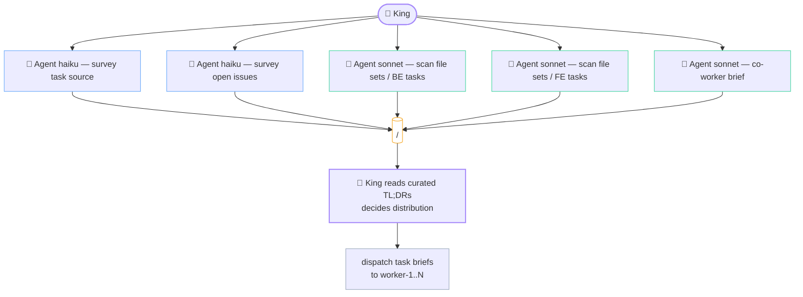
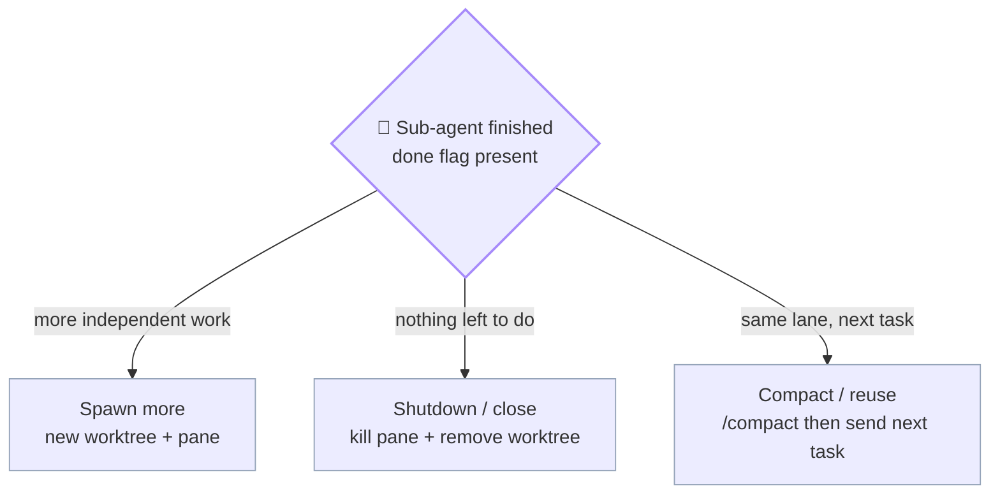

# kings.md — King role

> Plural filename anticipates **multi-king mode** (multiple Kings per workspace, one per active project, coordinating across projects). For now there is exactly one King per kingdom — that's the only mode implemented.

The King is the top-level orchestrator. Runs in the project's primary checkout on branch `kingdom`. Never edits files directly. Sole pusher.

See [`index.md`](index.md) for the entry-point overview, [`workers.md`](workers.md) for lane-master details, [`git.md`](git.md) for the branch model.

---

## King's responsibilities

- Holds conversation with Ter; never edits files directly.
- Picks unclaimed sub-tasks from the project's task source per lane.
- Dispatches to each lane via `cmux send` (primary) / `tmux send-keys -l` (fallback) / `claude -p` (headless).
- Reads `<workspace-root>/.kingdom/<project>/logs/master_agent.log` for lane completion. Tier 1 always; Tier 2 (`<ID>.md`) on demand; Tier 3 (`raw/*`) **banned**.
- Watches sidebar badges from `cmux notify` (lanes signal readiness).
- Runs full pre-commit gate per lane (tests + dry-merge + cross-lane overlap).
- Refreshes `kingdom` integration branch periodically.
- Writes test reports to `<project>/docs/test-reports/`.
- Runs **FINAL conflict check** after Ter's "push" OK (re-verifies the lane still merges cleanly into the latest `origin/develop`).
- **SOLE PUSHER** — carves `feature/<topic>` from the lane branch + `git push` + `gh pr create`. Lane masters never push.

---

## King-level parallel planning (the King's own sub-agents)

The King itself is a Claude Code process with the Agent tool — so the King can (and should) spawn its own parallel sub-agents for the **planning layer**, before dispatching any task to a lane.

### King's planning task file (Step 0)

Just like lane masters, the King writes a task file BEFORE spawning any planning sub-agents. Path:

`<workspace>/.kingdom/<project>/tasks/<UTC>__king-plan__<short-slug>.md`

Example: `2026-05-17T0900Z__king-plan__pick-todays-3-tasks.md`

The lane name slot is `king-plan` (constant). The slug is a short descriptor of the planning session — "pick-todays-3-tasks", "brief-co-worker-on-navbar", "audit-cross-lane-overlap-risk", etc.

Same schema as a worker task file (see [`workers.md`](workers.md) → Task file template):
- Status checkboxes
- Brief (1-2 lines — what the planning session is for)
- Multi-layer plan (typically just Layer 1 = Discovery via Haiku fan-out, Layer 2 = Synthesis decision)
- Progress notes
- Final summary (what the King decided + which lanes get which tasks)

The King's planning task file is read by:
- The King itself (so it doesn't re-plan the same thing on context loss)
- The sub-agents the King spawns (so they have shared context)
- Lane masters (after dispatch — they know WHY they got this assignment)
- Ter (audit trail)

**Lifecycle:** same as worker task files — created at planning start, updated as layers complete, finalised with summary, never deleted, never reused.

### Use cases

- **Survey the task source** — fan out Haiku agents to read CSV / scan open issues / read recent PR titles. Understand what's claimable right now.
- **Read candidate files** — fan out Sonnet/Haiku agents to read files each candidate sub-task would touch; build a dependency picture.
- **Detect cross-lane conflicts before dispatch** — for each candidate task, identify file sets; group tasks so lanes work on disjoint sets where possible.
- **Brief a co-worker** — if a co-worker is paired today, fan out planning agents to summarise the day's context for Ter + the co-worker (what other lanes are doing, which UI surface the co-worker will touch).

King's planning sub-agents follow the **same 4-step closer** as any other worker — raw + curated + log + flag, all written to `<LOGS>/`. King reads only the curated TL;DRs (Tier 2, `Read(limit=15)`) to make the dispatch decision.

Planning fan-out: the King's own parallel agents run before any lane receives a task brief.



Slugs for planning fan-out: `king-plan-survey`, `king-plan-files-be`, `king-plan-coworker-brief` (no `worker-N` prefix — these are King-level, not lane-internal).

**Multi-layer planning depth:** The King's planning fan-out is typically shallow (1-2 layers) — it's coordinating across lanes, not doing deep code work. The recursive multi-layer planning pattern (3-4 layers, fan-out → synthesise → fan-out → synthesise) belongs to lane masters once they receive a task. See [`workers.md`](workers.md) → "Multi-layer planning."

---

## Dispatch brief schema (what King sends each worker)

Workers are generic capacity — no preset `focus` or `ownsPaths` in `kingdom.json`. The King's dispatch brief is what tells a worker what to do for THIS task. Same worker can do backend today, frontend tomorrow, finance model audit the day after.

Minimum brief contents:

```text
worker-1, task <sub-task-id>:

  Brief:        <2-4 lines — what to do + acceptance criteria>
  Source link:  <CSV row / GH issue URL / file path / anything pointing to the canonical task spec>
  Gate:         runs kingdom.json.gate.* after completion (standard)
  Closer:       4-step (raw + curated + log + sentinel flag) per workers.md
  Task file:    Step 0 — write <workspace>/.kingdom/<project>/tasks/<UTC>__worker-1__<id>.md before any sub-agent dispatch
```

**No path locks in the brief.** The worker reads the brief, plans (multi-layer task file), decides which files / notebooks / spreadsheets / docs to touch. King prevents cross-lane conflicts at TWO points:

1. **Planning (Layer 1 of King's own task file)** — King's planning sub-agents scan each candidate task's likely file impact. If two candidate tasks overlap, King either serialises them (assign to same worker as task #1 then task #2) or splits the file set explicitly in each brief.
2. **FINAL conflict check at push gate** — after Ter's "push" OK, King runs `git merge-tree --write-tree --no-messages origin/develop <role>-<n>` to dry-merge against the latest `origin/develop`. If conflicts, push is blocked.

Together these replace what `ownsPaths` did in v0.4.0 — without the staleness problem (paths drift; workers stay generic).

### Domain notes

The brief format is the same regardless of what kind of work the kingdom is doing. For non-code work, swap the gate vocabulary accordingly in `kingdom.json.gate.*`:

| Domain | Example `gate.*` keys |
|---|---|
| Software dev | `typecheck`, `tests`, `smoke`, `lint` |
| Finance / analysis | `validate`, `audit`, `cross-check`, `format` |
| Science / research | `reproduce`, `peer-review`, `lint-notebook`, `data-integrity` |
| Writing / docs | `spellcheck`, `fact-check`, `link-check`, `style` |

Keys are arbitrary; the King runs each list as bash commands inside the lane's worktree before approving a push.

---

## Spawning the kingdom — PRIMARY path (manaflow/cmux.app + claude-teams)

Done once at the start of a kingdom session. Idempotent. Reads shape from `kingdom.json`.

```bash
WS=/Users/ter/Desktop/Bonfire                # workspace root
PROJ=$WS/<project>                           # project directory
LOGS=$WS/.kingdom/$(basename "$PROJ")/logs   # workspace-level logs dir
BASE=develop                                 # from kingdom.json.git.base

# Auto-detect outer host mode (the King runs this once at startup)
if [ -n "$CMUX_CLAUDE_PID" ] && [ -d "/Applications/cmux.app" ]; then
  MODE=primary        # manaflow/cmux.app + native splits via cmux claude-teams
elif command -v tmux >/dev/null 2>&1; then
  MODE=fallback       # raw tmux + git worktree
else
  MODE=headless       # claude -p, no panes
fi

# ─── Phase 1: project git state ─────────────────────────────────────────
cd "$PROJ"
git fetch origin
git status                                   # must be clean
git checkout kingdom 2>/dev/null || git checkout -b kingdom
git merge --no-edit "origin/$BASE"

# ─── Phase 2: ensure dirs exist ─────────────────────────────────────────
grep -q "^\.worktrees/" "$PROJ/.gitignore" || echo ".worktrees/" >> "$PROJ/.gitignore"
mkdir -p "$LOGS/claims" "$LOGS/done" "$LOGS/raw"

# ─── Phase 3: read shape from kingdom.json ──────────────────────────────
KJSON="$WS/.kingdom/$(basename "$PROJ")/kingdom.json"
WORKERS=$(jq -r '.shape.workers'    "$KJSON" 2>/dev/null || echo 3)
COWORKERS=$(jq -r '.shape."co-workers"' "$KJSON" 2>/dev/null || echo 1)
WATCHMEN=$(jq -r '.shape.watchman'  "$KJSON" 2>/dev/null || echo 1)

# ─── Phase 4: create worktrees per shape (plain git worktree) ───────────
for I in $(seq 1 "$WORKERS"); do
  [ -d "$PROJ/.worktrees/worker-$I" ] || \
    git -C "$PROJ" worktree add -b "worker-$I" "$PROJ/.worktrees/worker-$I" "origin/$BASE"
done
for I in $(seq 1 "$COWORKERS"); do
  [ -d "$PROJ/.worktrees/co-worker-$I" ] || \
    git -C "$PROJ" worktree add -b "co-worker-$I" "$PROJ/.worktrees/co-worker-$I" "origin/$BASE"
done
for I in $(seq 1 "$WATCHMEN"); do
  [ -d "$PROJ/.worktrees/watchman-$I" ] || \
    git -C "$PROJ" worktree add -b "watchman-$I" "$PROJ/.worktrees/watchman-$I" "origin/$BASE"
done

# ─── Phase 5 (PRIMARY): spawn the team via cmux claude-teams ────────────
# Pre-req: ~/.claude/settings.json has "teammateMode": "tmux" and
#          env.CLAUDE_CODE_EXPERIMENTAL_AGENT_TEAMS = "1".
cmux claude-teams

# ─── Phase 6 (PRIMARY): pin each teammate to its lane's worktree ────────
WS_ID=$(cmux current-workspace --json | jq -r .id)
# Discover panes; route each into its lane's worktree; name tabs to match branch.
# (Exact handle-walk depends on cmux claude-teams's layout; see cmux.app docs.)
```

### Fallback path (raw tmux + git worktree)

Used when `cmux.app` isn't available (`MODE=fallback`). Phases 1-4 are identical. Replace Phases 5-6 with raw tmux:

```bash
SESSION=kingdom
WIN=1                                        # pane-base-index 1

tmux has-session -t "$SESSION" 2>/dev/null || tmux new-session -d -s "$SESSION" -c "$WS"
tmux split-window -t "$SESSION:$WIN.1" -h -c "$PROJ/.worktrees/worker-1"
# … additional splits for worker-2, worker-3, co-worker-1, watchman-1, etc.
tmux select-layout -t "$SESSION:$WIN" main-vertical
# cd into each pane's worktree — git worktree add already ran in Phase 4.
```

See [`index.md`](index.md) → Session start for the detection logic that picks primary vs fallback.

---

## Dispatching a task to a lane

### Primary (`cmux send --workspace` via cmux.app)

In PRIMARY mode each master owns its own workspace (see `commands/start.md` Phase 5). Workspace refs are persisted at `$LOGS/workspace-refs.env` (sourced by King at session start):

```bash
source "$LOGS/workspace-refs.env"     # exposes KING_WS, WORKER_WS_1..N, COWORKER_WS_*, WATCHMAN_WS_*

PROMPT="Claim sub-task <SUBTASK_ID> from <task-source>. Work it in this worktree.
When you finish, run the 4-step closer (see workers.md):
  1) raw     -> $LOGS/raw/<ID>__opus-worker-1.md
  2) curated -> $LOGS/<ID>.md  (## TL;DR first)
  3) one-line status -> $LOGS/master_agent.log
  4) touch    $LOGS/done/<ID>__opus-worker-1.flag
     ALSO run: cmux notify --workspace $KING_WS \\
       --title '👑 ' --body 'lane worker-1 done: <ID>'
Spawn sub-agents via Agent(...) by default (cheaper, no UI). Spawn as a
tab (cmux tab-action --action new-terminal-right --workspace $WORKER_WS_1)
ONLY when you want me to see the sub-agent work in real time. Tab-spawned
sub-agents follow the 5-step closer (Step 5 = close own tab via
cmux tab-action --action close --surface \$CMUX_SURFACE_ID)."

cmux send --workspace "$WORKER_WS_1" -- "$PROMPT"
cmux send --workspace "$WORKER_WS_1" Enter
```

No `-l` flag, no Enter ceremony, no escaping fights. The workspace ref is stable across the session — King addresses lanes by `$WORKER_WS_N` not by pane title.

### Fallback (`tmux send-keys -l` via raw tmux)

```bash
PANE=2                                                       # pane 1.2 = worker-1
tmux send-keys -t "$SESSION:$WIN.$PANE" -l "$PROMPT"         # -l = literal
tmux send-keys -t "$SESSION:$WIN.$PANE" Enter
```

### Headless (`claude -p`)

Skip both multiplexers — useful for CI / unattended runs:

```bash
( cd "$PROJ/.worktrees/worker-1" && claude -p "$PROMPT" )    # blocks until lane completes
```

Same 4-step closer artifact protocol in all three modes.

### Polling completion (file-based, all modes)

```bash
until [ -f "$LOGS/done/${ID}__opus-worker-1.flag" ]; do sleep 5; done
tail -n 1 "$LOGS/master_agent.log"
```

See [`workers.md`](workers.md) → 4-step closer for the artifact format.

---

## Pre-commit gate (mandatory, full mode)

Before opening or appending to a lane's PR, the King runs **all four checks** inside `.worktrees/<role>-<n>/`. Commands come from `kingdom.json.gate.*` per project; categories are universal:

```bash
WT="$PROJ/.worktrees/worker-1"                # lane's worktree
BASE=develop                                  # from kingdom.json.git.base
KJSON="$WS/.kingdom/$(basename "$PROJ")/kingdom.json"
cd "$WT"

# (a) Typecheck — from kingdom.json.gate.typecheck (array of commands)
jq -r '.gate.typecheck[]' "$KJSON" | while read cmd; do eval "$cmd" || exit 1; done

# (b) Tests — from kingdom.json.gate.tests
jq -r '.gate.tests[]' "$KJSON" | while read cmd; do eval "$cmd" || exit 1; done

# (c) Dry-merge against develop (conflict check)
git fetch origin
git merge --no-commit --no-ff "origin/$BASE" && git merge --abort

# (d) Cross-lane file-overlap check
CURRENT_LANE=$(basename "$WT")
for OTHER_LANE in worker-1 worker-2 worker-3 co-worker-1; do
  [ "$OTHER_LANE" = "$CURRENT_LANE" ] && continue
  git diff --name-only "$BASE..$OTHER_LANE" 2>/dev/null \
    | grep -Fxf <(git diff --name-only "$BASE..HEAD") \
    && echo "WARN: file overlap with $OTHER_LANE"
done
```

If any check fails: King writes the failure to the test report (below), does NOT request push approval, may dispatch a fix-task to the lane.

---

## Test reports

After every pre-commit gate run, King writes a per-lane-per-task report:

```text
<project>/docs/test-reports/KING_<UTC>__<lane-name>__<sub-task-id>.md
```

`<UTC>` = `YYYY-MM-DDTHHMMZ` (no colons, trailing `Z`). Multiple gate runs against the same sub-task sort chronologically.

Header schema (master-readable in 15 lines):

```markdown
# Test report — <lane-name> — <sub-task-id>

## TL;DR
- **Status:** pass | partial | fail
- **Typecheck:** pass | fail
- **Tests:** pass | fail (X failed of Y)
- **Dry-merge <base>:** clean | conflicts in <files>
- **Cross-lane overlap:** none | files=<list> with lane=<N>
- **Next action:** open PR | fix in lane | block on lane-N

---

- **Date (UTC):** <ISO>
- **Lane:** <lane-name>
- **Sub-task:** <id>
- **Commits checked:** <SHA range>

## Commands run
<pasted output summaries; full logs at <LOGS>/raw/<ID>__opus-<lane>.md>

## Followups / TODO
<bullets>
```

---

## Push approval gate

King NEVER pushes without Ter's explicit OK. Full sequence (King's cwd = primary checkout = `<project>`, branch=`kingdom`):

1. **Pre-commit gate passes** → King has green test report. The lane's task file (`<LOGS>/../tasks/<UTC>__<lane>__<id>.md`) should already have its status set to `verifying` or `done` at this point; King reads it to understand the layered execution before approving the push.
2. **King reports to chat:** "Lane <name> ready. Test report at <path>. Proposed PR title: `feat(scope): ...`. Proposed PR branch name: `feature/<topic>`. Push?"
3. **Ter says push** (or holds with reasoning).
4. **FINAL conflict check** (King-only, after Ter's approval):
   ```bash
   cd "$PROJ"
   git fetch origin
   if git merge-tree --write-tree --no-messages origin/develop "<role>-<n>" \
        | grep -qE '^<<<<<<<|^=======|^>>>>>>>'; then
     echo "CONFLICT: origin/develop moved during approval window."
     # → dispatch rebase to lane, re-run pre-commit gate, re-request approval
   fi
   ```
5. **King carves `feature/<topic>` + pushes (from primary checkout):**
   ```bash
   cd "$PROJ"
   git branch "feature/<topic>" "<role>-<n>"     # ref-only; no checkout, lane worktree unaffected
   git push -u origin "feature/<topic>"
   gh pr create --base develop --head "feature/<topic>" \
       --title "feat(scope): ..." --body "..." --reviewer <lead>
   ```
6. **King logs push** — appends one line to `master_agent.log` with timestamp + PR number.
7. **After PR merge** (lead clicks Merge or manually closes): King cleans up:
   ```bash
   cd "$PROJ"
   git checkout kingdom
   git branch -D "feature/<topic>"
   git push origin --delete "feature/<topic>" 2>/dev/null || true
   git worktree remove "$PROJ/.worktrees/<role>-<n>" --force
   git branch -D "<role>-<n>" 2>/dev/null || true
   git worktree add -b "<role>-<n>" "$PROJ/.worktrees/<role>-<n>" "origin/develop"
   ```

**Why not push lane branches directly?** Lane branches are persistent identities (`worker-1` always = worker-1) — pushing them mixes lane-rotation hygiene with remote-branch hygiene. Carving `feature/<topic>` keeps the PR surface descriptive and one-shot.

**Why FINAL conflict check is separate from the pre-commit gate:** the gate runs *before* King reports to Ter. Ter may take minutes (or longer) to decide. The lead may merge another PR in that window. The final check is the freshness guarantee — without it, a stale "gate green" could approve a push that conflicts on arrival. `git merge-tree` is plumbing; it computes the merge without touching any working tree or branch ref.

---

## Refreshing the `kingdom` integration branch (advisory only)

King keeps `kingdom` (in primary checkout) merged-up so Ter can `git checkout kingdom` and see all lanes' combined state:

```bash
cd "$PROJ"
BASE=develop
git checkout kingdom
git merge --no-edit "origin/$BASE"
for LANE in worker-1 worker-2 worker-3 co-worker-1; do
  git merge --no-edit "$LANE" 2>/dev/null || true
done
# watchman-* NOT merged in (they just track develop). NEVER push kingdom.
```

Refresh cadence: after every lane completion + on Ter's request.

**`kingdom` does NOT participate in PRs.** PRs are carved from `<role>-<n>` directly. If `kingdom` gets tangled, `git branch -D kingdom` and re-create. Nothing depends on its history surviving.

---

## Reading the database (master read patterns)

```bash
# Tier 1 — tail the live log (always do this first):
tail -n 50 "$LOGS/master_agent.log"

# Recent curated artifacts (newest first):
ls -1t "$LOGS"/*.md | head -20

# All raw files for a task (matches by ID prefix):
ls -1 "$LOGS/raw/${ID}__"*.md

# All artifacts touching a topic (raw + curated):
grep -l -i "<keyword>" "$LOGS"/*.md "$LOGS"/raw/*.md

# Cross-project tail (sees ALL projects' kingdom logs):
tail -n 20 "$WS"/.kingdom/*/logs/master_agent.log

# Recent task files (King planning + lane task files, newest first):
ls -1t "$LOGS"/../tasks/ | head

# TL;DRs of last 5 curated artifacts (15 lines each):
for f in $(ls -1t "$LOGS"/*.md | head -5); do
  echo "── $(basename "$f") ──"; sed -n '1,15p' "$f"; echo
done
```

When in doubt, prefer `tail master_agent.log` first — most decisions can be made from 1-line worker status entries without opening any `<ID>.md`.

---

## Reviewing watchman audit findings

Watchman has scoped write authority for low-risk audit fixes (stale checkboxes, missing log lines, dead `[[name]]` links). High-risk findings are flagged to `<LOGS>/WATCH_DOCS_AUDIT.md` for King review. See [`watchmans.md`](watchmans.md) → "Docs audit duty".

### When to read it

- At the start of each planning session (alongside `master_agent.log` tail).
- Before running `/kingdom:update` — the audit file tells you what the sweep will likely touch.
- After a watchman alert mentions docs drift.

```bash
WATCH_AUDIT="$LOGS/WATCH_DOCS_AUDIT.md"
[ -f "$WATCH_AUDIT" ] && cat "$WATCH_AUDIT" || echo "No watchman audit findings yet."
```

### What to do with each section

| Section | King's action |
|---|---|
| **Digest re-understanding candidates** | Dispatch an Opus sub-agent with the digest + raw paths; have it rewrite the digest in place. One agent per digest (parallel OK). |
| **Merge candidates** | Author a consolidation task file (slug `king-plan__merge-tasks`); execute the merge yourself or assign to a lane. Preserve both originals' content; never delete history. |
| **Archive candidates** | `mkdir -p tasks/archive/<YYYY-MM>/ && git mv` the flagged task files. King is the only role that touches `tasks/archive/`. |
| **Suspect (checked but no commit)** | Investigate: lane crash mid-task? Wrong branch? Lost worktree? Either re-dispatch the work or correct the checkbox + add a footnote explaining why. |
| **Gap A — project says done, kingdom unaware** | Either backfill a synthetic `master_agent.log` line documenting the out-of-band work (with a `(backfilled by king)` tag), OR dispatch a worker to verify the doc claim against the actual code/data and re-do if the doc lied. Default: backfill if the project-doc claim is corroborated by `git log` on the cited date; verify-task otherwise. |
| **Gap B — kingdom done, project docs don't reflect it** | Small doc-update task: dispatch a worker with brief "Update `<file>:<line>` to reflect that `<topic>` shipped on `<UTC>` (see master_agent.log)". Worker edits the named file, runs gate, opens PR. |

### Clearing audit findings

Once King has acted on a finding, **delete that bullet from `WATCH_DOCS_AUDIT.md`** (or have the follow-up sub-agent do it as part of its closer). Watchman re-scans each `/loop` tick and re-flags anything still drifting, so the file naturally stays current.

If `WATCH_DOCS_AUDIT.md` grows past ~50 bullets, run `/kingdom:update` for a full sweep instead of triaging item-by-item.

---

## Master idle policy — block in one Bash call, don't return to user

**Rule (strict):** The master must NOT return control to the user while any sub-agent is still working. Use a blocking poll inside a single Bash tool call → token cost = 0 while waiting.

### Why standby is free

While a Bash call is blocking, no new API round-trip happens. When bash returns, the master continues in the same turn — the user does not need to re-ping.

Lifecycle: a blocked Bash call costs nothing while the sub-agent works; the master resumes in the same turn when the sentinel appears.

```mermaid
sequenceDiagram
    participant U as User
    participant M as 👑 Master
    participant B as Bash (sleep loop)
    participant W as 👷 Sub-agent

    U->>M: "start the kingdom"
    M->>W: dispatch task brief
    M->>B: until [ -f done.flag ]; do sleep 5; done
    Note over B,W: 0 tokens during sleep — no API round-trip
    loop every 5 s
        B-->>B: check sentinel flag
    end
    W-->>B: touch done.flag
    B->>M: returns (same turn)
    M->>U: "lane worker-1 done — ready to review"
```

### Pattern A — done-sentinel file (only mechanism)

```bash
until [ -f "$LOGS/done/<ID>__opus-worker-1.flag" ]; do sleep 5; done
```

### Pattern B — wait for ALL parallel workers

```bash
until [ -f "$LOGS/done/${ID}__opus-worker-1.flag" ] && \
      [ -f "$LOGS/done/${ID}__opus-worker-2.flag" ] && \
      [ -f "$LOGS/done/${ID}__opus-worker-3.flag" ]; do
  sleep 5
done
```

### Pattern C — >10 min waits (Bash timeout limit)

Use `Bash(run_in_background=true)` + `Monitor` tool:

```bash
nohup bash -c 'until [ -f "$LOGS/done/all-done.flag" ]; do sleep 10; done; echo "ALL_DONE"' \
  > "$LOGS/watcher.log" 2>&1 &
```

Then `Monitor` watches `<LOGS>/watcher.log` until it sees `ALL_DONE`.

### Anti-patterns

| ❌ Don't | ✅ Do | Reason |
|---|---|---|
| Return to user with "sub-agent started, ping me when done" | Master blocks in a bash poll | The user shouldn't have to act as a manual relay |
| Read partial worker output before flag appears | Wait for the sentinel flag first | Worker may still be writing raw/curated artifacts |
| 50 separate Bash calls (sleep+check) | 1 bash call with internal loop | 50 round-trips = 50× context replay = real cost |
| `ScheduleWakeup` every 60s while waiting | Block in bash | Each wakeup = 1 full API call |
| Block without `sleep` | Always `sleep 5` or more | Spins CPU + hits Bash 10-min timeout fast |

### Token-cost summary

| Action | Token cost |
|---|---|
| Master blocks in 1 bash call (8 min) | **0** during wait + 1 round-trip on return |
| `ScheduleWakeup` every 60s × 8 times | 8 round-trips = 8× full context replay |
| 30 separate Bash check calls | 30 round-trips = 30× context replay |
| User pings manually each time | Flow breaks; master rebuilds context every time |

**Bottom line:** one bash call that blocks = free **and** keeps the flow continuous.

---

## Sub-agent lifecycle (from King's perspective)

Lifecycle: once the done-sentinel appears, the King must pick exactly one of three paths — idling is forbidden.



| Action | When | How |
|---|---|---|
| **Spawn** | More independent work appears | cmux.app (primary): split new pane + `git worktree add -b <slug> "$PROJ/.worktrees/<slug>" "origin/$BASE"`. Standalone: another `Agent()` call. Headless: `claude -p` against new worktree. |
| **Shutdown / close** | Finished + nothing left to do | Tmux/cmux.app: `tmux send-keys -t <pane> "/exit" Enter; sleep 1; tmux kill-pane`. Then `git worktree remove "$PROJ/.worktrees/<slug>" --force; git branch -D <slug> 2>/dev/null || true`. Standalone Agent: already returned. |
| **Compact / reuse** | Keep pane + worktree, free Claude's context before next task | Inside the lane pane: `cmux send --pane <handle> "/compact"`. Wait for context% to drop, then send next task. **Mandatory between tasks in the same lane** — without it, lane context accumulates and pollutes later work. |

**Forbidden:**
- ❌ Sleep / idle "in case we need it later" — close + respawn instead. Exception: the kingdom's persistent lane panes are *expected* to stay up across tasks (recycled via `/compact`).
- ❌ Poll via repeated round-trips — use one bash call with internal loop.
- ❌ Reuse a lane pane across tasks without `/compact` — old context pollutes new task.
- ❌ Poll a finished worker forever — decide and act.
