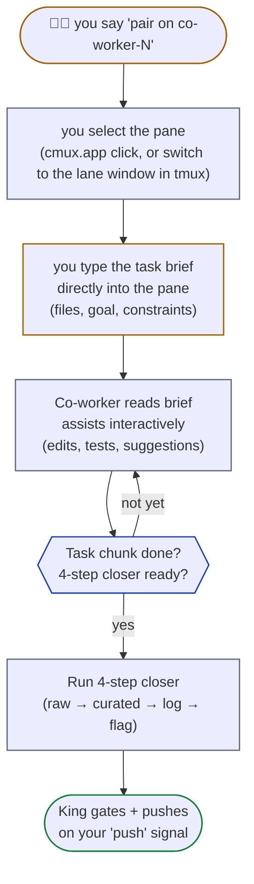

# co-worker.md — Co-worker (user-paired) lanes

Co-worker lanes (`co-worker-1`, `co-worker-2`, …) are the **interactive user-paired** track. Same Claude-teammate spawn mechanics as workers, but the dispatch flow is different: **the user drives, the co-worker assists**.

See [`worker.md`](worker.md) for the shared 4-step closer / dispatch / spawn-rights protocol, the pre-closer task commit (`guard_commit_branch` — R4 + R9), and the smoke-test report (everything below builds on it). See [`king.md`](king.md) for King-only operations (push, two-tier gate, kingdom overlay). See [`git.md`](../reference/git.md) for branch model.

Co-workers are **solo-path lanes** (never in a Senior's story pod — pods are worker-only, see [`senior.md`](senior.md)). So a co-worker's work ships through the **two-tier gate** (worker Tier-1 typecheck -> kingdom-overlay Tier-2 tests/smoke/lint -> human push, R13), NOT the three-tier pod path (R47 — Senior-owned, worker-only).

---

## Co-worker role

- **Dormant by default.** No autonomous task picking. The pane exists in the kingdom layout but stays idle until the user signals. **Co-worker is the ONE role that "waits for user dictation" — this is correct behaviour here (R32). Workers auto-claim and are never dormant; watchman runs `/loop` continuously.**
- **Activates when the user says** "pair on co-worker-1", "UI work on co-worker", "I'll drive co-worker-1", or similar.
- **Co-worker master is interactive:** the user drives the editing (typing into the lane pane, selecting which files to touch, making design calls); the Claude session inside the lane assists (suggests, refactors, runs tests, reads context).
- **Co-worker lane master runs Opus** (same default as autonomous workers). Sub-agents it spawns follow the P1/P2/P3 chain (Sonnet default — definition in [`index.md`](../index.md) → Sub-agent model priority).
- **4-step closer still applies** for any reasoning/output the co-worker session produces — same artifact layout as workers, just with slug `co-worker-N`.

---

## Lane setup (pre-spawned at kingdom startup)

The co-worker's pane and worktree are created as part of the kingdom spawn checklist (see [`king.md`](king.md) → Spawning the kingdom). At session start:

- `.worktrees/co-worker-N/` exists (created via `git worktree add -b "co-worker-N" "$PROJ/.worktrees/co-worker-N" "origin/develop"`), branch `co-worker-N` checked out.
- A Claude session is running in that lane — its own `cmux new-workspace` (the `spawn_master_workspace` helper) in primary mode, or a `tmux` window in fallback mode.
- **R52 self-grounding at spawn:** the King injects `/kingdom:self-co-worker` as the lane's FIRST message (work.md Step 0.4) — the lane pulls its role spec + the Tier-1 rules from disk before any task arrives. This is the ONLY thing the King sends; no autonomous TODO prompt follows.
- After self-grounding, the pane is idle — the King does NOT inject autonomous TODO prompts into it (that is the user's call, per R32).

The user activates the lane by:
- Selecting the pane (clicking it in cmux.app, or switching to it in tmux).
- Typing directly into the pane to start a conversation with that lane's Claude session.

---

## Activation flow

When the user signals "pair on co-worker-1":

1. **The user selects the co-worker pane** (manually in cmux.app, or by switching to it in tmux).
2. **The user types a task brief directly** into the pane — describing what to work on, which files, what the goal is.
3. **The co-worker session reads the brief** and starts assisting interactively.
4. **King may relay a USER-AUTHORED brief** into the pane via `cmux_send` (primary) / `tmux_send` (fallback) if the user explicitly asks ("King, send my plan to co-worker-1"). The King MUST `guard_lane_workspace_exists "co-worker-N"` before that send (R31+R36), same as any dispatch. But the King does NOT pick task content for co-workers — that is the user's call (R32).

Activation: how a co-worker lane goes from dormant to active.



---

## Task file (same as workers, with user-dictated briefs)

Co-workers follow the same task file convention as autonomous workers (see [`worker.md`](worker.md) → "Task file template", R22/R23/R24/R25). One file per task; lane master is sole writer; sub-agents read only.

**Path:** `<workspace>/.kingdom/<project>/tasks/<UTC>__co-worker-N__<sub-task-id>.md`

The only difference from autonomous workers:

- **Brief source:** the user typically dictates the brief verbatim (typing into the pane or via `cmux_send` from the King at the user's request). The co-worker captures what the user said into the task file's "Brief" section, then proceeds with planning.
- **Sub-task ID:** may be informal — co-worker work isn't always tied to a sub-task in `TODO_Master.csv`. Use a descriptive slug if no formal ID exists: `<UTC>__co-worker-1__navbar-redesign.md`.
- **Multi-layer planning is OPTIONAL** for co-workers. If the user is driving (e.g., live UI iteration), the task file may be a single layer with checkboxes for the agreed-upon work. If the co-worker is doing autonomous follow-up (the user set scope, then walked away), full multi-layer planning applies — same as a worker.

Other than that, the schema, lifecycle, and read/write rules are identical to workers.

---

## Dispatch differences from autonomous workers

| Aspect | Workers (autonomous) | Co-workers (user-paired) |
|---|---|---|
| Task source | `kingdom.json.taskSource` — King picks claimable sub-tasks | The user dictates the task directly |
| Claim files | Yes — King writes `<LOGS>/claims/<id>.lane` before dispatch | **No** — co-worker work is user-directed; may intentionally overlap with autonomous lanes |
| Dispatch mechanism | King sends a 4-step-closer prompt via `cmux_send` (primary) / `tmux_send` (fallback) | The user types directly; King mediates only if asked |
| `/compact` between tasks | King sends `/compact` after each task closer | The user manages context manually (or asks King to send `/compact`) |
| Autonomous TODO picking | Yes — King iterates from project's task source | **Never** — co-workers don't claim from TODO |

---

## 4-step closer still applies

Even though dispatch is interactive, the **artifact protocol is unchanged** — the pre-closer steps fire FIRST, in this order (canonical in [`worker.md`](worker.md) → Pre-closer): (1) the mandatory smoke-test report `LANE_<UTC>__co-worker-N__<id>.md` to `<project>/docs/test-reports/`, then (2) the task commit on `co-worker-N` via `guard_commit_branch "$PWD"` (R4 + R9). Then the 4-step closer (raw → curated → log → sentinel, plus the Step-4 `cmux_notify` pair — `tmux_notify` under the tmux FALLBACK backend) defined canonically in [`worker.md`](worker.md) → "The 4-step closer". The sentinel flag is the load-bearing signal (the notify is a convenience badge — same as a worker, see [`worker.md`](worker.md)). Co-workers run all of it identically, with only these differences:

- **Slug** = `co-worker-N` — so artifacts are `raw/<ID>__opus-co-worker-N.md`, `done/<ID>__opus-co-worker-N.flag`, etc. Master polls the flag the same way it does for autonomous workers.
- **Trigger** is interactive: the closer fires when the user says "we're done with this UI task on co-worker-1", not on autonomous task completion.
- **Notify titles** use the 🧑‍💼 emoji + co-worker slug (the worker version uses 👷):

```bash
cmux_notify "" "🧑‍💼 co-worker-1 done" "$ID" "$(head -1 $LOGS/$ID.md)" "$CMUX_SURFACE_ID"
cmux_notify "$KING_WS" "🧑‍💼 co-worker-1 done" "$ID" "$(head -1 $LOGS/$ID.md)"
```

The co-worker's own pane gets a blue ring; the King's sidebar gets a badge. `$KING_WS` is sourced from `<LOGS>/workspace-refs.env` (same as a worker — see [`worker.md`](worker.md) → "The 4-step closer"). Then the user can ask for the pre-commit gate + push. See [`cmux.md`](../reference/cmux.md) → § Notification system for the targeting reference.

---

## PR / push gates identical to autonomous workers

A co-worker ships through the **same two-tier gate + kingdom-overlay review** as an autonomous worker (R13 + R15 + R29). When the user declares a co-worker's work ready:

1. **Pre-closer (lane-side):** before the closer fires, the co-worker has already (1) written its smoke-test report to `<project>/docs/test-reports/LANE_<UTC>__co-worker-N__<sub-task-id>.md`, then (2) committed on its own `co-worker-N` branch (`guard_commit_branch "$PWD"` — R4 + R9). See [`worker.md`](worker.md) → Pre-closer.
2. **Tier-1 gate:** King runs the lane typecheck inside `.worktrees/co-worker-N/` (`gate.typecheck` — fast feedback). See [`king.md`](king.md) → Two-tier gate.
3. **Kingdom overlay + Tier-2 gate:** King overlays the lane onto kingdom's working tree via `kingdom_overlay_lane "$PWD" "co-worker-N" "$BASE"` (R4-guarded — NO commit on `kingdom`), then runs `gate.tests + smoke + lint` on the overlaid working tree. The cross-lane overlap check runs here too. King writes the test report to `<project>/docs/test-reports/KING_<UTC>__co-worker-N__<sub-task-id>.md`. See [`king.md`](king.md) → Kingdom as review staging.
4. **Review surface:** King prints the uncommitted overlay (`git status --short` + `git diff origin/$BASE --stat`) and asks the user to review it (GitHub Desktop's Changes tab / `git diff`). When ≥2 lanes are gated, King overlays ALL of them so the user reviews the full set at once (R15).
5. **Push (single-shot, PR-specific — R1):** the user says the literal word "push" → King runs the FINAL conflict check, carves `feature/<topic>` from `co-worker-N`'s tip byte-for-byte (R9), `git push`, `gh pr create`. See [`git.md`](../reference/git.md) → Push approval gate.
6. **After push:** King discards the overlay (`kingdom_discard_overlay` — R29) and prunes the pushed lane's done-flag.
7. **After PR merge:** King runs `kingdom_resync_after_merge` (R26) — it resyncs kingdom from base and **preserves** the `co-worker-N` worktree (R35: King never destroys a lane's work surface to recreate it). The lane stays ready for the next pair-up; no manual `git worktree remove` + re-add.

The King is still the sole pusher. Co-worker masters never push, just like workers don't.

---

## Conflict with autonomous lanes

Because co-workers DON'T consume claims from `<LOGS>/claims/`, their file edits may intentionally (or accidentally) overlap with autonomous workers' work.

The King's Tier-2 gate **detects overlap** when running the cross-lane file-overlap check on the kingdom overlay (see [`king.md`](king.md) → Common conflict patterns). If overlap is detected, the King reports it:

```text
Test report — co-worker-1 — <task>
  ...
  Cross-lane overlap: files=src/app/shop/page.tsx with lane=worker-2
  Next action: the user decides — push co-worker-1 first then rebase worker-2, OR push worker-2 first then rebase co-worker-1
```

Resolution is **always the user's call**. Co-worker work has no automatic priority — the user decides the merge order. Common patterns:
- Co-worker is doing a tightly-scoped UI iteration → push co-worker-1 first, dispatch a rebase task to worker-2.
- Co-worker is exploratory → land worker-2 first, ask co-worker to integrate worker-2's changes locally before its own PR.

---

## When to use multiple co-workers

`kingdom.json.shape.co-workers` can be >1 if the user wants multiple parallel paired tracks. Examples:

- **co-worker-1** = UI exploration (Figma → React iteration)
- **co-worker-2** = content editing (copy review, marketing landing tweaks)

Each gets its own slot in the cmux layout + its own worktree on a separate `co-worker-N` branch. The user switches between them as needed.

---

## What co-workers DO

Same as workers (see [`worker.md`](worker.md) → Spawn rights inside a lane):

- Read project files.
- Edit + commit locally to `co-worker-N`.
- Lane master itself runs **Opus** (high-quality coding inside the lane). Sub-agents it spawns follow the P1/P2/P3 chain — canonical definition in [`index.md`](../index.md) → Sub-agent model priority. The lane master's model is separate from the sub-agent chain. No eco cap; parallel allowed — per R51, fan heavy work out to parallel sub-agents (soft target ≈ 10, sonnet/haiku/opus by work type, bounded by R42).
  - **Fan-out mechanism ([R53](../rules/R53-fan-out-via-workflow-tool.md)):** when the session exposes the Claude Code **Workflow tool**, prefer it for that heavy fan-out — one Workflow run per task, rendered live in `/workflows`. The army is the same Discover → Execute → Verify shape as a worker (see [`reference/workflow-fanout.md`](../reference/workflow-fanout.md)); the only co-worker difference is that the **user still drives the brief (R32)** — once the brief is set, the army runs identically. If the tool is NOT present, fall back to bounded `Agent()` (R42) or visible cmux tabs, unchanged. The task file (R23) and the 4-step closer (R22) are untouched either way.
- Run the 4-step closer when the task chunk is complete.
- Use `cmux_notify` to ping King/the user when something needs attention.
- Write the task file (mandatory, Step 0 of any task).
- **Invoke skills directly (R41).** In a paired session, the co-worker resolves skills via `pick_skills_for_task` (or `skill-routing.md`) at task start, just like workers do. Because the user is present, the co-worker may also invoke additional skills mid-task on user request — log each invocation in the task file's `## Progress notes`.

## What co-workers DO NOT do

The forbidden-ops list is canonical in [`worker.md`](worker.md) → "What workers DO NOT do (King-only operations)" — `git push`, `feature/*` branch creation, `gh pr create`, the FINAL conflict check, the authoritative pre-commit gate, and task-file reuse. It applies to co-workers **identically**: there are no co-worker-specific exceptions, and all remote-touching git operations remain King-only.
