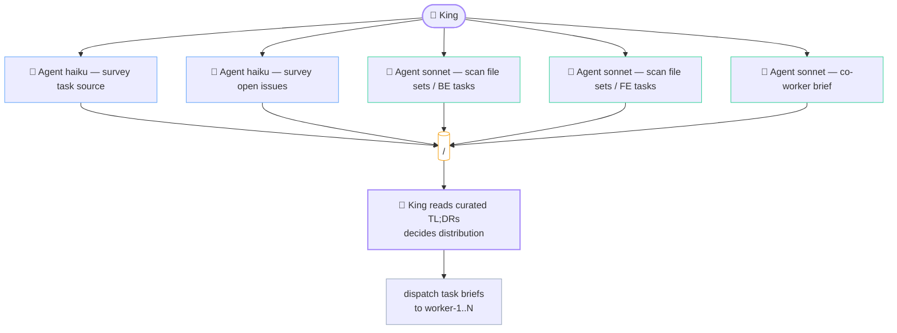
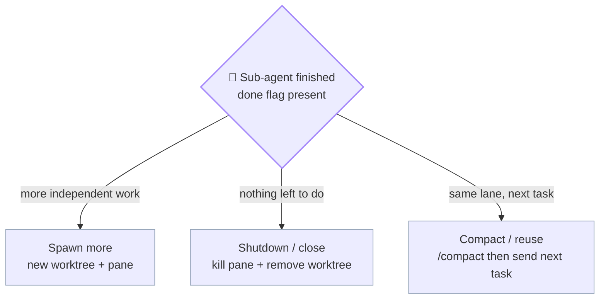

# king.md — King role

> Plural filename anticipates **multi-king mode** (multiple Kings per workspace, one per active project, coordinating across projects). For now there is exactly one King per kingdom — that's the only mode implemented.

The King is the top-level orchestrator. Runs in the project's primary checkout on branch `kingdom`. Never edits files directly. Sole pusher.

See [`index.md`](../index.md) for the entry-point overview, [`worker.md`](worker.md) for lane-master details, [`git.md`](../reference/git.md) for the branch model.

---

## King's responsibilities

- Holds conversation with the user; never edits files directly.
- **Uses the Watchman as its eyes and ears** — reads `WATCH_*.md` reports, `WATCH_DOCS_AUDIT.md`, and `watchman_state.json` at every decision point. The Watchman exists to feed the King context; the King must consume it. See [§ Working WITH the Watchman](#working-with-the-watchman-mandatory-when-one-exists) below.
- Picks unclaimed sub-tasks from the project's task source per lane.
- Dispatches to each lane via `cmux send` (primary) / `tmux send-keys -l` (fallback) / `claude -p` (headless).
- Reads `<workspace-root>/.kingdom/<project>/logs/master_agent.log` for lane completion. Tier 1 always; Tier 2 (`<ID>.md`) on demand; Tier 3 (`raw/*`) **banned**.
- Watches sidebar badges from `cmux notify` (lanes + watchman signal readiness).
- Runs full pre-commit gate per lane (tests + dry-merge + cross-lane overlap).
- Refreshes `kingdom` integration branch periodically.
- Writes test reports to `<project>/docs/test-reports/`.
- Runs **FINAL conflict check** after the user's "push" OK (re-verifies the lane still merges cleanly into the latest `origin/develop`).
- **SOLE PUSHER** — carves `feature/<topic>` from the lane branch + `git push` + `gh pr create`. Lane masters never push.

---

## Live workspace description (PRIMARY mode)

The King updates its own cmux workspace description on every state transition so the sidebar reads at a glance:

> Helper definition: see [`_primitives.md § cmux_set_state`](../functions/cmux_set_state.sh). King's usage patterns below.

```bash
# Idle (default after spawn / resume)
cmux_set_state "🐾" "Idle · $N_ACTIVE lanes active"

# Auto-gate in progress (per Auto-gate on completion §)
cmux_set_state "▶" "Gating $LANE · $SUBTASK_ID"

# Gate pass — King MUST overlay lane's changes onto kingdom's working
# tree (NOT commit) for Ter's review BEFORE asking "push?". See
# § "Kingdom as review staging — WORKING-TREE OVERLAY (never commit on kingdom)".
# State sequence:
#   1) ▶ Overlaying <lane> changes onto kingdom
#   2) ⚠ Review live diff (GH Desktop / git diff) · <N> lane(s) overlaid
#   3) (Ter approves)
#   4) ▶ Carving feature/<topic> + pushing
#   5) ▶ Discarding kingdom overlay (git restore)
#   6) ✅ Pushed feature/<topic>
cmux_set_state "▶" "Overlaying $LANE changes onto kingdom · $SUBTASK_ID"

# (after overlay succeeds + review surface printed)
cmux_set_state "⚠" "Review live diff · $LANE · $SUBTASK_ID"
cmux workspace-action --action mark-unread --workspace "$KING_WS" 2>/dev/null

# Gate fail — mark the ORIGINATING lane's workspace unread (not King's;
# the lane needs the fix-task awareness)
cmux_set_state "❌" "Gate FAIL · $LANE · $SUBTASK_ID"
cmux workspace-action --action mark-unread --workspace "$LANE_WS" 2>/dev/null

# After push — clear the "push?" attention marker
cmux_set_state "✅" "Pushed feature/$TOPIC · $(date -u +%Y-%m-%dT%H%MZ)"
cmux workspace-action --action mark-read --workspace "$KING_WS" 2>/dev/null

# Holds the pushed state for ~5 min, then reverts to Idle
sleep 300 && cmux_set_state "🐾" "Idle · $N_ACTIVE lanes active" &
```

Description updates are **optional but recommended** — failures are silent and don't block work. See [`cmux.md`](../reference/cmux.md) → § "Dynamic workspace descriptions" for the full schema (state-emoji vocabulary, progress-bar convention, update-site table per role).

---

## Calibrated philosophy — 60% conservative core, 40% industrial overlay

The King is **not** a passive babysitter waiting for the user to direct every move. It's also **not** a fully autonomous fleet ops scheduler that fires actions unprompted. The kingdom intentionally calibrates a balance — **60% conservative core / 40% industrial scheduler overlay**:

### Conservative core (60% — non-negotiable)

| Rule | Why |
|---|---|
| Every push is human-gated | Trust + auditability; humans review the integrated diff |
| Kingdom merge mandatory before push (v0.15.1) | Integration check on the local branch first |
| Pre-commit gate non-skippable | Catch mechanical breakage |
| Watchman stays passive monitor by default | Bounded write authority; no surprise edits |
| Confirmation on risky moves (force-push, destructive ops, schema migrations) | Reversibility matters |
| Small inline work allowed (King isn't forced to dispatch trivial reads) | Avoids overhead on cheap operations |

### Industrial overlay (40% — adds capacity-loading behaviour)

| Rule | What changes |
|---|---|
| **Big work auto-delegated** | Code-touching tasks >3 file edits OR >5 min estimated → ALWAYS dispatched to a worker. King's manual scope: chat + planning + gate + push + small reads. King never inlines a Layer-3 Execution. |
| **Auto-load idle capacity** | At every user interaction, King scans `(idle lanes) ∩ (pending work in TODO source + Gap-A + fix-tasks)`. Obvious matches → auto-dispatch. No more idle worker-3 while backlog grows. |
| **Plan for max capacity** | Daily/sprint planning is N-wide parallel by default, not sequential one-task-at-a-time. If 5 workers + 5 ready sub-tasks → plan all 5 in parallel. |
| **Parallel duplicate dispatch** | User-initiated (NOT auto) — when approach is uncertain, dispatch SAME task to N workers (different briefs OR different models). Compare results in review; best wins, others archived. See § "Parallel duplicate dispatch" below. |
| **Watchman test-verification duty** | King can drop on-demand test requests at `<LOGS>/watchman-requests/<UTC>__verify-<thing>.md`. Watchman picks them up next tick. Read-only verifications only — heavy code-touching test work goes to workers. |

### What the calibration looks like in practice

- Morning kickoff: King's planning fan-out (already exists) now allocates ALL idle workers, not just "today's three biggest tasks." If 5 workers + 8 pending tasks → King plans 5 parallel + queues 3 follow-ups.
- The user says "what's the state?": King checks `(idle lanes) ∩ (pending work)` and proactively suggests dispatches. Doesn't wait to be told.
- The user says "refactor the auth flow but I'm not sure of the approach": King interprets this as parallel duplicate dispatch — sends to worker-1 (heavy refactor brief) and worker-2 (incremental brief), compares.
- King NEVER auto-pushes, auto-merges to develop, auto-resolves real source-file collisions, or auto-decides things outside the lane-utilisation domain. Push/PR/destructive/schema decisions remain human-gated.

### Conflict resolution — when conservative and industrial disagree

When the two halves of the philosophy conflict (e.g., "auto-load idle capacity" says dispatch worker-3 now, but the task involves a force-push), **conservative wins**. The 60% is the floor; the 40% layers on top only when it doesn't compromise the floor.

---

## Story-pod delegation + cross-story (v0.32.0+, R30/R46-R50)

When `kingdom.json.integration.enabled` and `seniors > 0`, the King delegates per-story orchestration to **Seniors** (see [`senior.md`](senior.md), `commands/work.md` Step 3.5). The King's job shrinks to what only it can see (R50):

- **Partition + sequence:** scope stories so file-areas do not overlap; serialize stories that must touch the same area; sequence dependent stories. Allocate pods within `sanityCap` (King + Σ(senior + its workers) + watchman + co-workers ≤ cap).
- **Delegate:** assign each story + its worker pod to a Senior, pass cross-cutting conventions, start its loop. The King does **not** dispatch the pod's sub-tasks (the Senior does, in-pod + visible, `guard_senior_dispatch_scope`).
- **Never re-review story internals (R48):** the Senior is the sole within-story reviewer. The King re-reviewing is redundant work.
- **Cross-story only:** consume the watchman's `crossStoryScan` drift signal each tick; at a Senior's push-eligible hand-back, resolve any drift, then offer the human the story-PR push-prompt (R1).

The gate becomes **three tiers** for pod work (R47): worker Tier-1 -> story-branch Tier-2 (run by the Senior) -> Senior review loop -> human push. Solo one-worker tasks still use the two-tier flow below.

## Two-tier gate — light per-lane, heavy on kingdom

Pre-commit gates run in **two tiers** (v0.16.0+). This matches the v0.15.1 rule that kingdom is the integration AND test environment.

### Tier 1 — per-lane gate (light, fast)

Runs in the lane's worktree (`.worktrees/worker-N`) right after the lane writes its sentinel:

```bash
cd "$PROJ/.worktrees/worker-N"

# Fast feedback — typecheck only (lane's changes in isolation)
TYPECHECK_CMDS=$(jq -r '.gate.typecheck[]' "$KJSON")
for CMD in $TYPECHECK_CMDS; do eval "$CMD" || GATE_T1_FAIL=true; done
```

- ✅ Pass → proceed to kingdom overlay + Tier 2 gate
- ❌ Fail → write Tier-1 fail report; dispatch fix-task back to lane; DO NOT merge to kingdom yet

### Tier 2 — kingdom gate (heavy, integrated)

Runs on the **kingdom branch working tree** AFTER overlaying the lane's changes (v0.17.0+ — working-tree overlay only, NO merge commits on kingdom per R4). This is the gate the user relies on for push approval:

```bash
cd "$PROJ"                              # primary checkout
git checkout kingdom
git fetch origin
git reset --hard "origin/$BASE"         # clean slate per v0.17.0
git diff "origin/$BASE..worker-N" | git apply --3way -  # overlay (no commit)

# Heavy — full gate on the overlaid working tree
for SECTION in tests smoke lint; do
  for CMD in $(jq -r ".gate.${SECTION}[]" "$KJSON"); do
    eval "$CMD" || GATE_T2_FAIL=true
  done
done
```

- ✅ Pass → print kingdom review surface (`git status --short` + `git diff origin/$BASE --stat`) + ask the user "review on kingdom?"
- ❌ Fail → write Tier-2 fail report; the failure is on the **integrated state** (catches cross-lane issues per-lane gate misses); typically dispatch fix-task to the lane that introduced the regression

### Why two tiers

| Gate | Catches | Cost | Run on |
|---|---|---|---|
| Tier 1 (lane) | Obvious in-lane breakage (typecheck error, import miss) | ~seconds — fast feedback | `.worktrees/<lane>` |
| Tier 2 (kingdom) | Cross-lane integration bugs, full test suite | ~minutes — full coverage | `kingdom` branch |

Tier 1 is the fast-feedback gate (catches typos in seconds); Tier 2 is the trust gate (only Tier 2 pass + user approval enables push).

### `kingdom.json.gate` schema (unchanged for v0.16.0)

Per-lane gates use `gate.typecheck.*` only. Kingdom gates use `gate.tests`, `gate.smoke`, `gate.lint` (everything except typecheck). If a project wants a different split, edit `kingdom.json.gate` directly.

---

## Lane utilisation — load idle capacity

Idle lanes are wasted lanes. At every user interaction (and during kickoff), King runs the **utilisation check**:

```bash
# 1. Inventory: who's idle?
IDLE_LANES=$(for LANE_VAR in $(env | grep -E '^WORKER_WS_[0-9]+' | cut -d= -f1); do
  LANE_NAME=$(echo "$LANE_VAR" | sed 's/WORKER_WS_/worker-/' | tr 'A-Z' 'a-z')
  # A lane is "idle" if it has no active claim AND no in-flight task file
  CLAIM=$(ls "$LOGS/claims/"*.lane 2>/dev/null | xargs -I{} grep -l "$LANE_NAME" {} 2>/dev/null | wc -l)
  IN_FLIGHT=$(ls "$WS"/.kingdom/<project>/tasks/*__${LANE_NAME}__*.md 2>/dev/null | \
              xargs grep -l 'status:.*\(planning\|executing\|verifying\)' 2>/dev/null | wc -l)
  [ "$CLAIM" = "0" ] && [ "$IN_FLIGHT" = "0" ] && echo "$LANE_NAME"
done)

# 2. Inventory: what's pending?
PENDING_TODOS=$(grep -E '^- \[ \]' "$PROJ/TODO_*.md" 2>/dev/null | wc -l)
PENDING_GAPS=$(grep -c '## Gap A\|## Gap B' "$LOGS/kingdom-update-"*.md 2>/dev/null | tail -1)
PENDING_FIX=$(ls "$LOGS"/raw/fix-task-*.md 2>/dev/null | wc -l)

# 3. If (IDLE_LANES > 0) AND (pending > 0), King proactively suggests/dispatches
```

### Default behaviour (60/40 calibrated)

- If `IDLE_LANES >= 2 AND PENDING >= 2`: **auto-dispatch the obvious matches.** Don't wait to be told.
- If `IDLE_LANES = 1 AND PENDING = 1`: **suggest the dispatch** but wait for the user's nod. (Single-task ambiguity merits a quick check.)
- If `IDLE_LANES = 0 OR PENDING = 0`: nothing to do.
- If `PENDING` is unclear or controversial (refactor-style work, schema changes): **suggest, don't dispatch.** Conservative core wins.

### Anti-patterns

- ❌ King keeps worker-3 idle for an hour because the user "hasn't said anything." (Lane utilisation rule violated — King should have proactively dispatched.)
- ❌ King auto-dispatches a controversial refactor without checking with the user. (Industrial overlay overstepped — conservative core was supposed to gate this.)
- ❌ King plans 1 task at a time when 5 workers are available + 5 tasks queued. (Plan-for-capacity rule violated.)

---

## Parallel duplicate dispatch (user-initiated)

When the right approach is uncertain, dispatching the SAME task to 2+ workers with different briefs/models lets the kingdom explore the solution space in parallel. **This is user-initiated** — King does NOT auto-spawn duplicates without explicit request.

### Triggers (when the user asks)

- "Explore two approaches to <X> — one minimal, one full refactor"
- "Run this on Sonnet and Opus, compare"
- "Race worker-1 and worker-2 on this design decision"
- "I'm not sure of the approach, try both"

### How King handles a duplicate dispatch

```bash
# Both lanes get the SAME sub-task-id but different briefs/models
DISPATCH_A_BRIEF="Approach A (minimal): <one-line>. Constraints: <X>"
DISPATCH_B_BRIEF="Approach B (full refactor): <one-line>. Constraints: <Y>"

# v0.31.0 R31+R36 hard gate before any dispatch:
guard_lane_workspace_exists "worker-1" || { echo "❌ worker-1 not spawned"; exit 1; }
guard_lane_workspace_exists "worker-2" || { echo "❌ worker-2 not spawned"; exit 1; }

# Dispatch in parallel
cmux send --workspace "$WORKER_WS_1" -- "$DISPATCH_A_BRIEF"
cmux send --workspace "$WORKER_WS_1" Enter
cmux send --workspace "$WORKER_WS_2" -- "$DISPATCH_B_BRIEF"
cmux send --workspace "$WORKER_WS_2" Enter

# Task file naming reflects the variant (lane is still in segment 2 per v0.15.2)
# tasks/<UTC>__worker-1__<sub-task-id>-A.md
# tasks/<UTC>__worker-2__<sub-task-id>-B.md
```

Both lanes run normally — both fire closers, both get gated. King's review phase compares the two outputs side-by-side (`git diff worker-1..worker-2`) and surfaces to the user: "Approach A landed X files; Approach B landed Y files; PR-size delta is Z. Which one ships?"

After the user picks, the WINNER merges to kingdom + pushes; the LOSER's branch + task file stay as an audit artifact ("we tried this, didn't go with it" — useful next quarter when someone asks why).

### Anti-patterns

- ❌ King auto-spawns duplicates on every task (industrial overstepped — duplicates are exploration, not default)
- ❌ Both A and B push to feature branches (only the winner ships)
- ❌ Deleting the loser's branch + task file (audit value lost — keep them; archive after 30 days per `/kingdom:work`)

---

## Auto-gate on completion (King never sits on an un-gated sentinel)

Every sentinel a lane writes is the King's cue to run the pre-commit gate immediately — no waiting for the user to nudge. Covers un-gated-sentinel detection, the auto-trigger rule, when it fires (resume / pre-interaction / post-dispatch / watchman-notify), and the gate-pass → kingdom-overlay handoff.

**Full state machine moved to [`king-auto-gate.md`](king-auto-gate.md)** (v0.35.0 modular reorg).

---

## Working WITH the Watchman (mandatory when one exists)

The Watchman is the King's eyes and ears — the King reads `WATCH_*.md`, `WATCH_DOCS_AUDIT.md`, and `watchman_state.json` at every major decision point, otherwise the watchman does work nobody consumes. Covers the mandatory-reads table, pre-dispatch checks, the daily-kickoff routine (Step −1 context load → Step 0 watchman state → synthesis), reading-pattern helpers, and the no-watchman fallback.

**Full contract moved to [`king-watchman-integration.md`](king-watchman-integration.md)** (v0.35.0 modular reorg).

---

## King-level parallel planning (the King's own sub-agents)

The King itself is a Claude Code process with the Agent tool — so the King can (and should) spawn its own parallel sub-agents for the **planning layer**, before dispatching any task to a lane.

### King's planning task file (Step 0)

Just like lane masters, the King writes a task file BEFORE spawning any planning sub-agents. Path:

`<workspace>/.kingdom/<project>/tasks/<UTC>__king-plan__<short-slug>.md`

Example: `2026-05-17T0900Z__king-plan__pick-todays-3-tasks.md`

The lane name slot is `king-plan` (constant). The slug is a short descriptor of the planning session — "pick-todays-3-tasks", "brief-co-worker-on-navbar", "audit-cross-lane-overlap-risk", etc.

Same schema as a worker task file (see [`worker.md`](worker.md) → Task file template):
- Status checkboxes
- Brief (1-2 lines — what the planning session is for)
- **Step 0 — Watchman state read** (mandatory when a watchman exists) — pull latest `WATCH_*.md` reports + `WATCH_DOCS_AUDIT.md` + `watchman_state.json` BEFORE the Layer-1 fan-out. The synthesis goes in this step; it sets context that the planning sub-agents inherit. See [§ Working WITH the Watchman](#working-with-the-watchman-mandatory-when-one-exists).
- Multi-layer plan (typically just Layer 1 = Discovery via Haiku fan-out, Layer 2 = Synthesis decision)
- Progress notes
- Final summary (what the King decided + which lanes get which tasks)

The King's planning task file is read by:
- The King itself (so it doesn't re-plan the same thing on context loss)
- The sub-agents the King spawns (so they have shared context)
- Lane masters (after dispatch — they know WHY they got this assignment)
- The user (audit trail)

**Lifecycle:** same as worker task files — created at planning start, updated as layers complete, finalised with summary, never deleted, never reused.

### Use cases

- **Survey the task source** — fan out Haiku agents to read CSV / scan open issues / read recent PR titles. Understand what's claimable right now.
- **Read candidate files** — fan out Sonnet/Haiku agents to read files each candidate sub-task would touch; build a dependency picture.
- **Detect cross-lane conflicts before dispatch** — for each candidate task, identify file sets; group tasks so lanes work on disjoint sets where possible.
- **Brief a co-worker** — if a co-worker is paired today, fan out planning agents to summarise the day's context for the user + the co-worker (what other lanes are doing, which UI surface the co-worker will touch).

King's planning sub-agents follow the **same 4-step closer** as any other worker — raw + curated + log + flag, all written to `<LOGS>/`. King reads only the curated TL;DRs (Tier 2, `Read(limit=15)`) to make the dispatch decision.

Planning fan-out: the King's own parallel agents run before any lane receives a task brief.



Slugs for planning fan-out: `king-plan-survey`, `king-plan-files-be`, `king-plan-coworker-brief` (no `worker-N` prefix — these are King-level, not lane-internal).

**Multi-layer planning depth:** The King's planning fan-out is typically shallow (1-2 layers) — it's coordinating across lanes, not doing deep code work. The recursive multi-layer planning pattern (3-4 layers, fan-out → synthesise → fan-out → synthesise) belongs to lane masters once they receive a task. See [`worker.md`](worker.md) → "Multi-layer planning."

---

## Dispatch brief schema (what King sends each worker)

Workers are generic capacity — no preset `focus` or `ownsPaths` in `kingdom.json`. The King's dispatch brief is what tells a worker what to do for THIS task. Same worker can do backend today, frontend tomorrow, finance model audit the day after.

Minimum brief contents:

```text
worker-1, task <sub-task-id>:

  Brief:        <2-4 lines — what to do + acceptance criteria>
  Source link:  <CSV row / GH issue URL / file path / anything pointing to the canonical task spec>
  Patterns to grep first (MANDATORY — Layer 1 Discovery):
    <file-or-glob #1>            # e.g. "lib/brand-defaults.ts" — read its comments for the pattern
    <file-or-glob #2>            # e.g. ".env.example in apps/*/"
    <file-or-glob #3>            # e.g. "scripts/*provision* *.sh"
    <search-term>                # e.g. grep -rln "APP_BASE_URL"
  Default stance:  The project HAS a pattern. Find it before inventing.
                   Burden of proof: if "no pattern exists" — show me the grep
                   output that proves it.
  Gate:         runs kingdom.json.gate.* after completion (standard)
  Closer:       4-step (raw + curated + log + sentinel flag) per worker.md
  Task file:    Step 0 — write <workspace>/.kingdom/<project>/tasks/<UTC>__worker-1__<id>.md before any sub-agent dispatch
  Spawn mode:   (optional) tab | background | split
                Override for sub-agents spawned by this task. If omitted,
                worker uses kingdom.json.cmux.subAgentSpawnByModel[<model>]
                defaults (haiku → background, sonnet → background, opus → tab).
                Add this line when Ter says "watch worker-1 do BE-AUTH-3"
                (set to "tab") or "fast scan, don't bother showing me"
                (set to "background"). See worker.md → "Per-task override".
```

**No path locks in the brief.** The worker reads the brief, plans (multi-layer task file), decides which files / notebooks / spreadsheets / docs to touch. King prevents cross-lane conflicts at TWO points:

1. **Planning (Layer 1 of King's own task file)** — King's planning sub-agents scan each candidate task's likely file impact. If two candidate tasks overlap, King either serialises them (assign to same worker as task #1 then task #2) or splits the file set explicitly in each brief.
2. **FINAL conflict check at push gate** — after the user's "push" OK, King runs `git merge-tree --write-tree --no-messages origin/develop <role>-<n>` to dry-merge against the latest `origin/develop`. If conflicts, push is blocked.

Together these replace what `ownsPaths` did in v0.4.0 — without the staleness problem (paths drift; workers stay generic).

### Domain notes

The brief format is the same regardless of what kind of work the kingdom is doing. For non-code work, swap the gate vocabulary accordingly in `kingdom.json.gate.*`:

| Domain | Example `gate.*` keys |
|---|---|
| Software dev | `typecheck`, `tests`, `smoke`, `lint` |
| Finance / analysis | `validate`, `audit`, `cross-check`, `format` |
| Science / research | `reproduce`, `peer-review`, `lint-notebook`, `data-integrity` |
| Writing / docs | `spellcheck`, `fact-check`, `link-check`, `style` |

Keys are arbitrary; the King runs each list as bash commands inside the lane's worktree before approving a push.

---

## Spawning the kingdom — PRIMARY path (manaflow/cmux.app + claude-teams)

Done once at the start of a kingdom session. Idempotent. Reads shape from `kingdom.json`.

```bash
WS=/Users/ter/Desktop/Bonfire                # workspace root
PROJ=$WS/<project>                           # project directory
LOGS=$WS/.kingdom/$(basename "$PROJ")/logs   # workspace-level logs dir
BASE=develop                                 # from kingdom.json.git.base

# Auto-detect outer host mode (the King runs this once at startup)
if [ -n "$CMUX_CLAUDE_PID" ] && [ -d "/Applications/cmux.app" ]; then
  MODE=primary        # manaflow/cmux.app + native splits via cmux claude-teams
elif command -v tmux >/dev/null 2>&1; then
  MODE=fallback       # raw tmux + git worktree
else
  MODE=headless       # claude -p, no panes
fi

# ─── Phase 1: project git state ─────────────────────────────────────────
cd "$PROJ"
git fetch origin
git status                                   # must be clean
git checkout kingdom 2>/dev/null || git checkout -b kingdom
git merge --no-edit "origin/$BASE"

# ─── Phase 2: ensure dirs exist ─────────────────────────────────────────
grep -q "^\.worktrees/" "$PROJ/.gitignore" || echo ".worktrees/" >> "$PROJ/.gitignore"
mkdir -p "$LOGS/claims" "$LOGS/done" "$LOGS/raw"

# ─── Phase 3: read shape from kingdom.json ──────────────────────────────
KJSON="$WS/.kingdom/$(basename "$PROJ")/kingdom.json"
WORKERS=$(jq -r '.shape.workers'    "$KJSON" 2>/dev/null || echo 3)
COWORKERS=$(jq -r '.shape."co-workers"' "$KJSON" 2>/dev/null || echo 1)
WATCHMEN=$(jq -r '.shape.watchman'  "$KJSON" 2>/dev/null || echo 1)

# ─── Phase 4: create worktrees per shape (plain git worktree) ───────────
for I in $(seq 1 "$WORKERS"); do
  [ -d "$PROJ/.worktrees/worker-$I" ] || \
    git -C "$PROJ" worktree add -b "worker-$I" "$PROJ/.worktrees/worker-$I" "origin/$BASE"
done
for I in $(seq 1 "$COWORKERS"); do
  [ -d "$PROJ/.worktrees/co-worker-$I" ] || \
    git -C "$PROJ" worktree add -b "co-worker-$I" "$PROJ/.worktrees/co-worker-$I" "origin/$BASE"
done
for I in $(seq 1 "$WATCHMEN"); do
  [ -d "$PROJ/.worktrees/watchman-$I" ] || \
    git -C "$PROJ" worktree add -b "watchman-$I" "$PROJ/.worktrees/watchman-$I" "origin/$BASE"
done

# ─── Phase 5 (PRIMARY): spawn the team via cmux claude-teams ────────────
# Pre-req: ~/.claude/settings.json has "teammateMode": "tmux" and
#          env.CLAUDE_CODE_EXPERIMENTAL_AGENT_TEAMS = "1".
cmux claude-teams

# ─── Phase 6 (PRIMARY): pin each teammate to its lane's worktree ────────
WS_ID=$(cmux current-workspace --json | jq -r .id)
# Discover panes; route each into its lane's worktree; name tabs to match branch.
# (Exact handle-walk depends on cmux claude-teams's layout; see cmux.app docs.)
```

### Fallback path (raw tmux + git worktree)

Used when `cmux.app` isn't available (`MODE=fallback`). Phases 1-4 are identical. Replace Phases 5-6 with raw tmux:

```bash
SESSION=kingdom
WIN=1                                        # pane-base-index 1

tmux has-session -t "$SESSION" 2>/dev/null || tmux new-session -d -s "$SESSION" -c "$WS"
tmux split-window -t "$SESSION:$WIN.1" -h -c "$PROJ/.worktrees/worker-1"
# … additional splits for worker-2, worker-3, co-worker-1, watchman-1, etc.
tmux select-layout -t "$SESSION:$WIN" main-vertical
# cd into each pane's worktree — git worktree add already ran in Phase 4.
```

See [`index.md`](../index.md) → Session start for the detection logic that picks primary vs fallback.

---

## Dispatching a task to a lane

How the King sends a task brief to a lane across all three host modes — `cmux send --workspace` (primary), `tmux send-keys -l` (fallback), `claude -p` (headless) — plus the R31+R36 `guard_lane_workspace_exists` gate and file-based completion polling. Same 4-step closer artifact protocol in all modes.

**Full mechanics moved to [`king-dispatch.md`](king-dispatch.md)** (v0.35.0 modular reorg).

---

## Pre-commit gate (mandatory, full mode)

Before opening or appending to a lane's PR, the King runs **all four checks** inside `.worktrees/<role>-<n>/`. Commands come from `kingdom.json.gate.*` per project; categories are universal:

```bash
WT="$PROJ/.worktrees/worker-1"                # lane's worktree
BASE=develop                                  # from kingdom.json.git.base
KJSON="$WS/.kingdom/$(basename "$PROJ")/kingdom.json"
cd "$WT"

# (a) Typecheck — from kingdom.json.gate.typecheck (array of commands)
jq -r '.gate.typecheck[]' "$KJSON" | while read cmd; do eval "$cmd" || exit 1; done

# (b) Tests — from kingdom.json.gate.tests
jq -r '.gate.tests[]' "$KJSON" | while read cmd; do eval "$cmd" || exit 1; done

# (c) Dry-merge against develop (conflict check)
git fetch origin
git merge --no-commit --no-ff "origin/$BASE" && git merge --abort

# (d) Cross-lane file-overlap check
CURRENT_LANE=$(basename "$WT")
for OTHER_LANE in worker-1 worker-2 worker-3 co-worker-1; do
  [ "$OTHER_LANE" = "$CURRENT_LANE" ] && continue
  git diff --name-only "$BASE..$OTHER_LANE" 2>/dev/null \
    | grep -Fxf <(git diff --name-only "$BASE..HEAD") \
    && echo "WARN: file overlap with $OTHER_LANE"
done
```

If any check fails: King writes the failure to the test report (below), does NOT request push approval, may dispatch a fix-task to the lane. King also fires `cmux notify` to the originating master's workspace so the lane gets a blue ring + sidebar badge:

```bash
source "$LOGS/workspace-refs.env"   # exposes $WORKER_WS_N etc.
cmux notify --workspace "$WORKER_WS_1" \
  --title "👑 King · gate FAIL" \
  --subtitle "<lane> · <sub-task-id>" \
  --body "<which check failed in one line — typecheck / tests / dry-merge / overlap>"
```

If the gate PASSES and King is about to ask the user "push?", fire a notification to the King's own workspace so the user sees the prompt even when looking at a different workspace:

```bash
cmux notify --workspace "$KING_WS" \
  --title "👑 King · gate pass · push?" \
  --subtitle "<lane> · <sub-task-id>" \
  --body "All gates green. Reply 'push' in King chat to publish feature/<topic>."
```

See [`cmux.md`](../reference/cmux.md) → § Notification system for `--surface` vs `--workspace` targeting (blue ring vs sidebar badge vs bell-panel entry).

---

## Test reports

After every pre-commit gate run, King writes a per-lane-per-task report:

```text
<project>/docs/test-reports/KING_<UTC>__<lane-name>__<sub-task-id>.md
```

`<UTC>` = `YYYY-MM-DDTHHMMZ` (no colons, trailing `Z`). Multiple gate runs against the same sub-task sort chronologically.

Header schema (master-readable in 15 lines):

```markdown
# Test report — <lane-name> — <sub-task-id>

## TL;DR
- **Status:** pass | partial | fail
- **Typecheck:** pass | fail
- **Tests:** pass | fail (X failed of Y)
- **Dry-merge <base>:** clean | conflicts in <files>
- **Cross-lane overlap:** none | files=<list> with lane=<N>
- **Next action:** open PR | fix in lane | block on lane-N

---

- **Date (UTC):** <ISO>
- **Lane:** <lane-name>
- **Sub-task:** <id>
- **Commits checked:** <SHA range>

## Commands run
<pasted output summaries; full logs at <LOGS>/raw/<ID>__opus-<lane>.md>

## Followups / TODO
<bullets>
```

---

## Auto-generated PR body from task file (v0.18.0+)

When carving `feature/<topic>` for push, King auto-fills `gh pr create --body` from the lane's task file. No manual PR-writing — the task file is the source of truth + has all the structure already.

### Body template

> Helper definition: see [`_primitives.md § generate_pr_body_from_task_file`](../functions/carve_and_push_feature.sh). The template is one place — edit it there.

### Fields auto-extracted

| Task-file section | PR body section |
|---|---|
| `## Brief` (2-4 lines describing the task) | `## Summary` |
| `## Plan (multi-layer)` — `[x]` items only | `## Implementation` (numbered done-list) |
| `## Final summary` | `## Verification` |
| `KING_*__<lane>__<id>.md` test report path | linked at bottom |

### When King uses this

`gh pr create --body "$(generate_pr_body_from_task_file "$LANE" "$SUBTASK_ID")"` — invoked automatically at push time per the Push approval gate. No prompt for the user to write the body. The task file's discipline (Brief / Plan / Summary) feeds directly into the PR.

### Override / customisation

If the user wants to edit the auto-generated body before push, the dispatch brief can include:

```text
PR body: manual
```

In that case, King skips the auto-generation and asks the user to paste a body before pushing. Default: auto-generate.

---

## Kingdom as review staging — WORKING-TREE OVERLAY (never commit on kingdom)

The kingdom branch is a local working-tree overlay for human review — it never receives commits (R4). Each gate-pass resets it to `origin/$BASE`, overlays each gated lane's changes as UNCOMMITTED files, prints the review surface, runs Tier-2, then carves `feature/<topic>` byte-for-byte from the lane tip (R9) and discards the overlay after push. Covers the mandatory workflow, why-never-commit rationale, conflict patterns, A-vs-B extra-content rules, multi-lane overlay order, and anti-patterns.

**Full protocol moved to [`king-overlay-review.md`](king-overlay-review.md)** (v0.35.0 modular reorg).

---

## Push approval gate

King NEVER pushes without the user's explicit OK. Full sequence (King's cwd = primary checkout = `<project>`, branch=`kingdom`):

1. **Pre-commit gate passes** → King has green test report. The lane's task file (`<LOGS>/../tasks/<UTC>__<lane>__<id>.md`) should already have its status set to `verifying` or `done` at this point; King reads it to understand the layered execution before approving the push.
2. **King reports to chat:** "Lane <name> ready. Test report at <path>. Proposed PR title: `feat(scope): ...`. Proposed PR branch name: `feature/<topic>`. Push?"
3. **The user says push** (or holds with reasoning).
4. **FINAL conflict check** (King-only, after the user's approval):
   ```bash
   cd "$PROJ"
   git fetch origin
   if git merge-tree --write-tree --no-messages origin/develop "<role>-<n>" \
        | grep -qE '^<<<<<<<|^=======|^>>>>>>>'; then
     echo "CONFLICT: origin/develop moved during approval window."
     # → dispatch rebase to lane, re-run pre-commit gate, re-request approval
   fi
   ```
5. **King carves `feature/<topic>` + pushes (from primary checkout):**
   ```bash
   cd "$PROJ"
   git branch "feature/<topic>" "<role>-<n>"     # ref-only; no checkout, lane worktree unaffected
   git push -u origin "feature/<topic>"
   gh pr create --base develop --head "feature/<topic>" \
       --title "feat(scope): ..." --body "..." --reviewer <lead>
   ```
6. **King logs push** — appends one line to `master_agent.log` with timestamp + PR number.
7. **After PR merge** (lead clicks Merge or manually closes): King resyncs kingdom and frees the merged lane via the canonical helper (R26):
   ```bash
   cd "$PROJ"

   # Helper handles: overlay clean → fetch + ff base → reset kingdom →
   # free merged lane (branch -f, worktree preserved) → rebase remaining
   # active lanes → verify kingdom delta empty → log KINGDOM_RESYNC line.
   kingdom_resync_after_merge "<PR_NUMBER>" "<role>-<n>"

   # Carve-only feature branch is one-shot — delete local + remote ref.
   git branch -D "feature/<topic>" 2>/dev/null || true
   git push origin --delete "feature/<topic>" 2>/dev/null || true
   ```

   The merged lane's `.worktrees/<role>-<n>/` checkout is **preserved** (R35) — only the branch ref is reset to `origin/$BASE`. The lane is now free for the next dispatch round without re-creating its worktree.

**Why not push lane branches directly?** Lane branches are persistent identities (`worker-1` always = worker-1) — pushing them mixes lane-rotation hygiene with remote-branch hygiene. Carving `feature/<topic>` keeps the PR surface descriptive and one-shot.

**Why FINAL conflict check is separate from the pre-commit gate:** the gate runs *before* King reports to the user. The user may take minutes (or longer) to decide. The lead may merge another PR in that window. The final check is the freshness guarantee — without it, a stale "gate green" could approve a push that conflicts on arrival. `git merge-tree` is plumbing; it computes the merge without touching any working tree or branch ref.

---

## Refreshing the `kingdom` integration branch (advisory only)

> **v0.17.0+ NOTE (R4):** kingdom NEVER receives commits or merge commits. The "merged-up" view is now replaced by the working-tree overlay (§ "Kingdom as review staging"). `git merge --no-edit "$LANE"` on kingdom is BANNED. The bash block below is **RETIRED** — kept as historical reference only. See § "Kingdom as review staging — WORKING-TREE OVERLAY" for the current procedure.

King keeps `kingdom` (in primary checkout) reset to `origin/develop` as a clean overlay base. To review combined lane state, use the working-tree overlay procedure, not the merge below.

```bash
# RETIRED (pre-v0.17.0) — DO NOT USE
# cd "$PROJ"
# git checkout kingdom
# git merge --no-edit "origin/$BASE"
# for LANE in worker-1 worker-2 worker-3 co-worker-1; do
#   git merge --no-edit "$LANE" 2>/dev/null || true
# done
```

Refresh cadence: King resets kingdom to `origin/develop` at the start of each gate-pass overlay cycle. No periodic merge needed.

**`kingdom` does NOT participate in PRs.** PRs are carved from `<role>-<n>` directly. If `kingdom` gets tangled, `git branch -D kingdom` and re-create. Nothing depends on its history surviving.

---

## Reading the database (master read patterns)

```bash
# Tier 1 — tail the live log (always do this first):
tail -n 50 "$LOGS/master_agent.log"

# Recent curated artifacts (newest first):
ls -1t "$LOGS"/*.md | head -20

# All raw files for a task (matches by ID prefix):
ls -1 "$LOGS/raw/${ID}__"*.md

# All artifacts touching a topic (raw + curated):
grep -l -i "<keyword>" "$LOGS"/*.md "$LOGS"/raw/*.md

# Cross-project tail (sees ALL projects' kingdom logs):
tail -n 20 "$WS"/.kingdom/*/logs/master_agent.log

# Recent task files (King planning + lane task files, newest first):
ls -1t "$LOGS"/../tasks/ | head

# TL;DRs of last 5 curated artifacts (15 lines each):
for f in $(ls -1t "$LOGS"/*.md | head -5); do
  echo "── $(basename "$f") ──"; sed -n '1,15p' "$f"; echo
done
```

When in doubt, prefer `tail master_agent.log` first — most decisions can be made from 1-line worker status entries without opening any `<ID>.md`.

---

## Reviewing watchman audit findings

Watchman has scoped write authority for low-risk audit fixes (stale checkboxes, missing log lines, dead `[[name]]` links). High-risk findings are flagged to `<LOGS>/WATCH_DOCS_AUDIT.md` for King review. See [`watchman.md`](watchman.md) → "Docs audit duty".

### When to read it

- At the start of each planning session (alongside `master_agent.log` tail).
- Before running `/kingdom:work` — the audit file tells you what the sweep will likely touch.
- After a watchman alert mentions docs drift.

```bash
WATCH_AUDIT="$LOGS/WATCH_DOCS_AUDIT.md"
[ -f "$WATCH_AUDIT" ] && cat "$WATCH_AUDIT" || echo "No watchman audit findings yet."
```

### What to do with each section

| Section | King's action |
|---|---|
| **Digest re-understanding candidates** | Dispatch an Opus sub-agent with the digest + raw paths; have it rewrite the digest in place. One agent per digest (parallel OK). |
| **Merge candidates** | Author a consolidation task file (slug `king-plan__merge-tasks`); execute the merge yourself or assign to a lane. Preserve both originals' content; never delete history. |
| **Archive candidates** | `mkdir -p tasks/archive/<YYYY-MM>/ && git mv` the flagged task files. King is the only role that touches `tasks/archive/`. |
| **Suspect (checked but no commit)** | Investigate: lane crash mid-task? Wrong branch? Lost worktree? Either re-dispatch the work or correct the checkbox + add a footnote explaining why. |
| **Gap A — project says done, kingdom unaware** | Either backfill a synthetic `master_agent.log` line documenting the out-of-band work (with a `(backfilled by king)` tag), OR dispatch a worker to verify the doc claim against the actual code/data and re-do if the doc lied. Default: backfill if the project-doc claim is corroborated by `git log` on the cited date; verify-task otherwise. |
| **Gap B — kingdom done, project docs don't reflect it** | Small doc-update task: dispatch a worker with brief "Update `<file>:<line>` to reflect that `<topic>` shipped on `<UTC>` (see master_agent.log)". Worker edits the named file, runs gate, opens PR. |

### Clearing audit findings

Once King has acted on a finding, **delete that bullet from `WATCH_DOCS_AUDIT.md`** (or have the follow-up sub-agent do it as part of its closer). Watchman re-scans each `/loop` tick and re-flags anything still drifting, so the file naturally stays current.

If `WATCH_DOCS_AUDIT.md` grows past ~50 bullets, run `/kingdom:work` for a full sweep instead of triaging item-by-item.

---

## Master idle policy — block in one Bash call, don't return to user

**Rule (strict):** The master must NOT return control to the user while any sub-agent is still working. Use a blocking poll inside a single Bash tool call → token cost = 0 while waiting.

### Why standby is free

While a Bash call is blocking, no new API round-trip happens. When bash returns, the master continues in the same turn — the user does not need to re-ping.

Lifecycle: a blocked Bash call costs nothing while the sub-agent works; the master resumes in the same turn when the sentinel appears.

```mermaid
sequenceDiagram
    participant U as User
    participant M as 👑 Master
    participant B as Bash (sleep loop)
    participant W as 👷 Sub-agent

    U->>M: "start the kingdom"
    M->>W: dispatch task brief
    M->>B: until [ -f done.flag ]; do sleep 5; done
    Note over B,W: 0 tokens during sleep — no API round-trip
    loop every 5 s
        B-->>B: check sentinel flag
    end
    W-->>B: touch done.flag
    B->>M: returns (same turn)
    M->>U: "lane worker-1 done — ready to review"
```

### Pattern A — done-sentinel file (only mechanism)

```bash
until [ -f "$LOGS/done/<ID>__opus-worker-1.flag" ]; do sleep 5; done
```

### Pattern B — wait for ALL parallel workers

```bash
until [ -f "$LOGS/done/${ID}__opus-worker-1.flag" ] && \
      [ -f "$LOGS/done/${ID}__opus-worker-2.flag" ] && \
      [ -f "$LOGS/done/${ID}__opus-worker-3.flag" ]; do
  sleep 5
done
```

### Pattern C — >10 min waits (Bash timeout limit)

Use `Bash(run_in_background=true)` + `Monitor` tool:

```bash
nohup bash -c 'until [ -f "$LOGS/done/all-done.flag" ]; do sleep 10; done; echo "ALL_DONE"' \
  > "$LOGS/watcher.log" 2>&1 &
```

Then `Monitor` watches `<LOGS>/watcher.log` until it sees `ALL_DONE`.

### Anti-patterns

| ❌ Don't | ✅ Do | Reason |
|---|---|---|
| Return to user with "sub-agent started, ping me when done" | Master blocks in a bash poll | The user shouldn't have to act as a manual relay |
| Read partial worker output before flag appears | Wait for the sentinel flag first | Worker may still be writing raw/curated artifacts |
| 50 separate Bash calls (sleep+check) | 1 bash call with internal loop | 50 round-trips = 50× context replay = real cost |
| `ScheduleWakeup` every 60s while waiting | Block in bash | Each wakeup = 1 full API call |
| Block without `sleep` | Always `sleep 5` or more | Spins CPU + hits Bash 10-min timeout fast |

### Token-cost summary

| Action | Token cost |
|---|---|
| Master blocks in 1 bash call (8 min) | **0** during wait + 1 round-trip on return |
| `ScheduleWakeup` every 60s × 8 times | 8 round-trips = 8× full context replay |
| 30 separate Bash check calls | 30 round-trips = 30× context replay |
| User pings manually each time | Flow breaks; master rebuilds context every time |

**Bottom line:** one bash call that blocks = free **and** keeps the flow continuous.

---

## Sub-agent lifecycle (from King's perspective)

Lifecycle: once the done-sentinel appears, the King must pick exactly one of three paths — idling is forbidden.



| Action | When | How |
|---|---|---|
| **Spawn** | More independent work appears | cmux.app (primary): split new pane + `git worktree add -b <slug> "$PROJ/.worktrees/<slug>" "origin/$BASE"`. AGENT mode (no cmux/tmux): `Agent(subagent_type=general-purpose, prompt="cd .worktrees/<slug> && ...")` per R31. Headless: `claude -p` against new worktree. |
| **Shutdown / close** | Finished + nothing left to do | Tmux/cmux.app: `tmux send-keys -t <pane> "/exit" Enter; sleep 1; tmux kill-pane`. Then `git worktree remove "$PROJ/.worktrees/<slug>" --force; git branch -D <slug> 2>/dev/null || true`. Standalone Agent: already returned. |
| **Compact / reuse** | Keep pane + worktree, free Claude's context before next task | Inside the lane pane: `cmux send --pane <handle> "/compact"`. Wait for context% to drop, then send next task. **Mandatory between tasks in the same lane** — without it, lane context accumulates and pollutes later work. |

**Forbidden:**
- ❌ Sleep / idle "in case we need it later" — close + respawn instead. Exception: the kingdom's persistent lane panes are *expected* to stay up across tasks (recycled via `/compact`).
- ❌ Poll via repeated round-trips — use one bash call with internal loop.
- ❌ Reuse a lane pane across tasks without `/compact` — old context pollutes new task.
- ❌ Poll a finished worker forever — decide and act.
