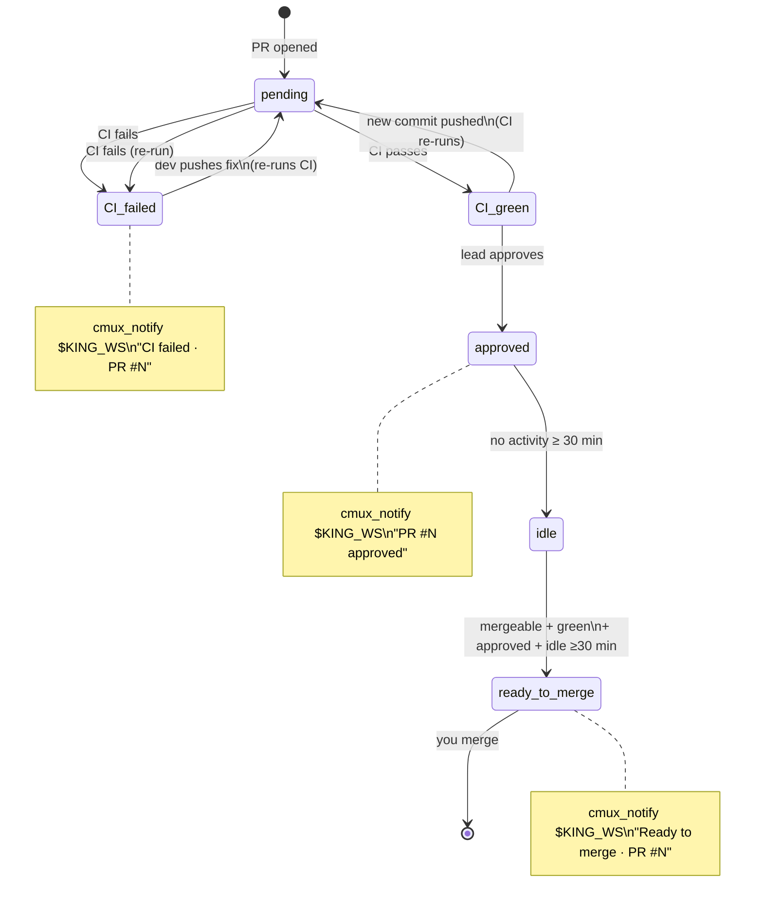

# watchman.md — Watchman lanes (`/loop` monitor)

> Plural filename anticipates multi-watchman setups (one per project area — e.g., backend smoke + frontend smoke + ops smoke). Typical setup is one watchman per kingdom.

Watchmen are **passive, continuous monitors**. NOT task workers. They run Claude Code with the `/loop` skill in dynamic-pacing mode (5 min when there's churn, 15 min when quiet). They track `origin/develop` tip + babysit open PRs.

**Model: Sonnet (explicit exception).** Workers and co-workers run on Opus because they edit code, reason over large diffs, and write curated artifacts. Watchman is the lighter Sonnet exception — it does not edit code; it only runs smoke commands, reads PR state, and fires notifications. Sonnet is sufficient for this read-only + test-runner + alerter loop, and keeps the long-running `/loop` cost proportionate. Slug convention: `sonnet-watchman-1`, `sonnet-watchman-2`, … (never Opus).

See [`index.md`](../index.md) for the entry-point overview, [`king.md`](king.md) for the King's gate (which is separate from Watchman monitoring), [`worker.md`](worker.md) for the 4-step closer pattern that Watchman ALSO follows for state-change reports, [`git.md`](../reference/git.md) for branch model.

This is the single, complete Watchman spec: role + model, the `/loop` tick body, the autonomous per-tick Haiku surveillance duties (Duty 1–8 + Haiku cap + the cross-tick findings ledger + tick aggregation), PR-number backfill, the idle-time docs audit, the read-only scans (orphan-tab, blocked-lane, on-demand verification), the `WATCH_*.md` report naming convention, and lifecycle / multi-watchman.

---

## Rule cross-reference

Five rules govern Watchman's relationship with the rest of the kingdom — keep these in mind before adding any new Watchman authority:

- **R39 — Watchman runs fully autonomously.** Watchman is self-scheduling (via `/loop`) and autonomous within its duty list; the King never queues work for it, sends it prompts mid-session, or treats it as a worker lane. The only King→Watchman interaction is the one-time spawn at kingdom startup (see § Dispatch below). Low-risk fixes are applied without King approval; high-risk changes are flagged.
- **R40 — Haiku cap per tick.** Each `/loop` tick spawns at most `kingdom.json.watchman.haikuCapPerTick` Haiku sub-agents (default 5, max 10) across all surveillance duties. See § `haiku_cap_per_tick` enforcement.
- **R11 — Watchman is read-only on project source.** It may read any project file for situational awareness; it may run smoke/test commands; it may NOT edit project source code. Write authority is confined to `WATCH_*.md` reports, `watchman_state.json`, and low-risk kingdom-doc fixes scoped to `.kingdom/<project>/{tasks,logs}/` (see § Docs audit duty).
- **R27 — Watchman owns PR-number backfill.** Workers commit TODO/CSV close-suffixes as `(PR #pending)` because the PR number doesn't exist at commit time. Watchman backfills `(PR #pending) → (PR #<N>)` on every `/loop` tick — this is the ONE allowed amend of a `feature/<topic>` branch (the R9 byte-for-byte rule's documented exception). King never does this work. See § PR-number backfill duty.
- **R52 — role knowledge is pull-from-disk.** The King injects `/kingdom:self-watchman` as this lane's FIRST message at spawn, so the watchman re-reads its canonical rules + this spec from `.kingdom/.setting/` before any work; the loop prompt that follows carries only the task. See § Dispatch.

Four more rules bound the work without granting authority: **R42** — every parallel fan-out (the Duty 1–8 Haiku spawn, the PR-backfill fan-out) uses `_bounded_wait`, never bare `wait`. **R28** — parallel by default for scan + non-conflicting edit. **R45** — the Duty 1 senior-dev review reads the project's documented architecture (R45 doc orientation) before judging a lane diff. **R51** — fan heavy work out to parallel sub-agents (soft target `kingdom.json.subAgents.parallelTarget`), bounded by R42; the watchman additionally caps Haiku per tick at R40.

One rule defines the watchman's place in the **story-pod three-way split** (it grants no authority — the watchman only *detects*): **R50** — the King owns cross-story coordination. The watchman's Duty 5 `cross_story_scan` *flags* between-story drift; the **Senior** owns *within-story* integration conflicts (R49); the **King** *resolves* the cross-story drift at push (R50). See [`senior.md`](senior.md) → Senior vs watchman boundary and § Duty 5 below.

---

## Watchman role

- **Continuous monitor**, not a worker. Does NOT claim TODOs, edit code, push, or open PRs.
- Lives in `.worktrees/watchman-N/`, branch `watchman-N` (a local-only branch that's hard-reset to `origin/develop` tip on every `/loop` tick).
- In PRIMARY mode (manaflow/cmux), watchman gets its own **workspace** with an optional **vertical split layout** (`kingdom.json.cmux.watchmanLayout`): top pane runs `claude` (the /loop session), bottom pane runs `gh pr list --watch --interval 30` for live PR state. Default `direction=vertical`, `split=0.6`. Set `watchmanLayout: null` in `kingdom.json` to disable the split and use a single-pane workspace instead.
- Runs Claude Code with the `/loop` skill in **dynamic-pacing mode**: 5 min cadence when there's churn (PRs opening, develop moving, CI transitions); 15 min cadence when quiet; 30 min cadence (`watchman.cadence.deepQuietMin`) after `watchman.cadence.deepQuietStreak` consecutive zero-finding ticks (deep-quiet, v0.41.0).
- Reads `kingdom.json.gate.smoke` + `gate.tests` for the smoke command list to run on each develop advance.
- Writes `WATCH_*.md` reports to `.kingdom/<project>/logs/watch/` — monitoring heartbeats stay OUT of the project git tree; only PR-evidence `SMOKE_*`/`SENIOR_*`/`KING_*` reports go to `<project>/docs/test-reports/`.
- Posts `cmux_notify` when something needs the King's or the user's attention.

---

## `/loop` body (the 8-step tick)

Tick cycle: each iteration of the watchman's `/loop`, with a dashed return arrow showing the loop.


Each `/loop` tick does:

```bash
WS=<workspace-root>
PROJ=$WS/<project>
LOGS=$WS/.kingdom/$(basename "$PROJ")/logs
WI=1                                   # this watchman's index (1 for the default single watchman;
                                       # 2, 3, … in a multi-watchman setup — see § Multiple watchmen).
                                       # Used in every cmux_notify title (🕵️ watchman-$WI) + worktree path.
source "$LOGS/workspace-refs.env"      # exposes KING_WS, WATCHMAN_WS_*, WORKER_WS_*, … (R31 dispatch refs)

# (1) cd to the watchman worktree
cd "$PROJ/.worktrees/watchman-$WI"

# (1.5) RETENTION SWEEP (v0.41.0) — runs at the TOP of every tick, before any duty.
# Over a 1-month continuous run, the per-tick timestamped WATCH_* files (one set
# every 5-15 min) accumulate to ~15-25k files. Delete timestamped per-tick files
# older than the retention window. This DELIBERATELY does NOT touch the rolling
# SINGLE-file reports that overwrite in place — WATCH_DOCS_AUDIT.md,
# WATCH_PR_BACKFILL.md, WATCH_TASK_AUDIT.md — because those carry forward state.
# Retention is configurable via kingdom.json.watchman.retentionDays (default 7);
# export it into the env as KINGDOM_WATCH_RETENTION_DAYS before the tick, e.g.
#   KINGDOM_WATCH_RETENTION_DAYS=$(jq -r '.watchman.retentionDays // 7' "$KJSON")
mkdir -p "$LOGS/watch"
for pfx in WATCH_TICK_ WATCH_REVIEW_ WATCH_CVE_ WATCH_CONFLICTS_ WATCH_GIT_ \
           WATCH_SEQ_ WATCH_CONFIG_ WATCH_TESTGAP_ 'WATCH_'*'__develop_' 'WATCH_'*'__pr-'; do
  find "$LOGS/watch" -name "${pfx}*" -mtime "+${KINGDOM_WATCH_RETENTION_DAYS:-7}" -delete 2>/dev/null
done

# (2) Fetch + compare develop SHA to previous tick (state stored in <LOGS>/watchman_state.json)
git fetch origin
PREV_DEVELOP_SHA=$(jq -r .develop_sha "$LOGS/watchman_state.json" 2>/dev/null || echo '')
NEW_DEVELOP_SHA=$(git rev-parse origin/develop)
git reset --hard origin/develop                       # always track develop tip

# (3) If develop moved OR no prior smoke recorded today: run smoke
if [ "$NEW_DEVELOP_SHA" != "$PREV_DEVELOP_SHA" ] || [ daily_smoke_overdue ]; then
  KJSON="$WS/.kingdom/$(basename "$PROJ")/kingdom.json"
  # Run gate.smoke + gate.tests command list from kingdom.json
  SMOKE_PASS=true
  jq -r '.gate.smoke[] // empty, .gate.tests[]' "$KJSON" | while read cmd; do
    eval "$cmd" || { SMOKE_PASS=false; break; }
  done

  if [ "$SMOKE_PASS" = "true" ]; then
    # Write heartbeat / pass report
    UTC=$(date -u +%Y-%m-%dT%H%MZ)
    # K10 (v0.37.0): heartbeats go to $LOGS/watch/, not the project tree
    mkdir -p "$LOGS/watch"
    echo "# develop smoke pass at $UTC" > "$LOGS/watch/WATCH_${UTC}__develop_green.md"
  else
    # Develop is RED — write report + alert King/you
    UTC=$(date -u +%Y-%m-%dT%H%MZ)
    # K10 (v0.37.0): RED reports go to $LOGS/watch/, not the project tree
    mkdir -p "$LOGS/watch"
    cat > "$LOGS/watch/WATCH_${UTC}__develop_RED__<short-reason>.md" <<EOF
    ## TL;DR
    - **Status:** fail
    - develop tip ${NEW_DEVELOP_SHA:0:8} broke smoke
    - Failing: <which command(s)>
    - **Next action:** King investigates; lanes paused until develop is green again.
    EOF
    cmux_notify "$KING_WS" "🕵️ watchman-$WI" "develop RED" \
      "Smoke broke on origin/develop ${NEW_DEVELOP_SHA:0:8}. Lanes paused pending King review."
  fi
fi

# (4) Babysit open PRs
gh pr list --state open --json number,headRefName,statusCheckRollup,reviews,mergeable > /tmp/prs.json
# Compare to previous PR state snapshot in <LOGS>/watchman_state.json
# Detect transitions: CI passed/failed, lead approved/requested-changes, mergeable+green+idle

# (5) Write WATCH_*.md for any state change
# e.g., WATCH_<UTC>__pr-<N>_CI_failed.md, WATCH_<UTC>__pr-<N>_ready_to_merge.md, …

# (6) fire cmux_notify on alert-worthy transitions (target $KING_WS so the
#     sidebar gets a badge + bell-icon panel logs the alert).
# All watchman alerts use the same positional schema:
#   cmux_notify "$KING_WS" "🕵️ watchman-N" "<event class>" "<one-line context>"
#     event class e.g. "CI failed · PR #234"
#
# Cases:
#   - CI just failed     → cmux_notify "$KING_WS" "🕵️ watchman-$WI" \
#                            "CI failed · PR #$N" \
#                            "$(gh pr view $N --json statusCheckRollup -q '.statusCheckRollup[0].name')"
#   - PR mergeable +
#     green + approved +
#     idle ≥30 min       → cmux_notify "$KING_WS" "🕵️ watchman-$WI" \
#                            "Ready to merge · PR #$N" \
#                            "All checks pass, lead approved, idle 30m+. You to merge."

# (7) Update sidebar status
cmux_set_state "$CMUX_WORKSPACE_ID" "▶" "develop: <green|RED> | open PRs: <n> (<g> green, <r> red)"

# (8) Write new snapshot + schedule next tick
jq -n --arg sha "$NEW_DEVELOP_SHA" --argjson prs "$(cat /tmp/prs.json)" \
  '{develop_sha: $sha, last_smoke_ts: now|todate, pr_states: $prs}' \
  > "$LOGS/watchman_state.json"

# Dynamic pacing (three tiers, v0.41.0):
#   5 min  — churn: any transition this tick (PR state change, develop moved, finding)
#   15 min — quiet: no transition this tick
#   30 min — deep-quiet: QUIET_STREAK consecutive zero-finding ticks AND develop SHA
#            unchanged AND no open-PR state change. See § Deep-quiet cadence below.
# Track quiet_streak in watchman_state.json (gates.quiet_streak): reset to 0 on any
# finding / develop move / PR change; increment otherwise. Deep-quiet kicks in at
# kingdom.json.watchman.cadence.deepQuietStreak ticks (default 3), scheduling the next
# tick at kingdom.json.watchman.cadence.deepQuietMin (default 30 min).
```

In addition to these 8 steps, every tick also runs the autonomous Haiku surveillance fan-out (§ Per-tick autonomous duties), the PR-number backfill (§ PR-number backfill duty), the orphan-tab sweep, the blocked-lane scan, the on-demand verification pickup, and — when the tick is otherwise quiet — the idle-time docs audit. All of these are detailed below.

---

## Dispatch (King spawns this once at kingdom startup)

Inside the kingdom spawn checklist (see [`king.md`](king.md) → Spawning the kingdom), after `watchman-1`'s worktree + Claude session are up, the King first injects `/kingdom:self-watchman` as the lane's FIRST message (R52 — role knowledge is pull-from-disk: the watchman re-reads its canonical rules + this spec from `.kingdom/.setting/` before any work), THEN sends the watchman loop prompt via `cmux_send`. The watchman `/loop` is auto-dispatched via the `spawn_loop` helper (see [`../functions/index.md`](../functions/index.md)).

> **Backend-agnostic.** Every multiplexer op in this spec goes through the `cmux_*` wrappers (`cmux_send`, `cmux_set_state`, `cmux_notify`, …). When the host is plain tmux (FALLBACK), `KINGDOM_BACKEND=tmux` transparently routes those same calls to the tmux mirror (`tmux_send`, `tmux_set_state`, …) — the watchman never calls a multiplexer directly, exactly as the King and Senior do.

```bash
HANDLE=$(cmux_list_panes "$WS_ID" | jq -r '.[] | select(.title=="watchman-1") | .id')

LANE_WATCHMAN_PROMPT="You are the Watchman for project <project>. Run /loop with this body
every 5-15 min (dynamic pacing) until I tell you to stop. Each tick:

1. cd $PROJ/.worktrees/watchman-1
2. git fetch origin
   PREV_DEVELOP_SHA=\$(jq -r .develop_sha $LOGS/watchman_state.json 2>/dev/null || echo '')
   NEW_DEVELOP_SHA=\$(git rev-parse origin/develop)
   git reset --hard origin/develop
3. If NEW_DEVELOP_SHA != PREV_DEVELOP_SHA OR no prior smoke today:
     Run <kingdom.json.gate.smoke + gate.tests command list>.
     On fail: write WATCH_<UTC>__develop_RED__<reason>.md + cmux_notify 'develop RED: <reason>'
     On pass: write WATCH_<UTC>__develop_green.md (TL;DR only)
4. gh pr list --state open --json number,headRefName,statusCheckRollup,reviews,mergeable > /tmp/prs.json
   Compare to previous snapshot in $LOGS/watchman_state.json. ALL notifications target
   $KING_WS (positional: cmux_notify $KING_WS title subtitle body) — the watchman has no
   user workspace ref; the King mediates the user conversation, so even "ready to merge"
   alerts go to the King, who surfaces them to the user before any "push?" prompt:
     CI just failed     → WATCH_<UTC>__pr-<N>_CI_failed.md + cmux_notify $KING_WS 'CI failed · PR #<N>'
     CI just passed     → WATCH_<UTC>__pr-<N>_CI_green.md (log only, no notify)
     lead approved      → cmux_notify $KING_WS 'PR #<N> approved'
     mergeable + green + approved + idle 30min → cmux_notify $KING_WS 'Ready to merge · PR #<N>'
5. cmux_set_state \"<self>\" \"▶\" \"develop: <green|RED> | open PRs: <n> (<g> green, <r> red)\"
6. Write new snapshot to $LOGS/watchman_state.json (develop_sha, last_smoke_ts, pr_states)
7. Schedule next tick via /loop dynamic pacing: 5 min if any transition, 15 min if quiet,
   30 min (deepQuietMin) after deepQuietStreak consecutive zero-finding ticks (deep-quiet)

You DO NOT edit code, claim TODO tasks, or push anything. Read-only + test runner + alerter."

cmux_send "$HANDLE" "$LANE_WATCHMAN_PROMPT"
```

---

## Per-tick autonomous duties (Haiku fan-out, v0.29.0+, per rules.md R39 + R40)

Starting in v0.29.0, Watchman becomes fully autonomous within its tick: it no longer only runs smoke commands and PR checks — each `/loop` tick fans out up to `kingdom.json.watchman.haikuCapPerTick` Haiku sub-agents in parallel across its surveillance duties:

- **Duty 1** — senior-dev review with doc cross-check (R45 doc orientation)
- **Duty 2** — CVE scan
- **Duty 3** — cross-lane conflict scan
- **Duty 4** — git hygiene scan
- **Duty 5** — cross-story drift scan (R50)
- **Duty 6** — sequence-collision scan (parallel numbered-file collisions — migrations/ADRs/changelog) — v0.40.0
- **Duty 7** — config/secret parity scan (new env/config key with no home; committed secret) — v0.40.0
- **Duty 8** — missing-tests heuristic (new source files, no matching tests) — v0.40.0

Each duty is independently toggleable in `kingdom.json.watchman.duties` (all default on). It then writes a `WATCH_TICK_<UTC>.md` aggregation and fires `cmux_notify` on any `severity: urgent` finding. All duties are advisory (Tier 2): they inform, never block.

**Two things make the duties *helpful* and not just noisy (v0.40.0):**
- **Every finding carries a one-line `suggested action`** — not just "X is wrong" but "→ worker-2 renumbers its migration to 0007 and rebases." The King (or you) can act without re-deriving the fix.
- **Findings flow through the cross-tick findings ledger** (§ Findings ledger) — the watchman remembers what it already reported, so it never re-flags the same issue every 5 minutes, escalates a finding only if it persists unactioned, and auto-resolves (with a log line) when an issue disappears.

**Fan-out mechanism (R53, v0.43.0).** When the session exposes the Claude Code **Workflow tool**, this per-tick duty fan-out is the watchman's preferred R53 surface: run it as ONE Workflow run per tick (phases `Duties → Reconcile`), which renders the live `/workflows` view of every duty agent. When the tool is NOT in the session's toolset, fall back to the existing bounded mechanism — `Agent(model="haiku", ...)` (bounded per R42) inside a Claude Code session, or `cmux_tab_action new-terminal-right --workspace $WATCHMAN_WS` in PRIMARY/cmux mode (per R38). **Either way, the [`R40`](../rules/R40-watchman-haiku-fan-out-cap.md) HARD Haiku cap (`kingdom.json.watchman.haikuCapPerTick`) still bounds the fan-out** — it is not relaxed when the work runs through Workflow; encode the cap as the run's concurrency exactly as § `haiku_cap_per_tick` enforcement requires. All duties run in parallel at every tick; no duty waits for another. Canonical pattern + per-role shape: [`reference/workflow-fanout.md`](../reference/workflow-fanout.md).

**R41 — Skill-aware (v0.29.3+):** Watchman Haiku sub-agents may optionally invoke domain skills to strengthen their analysis. Duty 1 (code review) may use `code-review:code-review`; Duty 2 (CVE scan) may use `security-review`. Invocation is optional — skip if the skill adds no material benefit for a shallow diff or trivial audit file. No cap beyond the normal 3-skill-per-brief limit.

### `haiku_cap_per_tick` enforcement

Read from `kingdom.json.watchman.haikuCapPerTick`. Default: `5`. Maximum: `10`.

```bash
HAIKU_CAP=$(jq -r '.watchman.haikuCapPerTick // 5' "$KJSON")
# Clamp to [1, 10]
if [ "$HAIKU_CAP" -gt 10 ]; then
  HAIKU_CAP=10
  echo "[$(date -u +%Y-%m-%dT%H%MZ)] WARN haiku_cap_per_tick clamped to 10 (configured value exceeded max)" \
    >> "$LOGS/master_agent.log"
fi
if [ "$HAIKU_CAP" -lt 1 ]; then
  HAIKU_CAP=1
fi
```

Count all Haiku sub-agents spawned this tick across all duties. If the combined count would exceed `HAIKU_CAP`, reduce the code-review fan-out first (it generates the most agents), then skip lower-priority duties in this order: git hygiene, conflict scan, CVE scan (CVE scan is rarely urgent mid-day; skip last). Log a one-line warning to `master_agent.log` whenever clamping occurs.

---

### Change-gating — don't re-compute on unchanged inputs (v0.41.0)

The findings ledger (§ Findings ledger) dedups **notifications** — it stops the same urgent flag firing every 5 min. It does NOT stop the **computation**: before v0.41.0, Duty 1 and Duty 3 already gated on lane SHA, but Duties 2/4/6/7/8 re-ran a Haiku **every tick on unchanged inputs**. Over a month that's tens of thousands of redundant Haiku. v0.41.0 change-gates the remaining duties the same way Duty 1 gates on `lane_shas`: **before** fanning out each duty, compute a cheap input marker; if it matches the marker stored in `watchman_state.json` from last tick, **skip the fan-out entirely** (and mark the duty `no (unchanged)` in the tick aggregation). The ledger prevents re-notify; this prevents re-compute.

Compute these markers ONCE near the top of the duty block and reuse them:

```bash
# Lane advance marker (shared by Duty 1, 3, 6, 7, 8 — their inputs are lane diffs).
# "Did ANY in-flight lane move since last tick?" If not, all lane-diff duties skip.
LANES_ADVANCED=false
for LANE in $(git -C "$PROJ" for-each-ref --format='%(refname:short)' 'refs/heads/worker-*' 'refs/heads/co-worker-*' 'refs/heads/story/*' 2>/dev/null); do
  LAST_SHA=$(jq -r ".lane_shas[\"$LANE\"] // empty" "$LOGS/watchman_state.json")
  NEW_SHA=$(git -C "$WORKTREES/$LANE" rev-parse HEAD 2>/dev/null)
  [ -n "$NEW_SHA" ] && [ "$LAST_SHA" != "$NEW_SHA" ] && LANES_ADVANCED=true
done

# CVE marker — hash of all lockfiles. Cheap; lockfiles are small + rarely change.
LOCK_HASH=$(find "$PROJ" \( -name package-lock.json -o -name pnpm-lock.yaml \
  -o -name yarn.lock -o -name requirements.txt -o -name Cargo.lock -o -name go.sum \) \
  -not -path '*/node_modules/*' -print0 2>/dev/null | sort -z | xargs -0 cat 2>/dev/null | shasum | cut -d' ' -f1)
LAST_LOCK_HASH=$(jq -r '.gates.last_cve_sha // empty' "$LOGS/watchman_state.json")
LAST_CVE_TS=$(jq -r '.gates.last_cve_ts // 0' "$LOGS/watchman_state.json")
NOW_TS=$(date -u +%s)
CVE_SLOW_TIMER_S=21600   # 6h — re-scan even on unchanged lockfile (new CVEs published upstream)
CVE_SHOULD_RUN=false
{ [ "$LOCK_HASH" != "$LAST_LOCK_HASH" ] || [ $((NOW_TS - LAST_CVE_TS)) -ge $CVE_SLOW_TIMER_S ]; } && CVE_SHOULD_RUN=true

# Git-hygiene marker — "did any branch/worktree/sentinel change?" (cheap, no Haiku).
GIT_STATE_HASH=$( { git for-each-ref --format='%(refname) %(objectname)' refs/heads 2>/dev/null;
                    ls -1 "$PROJ/.worktrees" 2>/dev/null;
                    ls -1 "$LOGS/done" 2>/dev/null; ls -1 "$LOGS/claims" 2>/dev/null; } | shasum | cut -d' ' -f1)
LAST_GIT_STATE_HASH=$(jq -r '.gates.last_git_state_sha // empty' "$LOGS/watchman_state.json")
```

The markers persist in a new `gates` block of `watchman_state.json` (see § Watchman state snapshot): `gates.last_cve_sha`, `gates.last_cve_ts`, `gates.last_git_state_sha`. The lane-diff duties reuse the existing `lane_shas` cache, so they need no new marker — `LANES_ADVANCED` is derived from it.

| Duty | Gate | Skip when |
|---|---|---|
| 2 — CVE | lockfile hash OR 6h slow timer | `CVE_SHOULD_RUN = false` |
| 4 — git hygiene | branch/worktree/sentinel hash | `GIT_STATE_HASH = LAST_GIT_STATE_HASH` |
| 6 — seq-collision | lane advance | `LANES_ADVANCED = false` |
| 7 — config parity | lane advance | `LANES_ADVANCED = false` |
| 8 — missing-tests | lane advance | `LANES_ADVANCED = false` |

After running each gated duty, persist its marker (`gates.last_cve_sha=$LOCK_HASH` + `gates.last_cve_ts=$NOW_TS` for Duty 2; `gates.last_git_state_sha=$GIT_STATE_HASH` for Duty 4) into `watchman_state.json` alongside the existing `lane_shas` write.

---

### Deep-quiet cadence tier (v0.41.0) — a third pace below "quiet"

The existing pacing is two tiers: 5 min on churn, 15 min when quiet. Over a month, a kingdom that's parked overnight / over a weekend still wakes every 15 min to fetch + diff + reconcile for nothing. v0.41.0 adds a **deep-quiet** tier: after `QUIET_STREAK` consecutive ticks that ALL had zero findings, an unchanged develop SHA, and no open-PR state change, schedule the next tick at `deepQuietMin` (default 30 min) instead of 15. The first sign of life (any finding, develop moves, a PR transitions) resets the streak and drops back to 5/15.

```bash
# Compute this tick's quietness (after all duties + PR-snapshot diff are done).
TICK_HAD_FINDINGS=$([ "$(jq -r '[.findings[]? | select(.status=="open")] | length' "$LOGS/watchman_state.json")" -gt 0 ] && echo true || echo false)
DEVELOP_MOVED=$([ "$NEW_DEVELOP_SHA" != "$PREV_DEVELOP_SHA" ] && echo true || echo false)
# PR_CHANGED is the same boolean the 5-min tier already computes from the gh pr snapshot diff.

QUIET_STREAK=$(jq -r '.gates.quiet_streak // 0' "$LOGS/watchman_state.json")
if [ "$TICK_HAD_FINDINGS" = "false" ] && [ "$DEVELOP_MOVED" = "false" ] && [ "$PR_CHANGED" = "false" ]; then
  QUIET_STREAK=$((QUIET_STREAK + 1))
else
  QUIET_STREAK=0
fi
jq '.gates.quiet_streak = ($s|tonumber)' --arg s "$QUIET_STREAK" \
  "$LOGS/watchman_state.json" > /tmp/ws-state && mv /tmp/ws-state "$LOGS/watchman_state.json"

DEEP_QUIET_STREAK=$(jq -r '.watchman.cadence.deepQuietStreak // 3' "$KJSON")
DEEP_QUIET_MIN=$(jq -r '.watchman.cadence.deepQuietMin // 30' "$KJSON")
if [ "$DEVELOP_MOVED" = "true" ] || [ "$PR_CHANGED" = "true" ] || [ "$TICK_HAD_FINDINGS" = "true" ]; then
  NEXT_TICK_MIN=5                                  # churn
elif [ "$QUIET_STREAK" -ge "$DEEP_QUIET_STREAK" ]; then
  NEXT_TICK_MIN="$DEEP_QUIET_MIN"                  # deep-quiet
else
  NEXT_TICK_MIN=15                                 # quiet
fi
# Pass NEXT_TICK_MIN to /loop as the next-tick interval.
```

The deep-quiet tier is purely a pacing change — it never skips a duty (the change-gates above already do that). It just lets a parked kingdom breathe at 30-min intervals instead of 15, halving the idle-tick count overnight without ever delaying a response to real churn (the very next tick after activity is back to 5 min).

---

### Duty 1 — Senior-dev review fan-out (with doc cross-check) — v0.31.1+

For each lane that has new commits since the last tick — **worker-N**, **co-worker-N**, **story/<id>** (Senior-owned pod branches), AND the **King's overlay state on kingdom** (the SOLO path only — the King overlays gated `worker-N`/`co-worker-N` lanes onto kingdom for review per R15; in the POD path the King never overlays, it carves `story/<id> -> develop` from the Senior's story branch per R47/R48, so the king-overlay review block below self-gates on `kingdom` being the checked-out branch and dirty) — spawn one Haiku sub-agent that reads the diff plus the project's documented architecture (R45 orientation), and writes a one-page senior-dev review.

> This is a **cheap per-lane mechanical scan that only flags** — it does NOT replace the Senior's authoritative within-story review (R48). The Senior owns deep, story-scoped review and routes fixes; the watchman's per-lane Haiku review is advisory context the King (or Senior) reads, never a gate. The two do not overlap (see [`senior.md`](senior.md) → Senior vs watchman boundary).

**Trigger:** `git log --oneline <last-tick-sha>..<lane>-HEAD` returns at least one commit, OR (for King) the kingdom working tree shows uncommitted changes against `origin/$BASE`.

> **Reading a `story/<id>` branch.** Its worktree dir does NOT match its branch name — the Senior owns it at `.worktrees/senior-N/` (see [`senior.md`](senior.md) → Workspace + worktree), so `$WORKTREES/story/<id>` does not exist. For story branches resolve the diff against the **primary checkout** instead — `git -C "$PROJ" rev-parse story/<id>` / `git -C "$PROJ" diff <range> story/<id>` (every local branch is visible from any worktree of the same repo). The `$WORKTREES/$LANE` form below is correct only for `worker-N` / `co-worker-N`, whose worktree dir equals the branch name.

**Doc context — read ONCE per tick, reused across lanes (R28 parallel-safe).** Before fan-out, gather the project's architectural ground truth:

```bash
# Tick-level setup — one-time read for the whole fan-out.
# v0.31.1: prefer the unified haiku_read_docs_orientation helper if you want
# the full R45 protocol (Phase 1 wayfinding + Phase 2 broader docs). For the
# narrower per-tick code-review context, the lightweight scan below is enough.
DOC_CONTEXT_FILE="$LOGS/.watchman_doc_context_${UTC}.txt"
{
  # Root-level docs (CLAUDE.md, README.md, AGENTS.md, CONTRIBUTING.md, etc.).
  # Hard-cap at 10 files to keep the per-lane prompt under ~50k tokens.
  find "$PROJ" -maxdepth 1 -name "*.md" -type f 2>/dev/null | head -10

  # docs/ tree — same hard cap, prefer recently-modified.
  if [ -d "$PROJ/docs" ]; then
    find "$PROJ/docs" -name "*.md" -type f -not -path "*/test-reports/*" 2>/dev/null \
      | while IFS= read -r f; do
          mtime=$(stat -f '%m' "$f" 2>/dev/null || stat -c '%Y' "$f" 2>/dev/null)
          [ -n "$mtime" ] && printf '%s\t%s\n' "$mtime" "$f"
        done | sort -rn | head -10 | cut -f2-
  fi
} > "$DOC_CONTEXT_FILE"

# v0.31.1 fix: DON'T collapse to space-separated — that splits paths with
# spaces (e.g., `docs/My Architecture.md`). Pass the file LIST as-is and let
# the Haiku read it line by line.
```

**Per-lane Haiku prompt:**

```bash
LAST_SHA=$(jq -r ".lane_shas[\"$LANE\"] // empty" "$LOGS/watchman_state.json")
NEW_SHA=$(git -C "$WORKTREES/$LANE" rev-parse HEAD 2>/dev/null)
[ "$LAST_SHA" = "$NEW_SHA" ] && continue   # no new commits — skip

UTC=$(date -u +%Y-%m-%dT%H%MZ)
# K10 (v0.37.0): WATCH_REVIEW artifacts go to $LOGS/watch/, not the project tree
mkdir -p "$LOGS/watch"
REVIEW_FILE="$LOGS/watch/WATCH_REVIEW_${UTC}__${LANE}.md"

Agent(
  model="haiku",
  prompt="You are a SENIOR DEVELOPER reviewing this lane's recent work. Your job is two-fold:
(1) standard code review and (2) cross-check the changes against the project's
documented architecture, conventions, and decisions.

== Project documentation (architectural ground truth) ==
The file paths to read are listed (one per line, may contain spaces) in:
  $DOC_CONTEXT_FILE
Use your Read tool on each path in that file (do NOT use cat — Read returns
line-numbered content with cleaner cap behavior). Build your mental model of
how this project is *supposed* to be structured BEFORE you open the diff.

Pay special attention to:
- README.md / docs/architecture.md / docs/how-it-works.md — system design
- CLAUDE.md / AGENTS.md — codebase conventions and project-specific rules
- CONTRIBUTING.md / docs/style.md — naming, patterns, file organization
- docs/branch-model.md or docs/git-workflow.md — git conventions
- Any 'decisions' / 'ADR' / 'rfc' files — locked-in architectural choices

== Lane diff (the work to review) ==
git -C $WORKTREES/$LANE diff $LAST_SHA..$NEW_SHA

== Output file ==
$REVIEW_FILE

== Review schema ==
## TL;DR
- **Severity:** urgent | warn | info
- **Lane:** $LANE
- **Verdict:** <one sentence — does this change align with the project's documented direction?>

## Doc cross-check (NEW — senior-dev lens)
For each meaningful change in the diff, locate the relevant doc anchor and verify:
- Does the change follow the documented pattern? (e.g., README says 'all DB calls go through repo/, this PR adds a direct DB call in route handler' → urgent)
- Does the change contradict a documented decision? (e.g., docs/decisions/01-auth.md says 'JWT in httpOnly cookie', PR uses localStorage → urgent)
- Is the change in the right architectural layer? (e.g., business logic in a UI component → warn)
- Does the change need a doc update that wasn't made? (e.g., new env var added but README setup section unchanged → warn)
Cite the doc file + line/section when you flag a mismatch.

## Code review (the existing dimensions)
- Missing or thin test coverage (any function >20 LOC with zero test calls)
- Large untested chunks (>50 LOC change with no matching test file change)
- Security smells (raw SQL, unescaped user input, hardcoded secrets, unsafe evals)
- Style outliers (naming, file length, unusual patterns vs the rest of the lane's history)

## Recommendations
A short bulleted list — what should change before this is ready for King's gate?
If nothing needs to change, write 'LGTM — aligns with documented architecture.'

Severity ladder:
- urgent — contradicts a documented decision, security smell, or breaks a documented invariant
- warn   — drifts from documented patterns, missing doc update, missing tests for >50 LOC chunk
- info   — minor style/naming, suggestion only

Write ONLY the review file — no other edits."
)
```

**King overlay review (the new third reviewee).** Once per tick, after lane fan-out, also review what's currently overlaid on kingdom (if anything):

```bash
KINGDOM_DIRTY=$(git -C "$PROJ" status --porcelain 2>/dev/null | head -1)
if [ -n "$KINGDOM_DIRTY" ] && [ "$(git -C "$PROJ" branch --show-current)" = "kingdom" ]; then
  # K10 (v0.37.0): king-overlay WATCH_REVIEW goes to $LOGS/watch/, not the project tree.
  # mkdir here too — this block can run on a tick where no lane review fired first.
  mkdir -p "$LOGS/watch"
  KING_REVIEW_FILE="$LOGS/watch/WATCH_REVIEW_${UTC}__king-overlay.md"
  Agent(
    model="haiku",
    prompt="Review King's current kingdom-branch overlay against the docs above.
Diff: git -C $PROJ diff origin/$BASE
Same schema as the lane review, but the lane name is 'king-overlay'.
Extra check: is the overlay consistent across the lanes it stitched together?
(e.g., two lanes adding the same env var with different default values)
Output file: $KING_REVIEW_FILE"
  )
fi
```

Update `watchman_state.json` after fan-out: `lane_shas["$LANE"] = $NEW_SHA`.

**Why this is Tier 2, not Tier 1:** the senior-dev review is advisory — it does NOT block the King's gate. R11 still applies: watchman never edits project source. If watchman flags `urgent` doc-drift, King reads the report at gate time and decides whether to dispatch a fix-up task to the lane. The user retains final say at push time.

---

### Duty 2 — CVE scan

**Change-gate (v0.41.0):** skip this duty entirely unless `CVE_SHOULD_RUN = true` — i.e. a lockfile changed since `gates.last_cve_sha`, OR ≥6h elapsed since `gates.last_cve_ts` (the slow timer catches newly-published advisories on an unchanged lockfile). On a quiet month with no dependency churn, this collapses CVE scanning from every tick to once per 6h. After running, persist `gates.last_cve_sha = $LOCK_HASH` and `gates.last_cve_ts = $NOW_TS`.

```bash
# Change-gate (v0.41.0): run Duty 2 only when a lockfile changed since
# gates.last_cve_sha, OR ≥6h elapsed since gates.last_cve_ts. Otherwise skip.
if [ "$CVE_SHOULD_RUN" != "true" ]; then
  echo "skip Duty 2 — lockfiles unchanged, slow timer not elapsed"   # mark "no (unchanged)" in tick summary
  return
fi
```

Detect the project's package manager(s) by inspecting the project root. Spawn ONE Haiku per detected manager.

**Detection → audit command map:**

| Indicator file | Audit command |
|---|---|
| `package.json` + `pnpm-lock.yaml` | `pnpm audit --json` |
| `package.json` (no pnpm lock) | `npm audit --json` |
| `requirements.txt` or `pyproject.toml` | `pip-audit --format json` |
| `Cargo.toml` | `cargo audit --json` |
| `go.mod` | `go list -json -m -u all` |

Multiple managers may coexist (e.g., a monorepo with both `pnpm-lock.yaml` and `requirements.txt`). Each gets its own Haiku, but each counts against `haiku_cap_per_tick`.

**Output file:** `$LOGS/watch/WATCH_CVE_<UTC>.md`

**Haiku prompt (per manager):**

```bash
UTC=$(date -u +%Y-%m-%dT%H%MZ)
mkdir -p "$LOGS/watch"
CVE_FILE="$LOGS/watch/WATCH_CVE_${UTC}.md"

Agent(
  model="haiku",
  prompt="Run: $AUDIT_CMD in $PROJ
Parse the JSON output. Write $CVE_FILE with:
## TL;DR
- Severity: 'urgent' (any critical/high) | 'warn' (moderate) | 'info' (low/none)
- Critical: N, High: N, Moderate: N, Low: N
## Findings
One row per advisory: package name | installed version | patched version | CVE ID | severity.
## Remediation
For each critical/high: recommended update command.
Write ONLY the CVE file — no other edits."
)
```

If no indicator files are found, skip this duty and note in the tick summary.

```bash
# After the per-manager Haiku fan-out completes, persist the gate state so the
# next tick can skip when nothing changed:
jq '.gates.last_cve_sha = $h | .gates.last_cve_ts = ($t|tonumber)' \
  --arg h "$LOCK_HASH" --arg t "$NOW_TS" "$LOGS/watchman_state.json" \
  > /tmp/ws-state && mv /tmp/ws-state "$LOGS/watchman_state.json"
```

---

### Duty 3 — Cross-lane conflict scan

Build a file-touch matrix across all active lanes since the last tick. Flag cases where two or more lanes have modified the same file.

```bash
UTC=$(date -u +%Y-%m-%dT%H%MZ)
mkdir -p "$LOGS/watch"
CONFLICT_FILE="$LOGS/watch/WATCH_CONFLICTS_${UTC}.md"

# Build per-lane changed-file lists. PORTABLE — no associative arrays: `declare -A` + `${!arr[@]}`
# is bash-only (zsh throws "bad substitution" and stores quoted keys wrong → empty reads), and the
# watchman runs under zsh. Accumulate a plain text block instead.
LANE_FILES_BLOCK=""
for LANE in $(git -C "$PROJ" for-each-ref --format='%(refname:short)' 'refs/heads/worker-*' 'refs/heads/co-worker-*' 'refs/heads/story/*' 2>/dev/null); do
  LAST_SHA=$(jq -r ".lane_shas[\"$LANE\"] // empty" "$LOGS/watchman_state.json")
  [ -z "$LAST_SHA" ] && continue
  CHANGED=$(git -C "$WORKTREES/$LANE" diff --name-only "$LAST_SHA"..HEAD 2>/dev/null)
  LANE_FILES_BLOCK="${LANE_FILES_BLOCK}=== ${LANE} ===
${CHANGED}
"
done

Agent(
  model="haiku",
  prompt="You are given per-lane file-touch lists below. Compute overlaps: any file touched
by 2+ lanes since last tick is a potential conflict.

Lane file lists:
$LANE_FILES_BLOCK

Output file: $CONFLICT_FILE
Format:
## TL;DR
- Severity: 'urgent' (same file modified in 2+ lanes) | 'info' (no overlaps)
- N overlapping file(s) found

## Conflict pairs
| File | Lane A | Lane B | Risk |
|---|---|---|---|
<one row per overlap — Risk = 'merge conflict likely' if both modified; 'watch' if one added, one modified>

Write ONLY the conflicts file — no other edits."
)
```

If no overlaps exist, Haiku writes a minimal `## TL;DR — info: no overlaps this tick` file. Watchman still logs it in the tick summary.

---

### Duty 4 — Git hygiene scan

Spawn one Haiku to scan for git-state drift across the kingdom worktree layout.

**Change-gate (v0.41.0):** skip this duty unless the git-state hash changed since last tick — i.e. `GIT_STATE_HASH != LAST_GIT_STATE_HASH`. The hash covers every local branch ref, the `.worktrees/` listing, and the `done/` + `claims/` sentinel listings — exactly the inputs the five hygiene checks read. If none of those moved, the hygiene verdict can't have changed, so the Haiku is redundant. After running, persist `gates.last_git_state_sha = $GIT_STATE_HASH`.

```bash
# Change-gate (v0.41.0): run this duty only when the git-state hash moved since
# last tick (branch refs, .worktrees/, done/ + claims/ listings). Otherwise skip.
if [ "$GIT_STATE_HASH" = "$LAST_GIT_STATE_HASH" ]; then
  echo "skip git-hygiene duty — no branch/worktree/sentinel change"   # mark "no (unchanged)" in tick summary
  return
fi
```

**What to scan:**

| Item | How to detect | Flag if |
|---|---|---|
| Stale worktrees | `ls $PROJ/.worktrees/` vs `git worktree list` | Directory exists but `git worktree list` has no matching entry |
| Orphan branches | `git branch` (local) vs `kingdom.json.shape` lane names | Local branch not in kingdom shape + not `develop`/`main`/`watchman-*` |
| Unflushed `.lane` claims | `ls $LOGS/claims/*.lane` | Claim file exists but matching sentinel in `$LOGS/done/` also exists |
| Broken sentinels | `ls $LOGS/done/*.flag` | Sentinel flag exists but no matching task file in `$LOGS/tasks/` |
| Commit-without-sentinel pairs | `git log --oneline` on each lane vs `$LOGS/done/` | Lane has ≥1 commit since last tick but no new sentinel in `done/` within 5 min of commit time |

```bash
UTC=$(date -u +%Y-%m-%dT%H%MZ)
mkdir -p "$LOGS/watch"
GIT_FILE="$LOGS/watch/WATCH_GIT_${UTC}.md"

Agent(
  model="haiku",
  prompt="Perform a git hygiene scan for project $PROJ.

Worktrees dir: $PROJ/.worktrees/
Kingdom logs: $LOGS/
Kingdom JSON: $KJSON

Check all five hygiene items (stale worktrees, orphan branches, unflushed .lane claims,
broken sentinels, commit-without-sentinel pairs). For each issue found, record:
- Item type
- Affected path / branch / file
- Recommended remediation (one line)

Output file: $GIT_FILE
## TL;DR
- Severity: 'urgent' (broken sentinel or commit-without-sentinel >30 min old) | 'warn' (stale worktree or orphan branch) | 'info' (no issues)
- N issue(s) found

## Findings
<bulleted list, one item per finding>

Write ONLY the git hygiene file — no other edits."
)
jq '.gates.last_git_state_sha = $h' --arg h "$GIT_STATE_HASH" \
  "$LOGS/watchman_state.json" > /tmp/ws-state && mv /tmp/ws-state "$LOGS/watchman_state.json"
```

---

### Duty 5 — Cross-story drift scan (v0.32.0+, R50)

When `kingdom.json.watchman.duties.crossStoryScan` is true and story pods are in flight, the watchman runs `cross_story_scan "$PROJ"` (see [`../functions/index.md`](../functions/index.md)) each tick. It does a pairwise `git merge-tree` across all `story/*` branches and emits a drift summary.

This is the King's cross-story signal (R50): the watchman only **detects and reports** drift (it never resolves). The King consumes the latest drift line at push time (at a Senior's push-eligible hand-back) and coordinates a rebase / re-merge of the affected story branch before opening its `story/<id> -> develop` PR. The three-way boundary holds exactly as the counterpart files describe it: the **Senior** owns *within-story* integration conflicts (R49, see [`senior.md`](senior.md)); the **watchman** flags *between-story* drift (this duty); the **King** resolves the cross-story drift at push (R50, see [`king.md`](king.md) → Story-pod delegation + cross-story). Output severity: `warn` (a documented-decision contradiction across stories may be `urgent`).

---

### Duty 6 — Sequence-collision scan (v0.40.0)

The most valuable catch is the one with **no git conflict**: two lanes that each add a file in the same numbered sequence off the same parent. Classic case — two workers both fork migration `0004_*` from `0003_*`. Different filenames, so `git merge-tree` sees no conflict, but the framework now has two leaf migrations and `migrate` refuses to run. The same trap hits Prisma migrations, ADRs (`docs/adr/NNNN-*.md`), and any `NNNN_*` / `NN-*` sequence. This was the single highest-value catch in the 2026-05-20 consumer run.

When `kingdom.json.watchman.duties.seqCollision` is true (default), one Haiku scans — across all in-flight `worker-*`/`co-worker-*`/`story/*` branches AND open PRs:

**Change-gate (v0.41.0):** skip unless `LANES_ADVANCED = true`. The inputs are lane diffs vs `origin/$BASE`; if no lane advanced since last tick, no new numbered files were added, so a re-scan would re-derive the identical verdict. Reuses the shared `lane_shas` cache — no new marker.

```bash
if [ "$LANES_ADVANCED" != "true" ]; then
  : # skip Duty 6 — no lane advanced since last tick; mark "no (unchanged)" in tick summary
else
# Gather every numbered file added on each in-flight branch vs origin/$BASE, then look for
# duplicate numbers OR multiple leaves sharing a parent.
SEQ_FILE="$LOGS/watch/WATCH_SEQ_$(date -u +%Y-%m-%dT%H%MZ).md"; mkdir -p "$LOGS/watch"
Agent(
  model="haiku",
  prompt="Detect parallel numbered-sequence COLLISIONS that git won't flag (different filenames, same slot).
Scope: for each in-flight branch (git for-each-ref 'refs/heads/worker-*' 'refs/heads/co-worker-*' 'refs/heads/story/*') and each open PR (gh pr list --json number,headRefName), list files ADDED vs origin/$BASE under any migrations dir (Django/Prisma '**/migrations/', raw '**/migrations/*.sql') and any 'docs/adr/NNNN-*' or numbered-changelog sequence.
Flag, per sequence: (a) the SAME number used by ≥2 branches, or (b) ≥2 migrations declaring the SAME parent (Django 'dependencies =', Prisma's chain) → multiple leaves.
For Django, parse the dependencies tuple; for Prisma, the migration folder order. severity=urgent if a real collision (it WILL break migrate/merge), else info.
Write to $SEQ_FILE: TL;DR (status + the colliding number/parent + which branches), then a 'suggested action' line naming WHICH lane should renumber/rebase (rule of thumb: the oldest-claimed lane keeps the slot, the later one bumps to the next free number and rebases). NO edits — flag only."
)
fi   # end seq-collision change-gate
```

Output severity `urgent` on a real collision (surface immediately — it blocks `migrate`/merge). Suggested action always names which lane renumbers.

---

### Duty 7 — Config/secret parity scan (v0.40.0)

Two cheap checks one Haiku runs over each in-flight lane diff when `kingdom.json.watchman.duties.configParity` is true (default):

1. **New config key with no home.** A lane adds or reads a new env var / config key (`process.env.FOO`, `os.environ["FOO"]`, `Deno.env`, a new yaml/`kingdom.json` key) that is NOT declared in any of the project's config sources — configmaps, `.env.example`, `infra/params/*`, helm values, templates. Example miss: an `AUTH_ISSUER` env var added in code but absent from every config source; a Senior catches it late when the watchman should have caught it on the lane diff. Severity `warn`; suggested action names the config files to add the key to.
2. **Committed secret.** Regex scan of lane diffs for high-entropy / secret patterns (AWS keys, `-----BEGIN * PRIVATE KEY-----`, `password=`, bearer/API tokens). Severity `urgent`; suggested action: rotate + strip from history. Flag only — the watchman never edits.

**Change-gate (v0.41.0):** skip unless `LANES_ADVANCED = true` — the two checks read lane diffs, so an unchanged set of lanes yields the same finding. Reuses the shared `lane_shas` cache.

```bash
if [ "$LANES_ADVANCED" != "true" ]; then
  : # skip Duty 7 — no lane advanced since last tick; mark "no (unchanged)" in tick summary
else
CFG_FILE="$LOGS/watch/WATCH_CONFIG_$(date -u +%Y-%m-%dT%H%MZ).md"; mkdir -p "$LOGS/watch"
Agent(
  model="haiku",
  prompt="For each in-flight lane diff (git diff origin/$BASE..<lane>):
(1) Find newly-referenced env vars / config keys; check whether each is declared in the project's config sources (search configmaps, .env.example, infra/params, helm values, *.template). List any with NO home → severity warn, suggested action = 'add <KEY> to <config files>'.
(2) Scan the diff for committed secrets (AWS AKIA, PRIVATE KEY blocks, password=/token=/bearer with a literal value). Any hit → severity urgent, suggested action = 'rotate + remove from history'.
Write TL;DR + findings + suggested actions to $CFG_FILE. Flag only; never edit."
)
fi   # end config-parity change-gate
```

---

### Duty 8 — Missing-tests heuristic (v0.40.0)

When `kingdom.json.watchman.duties.missingTests` is true (default), one Haiku checks each in-flight lane: did it add/modify source files (by the project's source globs) WITHOUT a corresponding test file (the project's convention — `*.test.*`, `*_test.py`, `*_spec.rb`, `tests/`, …)? Real miss (2026-05-20): a lane shipped 5 new modules with zero tests. Flags lanes with new source but no new/changed tests; severity `warn`; suggested action: "worker-N added <N> source files, 0 tests — request a test pass before its PR." This is a heuristic, NOT a gate — some changes legitimately need no tests (docs, config, pure refactors), so the King decides; the watchman only surfaces the gap.

**Change-gate (v0.41.0):** skip unless `LANES_ADVANCED = true` — the heuristic reads lane diffs, so unchanged lanes yield an unchanged gap list. Reuses the shared `lane_shas` cache.

```bash
if [ "$LANES_ADVANCED" != "true" ]; then
  : # skip Duty 8 — no lane advanced since last tick; mark "no (unchanged)" in tick summary
else
TESTGAP_FILE="$LOGS/watch/WATCH_TESTGAP_$(date -u +%Y-%m-%dT%H%MZ).md"; mkdir -p "$LOGS/watch"
Agent(
  model="haiku",
  prompt="For each in-flight lane (git diff --name-status origin/$BASE..<lane>): count source files added/modified vs test files added/modified, using the project's source + test conventions (infer from the repo — e.g. src/**/*.ts vs *.test.ts / __tests__; *.py vs *_test.py / tests/). Flag any lane with ≥N new/changed source files and 0 new/changed tests → severity warn, suggested action naming the lane + the untested files. Skip docs-only / config-only / pure-refactor diffs (no behavior change). Write TL;DR + per-lane gap list to $TESTGAP_FILE."
)
fi   # end missing-tests change-gate
```

---

### Tick aggregation — `WATCH_TICK_<UTC>.md`

At the END of each `/loop` tick (after all fan-out duties complete and their Haiku sub-agents have written their output files), Watchman writes a single tick summary:

**File:** `$LOGS/watch/WATCH_TICK_<UTC>.md`

```markdown
# Watchman tick summary — <UTC>

## TL;DR
- Develop SHA: <sha> (moved | unchanged)
- Smoke: pass | fail | skipped  ·  **develop-health trend: green N ticks | RED N ticks (sustained) | flaky (pass/fail/pass)**
- Haiku sub-agents spawned: N / <haiku_cap_per_tick>
- Highest severity this tick: urgent | warn | info
- **👑 King's next action:** <the single most important thing for the King to do this tick, or "none — all green">

## Duty results
| Duty | Ran? | Findings | Severity | Output file |
|---|---|---|---|---|
| Code review fan-out | yes / no (cap) / no (unchanged) | N reviews written | urgent/warn/info | WATCH_REVIEW_... |
| CVE scan | yes / no (no lockfile) / no (unchanged) | N advisories | urgent/warn/info | WATCH_CVE_... |
| Cross-lane conflict scan | yes / no (cap) / no (unchanged) | N overlaps | urgent/warn/info | WATCH_CONFLICTS_... |
| Git hygiene scan | yes / no (cap) / no (unchanged) | N issues | urgent/warn/info | WATCH_GIT_... |
| Cross-story drift scan | yes / no (off) | N drift pairs | warn/urgent/info | (drift summary) |
| Sequence-collision scan | yes / no (off) / no (unchanged) | N collisions | urgent/info | WATCH_SEQ_... |
| Config/secret parity | yes / no (off) / no (unchanged) | N keys / secrets | urgent/warn/info | WATCH_CONFIG_... |
| Missing-tests heuristic | yes / no (off) / no (unchanged) | N lanes with gaps | warn/info | WATCH_TESTGAP_... |

## Lane activity
| Lane | New commits | Files changed | Conflicts |
|---|---|---|---|
| worker-1 | N | N | — |
...

## New vs carried findings (from the ledger)
- **New this tick:** <findings first seen now, with suggested actions>
- **Carried (still open):** <findings flagged before, with tick-age + escalated severity if persisted>
- **Resolved this tick:** <findings that disappeared since last tick — auto-closed>

## Cap warnings
<list any duties skipped or trimmed due to haiku_cap_per_tick, or "none">
```

**The "King's next action" line is the watchman's single most valuable output** — it turns raw monitoring into a decision. The watchman picks it by priority: develop RED (sustained) > urgent finding (sequence collision / committed secret / CI fail on a ready PR) > a PR ready-to-merge > a carried warn that's escalated > "none." One line, the King acts.

**Urgent escalation:** If any duty's output file contains `severity: urgent` (case-insensitive in its TL;DR), Watchman renders a `watchman-tick` card (from the `cards/` directory) and fires `cmux_notify` to both `$KING_WS` and `$WATCHMAN_WS`. Non-urgent ticks are logged only; no notification.

---

## PR-number backfill duty (every tick · v0.19.0+ · per [rules.md R27](../rules/R27-watchman-owns-pr-number-backfill.md))

The worker commits TODO/CSV close-suffix as `(PR #pending)` because the PR number doesn't exist at commit time. **Watchman backfills `(PR #pending) → (PR #<N>)` on every `/loop` tick** — King never does this work. Two side duties ride along: stale `.lane` claim sweep, and a kingdom-task-file `verifying`-checkbox audit (flag-only). Tier 2 — failure is cosmetic, not load-bearing.

**Scan logic (parallel by default, per [rules.md R28](../rules/R28-parallel-by-default-for-scan.md)) — calls the `parallel_edit_fanout` helper from [`../functions/index.md`](../functions/index.md):**

```bash
# Build feature/<topic> → PR #N map from King's master_agent.log.
# v0.41.0: read only the LAST 500 lines, not the whole file. Open feature branches
# are always recent (a stale feature is either merged or abandoned), so the tail
# always carries every open feature→PR mapping. Over a month the full log grows to
# tens of thousands of lines; re-parsing it every tick is wasted I/O. The log itself
# is rotated/truncated by /kingdom:archive, so the tail stays a sound window.
# Portable feat→PR map as newline-delimited "feat pr" pairs — NOT a bash
# associative array. `declare -A` + `${PR_MAP[$feat]}` is bash-only: under zsh
# (the King may run either shell) `${!arr[@]}` throws `bad substitution` and a
# quoted-key write stores the brackets literally, so the lookup reads back empty
# and EVERY backfill silently no-ops. A plain string + awk lookup is shell-agnostic.
PR_PAIRS=""
while IFS= read -r line; do
  feat=$(echo "$line" | grep -oE 'feature/[a-z0-9-]+' | head -1)
  prn=$(echo  "$line" | grep -oE 'PR #[0-9]+'        | grep -oE '[0-9]+' | head -1)
  [ -n "$feat" ] && [ -n "$prn" ] && PR_PAIRS="$PR_PAIRS$feat $prn
"
done < <(tail -n 500 "$LOGS/master_agent.log")

# Build the lane=pr spec for the helper. Lane → feature → PR resolution is
# watchman's local concern; the helper just needs <lane>=<pr> tuples. Enumerate
# live lanes dynamically (R28-style) — a fleet shape with worker-5 or story/*
# lanes would be silently skipped by a hardcoded worker-1..co-worker-1 list.
#
# Resolve lane → feature from master_agent.log, NOT from state.json. state.json
# (written by save_session_state) carries `lanes.<lane>.{branch,head_sha,task}`
# but NO `.dispatch.<lane>.feature` key — reading that phantom path returns empty
# and silently no-ops the entire backfill (R27 broken). The King's carve/push log
# line is the real source: it names BOTH the lane and the `feature/<topic>` it
# carved (R9 — feature is byte-for-byte from the lane tip), in the same tail window
# already scanned for PR_PAIRS. Parse lane→feature from those same lines.
LANE_FEAT_PAIRS=""
while IFS= read -r line; do
  lf=$(echo "$line" | grep -oE '(co-)?worker-[0-9]+|story/[a-z0-9._-]+' | head -1)
  ff=$(echo "$line" | grep -oE 'feature/[a-z0-9-]+'                     | head -1)
  [ -n "$lf" ] && [ -n "$ff" ] && LANE_FEAT_PAIRS="$LANE_FEAT_PAIRS$lf $ff
"
done < <(tail -n 500 "$LOGS/master_agent.log")

spec=""
for lane in $(git -C "$PROJ" for-each-ref --format='%(refname:short)' \
                'refs/heads/worker-*' 'refs/heads/co-worker-*' 'refs/heads/story/*' 2>/dev/null); do
  # awk lookup: lane → feature (last carve wins), then feature → PR (freshest log line).
  feat=$(printf '%s' "$LANE_FEAT_PAIRS" | awk -v l="$lane" '$1==l{v=$2} END{print v}')
  [ -z "$feat" ] && continue
  pr=$(printf '%s' "$PR_PAIRS" | awk -v f="$feat" '$1==f{v=$2} END{print v}')
  [ -z "$pr" ] && continue
  spec="$spec $lane=$pr"
done

# One call — handles parallel-across-branches, MERGED/CLOSED skip, amend +
# --force-with-lease, and master_agent.log line. Per-lane stdout lines reach
# the WATCH_PR_BACKFILL.md report. (K10 v0.37.0: WATCH_* live in $LOGS/watch/.)
# The replacement carries the `%PR%` token: parallel_edit_fanout substitutes each
# lane's OWN pr (from the spec tuple) per-branch. A literal `(PR #${pr})` here
# would bake in whatever `$pr` held after the loop — the LAST lane's number — and
# stamp it onto every lane's commit. The token keeps each lane's number distinct.
mkdir -p "$LOGS/watch"
parallel_edit_fanout "(PR #pending)" "(PR #%PR%)" "$spec" > "$LOGS/watch/WATCH_PR_BACKFILL.md" 2>&1
```

**On per-lane `(PR #${pr})` expansion:** the helper does literal string replace, not shell expansion, so the second argument must already encode the lane's own PR number. The wrapper above is illustrative; in practice watchman calls `parallel_edit_fanout` **once per lane** when PR numbers differ across lanes, or once collectively when the search/replace is identical (e.g. a structural footer change). The library favours the latter — different PR numbers per lane is the watchman-specific edge.

For the common case (one PR per lane), watchman fans out per-lane:

```bash
FANOUT_PIDS=""
for unit in $spec; do
  lane="${unit%=*}"
  pr="${unit#*=}"
  parallel_edit_fanout "(PR #pending)" "(PR #$pr)" "$lane=$pr" '**/*.{md,csv}' &
  FANOUT_PIDS="$FANOUT_PIDS $!"
done
# R42: bounded wait — gh + sed + git commit + git push --force-with-lease can each
# stall on network or remote refs; 45s budget covers the slowest of those × parallelism.
_bounded_wait 45 $FANOUT_PIDS
```

This is still parallel **across** lanes, with a hard ceiling so a stuck `gh pr view` or `git push` can't block the watchman tick. The helper itself is no-op-fast when a lane has nothing to flip.

**Constraints:**

- **Skip merged PRs** — `gh pr view <N> --json state -q .state | grep -q MERGED` → no force-push to closed branches (memory rule `check_pr_state_before_force_push`). Watchman opens a separate `feature/post-<N>-cleanup` branch + new PR for the orphan flips.
- **Each lane writes only to its own worktree** — no cross-lane file contention.
- **`--force-with-lease` not `--force`** — bails if remote moved since fetch.

**Side duty — stale `.lane` claim sweep:** for every `<LOGS>/done/<UTC>__<sub>-<lane>__<id>.flag` sentinel, check `<LOGS>/claims/<lane>__<task-id>.lane` — if both exist, rm the claim. Lane is then free for next dispatch.

**Side duty — kingdom-task-file checkbox audit:** on each tick, walk `.kingdom/<project>/tasks/*.md` and flag any file whose `Status` is `verifying` but whose matching sentinel exists in `<LOGS>/done/` → write to `<LOGS>/watch/WATCH_TASK_AUDIT.md` for King (NOT auto-flip; status is worker's responsibility per R23/R24).

This duty IS Tier 2 maintenance — failure to backfill is cosmetic, not load-bearing. King carries on without it; the TODO files just stay ugly until next tick.

---

## Orphan-tab sweep (every tick)

Sub-agent tabs in master workspaces are SUPPOSED to auto-close via the 5-step closer Step 5 (`cmux_tab_action close --surface "$CMUX_SURFACE_ID"`). When that fails (cmux unreachable, killed process, etc.), tabs persist after their sentinel was written — clutter that the master can't clean up on its own.

Watchman sweeps for these every `/loop` tick. Logic:

```bash
# For each lane master workspace, enumerate its tabs/surfaces. Include SENIOR_WS_*
# — Seniors fan out review sub-agents (review_tick, see senior.md) as visible tabs too,
# so they can leave orphan tabs just like workers/co-workers.
for WS_VAR in $(env | grep -E '^(WORKER|COWORKER|SENIOR)_WS_[0-9]+' | cut -d= -f1); do
  WS_REF=$(eval echo "\$$WS_VAR")

  # List all surfaces in this workspace
  SURFACES=$(cmux_list_pane_surfaces --workspace "$WS_REF" --json)

  # For each surface that LOOKS like a sub-agent tab (name starts with "🐱 sub")
  echo "$SURFACES" | jq -r '.surfaces[] | select(.title | startswith("🐱 sub")) | .ref' | while read SURF; do

    # Was its sentinel written more than 5 minutes ago?
    # We don't know the ID directly from the surface name — but we can
    # check the surface's idle time + last-written log line.
    OUTPUT=$(cmux_capture_pane "$WS_REF" 5)

    # If the recent output mentions "closer complete" or "sentinel written"
    # AND the surface has been idle (no new content) for ≥5 min, it's orphan.
    if echo "$OUTPUT" | grep -q 'sentinel\|closer\|done flag'; then
      AGE=$(jq -r ".surface_idle_ts[\"$SURF\"] // 0" "$LOGS/watchman_state.json")
      NOW=$(date -u +%s)
      if [ $((NOW - AGE)) -gt 300 ]; then
        cmux_tab_action close --surface "$SURF" 2>/dev/null
        echo "[$(date -u +%Y-%m-%dT%H%MZ)] 🕵️ watchman swept orphan tab $SURF in $WS_VAR" \
          >> "$LOGS/master_agent.log"
      fi
    fi
  done
done
```

This is BELT-AND-SUSPENDERS — the sub-agent's own Step 5 closes >99% of tabs. Watchman handles the rest. Sweeps are logged to `master_agent.log` so the King can see orphans being cleaned up.

---

## Blocked-lane scan (every tick)

Lanes can silently stall on Claude Code's interactive permission prompts ("Do you want to proceed? 1. Yes / 2. Yes allow … / 3. No") or other TUI input requests. cmux.app shows the workspace as "Running" but the lane is actually idle, waiting for keyboard input. Without intervention you only notice by clicking each lane.

Watchman scans for this every `/loop` tick:

```bash
# For each lane workspace ref in $LOGS/workspace-refs.env:
source "$LOGS/workspace-refs.env"

# Include SENIOR_WS_* — a Senior is an Opus master lane that can also stall on a
# permission prompt (it dispatches its pod + runs the story gate).
for WS_VAR in $(env | grep -E '^(WORKER|COWORKER|WATCHMAN|SENIOR)_WS_[0-9]+' | cut -d= -f1); do
  WS_REF=$(eval echo "\$$WS_VAR")
  LANE_LABEL=$(echo "$WS_VAR" | sed 's/_WS_/ /' | tr 'A-Z' 'a-z')   # e.g. "worker 1"

  # Grab the recent surface output
  OUTPUT=$(cmux_capture_pane "$WS_REF" 30)

  # Patterns that indicate a blocked lane
  if echo "$OUTPUT" | grep -qE '(Do you want to proceed\?|Esc to cancel|\[y/N\]|allow .* during this session|Press Enter)'; then
    # Already notified this tick? Skip to avoid spam — state stored in watchman_state.json
    PREV_BLOCKED=$(jq -r ".blocked_lanes[\"$WS_VAR\"] // empty" "$LOGS/watchman_state.json" 2>/dev/null)
    if [ "$PREV_BLOCKED" != "true" ]; then
      # 3-layer state override: badge + description + notify (cmux's auto-state
      # may still say "Running" but our three signals tell the truth)
      cmux_workspace_action "$WS_REF" mark-unread
      cmux_set_state "$WS_REF" "⚠" "Blocked · permission prompt"
      cmux_notify "" "🕵️ watchman-$WI" "Lane blocked · $LANE_LABEL" \
        "Permission prompt or input requested. Click workspace to approve." "$WS_REF"
      cmux_notify "$KING_WS" "🕵️ watchman-$WI" "Lane blocked · $LANE_LABEL" \
        "$LANE_LABEL is waiting on a permission prompt. Click its workspace to resolve."
      # Mark as notified
      jq ".blocked_lanes[\"$WS_VAR\"] = true" "$LOGS/watchman_state.json" \
        > /tmp/ws-state && mv /tmp/ws-state "$LOGS/watchman_state.json"
    fi
  else
    # Lane no longer blocked — clear unread marker + restore description + clear state
    PREV_BLOCKED=$(jq -r ".blocked_lanes[\"$WS_VAR\"] // empty" "$LOGS/watchman_state.json" 2>/dev/null)
    if [ "$PREV_BLOCKED" = "true" ]; then
      cmux_workspace_action "$WS_REF" mark-read
      # Description restored by the lane itself on its next state transition;
      # watchman doesn't second-guess what the lane should display normally.
    fi
    jq "del(.blocked_lanes[\"$WS_VAR\"])" "$LOGS/watchman_state.json" \
      > /tmp/ws-state && mv /tmp/ws-state "$LOGS/watchman_state.json"
  fi
done
```

The scan is **idempotent + debounced** — `watchman_state.json` tracks which lanes are currently blocked so watchman doesn't re-notify every tick. Once a lane unblocks (output no longer matches the patterns), the state clears and the lane is eligible for re-notification next time it blocks.

A blocked lane may also be surfaced to the King via the `blocked-lane` card (from the `cards/` directory).

Patterns watched:

| Pattern | Triggers |
|---|---|
| `Do you want to proceed\?` | Claude Code's standard permission prompt |
| `Esc to cancel` | Same prompt's footer |
| `\[y/N\]` | Common interactive y/n confirmations |
| `allow .* during this session` | The session-scoped permission option |
| `Press Enter` | Generic "press enter to continue" prompts |

Most of these are pre-empted by the workspace `.claude/settings.json` permissions allow-list (see `commands/init.md` Step 4.5 — kingdom auto-allows `.kingdom/**` and `.worktrees/**`). The scan catches any that slip through.

---

## On-demand test verification (King-dispatched, read-only)

Beyond the passive `/loop` smoke + PR babysitting, watchman accepts **on-demand test verification requests** from the King. This is the v0.16.0 industrial-overlay role expansion — King can route "verify X by running these tests" work to watchman without spinning up a worker for read-only verification tasks.

### Request artifact

King drops a request file at `<LOGS>/watchman-requests/<UTC>__verify-<slug>.md`:

```markdown
# Watchman test request — verify-<slug>

## Brief
<2-4 lines — what to verify, e.g. "Run integration tests against branch X
to confirm BE-AUTH-3 doesn't regress the login flow.">

## Commands
- pnpm --filter @my-app/backend test:integration
- pnpm --filter @my-app/web test:e2e -- --grep login

## Scope
- Read-only — DO NOT edit test code, fixtures, or project files
- DO NOT push, commit, or open PRs
- Write report to $LOGS/watch/WATCH_<UTC>__verify-<slug>.md
```

### Watchman's pickup logic (every `/loop` tick)

```bash
# At the end of each /loop tick (after the standard 8 steps), watchman scans
# for new request files:

REQUESTS_DIR="$LOGS/watchman-requests"
mkdir -p "$REQUESTS_DIR"

for REQ in "$REQUESTS_DIR"/*.md; do
  [ -f "$REQ" ] || continue
  REQ_SLUG=$(basename "$REQ" .md | sed 's/^[0-9-]*T[0-9]*Z__verify-//')
  # K10 (v0.37.0): verify reports go to $LOGS/watch/, not the project tree
  mkdir -p "$LOGS/watch"
  REPORT="$LOGS/watch/WATCH_$(date -u +%Y-%m-%dT%H%MZ)__verify-${REQ_SLUG}.md"

  # Already processed? (a matching report exists)
  if ls "$LOGS/watch/WATCH_"*"__verify-${REQ_SLUG}.md" >/dev/null 2>&1; then
    continue
  fi

  # Execute the commands listed in the request (extract from the "## Commands" section)
  COMMANDS=$(awk '/^## Commands/,/^##/' "$REQ" | grep -E '^- ' | sed 's/^- //')

  STATUS="pass"
  OUTPUT_BUFFER=""
  while IFS= read -r CMD; do
    OUTPUT=$(eval "$CMD" 2>&1) || STATUS="fail"
    OUTPUT_BUFFER="${OUTPUT_BUFFER}
$ $CMD
$OUTPUT
"
  done <<< "$COMMANDS"

  # Write the report (lane name slot = "watchman-N" per v0.15.2 strict naming)
  cat > "$REPORT" <<EOF
# Verification report — $REQ_SLUG

## TL;DR
- **Status:** $STATUS
- **Requested by:** King ($(basename "$REQ"))
- **Commands run:** $(echo "$COMMANDS" | wc -l)

## Command outputs
\`\`\`
$OUTPUT_BUFFER
\`\`\`
EOF

  # Notify King via cmux_notify (badge on King's workspace)
  cmux_notify "$KING_WS" "🕵️ watchman-$WI" "Verification $STATUS · $REQ_SLUG" "Report: $REPORT"
done
```

### What watchman WILL and WON'T do

| Will | Won't |
|---|---|
| ✅ Run test commands listed in the request | ❌ Edit test code, fixtures, or project files |
| ✅ Read project source to understand what it's testing | ❌ Push, commit, or open PRs |
| ✅ Write a `WATCH_*__verify-*.md` report | ❌ Modify the test request file itself |
| ✅ Notify King when done | ❌ Take action on test failures (just reports — King decides next step) |

### When King uses watchman vs a worker for test work

| Test work type | Route to | Why |
|---|---|---|
| **Run existing tests, no edits** (verify a hypothesis, sanity-check a branch, confirm regression isn't introduced) | 🕵️ Watchman via request file | Read-only; cheaper Sonnet model; preserves worker capacity for code work |
| **Write new tests, fix flaky tests, edit fixtures, modify CI config** | 👷 Worker | Code-touching; needs full lane authority + commit/push capability |

Heuristic: if the answer is "run these commands and tell me what happened," → watchman. If the answer is "make these tests pass," → worker.

---

## Docs audit duty (idle-time work)

When `/loop` is otherwise quiet (no PRs to babysit, no `develop` movement, no smoke break), watchman runs a bounded docs audit pass over `<workspace>/.kingdom/<project>/{tasks,logs}/` — the ONLY place it has WRITE authority, and only on audit artifacts, never project source code. Low-risk fixes (stale checkbox ticks backed by a `git log` commit, `master_agent.log` summary backfills, dead `[[name]]`-link repairs) it applies directly; high-risk changes (digest rewrites, task-file merges, role-doc rewrites, >30d archives) plus project-state `Gap A`/`Gap B` findings are flag-only to `WATCH_DOCS_AUDIT.md` for King. When unsure, default to flagging.

### Split by risk

| Action | Risk | Watchman does | King reviews |
|---|---|---|---|
| Tick a stale checkbox when a matching commit is found in `git log` | Low | ✅ writes (`tasks/*.md`) | informed via WATCH_*.md |
| Backfill a missing summary line in `master_agent.log` | Low | ✅ writes | informed |
| Fix dead `[[name]]` link / formatting drift | Low | ✅ writes | informed |
| Re-understand & rewrite a digest from raw | **High** | ❌ flag only | ✅ dispatches Opus sub-agent |
| Merge two task files into one | **High** | ❌ flag only | ✅ decides + dispatches |
| Rewrite role doc to match landed code | **High** | ❌ flag only | ✅ decides |
| Archive task files older than 30 days | **High** | ❌ flag only | ✅ moves to `tasks/archive/` |

Low-risk: watchman just does it; one-line note in its next `WATCH_*.md` report.
High-risk: watchman writes findings to `WATCH_DOCS_AUDIT.md` (single rolling file per project) — King's next attention pulls from it.

### Project state scan (idle, bounded)

In addition to scanning `tasks/` + `logs/`, watchman also performs a **bounded** project-state scan during idle ticks. Same pattern as `/kingdom:work` audit phase Step 3.0, but smaller: at most 5 project doc files per tick (newest by mtime), `.md` + `.txt` + `.csv`. For each, watchman extracts completion markers and cross-refs against `master_agent.log`. Findings are **flag-only** → appended to `WATCH_DOCS_AUDIT.md` under `## Gap A` / `## Gap B`. Watchman NEVER edits project source code based on a gap — only flags. King runs `/kingdom:work` audit phase for a full sweep when the gap list grows.

This keeps the doc-audit honest without making watchman expensive — full project scans happen on demand via `/kingdom:work` audit phase, not on every `/loop` tick.

### `WATCH_DOCS_AUDIT.md` schema

```text
# Docs audit findings — <project>

Last scan: <UTC>

## Digest re-understanding candidates
- `logs/<ID>.md` — raw mentions X which is now load-bearing (X was added <YYYY-MM-DD> to <file>)

## Merge candidates
- `tasks/<UTC-a>__worker-1__feat-x.md` + `tasks/<UTC-b>__worker-2__feat-x-followup.md` — overlap on the same module

## Archive candidates
- `tasks/<UTC>__co-worker-1__redesign.md` — all boxes checked, last edit 2026-04-10 (>30d)

## Suspect (checked but no commit)
- `tasks/<UTC>__co-worker-1__redesign.md`: item "wire up auth" — no commit trace

## Gap A — project says done, kingdom has no record
- `docs/STEP.md:42` claims "Phase 0 API smoke shipped 2026-04-28" — no master_agent.log entry on that date for `phase0-api-smoke`

## Gap B — kingdom done, docs don't reflect it
- `master_agent.log:89` shipped `kc26-script-patches` 2026-04-28T2110Z — `STEP.md` still lists it as pending
```

King reviews → dispatches `/kingdom:work` audit phase or a targeted sub-agent. Watchman never edits high-risk items, never edits project source code; the Gap sections are flag-only.

### Boundary

Watchman's write authority is scoped to `<workspace>/.kingdom/<project>/{tasks,logs}/` only. It NEVER touches:
- Project source code
- `.kingdom/.setting/*.md` (role specs)
- `kingdom.json`
- `.git/` or branches

If watchman is unsure whether something is low- or high-risk, default to flagging. Cost of a missed audit fix is zero (King catches it next round, or `/kingdom:work` audit phase sweeps it); cost of a wrong autonomous edit is reputational.

### Cadence

Watchman runs the docs audit at most once per `/loop` tick, only when ALL other tick steps are quiet (no PR transitions, no develop advance, no smoke needed). Scan is bounded — newest 20 task files + newest 20 curated digests. Older artifacts are swept by `/kingdom:work` audit phase (explicit) rather than continuously.

---

## WATCH_*.md report naming convention

Watchman writes `WATCH_*` reports to `.kingdom/<project>/logs/watch/` — monitoring heartbeats stay out of the project git tree so they don't pollute PRs or appear as dirty files on the integration branch. PR-evidence reports (`SMOKE_*`, `SENIOR_*`, `KING_*`) still go to `<project>/docs/test-reports/`.

```text
.kingdom/<project>/logs/watch/                     ← all Watchman heartbeats/monitoring reports
├── WATCH_<UTC>__develop_green.md                  ← heartbeat / develop pass
├── WATCH_<UTC>__develop_RED__<short-reason>.md    ← develop break detected
├── WATCH_<UTC>__pr-<N>_CI_failed.md               ← PR CI just turned red
├── WATCH_<UTC>__pr-<N>_CI_green.md                ← PR CI just turned green (log only, no notify)
├── WATCH_<UTC>__pr-<N>_lead_approved.md           ← lead just approved a PR
├── WATCH_<UTC>__pr-<N>_ready_to_merge.md          ← PR green + approved + idle ≥30 min
├── WATCH_<UTC>__verify-<slug>.md                  ← on-demand verification report
├── WATCH_REVIEW_<UTC>__<lane>.md                  ← Duty 1 senior-dev review (per lane; also __king-overlay)
├── WATCH_CVE_<UTC>.md                             ← Duty 2 CVE scan
├── WATCH_CONFLICTS_<UTC>.md                       ← Duty 3 cross-lane conflict scan
├── WATCH_GIT_<UTC>.md                             ← Duty 4 git hygiene scan
├── WATCH_SEQ_<UTC>.md                             ← Duty 6 sequence-collision scan
├── WATCH_CONFIG_<UTC>.md                          ← Duty 7 config/secret parity scan
├── WATCH_TESTGAP_<UTC>.md                         ← Duty 8 missing-tests heuristic
├── WATCH_TICK_<UTC>.md                            ← per-tick aggregation
├── WATCH_PR_BACKFILL.md                           ← PR-number backfill report
├── WATCH_TASK_AUDIT.md                            ← verifying-checkbox audit (flag-only)
└── WATCH_DOCS_AUDIT.md                            ← rolling idle-time docs-audit findings

<project>/docs/test-reports/                       ← PR-evidence only (rides PRs, visible to reviewers)
├── KING_<UTC>__<lane-name>__<sub-task-id>.md      ← King's per-lane pre-commit gate (one per push-decision)
└── (existing) SMOKE_*.md / SENIOR_*.md / DEBUG_*.md / POSTMORTEM_*.md  ← human-written / Senior reviews
```

`<UTC>` = `YYYY-MM-DDTHHMMZ` (no colons, trailing `Z`).

The Watchman's reports follow the same TL;DR-first header schema as the rest of the kingdom — first 15 lines must give the master enough to decide whether to read further.

---

## PR transition state machine

State machine: the transitions Watchman watches for on each open PR, and the alert it fires at each transition.



---

## Watchman state snapshot

Watchman maintains its own state file (NOT mixed with master_agent.log):

```text
<LOGS>/watchman_state.json
```

Schema:

```json
{
  "develop_sha": "abc1234...",
  "last_smoke_ts": "2026-05-17T10:30:00Z",
  "develop_health": { "trend": ["pass","pass","fail","pass"], "consecutive_red": 0, "flaky": false },
  "pr_states": {
    "247": { "ci": "green", "reviews": "approved", "mergeable": true, "first_ready_at": "2026-05-17T09:55:00Z" },
    "248": { "ci": "red", "reviews": "pending", "mergeable": true },
    "249": { "ci": "pending", "reviews": "pending", "mergeable": true }
  },
  "gates": {
    "last_cve_sha": "9f3a...",
    "last_cve_ts": 1747476600,
    "last_git_state_sha": "1c4e...",
    "quiet_streak": 0
  },
  "findings": {
    "seq-collision:0004-product-variant": {
      "duty": "seqCollision", "severity": "urgent", "first_seen_tick": "2026-05-17T1015Z",
      "last_seen_tick": "2026-05-17T1030Z", "ticks_open": 2, "notified": true,
      "suggested_action": "co-worker-1 renumbers 0004_cart → 0005_cart and rebases",
      "status": "open"
    }
  }
}
```

Watchman writes; King reads (for alert context); no human edit. Cleared/reset when watchman is torn down. The same file also carries the per-lane SHA cache (`lane_shas`) used by the Duty 1–8 fan-out, the `blocked_lanes` debounce map, the `surface_idle_ts` map used by the orphan-tab sweep, and the v0.41.0 `gates` block — the change-gate markers (`last_cve_sha`, `last_cve_ts`, `last_git_state_sha`) that let Duties 2/4/6/7/8 skip re-compute on unchanged inputs, plus `quiet_streak` driving the deep-quiet cadence tier.

`develop_health.trend` is the last ~12 smoke results (oldest→newest); `consecutive_red` drives the "sustained RED" escalation; `flaky` is set when the trend oscillates pass/fail/pass on an unchanged develop SHA. `findings` is the cross-tick ledger — see below.

---

## Findings ledger (v0.40.0) — memory across ticks so the watchman is signal, not noise

The `findings` map in `watchman_state.json` is keyed by a stable **finding key** (`<duty>:<stable-slug>`, e.g. `seq-collision:0004-product-variant`, `config:AUTH_ISSUER`, `testgap:worker-2`). Each tick, after the duties run, the watchman reconciles this tick's findings against the ledger:

| Situation | What the watchman does |
|---|---|
| **New finding** (key not in ledger) | Add it (`first_seen_tick`, `ticks_open: 1`, `status: open`); `cmux_notify` if severity ≥ warn; include in the tick's "New this tick" + the `WATCH_*` report. |
| **Carried finding** (key already open) | Increment `ticks_open`; do **NOT** re-notify (dedup — this is what kills the "same urgent flag every 5 min" noise). **Escalate** severity one step (info→warn→urgent) once `ticks_open` crosses a threshold (default: warn after 3 ticks, urgent after 6) — a problem nobody fixed for 30 min deserves louder. Re-notify only on an escalation step, not every tick. |
| **Resolved finding** (key in ledger, absent this tick **AND its owning duty actually RAN this tick**) | Mark `status: resolved`, write a one-line "✅ resolved: <finding> (was open N ticks)" to the tick summary + `master_agent.log`, then drop it next tick. Auto-close = the watchman tells you when it fixed itself, instead of silently forgetting. |
| **Finding whose duty was SKIPPED this tick** (change-gated off — Duty 2/4/6/7/8) | **Carry it forward unchanged — do NOT auto-resolve.** A skipped duty produced no findings because it didn't run, NOT because the issue is gone. Auto-resolving here would silently drop a real open finding (e.g. a seq-collision on an idle lane). Reconcile/auto-resolve ONLY for duties that ran this tick; for skipped duties, leave their open findings as-is. |

**Notify fallback (the dead-notification fix).** Every `cmux_notify` the watchman fires also appends the finding (key + severity + suggested action) to `<LOGS>/king-inbox/WATCH_<UTC>__<key>.md`. So if cmux can't deliver (the 2026-05-20 run: `workspace-refs.env` was empty for 24+ ticks → every alert was lost), the King still picks it up from king-inbox at its next decision point. A finding is never *only* a sidebar badge.

**Suggested action is mandatory.** Every ledger entry carries `suggested_action` — a one-line, lane-named fix. The tick's "King's next action" line is just the highest-priority open finding's suggested action.

---

## Why Watchman doesn't replace King's per-lane pre-commit gate

- **Gate is lane-specific + blocking:** runs against `<role>-<n>` (which has the lane's commits not yet in develop), runs once, blocks the push decision. Watchman only knows about develop tip + open PRs — no view of in-flight lane work.
- **Gate is fresh at push time:** runs after the user's "push" approval (via `git merge-tree` for the FINAL conflict check). Watchman runs at `/loop` ticks; by push time, the last Watchman result could be 15 minutes stale.
- **Watchman is develop-wide + non-blocking:** catches drift, CI failures on open PRs, lead-review transitions — none of which the King's per-lane gate sees.

The two complement: **King keeps push-time freshness; Watchman keeps develop-wide visibility.**

---

## Task file access (read-only)

Watchman does NOT create task files. The watchman role has no per-task work — it's a continuous monitor (`/loop`), not an executor.

Watchman MAY read task files at `<workspace>/.kingdom/<project>/tasks/*.md` for situational awareness:

- When alerting the King about a develop break, watchman can check whether any in-flight lane's task file is affected (e.g., lane currently editing the broken module).
- When detecting a PR ready-to-merge, watchman can include in its notification: "PR #N (from `worker-1`, task `BE-P0-CICD.1`) is mergeable + green + idle for 30m." — pulled from the task file's brief.

Watchman writes ONLY: `WATCH_*.md` reports, `watchman_state.json`, `cmux_notify` events, sidebar status pills. It never writes to task files (except the low-risk idle-time docs-audit edits scoped to `tasks/` + `logs/`), raw artifacts, master_agent.log (except its own sweep/clamp log lines), or anything outside its own WATCH_ namespace.

---

## Watchman lifecycle

| Action | Trigger | How |
|---|---|---|
| **Spawn** | Kingdom startup (part of the spawn checklist) | King injects `/kingdom:self-watchman` first (R52), then `git worktree add -b "watchman-1" "$PROJ/.worktrees/watchman-1" "origin/develop"` + `spawn_loop` auto-dispatch of `cmux_send "<self>" "$LANE_WATCHMAN_PROMPT"` (routed to the tmux mirror under `KINGDOM_BACKEND=tmux`) |
| **Pause** | The user says "pause watchman" | King sends `/loop cancel` to the watchman pane: `cmux_send "<self>" "/loop cancel"` |
| **Resume** | The user says "resume watchman" | King re-sends the `LANE_WATCHMAN_PROMPT` |
| **Teardown** | Kingdom close | `cmux_send "<self>" "/loop cancel"` → `git worktree remove "$PROJ/.worktrees/watchman-1" --force; git branch -D "watchman-1" 2>/dev/null \|\| true` |

The watchman's worktree + branch + state file persist across pauses; only the `/loop` schedule is suspended.

---

## Multiple watchmen (one per project area)

`kingdom.json.shape.watchman` can be >1. Use case: per-area smoke — one watchman runs backend smoke + watches backend PRs, another runs frontend smoke + watches frontend PRs:

```json
{
  "shape": { "workers": 3, "co-workers": 1, "watchman": 2 },
  "watchmen": [
    { "name": "watchman-1", "cadence": "dynamic", "watches": ["origin/develop", "PRs with label:component:backend"] },
    { "name": "watchman-2", "cadence": "dynamic", "watches": ["origin/develop", "PRs with label:component:frontend"] }
  ]
}
```

Each watchman gets its own worktree (`watchman-1`, `watchman-2`) tracking the same `origin/develop` tip, but with different PR filter scopes. They write to the same `.kingdom/<project>/logs/watch/` dir but with distinct `WATCH_<UTC>__watchman-<N>__...md` filenames to avoid collision.

---

## What watchmen DO

- Read project files.
- Run smoke / typecheck / test commands from `kingdom.json.gate.*`.
- Query `gh pr list` / `gh pr view` / `gh pr checks`.
- Write `WATCH_*.md` reports + `WATCH_DOCS_AUDIT.md`.
- Fan out up to `haikuCapPerTick` Haiku sub-agents per tick across the eight surveillance duties (Duty 1–8): senior-dev review, CVE, cross-lane conflict, git hygiene, cross-story drift, **sequence-collision** (migrations/ADRs), **config/secret parity**, **missing-tests** (v0.40.0).
- Maintain the cross-tick **findings ledger** (dedup, persistence-escalation, auto-resolve, notify-fallback to king-inbox) and attach a **suggested action** + a per-tick **"King's next action"** line so every finding is actionable, not just noise (v0.40.0).
- Track the **develop-health trend** (sustained-RED vs one-off, flaky-test detection).
- Backfill `(PR #pending) → (PR #N)` on TODO/CSV close-suffixes (R27).
- Render the `watchman-alert` / `watchman-tick` / `blocked-lane` cards (from the `cards/` directory) on alert-worthy events.
- Call `cmux_notify` to alert King / the user.
- Update `cmux_set_state` for sidebar visibility.
- Maintain `<LOGS>/watchman_state.json`.
- Read task files (`<workspace>/.kingdom/<project>/tasks/`) for situational awareness when issuing alerts.
- Apply **low-risk** fixes to `tasks/` + `logs/` during idle docs audit (see § Docs audit duty).

## What watchmen DO NOT do

| ❌ Forbidden | Why |
|---|---|
| Claim TODOs | Not a task worker; passive monitor |
| Edit project source code | Read-only on project files |
| `git push` / `git commit` to anything | King-only push authority |
| `gh pr create` | King-only |
| Authoritative gate | That's King's pre-commit gate; Watchman just informs |
| Read `<LOGS>/raw/*` directly | Tier-3 banned for everyone — including watchman |
| Apply **high-risk** docs fixes (digest rewrite, task-file merge, role-doc rewrite, archive) | Flag-only — King decides; see § Docs audit duty |
| Edit `.kingdom/.setting/*.md`, `kingdom.json`, or `.git/` | Out of scope; watchman writes only to its own audit-artifact namespace |

Watchman is **read-only on source + test runner + alerter + low-risk audit janitor**. Nothing more.
