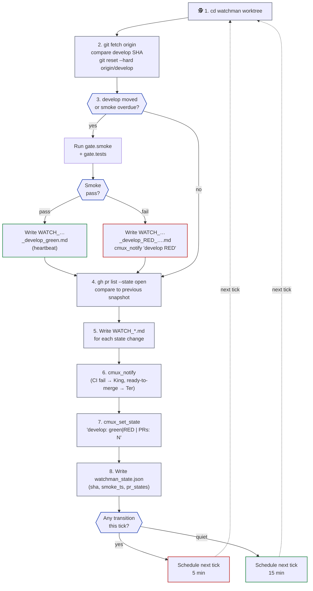
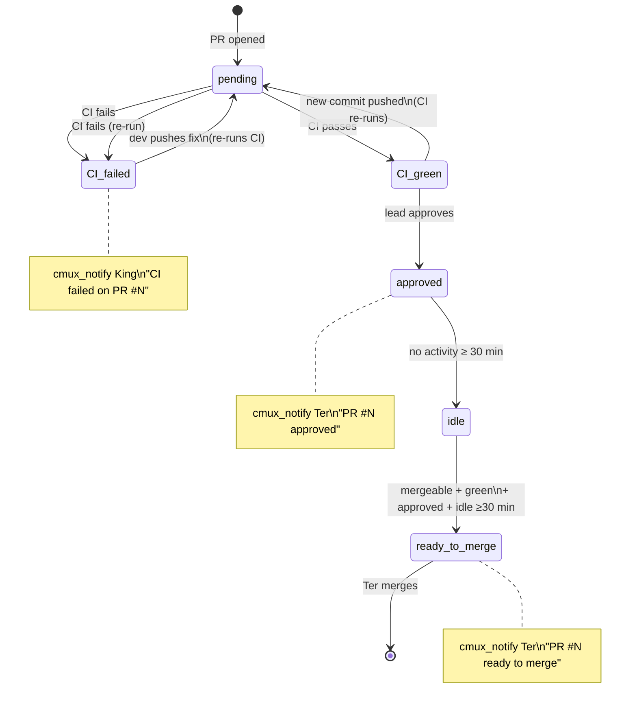

# watchman.md — Watchman lanes (`/loop` monitor)

> Plural filename anticipates multi-watchman setups (one per project area — e.g., backend smoke + frontend smoke + ops smoke). Typical setup is one watchman per kingdom.

Watchmen are **passive, continuous monitors**. NOT task workers. They run Claude Code with the `/loop` skill in dynamic-pacing mode (5 min when there's churn, 15 min when quiet). They track `origin/develop` tip + babysit open PRs.

**Model: Sonnet (explicit exception).** Workers and co-workers run on Opus because they edit code, reason over large diffs, and write curated artifacts. Watchman is the lighter Sonnet exception — it does not edit code; it only runs smoke commands, reads PR state, and fires notifications. Sonnet is sufficient for this read-only + test-runner + alerter loop, and keeps the long-running `/loop` cost proportionate. Slug convention: `sonnet-watchman-1`, `sonnet-watchman-2`, … (never Opus).

See [`index.md`](../index.md) for the entry-point overview, [`king.md`](king.md) for the King's gate (which is separate from Watchman monitoring), [`worker.md`](worker.md) for the 4-step closer pattern that Watchman ALSO follows for state-change reports, [`git.md`](../reference/git.md) for branch model.

---

## Rule cross-reference

Three rules govern Watchman's relationship with the rest of the kingdom — keep these in mind before adding any new Watchman authority:

- **R39 — King never dispatches to Watchman.** Watchman is self-scheduling (via `/loop`) and autonomous. King does not queue work for it, does not send it prompts mid-session, and does not treat it as a worker lane. The only King→Watchman interaction is the one-time spawn at kingdom startup (see § Dispatch below).
- **R11 — Watchman is read-mostly on project source.** It may read any project file for situational awareness; it may run smoke/test commands; it may NOT edit project source code. Write authority is confined to `WATCH_*.md` reports, `watchman_state.json`, and low-risk kingdom-doc fixes (see [`watchman-docs-audit.md`](watchman-docs-audit.md)).
- **R27 — Watchman owns PR-number backfill.** Workers commit TODO/CSV close-suffixes as `(PR #pending)` because the PR number doesn't exist at commit time. Watchman backfills `(PR #pending) → (PR #<N>)` on every `/loop` tick. King never does this work. See [`watchman-pr-backfill.md`](watchman-pr-backfill.md).

---

## Watchman role

- **Continuous monitor**, not a worker. Does NOT claim TODOs, edit code, push, or open PRs.
- Lives in `.worktrees/watchman-N/`, branch `watchman-N` (a local-only branch that's hard-reset to `origin/develop` tip on every `/loop` tick).
- In PRIMARY mode (manaflow/cmux), watchman gets its own **workspace** with an optional **vertical split layout** (`kingdom.json.cmux.watchmanLayout`): top pane runs `claude` (the /loop session), bottom pane runs `gh pr list --watch --interval 30` for live PR state. Default `direction=vertical`, `split=0.6`. Set `watchmanLayout: null` in `kingdom.json` to disable the split and use a single-pane workspace instead.
- Runs Claude Code with the `/loop` skill in **dynamic-pacing mode**: 5 min cadence when there's churn (PRs opening, develop moving, CI transitions); 15 min cadence when quiet.
- Reads `kingdom.json.gate.smoke` + `gate.tests` for the smoke command list to run on each develop advance.
- Writes `WATCH_*.md` reports to `<project>/docs/test-reports/` (separate prefix from King's `KING_*.md` gate reports).
- Posts `cmux_notify` when something needs the King's or the user's attention.

---

## `/loop` body (the 8-step tick)

Tick cycle: each iteration of the watchman's `/loop`, with a dashed return arrow showing the loop.



Each `/loop` tick does:

```bash
WS=/Users/ter/Desktop/Bonfire
PROJ=$WS/<project>
LOGS=$WS/.kingdom/$(basename "$PROJ")/logs

# (1) cd to the watchman worktree
cd "$PROJ/.worktrees/watchman-1"

# (2) Fetch + compare develop SHA to previous tick (state stored in <LOGS>/watchman_state.json)
git fetch origin
PREV_DEVELOP_SHA=$(jq -r .develop_sha "$LOGS/watchman_state.json" 2>/dev/null || echo '')
NEW_DEVELOP_SHA=$(git rev-parse origin/develop)
git reset --hard origin/develop                       # always track develop tip

# (3) If develop moved OR no prior smoke recorded today: run smoke
if [ "$NEW_DEVELOP_SHA" != "$PREV_DEVELOP_SHA" ] || [ daily_smoke_overdue ]; then
  KJSON="$WS/.kingdom/$(basename "$PROJ")/kingdom.json"
  # Run gate.smoke + gate.tests command list from kingdom.json
  SMOKE_PASS=true
  jq -r '.gate.smoke[] // empty, .gate.tests[]' "$KJSON" | while read cmd; do
    eval "$cmd" || { SMOKE_PASS=false; break; }
  done

  if [ "$SMOKE_PASS" = "true" ]; then
    # Write heartbeat / pass report
    UTC=$(date -u +%Y-%m-%dT%H%MZ)
    echo "# develop smoke pass at $UTC" > "$PROJ/docs/test-reports/WATCH_${UTC}__develop_green.md"
  else
    # Develop is RED — write report + alert King/Ter
    UTC=$(date -u +%Y-%m-%dT%H%MZ)
    cat > "$PROJ/docs/test-reports/WATCH_${UTC}__develop_RED__<short-reason>.md" <<EOF
    ## TL;DR
    - **Status:** fail
    - develop tip ${NEW_DEVELOP_SHA:0:8} broke smoke
    - Failing: <which command(s)>
    - **Next action:** King investigates; lanes paused until develop is green again.
    EOF
    cmux_notify "$KING_WS" "🕵️ watchman-$WI" "develop RED" \
      "Smoke broke on origin/develop ${NEW_DEVELOP_SHA:0:8}. Lanes paused pending King review."
  fi
fi

# (4) Babysit open PRs
gh pr list --state open --json number,headRefName,statusCheckRollup,reviews,mergeable > /tmp/prs.json
# Compare to previous PR state snapshot in <LOGS>/watchman_state.json
# Detect transitions: CI passed/failed, lead approved/requested-changes, mergeable+green+idle

# (5) Write WATCH_*.md for any state change
# e.g., WATCH_<UTC>__pr-<N>_CI_failed.md, WATCH_<UTC>__pr-<N>_ready_to_merge.md, …

# (6) fire cmux_notify on alert-worthy transitions (target $KING_WS so the
#     sidebar gets a badge + bell-icon panel logs the alert).
# All watchman alerts use the same positional schema:
#   cmux_notify "$KING_WS" "🕵️ watchman-N" "<event class>" "<one-line context>"
#     event class e.g. "CI failed · PR #234"
#
# Cases:
#   - CI just failed     → cmux_notify "$KING_WS" "🕵️ watchman-$WI" \
#                            "CI failed · PR #$N" \
#                            "$(gh pr view $N --json statusCheckRollup -q '.statusCheckRollup[0].name')"
#   - PR mergeable +
#     green + approved +
#     idle ≥30 min       → cmux_notify "$KING_WS" "🕵️ watchman-$WI" \
#                            "Ready to merge · PR #$N" \
#                            "All checks pass, lead approved, idle 30m+. Ter to merge."

# (7) Update sidebar status
cmux_set_state "$CMUX_WORKSPACE_ID" "▶" "develop: <green|RED> | open PRs: <n> (<g> green, <r> red)"

# (8) Write new snapshot + schedule next tick
jq -n --arg sha "$NEW_DEVELOP_SHA" --argjson prs "$(cat /tmp/prs.json)" \
  '{develop_sha: $sha, last_smoke_ts: now|todate, pr_states: $prs}' \
  > "$LOGS/watchman_state.json"

# Dynamic pacing: 5 min if any transition this tick, 15 min if quiet
```

---

## Autonomous Haiku fan-out (v0.29.0+, per rules.md R39 + R40)

Each `/loop` tick fans out up to `kingdom.json.watchman.haikuCapPerTick` Haiku sub-agents (default 5, max 10) across five parallel surveillance duties — **Duty 1** senior-dev review with doc cross-check (R31), **Duty 2** CVE scan, **Duty 3** cross-lane conflict scan, **Duty 4** git hygiene scan, **Duty 5** cross-story drift scan (R50) — then writes a `WATCH_TICK_<UTC>.md` aggregation and fires `cmux_notify` on any `severity: urgent` finding. All duties are advisory (Tier 2): they inform, never block.

→ Full duty specs, Haiku prompts, `haiku_cap_per_tick` enforcement, and the tick-aggregation schema: [`watchman-duties.md`](watchman-duties.md).

---

## Dispatch (King spawns this once at kingdom startup)

Inside the kingdom spawn checklist (see [`king.md`](king.md) → Spawning the kingdom), after `watchman-1`'s worktree + Claude session are up, the King sends the watchman prompt via `cmux_send` (or `tmux send-keys -l` in fallback mode):

```bash
HANDLE=$(cmux_list_panes "$WS_ID" | jq -r '.[] | select(.title=="watchman-1") | .id')

LANE_WATCHMAN_PROMPT="You are the Watchman for project <project>. Run /loop with this body
every 5-15 min (dynamic pacing) until I tell you to stop. Each tick:

1. cd $PROJ/.worktrees/watchman-1
2. git fetch origin
   PREV_DEVELOP_SHA=\$(jq -r .develop_sha $LOGS/watchman_state.json 2>/dev/null || echo '')
   NEW_DEVELOP_SHA=\$(git rev-parse origin/develop)
   git reset --hard origin/develop
3. If NEW_DEVELOP_SHA != PREV_DEVELOP_SHA OR no prior smoke today:
     Run <kingdom.json.gate.smoke + gate.tests command list>.
     On fail: write WATCH_<UTC>__develop_RED__<reason>.md + cmux_notify 'develop RED: <reason>'
     On pass: write WATCH_<UTC>__develop_green.md (TL;DR only)
4. gh pr list --state open --json number,headRefName,statusCheckRollup,reviews,mergeable > /tmp/prs.json
   Compare to previous snapshot in $LOGS/watchman_state.json:
     CI just failed     → WATCH_<UTC>__pr-<N>_CI_failed.md + cmux_notify King
     CI just passed     → WATCH_<UTC>__pr-<N>_CI_green.md (log only)
     lead approved      → cmux_notify Ter 'PR #<N> approved'
     mergeable + green + approved + idle 30min → cmux_notify Ter 'PR #<N> ready to merge'
5. cmux_set_state \"<self>\" \"▶\" \"develop: <green|RED> | open PRs: <n> (<g> green, <r> red)\"
6. Write new snapshot to $LOGS/watchman_state.json (develop_sha, last_smoke_ts, pr_states)
7. Schedule next tick via /loop dynamic pacing (5 min if any transition, 15 min if quiet)

You DO NOT edit code, claim TODO tasks, or push anything. Read-only + test runner + alerter."

cmux_send "$HANDLE" "$LANE_WATCHMAN_PROMPT"
```

---

## WATCH_*.md report naming convention

Watchman writes to `<project>/docs/test-reports/` alongside human-written `SMOKE_*.md` / `DEBUG_*.md` / `POSTMORTEM_*.md` and King's `KING_*.md` gate reports. Watchman uses the `WATCH_*` prefix:

```text
<project>/docs/test-reports/
├── KING_<UTC>__<lane-name>__<sub-task-id>.md     ← King's per-lane pre-commit gate (one per push-decision)
├── WATCH_<UTC>__develop_green.md                  ← heartbeat / develop pass
├── WATCH_<UTC>__develop_RED__<short-reason>.md    ← develop break detected
├── WATCH_<UTC>__pr-<N>_CI_failed.md               ← PR CI just turned red
├── WATCH_<UTC>__pr-<N>_CI_green.md                ← PR CI just turned green (log only, no notify)
├── WATCH_<UTC>__pr-<N>_lead_approved.md           ← lead just approved a PR
├── WATCH_<UTC>__pr-<N>_ready_to_merge.md          ← PR green + approved + idle ≥30 min
└── (existing) SMOKE_*.md / DEBUG_*.md / POSTMORTEM_*.md  ← human-written
```

`<UTC>` = `YYYY-MM-DDTHHMMZ` (no colons, trailing `Z`).

The Watchman's reports follow the same TL;DR-first header schema as the rest of the kingdom — first 15 lines must give the master enough to decide whether to read further.

---

## PR transition state machine

State machine: the transitions Watchman watches for on each open PR, and the alert it fires at each transition.



## Watchman state snapshot

Watchman maintains its own state file (NOT mixed with master_agent.log):

```text
<LOGS>/watchman_state.json
```

Schema:

```json
{
  "develop_sha": "abc1234...",
  "last_smoke_ts": "2026-05-17T10:30:00Z",
  "pr_states": {
    "247": { "ci": "green", "reviews": "approved", "mergeable": true, "first_ready_at": "2026-05-17T09:55:00Z" },
    "248": { "ci": "red", "reviews": "pending", "mergeable": true },
    "249": { "ci": "pending", "reviews": "pending", "mergeable": true }
  }
}
```

Watchman writes; King reads (for alert context); no human edit. Cleared/reset when watchman is torn down.

---

## Why Watchman doesn't replace King's per-lane pre-commit gate

- **Gate is lane-specific + blocking:** runs against `<role>-<n>` (which has the lane's commits not yet in develop), runs once, blocks the push decision. Watchman only knows about develop tip + open PRs — no view of in-flight lane work.
- **Gate is fresh at push time:** runs after the user's "push" approval (via `git merge-tree` for the FINAL conflict check). Watchman runs at `/loop` ticks; by push time, the last Watchman result could be 15 minutes stale.
- **Watchman is develop-wide + non-blocking:** catches drift, CI failures on open PRs, lead-review transitions — none of which the King's per-lane gate sees.

The two complement: **King keeps push-time freshness; Watchman keeps develop-wide visibility.**

---

## Watchman lifecycle

| Action | Trigger | How |
|---|---|---|
| **Spawn** | Kingdom startup (part of the spawn checklist) | `git worktree add -b "watchman-1" "$PROJ/.worktrees/watchman-1" "origin/develop"` + `cmux_send "<self>" "$LANE_WATCHMAN_PROMPT"` (primary) or `tmux send-keys -l` (fallback) |
| **Pause** | The user says "pause watchman" | King sends `/loop cancel` to the watchman pane: `cmux_send "<self>" "/loop cancel"` |
| **Resume** | The user says "resume watchman" | King re-sends the `LANE_WATCHMAN_PROMPT` |
| **Teardown** | Kingdom close | `cmux_send "<self>" "/loop cancel"` → `git worktree remove "$PROJ/.worktrees/watchman-1" --force; git branch -D "watchman-1" 2>/dev/null \|\| true` |

The watchman's worktree + branch + state file persist across pauses; only the `/loop` schedule is suspended.

---

## Multiple watchmen (one per project area)

`kingdom.json.shape.watchman` can be >1. Use case: per-area smoke — one watchman runs backend smoke + watches backend PRs, another runs frontend smoke + watches frontend PRs:

```json
{
  "shape": { "workers": 3, "co-workers": 1, "watchman": 2 },
  "watchmen": [
    { "name": "watchman-1", "cadence": "dynamic", "watches": ["origin/develop", "PRs with label:component:backend"] },
    { "name": "watchman-2", "cadence": "dynamic", "watches": ["origin/develop", "PRs with label:component:frontend"] }
  ]
}
```

Each watchman gets its own worktree (`watchman-1`, `watchman-2`) tracking the same `origin/develop` tip, but with different PR filter scopes. They write to the same `<project>/docs/test-reports/` dir but with distinct `WATCH_<UTC>__watchman-<N>__...md` filenames to avoid collision.

---

## Task file access (read-only)

Watchman does NOT create task files. The watchman role has no per-task work — it's a continuous monitor (`/loop`), not an executor.

Watchman MAY read task files at `<workspace>/.kingdom/<project>/tasks/*.md` for situational awareness:

- When alerting the King about a develop break, watchman can check whether any in-flight lane's task file is affected (e.g., lane currently editing the broken module).
- When detecting a PR ready-to-merge, watchman can include in its notification: "PR #N (from `worker-1`, task `BE-P0-CICD.1`) is mergeable + green + idle for 30m." — pulled from the task file's brief.

Watchman writes ONLY: `WATCH_*.md` reports, `watchman_state.json`, `cmux_notify` events, sidebar status pills. It never writes to task files, raw artifacts, master_agent.log, or anything outside its own WATCH_ namespace.

---

## PR-number backfill duty (every tick · v0.19.0+ · per [rules.md R27](../rules/R27-watchman-owns-pr-number-backfill.md))

Workers commit TODO/CSV close-suffixes as `(PR #pending)` because the PR number doesn't exist at commit time. Every tick, watchman backfills `(PR #pending) → (PR #<N>)` per-lane via the `parallel_edit_fanout` helper (parallel across lanes under `_bounded_wait 45`, `--force-with-lease`, skip MERGED PRs) — King never does this work. Two side duties ride along: stale `.lane` claim sweep, and a kingdom-task-file `verifying`-checkbox audit (flag-only). Tier 2 — failure is cosmetic, not load-bearing.

→ Scan logic, the helper call + per-lane fan-out, constraints, and side duties: [`watchman-pr-backfill.md`](watchman-pr-backfill.md).

---

## Orphan-tab sweep (every tick)

Sub-agent tabs in master workspaces are SUPPOSED to auto-close via the 5-step closer Step 5 (`cmux_tab_action close --surface "$CMUX_SURFACE_ID"`). When that fails (cmux unreachable, killed process, etc.), tabs persist after their sentinel was written — clutter that the master can't clean up on its own.

Watchman sweeps for these every `/loop` tick. Logic:

```bash
# For each lane master workspace, enumerate its tabs/surfaces
for WS_VAR in $(env | grep -E '^(WORKER|COWORKER)_WS_[0-9]+' | cut -d= -f1); do
  WS_REF=$(eval echo "\$$WS_VAR")

  # List all surfaces in this workspace
  SURFACES=$(cmux_list_pane_surfaces --workspace "$WS_REF" --json)

  # For each surface that LOOKS like a sub-agent tab (name starts with "🐱 sub")
  echo "$SURFACES" | jq -r '.surfaces[] | select(.title | startswith("🐱 sub")) | .ref' | while read SURF; do

    # Was its sentinel written more than 5 minutes ago?
    # We don't know the ID directly from the surface name — but we can
    # check the surface's idle time + last-written log line.
    OUTPUT=$(cmux_capture_pane "$WS_REF" 5)

    # If the recent output mentions "closer complete" or "sentinel written"
    # AND the surface has been idle (no new content) for ≥5 min, it's orphan.
    if echo "$OUTPUT" | grep -q 'sentinel\|closer\|done flag'; then
      AGE=$(jq -r ".surface_idle_ts[\"$SURF\"] // 0" "$LOGS/watchman_state.json")
      NOW=$(date -u +%s)
      if [ $((NOW - AGE)) -gt 300 ]; then
        cmux_tab_action close --surface "$SURF" 2>/dev/null
        echo "[$(date -u +%Y-%m-%dT%H%MZ)] 🕵️ watchman swept orphan tab $SURF in $WS_VAR" \
          >> "$LOGS/master_agent.log"
      fi
    fi
  done
done
```

This is BELT-AND-SUSPENDERS — the sub-agent's own Step 5 closes >99% of tabs. Watchman handles the rest. Sweeps are logged to `master_agent.log` so the King can see orphans being cleaned up.

---

## On-demand test verification (King-dispatched, read-only)

Beyond the passive `/loop` smoke + PR babysitting, watchman accepts **on-demand test verification requests** from the King. This is the v0.16.0 industrial-overlay role expansion — King can route "verify X by running these tests" work to watchman without spinning up a worker for read-only verification tasks.

### Request artifact

King drops a request file at `<LOGS>/watchman-requests/<UTC>__verify-<slug>.md`:

```markdown
# Watchman test request — verify-<slug>

## Brief
<2-4 lines — what to verify, e.g. "Run integration tests against branch X
to confirm BE-AUTH-3 doesn't regress the login flow.">

## Commands
- pnpm --filter @bfg-swt/backend-bac test:integration
- pnpm --filter @bfg-swt/webshop test:e2e -- --grep login

## Scope
- Read-only — DO NOT edit test code, fixtures, or project files
- DO NOT push, commit, or open PRs
- Write report to <project>/docs/test-reports/WATCH_<UTC>__verify-<slug>.md
```

### Watchman's pickup logic (every `/loop` tick)

```bash
# At the end of each /loop tick (after the standard 8 steps), watchman scans
# for new request files:

REQUESTS_DIR="$LOGS/watchman-requests"
mkdir -p "$REQUESTS_DIR"

for REQ in "$REQUESTS_DIR"/*.md; do
  [ -f "$REQ" ] || continue
  REQ_SLUG=$(basename "$REQ" .md | sed 's/^[0-9-]*T[0-9]*Z__verify-//')
  REPORT="$PROJ/docs/test-reports/WATCH_$(date -u +%Y-%m-%dT%H%MZ)__verify-${REQ_SLUG}.md"

  # Already processed? (a matching report exists)
  if ls "$PROJ/docs/test-reports/WATCH_"*"__verify-${REQ_SLUG}.md" >/dev/null 2>&1; then
    continue
  fi

  # Execute the commands listed in the request (extract from the "## Commands" section)
  COMMANDS=$(awk '/^## Commands/,/^##/' "$REQ" | grep -E '^- ' | sed 's/^- //')

  STATUS="pass"
  OUTPUT_BUFFER=""
  while IFS= read -r CMD; do
    OUTPUT=$(eval "$CMD" 2>&1) || STATUS="fail"
    OUTPUT_BUFFER="${OUTPUT_BUFFER}
$ $CMD
$OUTPUT
"
  done <<< "$COMMANDS"

  # Write the report (lane name slot = "watchman-N" per v0.15.2 strict naming)
  cat > "$REPORT" <<EOF
# Verification report — $REQ_SLUG

## TL;DR
- **Status:** $STATUS
- **Requested by:** King ($(basename "$REQ"))
- **Commands run:** $(echo "$COMMANDS" | wc -l)

## Command outputs
\`\`\`
$OUTPUT_BUFFER
\`\`\`
EOF

  # Notify King via cmux_notify (badge on King's workspace)
  cmux_notify "$KING_WS" "🕵️ watchman-$WI" "Verification $STATUS · $REQ_SLUG" "Report: $REPORT"
done
```

### What watchman WILL and WON'T do

| Will | Won't |
|---|---|
| ✅ Run test commands listed in the request | ❌ Edit test code, fixtures, or project files |
| ✅ Read project source to understand what it's testing | ❌ Push, commit, or open PRs |
| ✅ Write a `WATCH_*__verify-*.md` report | ❌ Modify the test request file itself |
| ✅ Notify King when done | ❌ Take action on test failures (just reports — King decides next step) |

### When King uses watchman vs a worker for test work

| Test work type | Route to | Why |
|---|---|---|
| **Run existing tests, no edits** (verify a hypothesis, sanity-check a branch, confirm regression isn't introduced) | 🕵️ Watchman via request file | Read-only; cheaper Sonnet model; preserves worker capacity for code work |
| **Write new tests, fix flaky tests, edit fixtures, modify CI config** | 👷 Worker | Code-touching; needs full lane authority + commit/push capability |

Heuristic: if the answer is "run these commands and tell me what happened," → watchman. If the answer is "make these tests pass," → worker.

---

## Blocked-lane scan (every tick)

Lanes can silently stall on Claude Code's interactive permission prompts ("Do you want to proceed? 1. Yes / 2. Yes allow … / 3. No") or other TUI input requests. cmux.app shows the workspace as "Running" but the lane is actually idle, waiting for keyboard input. Without intervention you only notice by clicking each lane.

Watchman scans for this every `/loop` tick:

```bash
# For each lane workspace ref in $LOGS/workspace-refs.env:
source "$LOGS/workspace-refs.env"

for WS_VAR in $(env | grep -E '^(WORKER|COWORKER|WATCHMAN)_WS_[0-9]+' | cut -d= -f1); do
  WS_REF=$(eval echo "\$$WS_VAR")
  LANE_LABEL=$(echo "$WS_VAR" | sed 's/_WS_/ /' | tr 'A-Z' 'a-z')   # e.g. "worker 1"

  # Grab the recent surface output
  OUTPUT=$(cmux_capture_pane "$WS_REF" 30)

  # Patterns that indicate a blocked lane
  if echo "$OUTPUT" | grep -qE '(Do you want to proceed\?|Esc to cancel|\[y/N\]|allow .* during this session|Press Enter)'; then
    # Already notified this tick? Skip to avoid spam — state stored in watchman_state.json
    PREV_BLOCKED=$(jq -r ".blocked_lanes[\"$WS_VAR\"] // empty" "$LOGS/watchman_state.json" 2>/dev/null)
    if [ "$PREV_BLOCKED" != "true" ]; then
      # 3-layer state override: badge + description + notify (cmux's auto-state
      # may still say "Running" but our three signals tell the truth)
      cmux_workspace_action "$WS_REF" mark-unread
      cmux_set_state "$WS_REF" "⚠" "Blocked · permission prompt"
      cmux_notify "" "🕵️ watchman-$WI" "Lane blocked · $LANE_LABEL" \
        "Permission prompt or input requested. Click workspace to approve." "$WS_REF"
      cmux_notify "$KING_WS" "🕵️ watchman-$WI" "Lane blocked · $LANE_LABEL" \
        "$LANE_LABEL is waiting on a permission prompt. Click its workspace to resolve."
      # Mark as notified
      jq ".blocked_lanes[\"$WS_VAR\"] = true" "$LOGS/watchman_state.json" \
        > /tmp/ws-state && mv /tmp/ws-state "$LOGS/watchman_state.json"
    fi
  else
    # Lane no longer blocked — clear unread marker + restore description + clear state
    PREV_BLOCKED=$(jq -r ".blocked_lanes[\"$WS_VAR\"] // empty" "$LOGS/watchman_state.json" 2>/dev/null)
    if [ "$PREV_BLOCKED" = "true" ]; then
      cmux_workspace_action "$WS_REF" mark-read
      # Description restored by the lane itself on its next state transition;
      # watchman doesn't second-guess what the lane should display normally.
    fi
    jq "del(.blocked_lanes[\"$WS_VAR\"])" "$LOGS/watchman_state.json" \
      > /tmp/ws-state && mv /tmp/ws-state "$LOGS/watchman_state.json"
  fi
done
```

The scan is **idempotent + debounced** — `watchman_state.json` tracks which lanes are currently blocked so watchman doesn't re-notify every tick. Once a lane unblocks (output no longer matches the patterns), the state clears and the lane is eligible for re-notification next time it blocks.

Patterns watched:

| Pattern | Triggers |
|---|---|
| `Do you want to proceed\?` | Claude Code's standard permission prompt |
| `Esc to cancel` | Same prompt's footer |
| `\[y/N\]` | Common interactive y/n confirmations |
| `allow .* during this session` | The session-scoped permission option |
| `Press Enter` | Generic "press enter to continue" prompts |

Most of these are pre-empted by the workspace `.claude/settings.json` permissions allow-list (see `commands/init.md` Step 4.5 — kingdom auto-allows `.kingdom/**` and `.worktrees/**`). The scan catches any that slip through.

---

## Docs audit duty (idle-time work)

When `/loop` is otherwise quiet (no PRs to babysit, no `develop` movement, no smoke break), watchman runs a bounded docs audit over `<workspace>/.kingdom/<project>/{tasks,logs}/` — the ONLY place it has WRITE authority, and only on audit artifacts, never project source. Low-risk fixes (stale checkbox ticks backed by a `git log` commit, `master_agent.log` summary backfills, dead `[[name]]`-link repairs) it applies directly; high-risk changes (digest rewrites, task-file merges, role-doc rewrites, >30d archives) plus project-state `Gap A`/`Gap B` findings are flag-only to `WATCH_DOCS_AUDIT.md` for King. When unsure, default to flagging.

→ Risk split table, project-state scan, `WATCH_DOCS_AUDIT.md` schema, boundary, and cadence: [`watchman-docs-audit.md`](watchman-docs-audit.md).

---

## What watchmen DO

- Read project files.
- Run smoke / typecheck / test commands from `kingdom.json.gate.*`.
- Query `gh pr list` / `gh pr view` / `gh pr checks`.
- Write `WATCH_*.md` reports + `WATCH_DOCS_AUDIT.md`.
- Call `cmux_notify` to alert King / the user.
- Update `cmux_set_state` for sidebar visibility.
- Maintain `<LOGS>/watchman_state.json`.
- Read task files (`<workspace>/.kingdom/<project>/tasks/`) for situational awareness when issuing alerts.
- Apply **low-risk** fixes to `tasks/` + `logs/` during idle docs audit (see [`watchman-docs-audit.md`](watchman-docs-audit.md)).

## What watchmen DO NOT do

| ❌ Forbidden | Why |
|---|---|
| Claim TODOs | Not a task worker; passive monitor |
| Edit project source code | Read-only on project files |
| `git push` / `git commit` to anything | King-only push authority |
| `gh pr create` | King-only |
| Authoritative gate | That's King's pre-commit gate; Watchman just informs |
| Read `<LOGS>/raw/*` directly | Tier-3 banned for everyone — including watchman |
| Apply **high-risk** docs fixes (digest rewrite, task-file merge, role-doc rewrite, archive) | Flag-only — King decides; see [`watchman-docs-audit.md`](watchman-docs-audit.md) |
| Edit `.kingdom/.setting/*.md`, `kingdom.json`, or `.git/` | Out of scope; watchman writes only to its own audit-artifact namespace |

Watchman is **read-only on source + test runner + alerter + low-risk audit janitor**. Nothing more.
