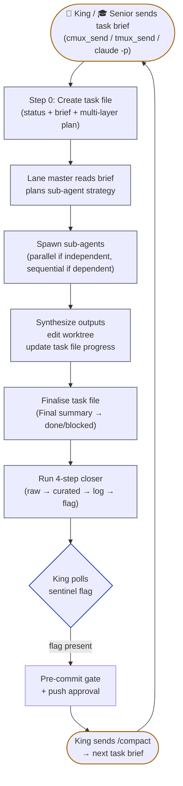
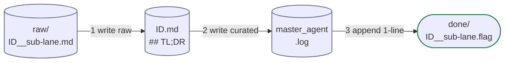
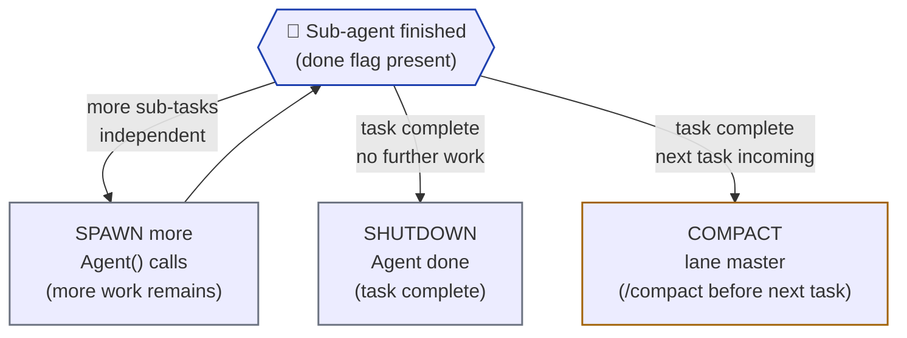

# worker.md — Worker role + 4-step closer

Workers are the autonomous task-execution lanes (`worker-1`, `worker-2`, …). Each runs a long-lived Claude Code teammate in its own `git worktree` on its own `worker-N` branch. Workers pick claimable sub-tasks from the project's task source, execute via their own sub-agent fleet, and signal the King with the 4-step closer.

See [`index.md`](../index.md) for entry-point context, [`king.md`](king.md) for who dispatches and gates worker work in the solo path, [`senior.md`](senior.md) for who dispatches and reviews worker work in a story pod, [`co-worker.md`](co-worker.md) and [`watchman.md`](watchman.md) for the other lane roles, [`git.md`](../reference/git.md) for branch model.

---

## Spawning sub-agents — Tab vs Agent decision

A lane master spawns sub-agents in one of three ways. **Default since v0.28.0 (R38): ALL models default to visible tab** — `Agent()` in-process background spawns are opt-in only, not the default. (Pre-v0.28.0 model-tiered "cheap fan-outs headless" behaviour is retired.)

**R51 — fan heavy work out, don't do it serially.** Multi-file reads, pattern greps, doc orientation, independent edits, and review passes SHOULD run as parallel sub-agents (strong default, soft target `kingdom.json.subAgents.parallelTarget` ≈ 10 — aim for it, exceed when a task needs it, skip for a trivial one). Model by work type: **sonnet** = standard task work, **haiku** = bulk reads/greps/orientation, **opus** = sensitive/high-stakes. Always bounded by `_bounded_wait` (R42).

**R53 — prefer the Workflow tool for the fan-out, when the session exposes it.** The worker's heavy fan-out is the task's own **Discover → Execute → Verify** army (Layers 1/3/4 below). When the Workflow tool is in this session's toolset, run that army as **one Workflow run per task** (→ live `/workflows` view: phases + per-agent token/tool/time + an optional Verify judge stage) instead of raw `Agent()` calls. One kingdom task = one Workflow run. When the tool is **not** present, fall back to the existing bounded mechanism unchanged: parallel `Agent()` (R42) or visible cmux tabs (R38). Either way the task file (R23), the 4-step closer (R22), and the load-bearing sentinel flag are unchanged — the Workflow run is only the *execution surface* for the army, never a substitute for the artifact protocol. Canonical pattern + script skeleton + per-role shapes: [`R53`](../rules/R53-fan-out-via-workflow-tool.md) and [`reference/workflow-fanout.md`](../reference/workflow-fanout.md).

### Spawn-cost reality

| Mode | Spawn cost | When it's worth it |
|---|---|---|
| 📑 `cmux_tab_action new-terminal-right` + boot Claude | **~10–20s** (full Claude session boot) or **~20ms** with pre-warmed pool (v0.18.0+) | **Default for all sub-agent work** — visible, auditable, auto-closes on sentinel |
| 🐱 Lane dispatch via `cmux_send "worker-N" "..."` | **~20ms** | Routing work to an already-running lane Claude session (audit specialists, pattern scans) |
| 🪟 `cmux_new_split right` | Same as tab | Side-by-side comparison of ≤2 sub-agents. Rare. |

**`Agent(run_in_background=true)` is banned as kingdom default (R38).** Background spawns may be used only when explicitly opted-in via `kingdom.json.cmux.subAgentSpawnByModel` on a per-task basis; they must still run the 4-step closer.

### Model-tiered defaults (kingdom.json.cmux.subAgentSpawnByModel) — v0.28.0+

```json
"subAgentSpawnByModel": {
  "haiku":  "tab",     // default tab (R38); set "background" to opt-in to headless
  "sonnet": "tab",     // default tab (R38); set "background" to opt-in to headless
  "opus":   "tab"      // always tab — expensive + slow → deserves visibility
}
```

The master looks up the spawn mode by the sub-agent's model:

```bash
SPAWN_MODE=$(jq -r ".cmux.subAgentSpawnByModel.${SUB_MODEL} // .cmux.subAgentSpawnFallback // \"tab\"" "$KJSON")
case "$SPAWN_MODE" in
  background) spawn_as_agent "$SUB_MODEL" "$BRIEF" ;;
  tab)        spawn_as_tab   "$SUB_MODEL" "$BRIEF" ;;
  split)      spawn_as_split "$SUB_MODEL" "$BRIEF" ;;
esac
```

### Per-task override

The dispatch brief can explicitly request a non-default mode. Master honours the override:

```text
worker-1 task BE-AUTH-3:
  Brief: refactor auth middleware...
  Spawn mode: tab          # the user wants to watch the Sonnet sub-agents work
```

Common reasons to override:

| Override | When |
|---|---|
| `spawn_mode: tab` (visible — default) | Long-running Sonnet work, debugging, "show me what worker-1 is doing" |
| `spawn_mode: background` (opt-in headless) | the user wants speed, doesn't care to watch; cost-sensitive fan-out of >5 sub-agents; still requires 4-step closer |
| `spawn_mode: split` (rare) | Pair-style "do A and B side-by-side" |

### Auto-close still applies (Tab-spawned)

Tab-spawned sub-agents run the **5-step closer** (Step 5 = `cmux_tab_action close --surface "$CMUX_SURFACE_ID"`). Tabs self-destruct after sentinel. Watchman has an orphan-tab sweep as belt-and-suspenders (v0.14.9).

Agent-spawned sub-agents run the **4-step closer** only — no Step 5 (no tab to close).

### Pre-warmed sub-agent pool (v0.18.0+) — instant tab spawns

Tab spawns cost ~10–20s each (full Claude session boot). Layer-3 fan-out of 5 Sonnet sub-agents pre-v0.18 took ~50–100s just for spawn. **v0.18.0 pre-warms a pool of idle `claude -p` processes** in hidden tabs so sub-agent spawn becomes `cmux_send` to the existing surface (~20ms) instead of `cmux_tab_action new-terminal-right` + boot.

Configured in `kingdom.json.cmux.subAgentPool`:

```json
"subAgentPool": {
  "enabled": true,
  "perMasterPoolSize": 2,
  "models": ["sonnet"]
}
```

Master initialises the pool at spawn time (background, non-blocking):

> Helper definitions: see [`init_subagent_pool.sh`](../functions/init_subagent_pool.sh) / [`spawn_pool_slot.sh`](../functions/spawn_pool_slot.sh) / [`spawn_subagent_from_pool.sh`](../functions/spawn_subagent_from_pool.sh).
>
> - `init_subagent_pool` — call once at master spawn; fans out `perMasterPoolSize` hidden tabs running `claude -p 'AWAITING_DISPATCH'`.
> - `spawn_pool_slot` — internal; spawns one hidden tab + appends its surface ref to the pool list file.
> - `spawn_subagent_from_pool` — public dispatch entry; reuses a hot slot (`cmux_send` ~20ms) or falls back to `spawn_subagent_tab` (~10-20s).

Result:

| Spawn pattern | Pre-v0.18 | Post-v0.18 |
|---|---|---|
| Layer-3 fan-out of 5 Sonnet sub-agents (tab mode) | ~50–100s | **~100ms** (5 × 20ms `cmux_send`) |
| Per-spawn boot cost (when pool hit) | 10–20s | 20ms |
| Per-spawn boot cost (when pool miss, fallback) | 10–20s | 10–20s |

Pool refills in background after each consumption so subsequent spawns also hit the fast path. **Layer-3 parallelism is effectively instant** after the first 2 spawns (or whatever `perMasterPoolSize` is set to).

Applies only to **tab-mode** spawns. `Agent(...)` background spawns are already cheap (~2s) so no pool needed there.

Disable via `kingdom.json.cmux.subAgentPool.enabled: false` if you want to skip pool initialization (e.g., cost-sensitive runs, debugging).

### Visual fan-out example

When worker-1 hits Layer 3 (Execution) and decides to spawn 3 parallel Sonnet sub-agents for separate code chunks:

```text
Master worker-1 dispatches Layer 3 fan-out (all tab — R38 default):

  cmux.app sidebar (workspace `👷 worker-1`):
    ├── 📑 worker-1 (master Claude session, the long-lived worker)
    ├── 📑 🐱 sub · Sonnet · auth-controller   ← spawned, running
    ├── 📑 🐱 sub · Sonnet · jwt-service       ← spawned, running
    └── 📑 🐱 sub · Sonnet · auth-tests        ← spawned, running

When each sub-agent finishes (writes sentinel + Step 5 self-close):

  cmux.app sidebar (workspace `👷 worker-1`):
    └── 📑 worker-1   ← master synthesises the 3 outputs, continues Layer 4
```

The user SEES the parallelism happen. Tabs appear, do work, disappear cleanly.

---

## Worker lane role

- **Generic autonomous task workers.** No preset focus, no path locks. Every worker starts as identical capacity — `worker-1` and `worker-2` are interchangeable. The King assigns each task at dispatch time; the same worker can be doing backend today and frontend tomorrow.
- Lane master itself runs **Opus** by default (override per-lane in `kingdom.json.workers[i].model` if you want Sonnet for cost reasons). Executes via its own sub-agent fleet (P1 Sonnet / P2 Haiku / P3 Opus; fan heavy work out in parallel per R51 — soft target `kingdom.json.subAgents.parallelTarget` ≈ 10, every fan-out bounded by `_bounded_wait` per R42 — see Spawn rights below).
- **Domain-agnostic.** A worker can edit code, run financial-model checks, run lab notebooks, draft manuscripts — whatever the task brief describes. The kingdom's only assumption is that work is versioned in git.
- Signals its dispatcher via the standard 4-step closer (raw + curated + log + sentinel flag). The dispatcher is the **King** for a solo lane and its **Senior** for a pod worker — both poll the same `done/*.flag` sentinel. Sub-agents spawned as **Tabs** add Step 5 (auto-close own tab) — see § "5-step closer for tab-spawned sub-agents" below.
- Cross-lane conflict prevention is not the worker's job — Layer 1 planning detects overlapping tasks before dispatch, and the FINAL `git merge-tree` check at the push gate catches anything that slipped through. In a pod, within-story merge conflicts are the **Senior's** to resolve (R49) and between-story drift is watchman-flagged + King-resolved (R50). Workers don't need configured `ownsPaths` to stay out of each other's way.

---

## Before implementing — read, fan out, ask (do this EARLY, every task)

Three habits the worker runs at task start, before writing any code. They are the antidote to the real failure modes from a week of fleet driving (lanes that didn't read docs, never used the Workflow tool, and stalled silently on questions):

1. **Ground in the docs FIRST (R45).** Run the Layer-1 doc orientation (`haiku_read_docs_orientation`, see Task-file template Layer 1) before any code grep. Docs override code patterns when they conflict. Don't implement against a guess.
2. **Fan out via the Workflow tool when the work is big (R53).** **Before implementing: if the task spans 3+ files or needs research across the codebase, fan the work out via the Workflow tool per [`reference/workflow-fanout.md`](../reference/workflow-fanout.md)** — self-detect availability first; if the Workflow tool is NOT in this session's toolset, fall back to bounded `Agent()` (R42) / visible cmux tabs (R38). **One Workflow run per task.** A trivial 1-2 file edit needs no fan-out; don't force it.
3. **Post to the inbox instead of guessing (R55).** If you hit a question or a blocker, send it via `inbox_send` — never stall silently. See § Talking to other actors below.

## Talking to other actors (shared broker inbox · R55)

The lane is NOT alone. When you need a decision — from the King, from a Senior, or from another lane — post to the shared inbox and **keep working on anything still continuable** while you wait. You never freeze.

```bash
# Ask the King a question (needs a reply) — set state + keep going on unblocked parts:
inbox_send king question "$SUBTASK_ID" yes "Two auth patterns exist (cookie vs header). Which is canonical?"
cmux_set_state "$CMUX_WORKSPACE_ID" "❓" "$SUBTASK_ID · waiting on King"

# Flag a cross-lane concern to the King (non-blocking info):
inbox_send king flag "$SUBTASK_ID" no "develop smoke references a module this task removes — possible cross-lane break."

# Ask a Senior directly (e.g. pod worker asking its Senior for clarification):
inbox_send senior-1 question "$SUBTASK_ID" yes "Story branch has a merge conflict on src/auth.ts — which side wins?"

# Broadcast an informational note to all actors:
inbox_send all info "$SUBTASK_ID" no "Migrating auth module — other lanes touching src/auth.ts should rebase after PR merges."
```

Render the [`lane-question`](../cards/lane-question.md) card in your reply so the user sees what you asked.

**Inbox hygiene — three mandatory check points** (task start, when blocked, before the closer):

```bash
# Visibility: scan the whole feed (read-only, no action required on messages not addressed to you)
inbox_list

# Action: read and consume messages addressed to this lane or 'all'
inbox_list --to worker-N                  # replace worker-N with your own slug
inbox_read "<path>" --consume             # read + archive each message you action
```

The key semantics: **everyone may read the whole feed** for situational awareness; **only the addressed actor (to == you, or to == all) owns the action + consume**. Never consume a message addressed to someone else.

The King drains its own inbox at every turn (see [`king.md`](king.md) → Inbox triage). The sentinel flag (R22) is still the only task-completion signal — the inbox is for questions and flags, never for task hand-off.

## Conventions

- **Replying with cards (R12 spirit — render, don't dump):** when you reply to the King/user, render the matching card, not raw prose: task completion → [`task-complete`](../cards/task-complete.md); blocked → [`blocked-lane`](../cards/blocked-lane.md); a question to any actor → [`lane-question`](../cards/lane-question.md). A plain status answer ("still on L3, 60%") is fine as prose. One `render_card` call; never ANSI.
- **Memory is King-only (R54):** if you discover something memory-worthy (a durable convention, a recurring user preference), do NOT write memory. Send `inbox_send king memory-request "$SUBTASK_ID" yes "<proposed memory line>"` and keep working — the King validates against R34 and writes it.

---

## Task claiming

Before assigning a sub-task to a lane, **King** writes a claim file:

```bash
echo "worker-1 | $(date -u +%Y-%m-%dT%H:%M:%SZ)" > "$LOGS/claims/$SUBTASK_ID.lane"
```

- Path: `<LOGS>/claims/<sub-task-id>.lane` (e.g., `BE-P0-CICD.1.lane`)
- Contents: `<lane-name> | <UTC>`
- Cleared when the lane's PR is merged
- King checks `<LOGS>/claims/` before picking any new task — if a claim exists, skip that sub-task

Workers don't write claims. King does. Workers just receive their assignment via the dispatch prompt — see [`king.md`](king.md) → "Dispatch brief schema" for what King sends to each worker.

### Pod membership (v0.32.0+, R46/R47/R48)

A worker may be assigned to a **Senior's story pod**. When it is:

- Its sub-tasks (and any fix-tasks) come from its **Senior** (a 🎓 Opus lane), not the King (the King delegated the story per R30's delegated-dispatch amendment, and the Senior dispatches in-pod + visible via `guard_dispatch_scope`). The work is identical to a solo task: open a task file (R23), do the sub-task on `worker-N`, run **Tier-1** typecheck in your own worktree, fire the closer (R22), signal done.
- **Gate tier changes (R47).** In pod work the gate is THREE-tier: your Tier-1 → the Senior's **story-branch Tier-2** (`run_tier2_on_story`) → the Senior's review loop → the human push. You still only own Tier-1; the kingdom-overlay Tier-2 path (the SOLO two-tier flow, run by the King) does not apply to pod work.
- You do **not** merge your own branch. The Senior merges `worker-N` into the local `story/<id>` branch via `merge_into_story` (R46) and is the **sole within-story reviewer** (R48). If the Senior routes a fix-task back, fix on the same `worker-N` branch and signal done again; the Senior re-merges and re-reviews (loop capped at `integration.reviewLoopCap`, R48).
- A worker belongs to at most one pod at a time. See [`senior.md`](senior.md).

---

## Task-artifact naming — strict (every artifact carries the lane)

**The lane name appears in every per-task artifact filename**, so a single `grep`/`ls` finds everything that lane touched across the kingdom's history. Workers are generic capacity, but each task file/log/raw/sentinel is a **snapshot** of the lane assignment at THAT moment. If worker-3 does BE-AUTH-3 this week and FE-ICONS-9 next week, both task files have `worker-3` in their name.

| Artifact | Filename | Lane location |
|---|---|---|
| Task file | `<workspace>/.kingdom/<project>/tasks/<UTC>__<lane>__<sub-task-id>.md` | `<lane>` (segment 2) |
| Raw output | `<LOGS>/raw/<UTC>__<sub>-<lane>__<sub-task-id>.md` | `<sub>-<lane>` (segment 2 — model-prefix + lane) |
| Curated digest | `<LOGS>/<UTC>__<lane>__<sub-task-id>.md` | `<lane>` (segment 2) |
| Sentinel flag | `<LOGS>/done/<UTC>__<sub>-<lane>__<sub-task-id>.flag` | `<sub>-<lane>` (segment 2) |
| Test report (King) | `<project>/docs/test-reports/KING_<UTC>__<lane>__<sub-task-id>.md` | `<lane>` (segment 2 of the name part) |

### Continuation grep patterns

```bash
# All artifacts from worker-3 (any task, any time)
ls "$WS"/.kingdom/<project>/tasks/*__worker-3__*.md
ls "$WS"/.kingdom/<project>/logs/*__worker-3__*.md
ls "$WS"/.kingdom/<project>/logs/raw/*-worker-3__*.md
ls "$WS"/.kingdom/<project>/logs/done/*-worker-3__*.flag
ls "$PROJ"/docs/test-reports/KING_*__worker-3__*.md

# Just today's worker-3 work
ls "$WS"/.kingdom/<project>/tasks/$(date -u +%Y-%m-%d)*__worker-3__*.md

# Most recent worker-3 task file
ls -1t "$WS"/.kingdom/<project>/tasks/*__worker-3__*.md | head -1
```

### Anti-patterns

- ❌ Task file without lane in name (e.g., `2026-05-18T0443Z__other__sonnet__fe-found-7-seo-metadata.md` — lane missing, can't grep)
- ❌ Lane name in different positions across artifacts (must always be segment 2 for shell glob consistency)
- ❌ Renaming a task file after creation (it's a frozen snapshot — write once)
- ❌ Putting two lanes' work in one task file (one lane, one file, period)
- ❌ **Implementing without exhaustive pattern grep first.** "I assume the project doesn't have X" is not allowed without grep evidence proving it. Use sub-agents — capacity is unlimited. The lazy-implementor failure mode caught by v0.17.2: a worker added `metadata: Metadata = { canonical: "https://shop.example.com/" }` at module top-level (hardcoded literal) when the project's `lib/brand-defaults.ts` had a comment block explicitly documenting "Read by `app/layout.tsx` via `process.env.X ?? BRAND_Y` pattern. Env reads live INSIDE the async RootLayout function so Next.js doesn't inline at build." The worker read the brief but didn't read the convention docs alongside.
- ❌ **Saying "scripts/foo.sh doesn't seed X" without grepping all of `scripts/`.** Real failure: King said "compose.stateless.yml and 000_superscript.sh don't seed APP_BASE_URL" → user pushed back → King discovered `scripts/026_provision_frontend_env.sh` DOES seed it. **Don't claim absence without exhaustive grep.**

### `/kingdom:work` and other non-lane artifacts

Some artifacts aren't lane-attached:

- `/kingdom:work` curated digest: `<LOGS>/kingdom-update-<UTC>.md` — no lane (it's King-dispatched, not lane work)
- `/kingdom:work` specialist sub-digests: `<LOGS>/audit-{A,B,C,D}-<UTC>.md` — no lane
- King planning task files: `<workspace>/.kingdom/<project>/tasks/<UTC>__king-plan__<short-slug>.md` — `king-plan` IS the "lane" slot (constant)
- Watchman reports: `<workspace>/.kingdom/<project>/logs/watch/WATCH_<UTC>__<event-class>.md` — no lane (always watchman-N implicit). (v0.37.0/K10: moved out of the project tree.)

For these non-lane artifacts, the filename's segment-2 slot carries the artifact TYPE instead of a lane name (`king-plan`, audit-A through audit-D, WATCH_*). The grep contract still holds: any file with a lane in segment 2 IS lane-attached; anything else isn't.

---

## Task file (mandatory — first thing the lane writes)

Every task assigned to a lane gets its own **task file** — checkbox doc tracking the multi-layer plan, in-progress progress, and final summary. It's the audit trail for HOW the work happened. Lane master is the sole writer; sub-agents and others read only.

**Path:** `<workspace>/.kingdom/<project>/tasks/<UTC>__<lane>__<sub-task-id>.md`
**Example:** `2026-05-17T1430Z__worker-1__BE-P0-CICD.1.md`

**Step 0 of every task** (before any sub-agent dispatch): the lane master creates the task file from this template:

```
# Task: <sub-task-id> — <one-line summary>

## Status
- [ ] planning → [ ] executing → [ ] verifying → [ ] done | blocked

## Brief
<2-4 lines from the King's dispatch prompt: what to do + acceptance criteria>

## Plan (multi-layer)

### Layer 1 — Discovery (MANDATORY exhaustive pattern search before any implementation)

> **The "lazy implementor antidote" rule (v0.17.2+):** Before deciding "no existing pattern exists" or "I'll invent a new approach", the worker MUST exhaustively grep the project for existing references, conventions, env handling, scripts, and doc comments. Capacity is unlimited — fan out 5-10 Haiku scanners in parallel if needed. Default stance: **the project HAS a pattern; my job is to find it. Burden of proof is on me to demonstrate one doesn't exist.**

- [ ] **Doc orientation FIRST (R45, v0.31.1+):** before any code grep, call `haiku_read_docs_orientation "<lane>" "$PROJ" "$LOGS"` (see [`haiku_read_docs_orientation.sh`](../functions/haiku_read_docs_orientation.sh)). The helper fans out up to 10 Haiku in parallel, reads root + `docs/` markdown (wayfinding first: every `readme.md` / `index.md` / `todo*.md`; then the 20 newest others), and writes a consolidated digest to `<LOGS>/.<lane>_<UTC>_doc_context.md`. Read that digest, not the originals. Docs encode the project's documented conventions, which **override** code patterns when they conflict — finding the code pattern first risks reinforcing drift.
- [ ] **Pattern grep — fan-out N× Agent(haiku) in parallel:**
  - [ ] `grep -rln "<key-term>" --include='*.{ts,tsx,js,py,sh,yml,yaml,json,md,env,env.example}' .` (any file types relevant)
  - [ ] Read every `.env*` and `.env.example` in the relevant subtree — these encode env conventions
  - [ ] Read all `scripts/` files matching the topic — they often seed env / fixtures / provisioning
  - [ ] Read all `lib/*-defaults.{ts,js,py}` / `lib/brand-defaults.*` / similar config-default files — they often have HOW-TO comments
  - [ ] Read `compose.*.yml` / `docker-compose*.yml` for container env contracts
  - [ ] Read `CLAUDE.md` (project) for project-specific conventions
- [ ] **Synthesise findings — list in task file Step 1:**
  - "Pattern found: `<file:line>` shows `<approach>` is the convention. Reusing it." → follow the pattern
  - OR: "No pattern found. Grepped <N> files; checked <list>. Confirming new approach is safe with King before implementing." → escalate to King; do NOT silently invent
- [ ] **Read any flagged comment-docs** — if `lib/<X>-defaults.ts` says "Read by `app/layout.tsx` via `process.env.X ?? BRAND_Y` pattern", THAT IS THE PATTERN. Follow it.

### Layer 2 — Strategy
- [ ] Based on Layer 1, decide approach
- [ ] (optional) Spawn 1× Agent(opus) for sensitive design review

### Layer 3 — Execution
- [ ] Spawn N× Agent(sonnet) for parallel edits — one per logical chunk
- [ ] Run lane-local typecheck after each chunk

### Layer 4 — Verification
- [ ] Run lane-local smoke tests
- [ ] Self-review: does the diff match the brief's acceptance criteria?
- [ ] Run 4-step closer

## Progress notes
<append date-stamped entries as work happens>

## Final summary
<written when status → done OR blocked. covers: what landed, what didn't, why, follow-ups>
```

**Forbidden brief fields (R43 — v0.31.0+).** The King's dispatch brief MUST NOT contain any of the following annotations, because they assign agent-owned closing actions (AC flips, heading-suffix updates, ledger mirror) to the user:

| Forbidden text | Why banned |
|---|---|
| `TODO_*.md AC flip held on kingdom branch — Ter's hand` (or any `<user>'s hand` variant) | AC flips are R25 + R43 agent-owned at job-done. |
| `(user will tick box after merge)` | Same — watchman backfills PR#, lane flips AC. |
| `Ledger update: manual` / `manual mirror` | R25 says agent commits ledger updates in same task commit. |
| `(human flip)` in any acceptance-criteria checklist | Same. |
| Any field that splits ownership of the 4 closing steps (AC flip / heading suffix / Final summary / 4-step closer) between user + agent | The closing checklist is wholly lane-owned per R43. |

**If a lane receives such a brief, the lane MUST reject it.** Reject template:

```
R43 violation: brief field "<exact text>" annotates agent-owned closing action as user-owned.
Re-brief required. The closing checklist (AC flip / heading suffix / Final summary / closer) is
wholly lane-owned per R43. Please re-dispatch with the annotation removed.
```

See [`rules/R43-job-done-closing-actions-are.md`](../rules/R43-job-done-closing-actions-are.md) for the full rule + the 2026-05-19 worker-1 incident that motivated it.

The status checkboxes are flipped sequentially as work progresses. Each Layer's bullets are checked off as their sub-agents complete. Progress notes are appended freely (one paragraph per layer-completion or significant event).

### Live workspace description (PRIMARY mode)

After every checkbox flip / layer transition, the worker updates its own cmux workspace description so the sidebar shows current state at a glance:

> Helper definition: see [`cmux_set_state.sh`](../functions/cmux/cmux_set_state.sh). Worker's usage patterns below.

```bash
# At Step 0 (task file just created)
cmux_set_state "$CMUX_WORKSPACE_ID" "▶" "$SUBTASK_ID · ▱▱▱▱ initialising"

# Layer transitions
cmux_set_state "$CMUX_WORKSPACE_ID" "▶" "$SUBTASK_ID · ▰▱▱▱ L1 Discovery"
cmux_set_state "$CMUX_WORKSPACE_ID" "▶" "$SUBTASK_ID · ▰▰▱▱ L2 Strategy"
cmux_set_state "$CMUX_WORKSPACE_ID" "▶" "$SUBTASK_ID · ▰▰▰▱ L3 Execution"
cmux_set_state "$CMUX_WORKSPACE_ID" "▶" "$SUBTASK_ID · ▰▰▰▰ L4 Verify"

# Closer Step 4 (sentinel written)
cmux_set_state "$CMUX_WORKSPACE_ID" "✅" "$SUBTASK_ID done · sentinel written"

# Idle (no claim for >5 min)
cmux_set_state "$CMUX_WORKSPACE_ID" "🐾" "Awaiting dispatch"
```

Description updates are **optional but recommended** — failures are silent and don't block work. See [`cmux.md`](../reference/cmux.md) → § "Dynamic workspace descriptions" for the full schema (state-emoji vocabulary, progress-bar convention, update-site table per role).

**Lifecycle:**
- **Created** in Step 0 of every task. Lane never starts sub-agent dispatch without writing the task file first.
- **Updated** continuously — check boxes off, append progress notes, refine plan as discovery yields surprises.
- **Finalised** when status → done or blocked: lane writes the "Final summary" section, then runs the 4-step closer.
- **R25 — update BOTH files before closing:** when finalising, lane updates the project task-ledger (`TODO_*.md` / `TODO_Master.csv` / `STEP.md` — whichever the project uses) alongside the kingdom task file. Flip acceptance-criteria checkboxes in the ledger, append `— ✅ closed YYYY-MM-DD (PR #pending)` to the heading. Both updates land in the same `worker-N` commit as the code change. See [`rules/R25-update-both-kingdom-task-file.md`](../rules/R25-update-both-kingdom-task-file.md) for the full diff pattern.
- **Never deleted, never reused.** New task = new task file.

**Read access:** anyone (King, sub-agents, Watchman for context, the user). **Write access:** lane master only. Sub-agents report progress via their own 4-step closer; lane master ingests their curated output and reflects it in the task file's progress notes / checkboxes.

---

## Spawn rights inside a lane — NO ECO MODE (applies to ALL models)

**The lane master itself runs Opus** (high-quality coding inside the lane). The sub-agents it spawns follow the P1/P2/P3 chain — canonical definition (what each tier means + when to use it) in [`index.md`](../index.md) → Sub-agent model priority. The lane master's model is separate from the sub-agent chain.

Each lane master is a full Claude Code process and has the **Agent tool available**. Inside a single task it can:

- Spawn **as many** parallel sub-agents as the work needs — **across every model in the chain**, not just Haiku. The count comes from the work's *structure*, not from a 1:1 mapping. Examples of trade-offs:
  - 12 isolated file edits with no shared context → fan out 6-12 parallel `Agent(model="sonnet")` calls (one per file or per logical chunk).
  - 12 files where edits need consistent style / cross-file naming → maybe just 1-2 `Agent(model="sonnet")` calls each handling 6 files, because shared context produces a more coherent result than 12 isolated agents working blind.
  - Same logic for `haiku` (bulk reads — sometimes 1 agent with all 12 files in context summarises better than 12 isolated digests) and `opus` (sensitive work — 1 agent across related files often beats N isolated agents).
- Mix models freely per the P1/P2/P3 chain. A single task can fan out a mixed batch — e.g., 5 Sonnet edits + 2 Haiku digests + 1 Opus secret-rotation, all spawned in one message.
- Spawn sequentially when later work depends on earlier work, or in parallel when independent.
- **Never cap or "eco-throttle" for cost reasons** — but also don't max-out parallel just because you can. **Pick N from the work's structure: maximum that still gives the BEST RESULT.** Coherence > raw parallelism when work has cross-file dependencies.

Each layer's spawn pattern is captured in the task file's plan section (see Multi-layer planning below).

The only spawn rules binding a lane master are the P1/P2/P3 model-selection rules (see [`index.md`](../index.md) → Sub-agent model priority), the 4-step closer (below), and R38 (sub-agents spawn as tabs or lane dispatch in kingdom mode — not in-process `Agent()` by default).

---

## Multi-layer planning (recursive fan-out)

Lane masters **plan before executing.** Planning produces 2-4 layers in the task file; each layer is a fan-out + synthesise step. Typical structure:

| Layer | Purpose | Typical model + count | Output |
|---|---|---|---|
| **1 — Discovery** | Read relevant code/docs | Agent(haiku) × N (one per file/module) | File inventory + summaries |
| **2 — Strategy** | Decide approach | Agent(sonnet) × 1 for design help; Agent(opus) × 1 if sensitive files involved | Refined plan in task file |
| **3 — Execution** | Make the edits | Agent(sonnet) × N (one per logical chunk; can be Opus for sensitive code) | Code changes in the lane's worktree |
| **4 — Verification** | Local checks before signalling done | Sometimes none (lane master runs typecheck itself); sometimes Agent(sonnet) × 1 for review | Confirm 4-step closer's curated digest is honest |

Each layer's sub-agents follow the 4-step closer themselves (raw + curated + log + flag). Lane master polls THEIR flags, reads their curated TL;DRs, synthesises, then ticks the layer's checkboxes in the task file before moving to the next layer.

Depth >4 is usually a sign of unclear scope — surface to King/the user rather than spiral deeper.

**Spawn rules within a layer are unchanged** — see "Spawn rights" above. N is chosen for best result, not 1:1 with files. Coherence > raw parallelism when work has cross-file dependencies.

---

## Task sequencing inside a lane — sequential tasks, parallel sub-agents

A lane runs **one task at a time** (no two task briefs from the King in flight against the same lane). But **within that task**, the lane master self-plans its sub-agent fan-out and parallelises freely.

Sequence:

0. **R52 — self-ground FIRST.** At spawn, the **King** injects `/kingdom:self-worker` as the lane's FIRST message (`commands/work.md` Step 0.4 spawns + grounds every lane, including pod workers), so the lane re-reads its canonical rules + this role spec from disk BEFORE any task arrives. The task brief that follows therefore carries only the *task* — it does NOT restate the rules. (A Senior re-sends `/kingdom:self-worker` only to a recovered lane it did not just spawn-and-ground; see [`senior.md`](senior.md) → The pod. If you were spawned without grounding, run `/kingdom:self-worker` yourself before claiming.)
1. King (solo) or Senior (pod) sends the task brief → lane pane (via `cmux_send` (primary) / `tmux_send` (tmux FALLBACK) / `claude -p` (headless) — all through the wrappers, never raw `cmux`/`tmux`; the backend is auto-detected by `kingdom_backend_init`). **Lane master creates the task file** (`<workspace>/.kingdom/<project>/tasks/<UTC>__<lane>__<sub-task-id>.md`) with status, brief, and multi-layer plan filled in (R23). No sub-agent is dispatched until the task file exists.
2. Lane master reads the brief, analyzes the work, plans its sub-agent strategy (recorded in the task file). **R41 — skills:** the dispatch brief includes a `${SUGGESTED_SKILLS}` block (0-3 domain skills from `skill-routing.md`). Lane invokes those skills immediately. If a gap is discovered mid-task (e.g., unexpected Prisma migration, Stripe error), lane may invoke ADDITIONAL skills mid-task and logs each invocation to `## Progress notes` in the task file.
3. Lane master spawns its sub-agents — parallel where independent, sequential where dependent.
4. Lane master synthesizes sub-agent outputs, makes edits to the lane's worktree, updates task file progress notes and checkboxes.
5. Lane master finalises the task file (writes Final summary, flips status → done/blocked), then runs the 4-step closer.
6. The dispatcher polls the sentinel flag. **Solo:** King runs the Tier-2 gate on the kingdom overlay → push approval (see [`king.md`](king.md) → Push approval gate). **Pod:** the Senior merges your branch into `story/<id>` (`merge_into_story`, R46), runs story-branch Tier-2, and reviews (R48); a fix routes back to step 0 on the same `worker-N` branch.
7. Lane master receives `/compact` from its dispatcher (King solo, Senior in a pod), then the next task brief — back to step 0.

Task lifecycle within a lane:



Lanes never receive a "queue" of multiple tasks; the dispatcher (the King in solo work, the Senior in a pod) serialises task-to-lane assignment. This keeps the lane's reasoning context focused and the gate boundaries clean.

> **Mermaid above is the SOLO path** (King is dispatcher + gater). In a story pod the same shape holds with the **Senior** as dispatcher and gater: the Senior sends the sub-task brief, polls the sentinel, then merges your branch into `story/<id>` (`merge_into_story`, R46) and runs story-branch Tier-2 + review (R47/R48) instead of the kingdom-overlay Tier-2. See [`senior.md`](senior.md) and § Pod membership above.

---

## Slug convention

- **Lane master itself** uses slug `<role>-<n>` (e.g., `opus-worker-1`).
- **Sub-agents spawned by lane master** use **dot-suffixed** slugs: `worker-1.a`, `worker-1.b`, `worker-1.docs`, `worker-1.tests` — chosen by the lane master per its internal partition.
- The shared `<LOGS>/` already disambiguates because the task `<ID>` is unique per dispatch.

---

## Pre-closer: the smoke-test report (v0.31.1+ — MANDATORY for every task close)

**Every lane (worker-N AND co-worker-N) MUST write a smoke-test report to `<project>/docs/test-reports/` before its task-commit fires.** Reports survive across PR reviews and are how the King's gate, the Watchman's senior-dev review, and the user audit "did this lane actually verify its work?"

### Format-discovery first (R8 applied to reports)

Per [R8](../rules/R08-pattern-grep-before-implementation.md) (pattern grep before implementation), look at how the dir is already organised before writing anything. Hand-rolling a new report shape would defeat the whole point.

```bash
REPORTS_DIR="$PROJ/docs/test-reports"
mkdir -p "$REPORTS_DIR"

# Step 1: list the dir to see what prefixes/conventions exist locally
ls -t "$REPORTS_DIR" | head -10

# Step 2: read 1-2 newest existing reports to match format
#   - KING_*.md = King's pre-commit gate report (the most common reference)
#   - WATCH_*.md = Watchman's reports
#   - LANE_*.md = prior lane smoke-test reports (if any from earlier tasks)
LATEST=$(ls -t "$REPORTS_DIR"/*.md 2>/dev/null | head -1)
[ -n "$LATEST" ] && cat "$LATEST"
```

If the dir is empty (first-ever report on this project): bootstrap using the schema below. From the second report onward, mimic the existing format — same heading levels, same TL;DR header, same metadata block style.

### File naming

`<project>/docs/test-reports/LANE_<UTC>__<lane>__<sub-task-id>.md`

- `LANE_` is the unified prefix for any non-King, non-Watchman report. Both `worker-N` and `co-worker-N` use it (no separate `WORKER_` / `COWORKER_` prefixes — segment 2 of the filename already disambiguates).
- `<UTC>` = `date -u +%Y-%m-%dT%H%MZ`.
- `<lane>` = `worker-1`, `co-worker-2`, etc. — preserves the lane-in-segment-2 grep contract (see § Artifact lifecycle above).
- `<sub-task-id>` = same ID the closer's sentinel uses.

### Minimum schema (bootstrap only — match existing convention from report 2 onward)

```markdown
# Smoke-test report — <lane> · <sub-task-id>

## TL;DR
- **Status:** pass | partial | fail
- **Lane:** <lane>
- **Task:** <sub-task-id>
- **Tier-1 commands run:** N (all passed | M failed)
- **Files touched in this task:** N
- **Verdict:** <one sentence — is this work ready for King's gate?>

## Commands run
| Command | Exit | Time | Notes |
|---|---|---|---|
| `<from kingdom.json gate.typecheck>` | 0 | 4s | clean |
| `<from kingdom.json gate.tests>` | 0 | 12s | 47 passed, 0 failed |
| `<any extra smoke specific to this change>` | 0 | 2s | — |

## Output excerpts
<paste any failure output verbatim; for passes, paste the summary line only>

## Files touched
<git diff --name-only $BASE_SHA..HEAD — bulleted>

## Caveats
<anything the next reader should know — flaky test you retried, env var you set, etc. Or "None."
```

### Run script (lane prompt template — every closer must include this BEFORE the task commit)

```bash
REPORTS_DIR="$PROJ/docs/test-reports"
UTC=$(date -u +%Y-%m-%dT%H%MZ)
REPORT="$REPORTS_DIR/LANE_${UTC}__${LANE}__${SUBTASK_ID}.md"

# v0.31.1 fix: $KJSON is set in King/Watchman contexts but NOT in worker context.
# Define it locally before the jq calls so the script is self-contained.
# WS is the workspace root (one level above $PROJ); kingdom.json lives at
# $WS/.kingdom/<project>/kingdom.json.
WS=$(dirname "$PROJ")
KJSON="$WS/.kingdom/$(basename "$PROJ")/kingdom.json"
[ -f "$KJSON" ] || { echo "❌ kingdom.json not found at $KJSON — smoke-test cannot proceed"; exit 1; }

# Source the gate commands from kingdom.json so the script stays in sync with King's Tier-1 gate.
TYPECHECK=$(jq -r '.gate.typecheck[]?' "$KJSON")
TESTS=$(jq -r '.gate.tests[]?' "$KJSON")

# Run commands, capture exit codes
ALL_PASS=true
{
  echo "# Smoke-test report — $LANE · $SUBTASK_ID"
  echo ""
  echo "## TL;DR"
  echo "- **Status:** <fill after commands run>"
  echo "- **Lane:** $LANE"
  echo "- **Task:** $SUBTASK_ID"
  echo ""
  echo "## Commands run"
  echo "| Command | Exit | Notes |"
  echo "|---|---|---|"
  while IFS= read -r cmd; do
    [ -z "$cmd" ] && continue
    OUT=$(eval "$cmd" 2>&1); RC=$?
    [ "$RC" != "0" ] && ALL_PASS=false
    SHORT=$(echo "$OUT" | tail -1)
    echo "| \`$cmd\` | $RC | $SHORT |"
  done < <(printf '%s\n' "$TYPECHECK" "$TESTS")
  echo ""
  echo "## Files touched"
  git -C "$PWD" diff --name-only "origin/$BASE"..HEAD | sed 's/^/- /'
} > "$REPORT"

# Patch TL;DR status (sed in-place — match existing project sed flavour if known, else BSD-safe)
if [ "$ALL_PASS" = "true" ]; then
  sed -i.bak 's/<fill after commands run>/pass/' "$REPORT"
else
  sed -i.bak 's/<fill after commands run>/fail/' "$REPORT"
fi
rm -f "$REPORT.bak"

# Sanity: ensure the report exists before continuing to the task commit
[ -s "$REPORT" ] || { echo "❌ smoke-test report missing or empty: $REPORT"; exit 1; }
echo "✅ smoke-test report written: $REPORT"
```

### Anti-patterns

- ❌ Writing the report **after** the task commit — by then the commit is already on the lane tip and the report can't influence what the King gates against.
- ❌ Skipping format-discovery and inventing a fresh schema — defeats the point of having a shared `docs/test-reports/` folder.
- ❌ Writing only on pass — failed smoke tests MUST also produce a report (status: `fail`) so the King's gate has audit trail of WHY it failed.
- ❌ Writing the report at `<LOGS>/` instead of `<project>/docs/test-reports/` — the kingdom log dir is for kingdom audit; test reports live with the project.

---

## Pre-closer: the task commit (v0.31.0+ — R4 + R9 hard gate)

Before the 4-step closer fires, the lane stages and commits its work on its **own lane branch** (`worker-N`). The commit lands all three things in one atom: the project source change, the project task-ledger update (per R25), and the kingdom task-file update.

**MANDATORY:** call `guard_commit_branch "$PWD"` BEFORE every `git commit`. The helper ([`guard_commit_branch.sh`](../functions/guard_commit_branch.sh)) refuses to proceed if:

- Current branch is `kingdom` → R4 violation (kingdom never holds commits)
- Current branch is `feature/<topic>` → R9 violation (feature is carved from `worker-N` at push time, byte-for-byte)
- Current branch doesn't match the worktree's lane name → R21 + R9 violation (worktree `.worktrees/worker-1/` must commit on branch `worker-1`)

**Docs-sync FIRST (U7, v0.44.0 — before the commit, before the sentinel).** If this task changed behavior, an API, a config key, or structure that is documented anywhere in the project's `README` / `docs/`, **update those docs in the SAME task commit.** Grep the docs for any mention of what you changed (`grep -rl "<thing-you-changed>" README* docs/ 2>/dev/null`) and patch the stale parts. If nothing documented is affected, write `docs: n/a` in the task file's `## Final summary` so the King's gate sees you checked. (This catches the real failure mode where code ships and the docs silently rot.) Memory is NOT yours to update — that's a `memory-request` to the King (R54).

```bash
# Inside a lane worktree, AT TASK CLOSE-OUT, before any other commit step:
guard_commit_branch "$PWD" || exit 1   # blocks bad-branch commits
# Docs-sync (U7): stage any README/docs/ updates alongside the source change.
git -C "$PWD" add <files-touched> <docs-touched-or-none>
git -C "$PWD" commit -m "<lane sub-task-id>: <one-line> — closes $SUBTASK_ID (PR #pending)"
```

**Why this guard exists (2026-05-20 incident):** a King session, working in `worker-1`'s worktree, committed on `feature/todo-cleanup-fe-p0-found-5-closure-mark` (carved prematurely) then FF-merged that onto `kingdom`. Two simultaneous violations: R9 (feature ≠ worker-1 tip byte-for-byte; feature WAS the work) and R4 (kingdom became a commit branch). Recovery required `git branch -f worker-1 <sha>`, `git branch -D feature/...`, `git reset --hard origin/develop`, then re-overlay via `kingdom_overlay_lane`. The guard would have caught it at the `git commit` line.

## The 4-step closer (mandatory for every worker task)

The worker prompt has **four mandatory closing actions** done at the end of each task, in this order:

> **Note:** The task file (see "Task file" section above) is an auxiliary parallel artifact — like the claim file, it runs alongside the task lifecycle. The task file's "Final summary" section is written and status flipped to done/blocked **before step 1 of the closer fires.** The closer itself is always exactly 4 steps. The lane's `git commit` (per the "Pre-closer" section above) lands BEFORE the closer fires too — closer step 1 (raw log write) is the FIRST closer action; the task commit is its predecessor.

1. **Write raw** → `<LOGS>/raw/<UTC>__<sub>-<lane-name>__<sub-task-id>.md` (full raw output; lane embedded for grep)
2. **Write curated** → `<LOGS>/<UTC>__<lane-name>__<sub-task-id>.md` with `## TL;DR` at top (machine-readable digest; lane embedded)
3. **Append 1-line status** → `<LOGS>/master_agent.log` (line includes lane name)
4. **Touch sentinel flag** → `<LOGS>/done/<UTC>__<sub>-<lane-name>__<sub-task-id>.flag` — AND fire two `cmux_notify` calls (mandatory in PRIMARY mode):
   - `cmux_notify "" "👷 <lane> done" "<ID>" "<one-line TL;DR from curated digest>" "$CMUX_SURFACE_ID"` — gives this pane a blue ring + tab lights up in cmux.app
   - `cmux_notify "$KING_WS" "👷 <lane> done" "<ID>" "<one-line TL;DR>"` — King's sidebar entry gets a badge + bell-icon panel logs the event
   `$KING_WS` is sourced from `<LOGS>/workspace-refs.env`. See `cmux.md` → § Notification system for visual targeting reference. (The sentinel flag in step 4 is the load-bearing signal: a pod worker's **Senior** polls that flag to know the sub-task is done — see [`senior.md`](senior.md) § Story lifecycle — so the ping is a convenience badge, never the handoff itself.)

4-step write chain:



Master writes nothing under `<LOGS>/`. The worker is the only writer for its task's artifacts.

### 5-step closer for tab-spawned sub-agents (PRIMARY mode only)

When a master spawns a sub-agent as a **visible tab** (the kingdom default per R38 — see § "Spawning sub-agents — Tab vs Agent decision"), the sub-agent's closer gets one extra step:

5. **Close own tab** — `cmux_tab_action close --surface "$CMUX_SURFACE_ID"` (the env var is auto-set in every cmux terminal)

The tab self-destructs after the sentinel flag is written. The master doesn't need to clean up; the sidebar/tab-strip stays tidy automatically.

**Robustness:** Step 5 must fire on EVERY exit path — successful task done, blocked task, errored task. The sub-agent's prompt template includes Step 5 inside a `trap` / `finally`-style wrapper so failures still close the tab:

```bash
# In the sub-agent's brief (added by the master):
# After Steps 1-4 (raw + curated + log + sentinel), ALWAYS run:
cmux_tab_action close --surface "$CMUX_SURFACE_ID" 2>/dev/null
# Errors are swallowed because by this point the sentinel is already
# written — the master sees the work as done regardless of whether the
# tab close succeeds.
```

**Orphan tab sweep:** Watchman has a duty (since v0.14.9) to detect tabs that DID write a sentinel but DIDN'T close — sweeps them every `/loop` tick. Belt-and-suspenders for the rare case where Step 5 fails (cmux unreachable, network glitch, killed process). See [`watchman.md`](watchman.md) → "Orphan-tab sweep".

For **Agent-spawned** sub-agents (the cheap-fan-out exception — background, no UI), Step 5 is a no-op because `$CMUX_SURFACE_ID` isn't set in the Agent's process context.

### Required curated-artifact header (mandatory schema)

Every curated `.md` (single-worker self-curate OR archivist merge) must start with `## TL;DR` so master can read only the first ~15 lines via `Read(file_path, limit=15)`:

```markdown
# <Title>

## TL;DR
- **Status:** done | partial | failed
- <key finding 1 — one line>
- <key finding 2 — one line>
- <key finding 3 — one line, optional>
- **Next action:** <what master should do next, if anything>

---

- **Date (UTC):** <ISO>
- **Project:** <project basename>
- **Task type:** <doc-pull | code-survey | audit | migration-plan | …>
- **Sub-agent(s):** <lane-name> (worker) [+ archivist when multi-worker]
- **Mode / worker slugs:** standalone / a,b,c   (or CMUX / worker-1, worker-2, worker-3)
- **Inputs:** (list of raw paths used)
- **Master log refs:** `[<UTC>]`, …
- **Follow-up artifacts:** (links to other `<LOGS>/*.md` if any)

## Summary
<2–10 bullets — what was learned>

## Result
<merged content / table / synthesis>

## Followups / TODO
<bullets that should land in CLAUDE.md / <NAME>.md / a ticket>
```

Rules:

- `## TL;DR` is **mandatory** and must be the first section after the title (before the metadata block) so `Read(limit=15)` always sees it.
- Master's default read pattern: `Read(<ID>.md, limit=15)` first → only re-read without `limit` if the TL;DR is insufficient.
- The 4-step closer applies whether the worker was spawned via Agent / cmux teammate / tmux pane / claude -p. Same artifact layout in all dispatch modes.

---

## Shared `<ID>` rule (strict)

Every task gets one `<ID>` generated by the master. Raw + curated share it.

```text
<ID>  =  YYYY-MM-DDTHHMMZ__<task-type>__<sub-agent>__<kebab-slug>

raw      <LOGS>/raw/<ID>__<sub>-<lane-name>.md      ← one file per worker
curated  <LOGS>/<ID>.md                              ← worker self-curates (single) or archivist merges (multi)
flag     <LOGS>/done/<ID>__<sub>-<lane-name>.flag    ← sentinel
```

| Field | Rule | Example |
|---|---|---|
| `YYYY-MM-DDTHHMMZ` | UTC, `T`-separated, **no colons**, trailing `Z`. Sortable. | `2026-04-29T1914Z` |
| `task-type` | `doc-pull`, `code-survey`, `audit`, `migration-plan`, `e2e-run`, `bug-repro`, `refactor-plan`, `release-notes`, `kb`, `other`. Lowercase kebab. | `doc-pull` |
| `sub-agent` | `sonnet` / `haiku` / `opus` / `mixed` / `solo` | `sonnet` |
| `kebab-slug` | 2-6 lowercase words, hyphen-separated. **No paths.** | `repo-architecture-pull` |
| Worker suffix (raw) | `__<sub>-<lane-name>` where lane-name = `worker-N` / `co-worker-N` / `watchman-N` (CMUX mode) or short tag like `a`/`b`/`c` (standalone parallel fan-out). | `__opus-worker-1` |
| Separator | **Double underscore `__`** between fields (single `-` for date and slug). | |

---

## Path / ID helpers (master generates IDs; worker uses paths in its prompt)

> Helper definitions: see [`make_artifact_id.sh`](../functions/make_artifact_id.sh) / [`raw_path.sh`](../functions/raw_path.sh) / [`curated_path.sh`](../functions/curated_path.sh). Usage examples below.

There is no `log_master` helper — master writes nothing. The worker prompt embeds its own `echo … >> master_agent.log` line as step 3 of the closer.

---

## Worker dispatch — Single-worker self-curate (most common)

Master dispatches its sub-agents per R38: **visible tab** (`cmux_tab_action new-terminal-right`, the kingdom default) or **lane dispatch** (`cmux_send` to a running lane). The raw `Agent()` form shown in the templates below is the **standalone-mode** shape (no cmux/tmux host); in kingdom mode (PRIMARY cmux.app or FALLBACK tmux) the same prompt body is delivered through a tab/lane spawn instead, because in-process `Agent()` is banned as the kingdom default (R38). Either way the closer protocol is identical. The lane master runs **Opus**; sub-agents it spawns follow the P1/P2/P3 chain (default = Sonnet for sub-agents).

```bash
# Master-side setup (Bash) — generate IDs and paths.
WS=<workspace-root>
PROJ=$WS/<project>
LOGS=$WS/.kingdom/$(basename "$PROJ")/logs
ID="$(make_artifact_id doc-pull opus docs-summary)"
mkdir -p "$LOGS/raw" "$LOGS/done"

SUB=opus
SLUG=solo                                # synthetic worker tag (single worker)
RAW="$(raw_path "$LOGS" "$ID" "$SUB" "$SLUG")"
CURATED="$(curated_path "$LOGS" "$ID")"
TASK_TYPE=doc-pull
```

Master issues the `Agent` call with the closer baked in:

```text
Agent(model="opus", prompt="""
Read <PROJ>/docs/ARCHITECTURE.md and produce a 5-bullet summary.

You MUST do FOUR things, in this exact order, before replying:

1) Write the full raw output to: <RAW>

2) Write a curated digest to: <CURATED>
   The curated file MUST start with this header (no exceptions):

   # <Title>

   ## TL;DR
   - **Status:** done | partial | failed
   - <key finding 1>
   - <key finding 2>
   - **Next action:** <next step>

   ---
   - **Date (UTC):** <ISO>
   - **Project:** <PROJ basename>
   - **Task type:** <TASK_TYPE>
   - **Sub-agent:** opus-<SLUG>
   - **Inputs:** <RAW>

   ## Summary
   <2-10 bullets>

   ## Result
   <merged content>

   ## Followups / TODO
   <bullets>

3) Append exactly one line to <LOGS>/master_agent.log:
   echo "[$(date -u +%Y-%m-%dT%H:%M:%SZ)] task=<TASK_TYPE> id=<ID> sub=opus-<SLUG> status=<pass|fail> raw=raw/$(basename <RAW>) curated=$(basename <CURATED>)" >> <LOGS>/master_agent.log

4) Touch the done flag: touch <LOGS>/done/<ID>__opus-<SLUG>.flag

Reply with only: saved: <CURATED>
""")
```

After issuing, master blocks on the done flag (see [`king.md`](king.md) → Master idle policy).

### Kingdom-mode variant (lane runs inside a worktree)

When the kingdom is active (primary via cmux.app or fallback via raw tmux), the worker runs inside a lane worktree:

1. **Create** worktree: `git worktree add -b "worker-N" "$PROJ/.worktrees/worker-N" "origin/$BASE"` (run once at kingdom startup).
   **Resume** existing worktree: `cd "$PROJ/.worktrees/worker-N"` (worktree already exists).
2. Worker prompt uses **absolute paths** to `<workspace-root>/.kingdom/<project>/logs/` — that path is identical from primary checkout and from every worktree.

Filenames become:
```text
raw       <WS>/.kingdom/<project>/logs/raw/<ID>__opus-worker-1.md
curated   <WS>/.kingdom/<project>/logs/<ID>.md
flag      <WS>/.kingdom/<project>/logs/done/<ID>__opus-worker-1.flag
```

After the flag appears, the King (solo path) overlays the lane onto kingdom's working tree for review (R4 — never a merge commit on `kingdom`), and on the user's `push` approval carves `feature/<topic>` from the `worker-N` tip byte-for-byte (R9) → push → `gh pr create`. (Pod path: the Senior collects + reviews; the King carves `story/<id> → develop` instead.) See [`king.md`](king.md) → Kingdom as review staging and [`git.md`](../reference/git.md) → Commit flow.

---

## Multi-worker tasks

For parallel fan-outs, master spawns multiple sub-agents (one per worker, each with its own slug) so they run concurrently — as parallel tabs/lane dispatches in kingdom mode (R38), or multiple `Agent` calls in **a single message** in standalone mode. Any parallel fan-out is bounded by `_bounded_wait`, never a bare `wait` (R42), with a soft target of `kingdom.json.subAgents.parallelTarget` ≈ 10 (R51). Each worker runs the same 4-step closer with its own slug. The curated path is shared (`<LOGS>/<ID>.md`) — the **last** worker to finish overwrites the previous one's `<ID>.md`, which is why multi-worker tasks require an archivist merge.

### Multi-worker archivist — required when ≥2 workers share an `<ID>`

When multiple workers contribute to the same `<ID>`, each writes its own raw and a per-worker curated, but they all overwrite the same `<ID>.md`. To get a coherent merged digest, spawn an archivist sub-agent as the **last step**. One-shot — no recycling.

Default archivist model = **Sonnet** (P1). Pick Haiku only if per-worker curated files are unusually large (≥10 KB each). Opus is not appropriate for archivist work unless the underlying task was already Opus-sensitive.

```bash
# 1. Wait for all worker done flags
for SLUG in a b c; do
  until [ -f "$LOGS/done/${ID}__opus-${SLUG}.flag" ]; do sleep 5; done
done

# 2. Compose the archivist prompt
INPUTS="a,b,c"
CURATE="Read every file in ${LOGS}/raw/ matching the prefix '${ID}__'.
Merge them into ONE curated artifact at:

  ${LOGS}/${ID}.md

This OVERWRITES whatever the per-worker self-curates wrote there. Use the
exact header from the 'Required curated-artifact header' section above
(## TL;DR first, then metadata, then ## Summary / ## Result / ## Followups).
The TL;DR must synthesise across all workers, not just one.

Then close out by appending ONE line to ${LOGS}/master_agent.log :

  echo \"[\$(date -u +%Y-%m-%dT%H:%M:%SZ)] task=doc-pull id=${ID} sub=sonnet-archivist status=merged curated=${ID}.md inputs=${INPUTS}\" >> ${LOGS}/master_agent.log

And touch the merge-done flag:

  touch ${LOGS}/done/${ID}__archivist.flag

Reply with only: saved: ${LOGS}/${ID}.md"

# 3. Issue archivist (standalone recommended; no worktree needed for archivist work):
Agent(model="sonnet", prompt=$CURATE)   # archivist stays Sonnet (P1); only the lane master is Opus

# 4. Master blocks on merge flag, then reads:
until [ -f "$LOGS/done/${ID}__archivist.flag" ]; do sleep 5; done
tail -n 5 "$LOGS/master_agent.log"
```

---

## When NOT to write artifacts

The 4-step closer is **mandatory for every information-producing worker task**. The only exemptions:

- **Pure orchestration plumbing by master** (cmux.app/tmux commands, parallel `Agent` dispatch, log tailing) — master-side shell/tool commands, not worker tasks.
- **Master-side `tail` / `Read` of existing artifacts** — reading is free, no new artifact needed.
- **Throw-away one-line probes** master runs itself (e.g., `ls`, `docker ps`) — not worker tasks; if you find yourself wanting to log them, you're probably missing a worker dispatch.

If a worker runs and produces any reasoning / analysis / file content, **all four closer steps are required** — don't skip the curated digest "to save time", because that's exactly what costs Opus tokens later when master has to read raw instead.

---

## What workers DO NOT do (King-only operations)

| ❌ Forbidden for workers | ✅ Belongs to King |
|---|---|
| `git push` | King is the SOLE pusher (R1) — see [`king.md`](king.md) → Push approval gate. (A pod Senior never pushes either; it marks the story push-eligible and the King carves + pushes.) |
| `feature/*` / `story/*` branch carving | King carves `feature/<topic>` from the lane tip (solo) or pushes the Senior's `story/<id> -> develop` (pod) |
| `gh pr create` | King opens PRs after the user's "push" OK + FINAL conflict check |
| FINAL conflict check against `origin/develop` | King runs `git merge-tree` after the user approves (cross-story drift in a pod, R50) |
| Authoritative integration gate | **Solo:** King runs kingdom-overlay Tier-2 (R13). **Pod:** the Senior runs story-branch Tier-2 + the within-story review (R47/R48). Either way the worker owns only its own Tier-1 typecheck; its fast-feedback tests are hygiene, not the gate. |
| Merge own branch into the integration branch | **Solo:** King overlays `worker-N` onto kingdom. **Pod:** the Senior merges `worker-N` into `story/<id>` (`merge_into_story`, R46) — the worker never merges its own branch. |
| Reuse task files across tasks | New task = new task file. Task files are never reused or overwritten for a subsequent task. |

Workers DO: read, edit, commit locally to `<role>-<n>` via `guard_commit_branch` (R4 + R9), spawn their own sub-agents (P1/P2/P3, no eco cap), run the mandatory 4-step closer (R22 — including the two Step-4 `cmux_notify` pings in PRIMARY mode), and signal completion via the sentinel flag. Everything else is the King's (solo) or the Senior's (pod). The live `cmux_set_state` workspace description is the only optional signal.

---

## Sub-agent lifecycle inside a lane

A lane master is itself long-lived (across multiple tasks). Its sub-agents (`Agent(model=...)` calls it issues) are short-lived (one task per Agent call).

Lifecycle: what the lane master decides after each sub-agent's done flag appears.



For lane master itself (long-lived across tasks): `/compact` between tasks is mandatory. Without it, lane context accumulates and pollutes the next task's reasoning. The dispatcher's per-task closing sequence ends with sending `/compact` to the lane pane via `cmux_send` (or `tmux_send`) — the **King** for a solo lane, the **Senior** for a pod worker.

For sub-agents spawned by lane master: each sub-agent is one-shot; it returns (via sentinel flag) when done. In kingdom mode (R38), "spawn sub-agent" means tab-spawn or lane dispatch — not in-process `Agent()`. In standalone mode, `Agent()` calls are used directly. The lane master collects results, synthesises, then moves to the next dispatch within the same task (or completes the task and runs the 4-step closer).

**Forbidden:**
- ❌ Lane master idle / "wait and see" without `/compact` — old context pollutes the next task.
- ❌ Repeat-round-trip polling — use one bash call with internal loop.
- ❌ Recycling a lane master across unrelated tasks without `/compact` first.
