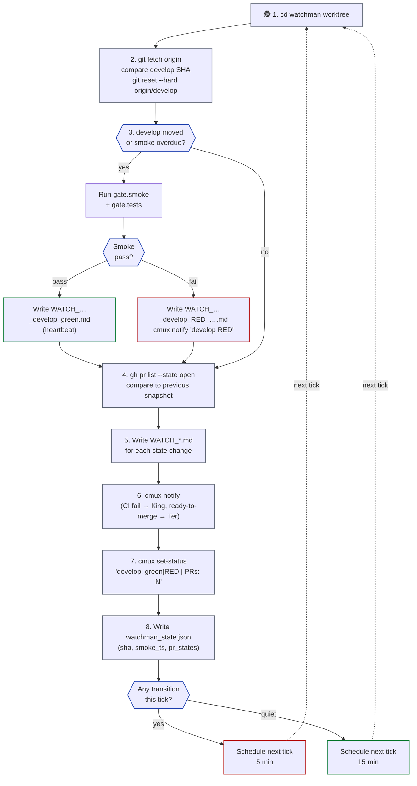
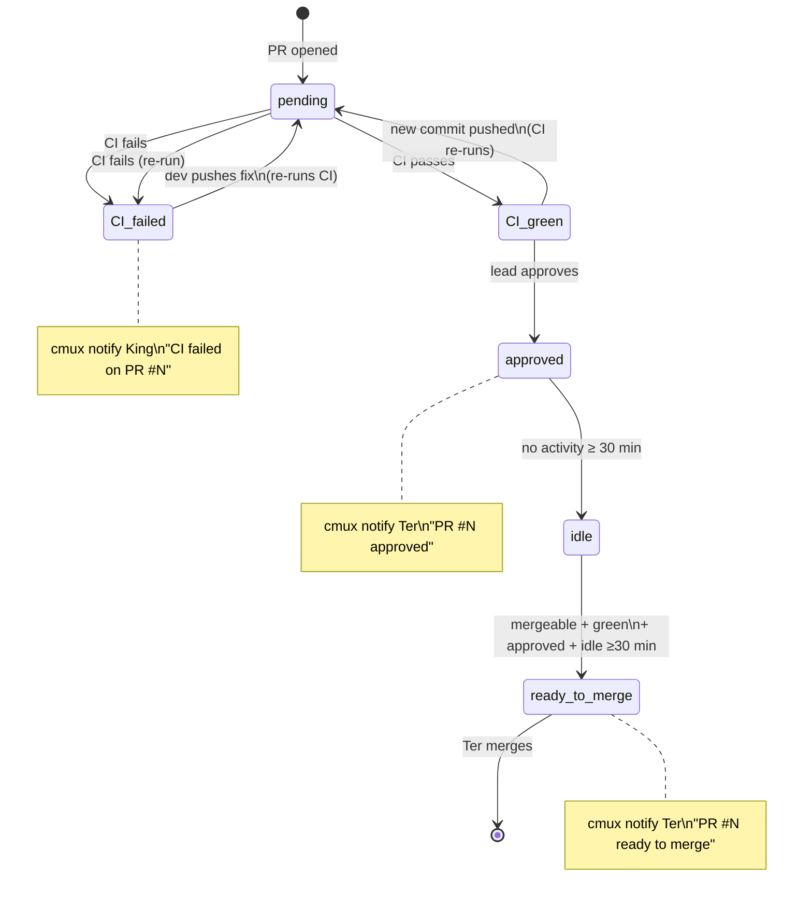

# watchmans.md — Watchman lanes (`/loop` monitor)

> Plural filename anticipates multi-watchman setups (one per project area — e.g., backend smoke + frontend smoke + ops smoke). Typical setup is one watchman per kingdom.

Watchmen are **passive, continuous monitors**. NOT task workers. They run Claude Code with the `/loop` skill in dynamic-pacing mode (5 min when there's churn, 15 min when quiet). They track `origin/develop` tip + babysit open PRs.

**Model: Sonnet (explicit exception).** Workers and co-workers run on Opus because they edit code, reason over large diffs, and write curated artifacts. Watchman is the lighter Sonnet exception — it does not edit code; it only runs smoke commands, reads PR state, and fires notifications. Sonnet is sufficient for this read-only + test-runner + alerter loop, and keeps the long-running `/loop` cost proportionate. Slug convention: `sonnet-watchman-1`, `sonnet-watchman-2`, … (never Opus).

See [`index.md`](index.md) for the entry-point overview, [`kings.md`](kings.md) for the King's gate (which is separate from Watchman monitoring), [`workers.md`](workers.md) for the 4-step closer pattern that Watchman ALSO follows for state-change reports, [`git.md`](git.md) for branch model.

---

## Rule cross-reference

Three rules govern Watchman's relationship with the rest of the kingdom — keep these in mind before adding any new Watchman authority:

- **R39 — King never dispatches to Watchman.** Watchman is self-scheduling (via `/loop`) and autonomous. King does not queue work for it, does not send it prompts mid-session, and does not treat it as a worker lane. The only King→Watchman interaction is the one-time spawn at kingdom startup (see § Dispatch below).
- **R11 — Watchman is read-mostly on project source.** It may read any project file for situational awareness; it may run smoke/test commands; it may NOT edit project source code. Write authority is confined to `WATCH_*.md` reports, `watchman_state.json`, and low-risk kingdom-doc fixes (see § Docs audit duty).
- **R27 — Watchman owns PR-number backfill.** Workers commit TODO/CSV close-suffixes as `(PR #pending)` because the PR number doesn't exist at commit time. Watchman backfills `(PR #pending) → (PR #<N>)` on every `/loop` tick. King never does this work. See § PR-number backfill duty.

---

## Watchman role

- **Continuous monitor**, not a worker. Does NOT claim TODOs, edit code, push, or open PRs.
- Lives in `.worktrees/watchman-N/`, branch `watchman-N` (a local-only branch that's hard-reset to `origin/develop` tip on every `/loop` tick).
- In PRIMARY mode (manaflow/cmux), watchman gets its own **workspace** with an optional **vertical split layout** (`kingdom.json.cmux.watchmanLayout`): top pane runs `claude` (the /loop session), bottom pane runs `gh pr list --watch --interval 30` for live PR state. Default `direction=vertical`, `split=0.6`. Set `watchmanLayout: null` in `kingdom.json` to disable the split and use a single-pane workspace instead.
- Runs Claude Code with the `/loop` skill in **dynamic-pacing mode**: 5 min cadence when there's churn (PRs opening, develop moving, CI transitions); 15 min cadence when quiet.
- Reads `kingdom.json.gate.smoke` + `gate.tests` for the smoke command list to run on each develop advance.
- Writes `WATCH_*.md` reports to `<project>/docs/test-reports/` (separate prefix from King's `KING_*.md` gate reports).
- Posts `cmux notify` when something needs the King's or the user's attention.

---

## `/loop` body (the 8-step tick)

Tick cycle: each iteration of the watchman's `/loop`, with a dashed return arrow showing the loop.



Each `/loop` tick does:

```bash
WS=/Users/ter/Desktop/Bonfire
PROJ=$WS/<project>
LOGS=$WS/.kingdom/$(basename "$PROJ")/logs

# (1) cd to the watchman worktree
cd "$PROJ/.worktrees/watchman-1"

# (2) Fetch + compare develop SHA to previous tick (state stored in <LOGS>/watchman_state.json)
git fetch origin
PREV_DEVELOP_SHA=$(jq -r .develop_sha "$LOGS/watchman_state.json" 2>/dev/null || echo '')
NEW_DEVELOP_SHA=$(git rev-parse origin/develop)
git reset --hard origin/develop                       # always track develop tip

# (3) If develop moved OR no prior smoke recorded today: run smoke
if [ "$NEW_DEVELOP_SHA" != "$PREV_DEVELOP_SHA" ] || [ daily_smoke_overdue ]; then
  KJSON="$WS/.kingdom/$(basename "$PROJ")/kingdom.json"
  # Run gate.smoke + gate.tests command list from kingdom.json
  SMOKE_PASS=true
  jq -r '.gate.smoke[] // empty, .gate.tests[]' "$KJSON" | while read cmd; do
    eval "$cmd" || { SMOKE_PASS=false; break; }
  done

  if [ "$SMOKE_PASS" = "true" ]; then
    # Write heartbeat / pass report
    UTC=$(date -u +%Y-%m-%dT%H%MZ)
    echo "# develop smoke pass at $UTC" > "$PROJ/docs/test-reports/WATCH_${UTC}__develop_green.md"
  else
    # Develop is RED — write report + alert King/Ter
    UTC=$(date -u +%Y-%m-%dT%H%MZ)
    cat > "$PROJ/docs/test-reports/WATCH_${UTC}__develop_RED__<short-reason>.md" <<EOF
    ## TL;DR
    - **Status:** fail
    - develop tip ${NEW_DEVELOP_SHA:0:8} broke smoke
    - Failing: <which command(s)>
    - **Next action:** King investigates; lanes paused until develop is green again.
    EOF
    cmux notify --workspace "$KING_WS" \
      --title "🕵️ watchman-$WI" \
      --subtitle "develop RED" \
      --body "Smoke broke on origin/develop ${NEW_DEVELOP_SHA:0:8}. Lanes paused pending King review."
  fi
fi

# (4) Babysit open PRs
gh pr list --state open --json number,headRefName,statusCheckRollup,reviews,mergeable > /tmp/prs.json
# Compare to previous PR state snapshot in <LOGS>/watchman_state.json
# Detect transitions: CI passed/failed, lead approved/requested-changes, mergeable+green+idle

# (5) Write WATCH_*.md for any state change
# e.g., WATCH_<UTC>__pr-<N>_CI_failed.md, WATCH_<UTC>__pr-<N>_ready_to_merge.md, …

# (6) cmux notify on alert-worthy transitions (target $KING_WS so the
#     sidebar gets a badge + bell-icon panel logs the alert).
# All watchman alerts use this schema:
#   --title    "🕵️ watchman-N"
#   --subtitle "<event class>"  e.g. "CI failed · PR #234"
#   --body     "<one-line context>"
#
# Cases:
#   - CI just failed     → cmux notify --workspace "$KING_WS" \
#                            --title "🕵️ watchman-$WI" \
#                            --subtitle "CI failed · PR #$N" \
#                            --body "$(gh pr view $N --json statusCheckRollup -q '.statusCheckRollup[0].name')"
#   - PR mergeable +
#     green + approved +
#     idle ≥30 min       → cmux notify --workspace "$KING_WS" \
#                            --title "🕵️ watchman-$WI" \
#                            --subtitle "Ready to merge · PR #$N" \
#                            --body "All checks pass, lead approved, idle 30m+. Ter to merge."

# (7) Update sidebar status
cmux set-status --pane <self> "develop: <green|RED> | open PRs: <n> (<g> green, <r> red)"

# (8) Write new snapshot + schedule next tick
jq -n --arg sha "$NEW_DEVELOP_SHA" --argjson prs "$(cat /tmp/prs.json)" \
  '{develop_sha: $sha, last_smoke_ts: now|todate, pr_states: $prs}' \
  > "$LOGS/watchman_state.json"

# Dynamic pacing: 5 min if any transition this tick, 15 min if quiet
```

---

## Autonomous Haiku fan-out (v0.29.0+, per rules.md R39 + R40)

Starting in v0.29.0, Watchman becomes fully autonomous within its tick: it no longer only runs smoke commands and PR checks — it also fans out up to `haiku_cap_per_tick` Haiku sub-agents in parallel to perform four new surveillance duties. These sub-agents are spawned either via `Agent(model="haiku", ...)` (when running inside a Claude Code session) or via `cmux tab-action --action new-terminal-right --workspace $WATCHMAN_WS` (when running in PRIMARY/cmux mode, per R38). All four duties run in parallel at every tick; no duty waits for another.

**R41 — Skill-aware (v0.29.3+):** Watchman Haiku sub-agents may optionally invoke domain skills to strengthen their analysis. Duty 1 (code review) may use `code-review:code-review`; Duty 2 (CVE scan) may use `security-review`. Invocation is optional — skip if the skill adds no material benefit for a shallow diff or trivial audit file. No cap beyond the normal 3-skill-per-brief limit.

### `haiku_cap_per_tick` enforcement

Read from `kingdom.json.watchman.haikuCapPerTick`. Default: `5`. Maximum: `10`.

```bash
HAIKU_CAP=$(jq -r '.watchman.haikuCapPerTick // 5' "$KJSON")
# Clamp to [1, 10]
if [ "$HAIKU_CAP" -gt 10 ]; then
  HAIKU_CAP=10
  echo "[$(date -u +%Y-%m-%dT%H%MZ)] WARN haiku_cap_per_tick clamped to 10 (configured value exceeded max)" \
    >> "$LOGS/master_agent.log"
fi
if [ "$HAIKU_CAP" -lt 1 ]; then
  HAIKU_CAP=1
fi
```

Count all Haiku sub-agents spawned this tick across all four duties. If the combined count would exceed `HAIKU_CAP`, reduce the code-review fan-out first (it generates the most agents), then skip lower-priority duties in this order: git hygiene, conflict scan, CVE scan (CVE scan is rarely urgent mid-day; skip last). Log a one-line warning to `master_agent.log` whenever clamping occurs.

---

### Duty 1 — Code review fan-out

For each lane that has new commits since the last tick, spawn one Haiku sub-agent that reads the diff and writes a one-page review artifact.

**Trigger:** `git log --oneline <last-tick-sha>..<lane>-HEAD` returns at least one commit.

**Per-lane Haiku prompt (condensed):**

```bash
LAST_SHA=$(jq -r ".lane_shas[\"$LANE\"] // empty" "$LOGS/watchman_state.json")
NEW_SHA=$(git -C "$WORKTREES/$LANE" rev-parse HEAD 2>/dev/null)
[ "$LAST_SHA" = "$NEW_SHA" ] && continue   # no new commits — skip

UTC=$(date -u +%Y-%m-%dT%H%MZ)
REVIEW_FILE="$LOGS/WATCH_REVIEW_${UTC}__${LANE}.md"

Agent(
  model="haiku",
  prompt="You are a code reviewer. Read the diff below and write a concise one-page review.
Diff: git -C $WORKTREES/$LANE diff $LAST_SHA..$NEW_SHA
Output file: $REVIEW_FILE

Review must cover (TL;DR header, then sections):
- Missing or thin test coverage (flag any function >20 LOC with zero test calls)
- Large untested chunks (>50 LOC change with no matching test file change)
- Security smells (raw SQL, unescaped user input, hardcoded secrets, unsafe evals)
- Style outliers (naming, file length, unusual patterns vs the rest of the lane's history)

Severity: 'urgent' | 'warn' | 'info'. Mark the TL;DR with the highest severity found.
Write ONLY the review file — no other edits."
)
```

Update `watchman_state.json` after fan-out: `lane_shas["$LANE"] = $NEW_SHA`.

---

### Duty 2 — CVE scan

Detect the project's package manager(s) by inspecting the project root. Spawn ONE Haiku per detected manager.

**Detection → audit command map:**

| Indicator file | Audit command |
|---|---|
| `package.json` + `pnpm-lock.yaml` | `pnpm audit --json` |
| `package.json` (no pnpm lock) | `npm audit --json` |
| `requirements.txt` or `pyproject.toml` | `pip-audit --format json` |
| `Cargo.toml` | `cargo audit --json` |
| `go.mod` | `go list -json -m -u all` |

Multiple managers may coexist (e.g., a monorepo with both `pnpm-lock.yaml` and `requirements.txt`). Each gets its own Haiku, but each counts against `haiku_cap_per_tick`.

**Output file:** `$LOGS/WATCH_CVE_<UTC>.md`

**Haiku prompt (per manager):**

```bash
UTC=$(date -u +%Y-%m-%dT%H%MZ)
CVE_FILE="$LOGS/WATCH_CVE_${UTC}.md"

Agent(
  model="haiku",
  prompt="Run: $AUDIT_CMD in $PROJ
Parse the JSON output. Write $CVE_FILE with:
## TL;DR
- Severity: 'urgent' (any critical/high) | 'warn' (moderate) | 'info' (low/none)
- Critical: N, High: N, Moderate: N, Low: N
## Findings
One row per advisory: package name | installed version | patched version | CVE ID | severity.
## Remediation
For each critical/high: recommended update command.
Write ONLY the CVE file — no other edits."
)
```

If no indicator files are found, skip this duty and note in the tick summary.

---

### Duty 3 — Cross-lane conflict scan

Build a file-touch matrix across all active lanes since the last tick. Flag cases where two or more lanes have modified the same file.

```bash
UTC=$(date -u +%Y-%m-%dT%H%MZ)
CONFLICT_FILE="$LOGS/WATCH_CONFLICTS_${UTC}.md"

# Build per-lane changed-file lists (using last-tick SHA from watchman_state.json)
declare -A LANE_FILES
for LANE in worker-1 worker-2 worker-3 co-worker-1; do
  LAST_SHA=$(jq -r ".lane_shas[\"$LANE\"] // empty" "$LOGS/watchman_state.json")
  [ -z "$LAST_SHA" ] && continue
  CHANGED=$(git -C "$WORKTREES/$LANE" diff --name-only "$LAST_SHA"..HEAD 2>/dev/null)
  LANE_FILES["$LANE"]="$CHANGED"
done

Agent(
  model="haiku",
  prompt="You are given per-lane file-touch lists below. Compute overlaps: any file touched
by 2+ lanes since last tick is a potential conflict.

Lane file lists:
$(for L in "${!LANE_FILES[@]}"; do echo "=== $L ==="; echo "${LANE_FILES[$L]}"; done)

Output file: $CONFLICT_FILE
Format:
## TL;DR
- Severity: 'urgent' (same file modified in 2+ lanes) | 'info' (no overlaps)
- N overlapping file(s) found

## Conflict pairs
| File | Lane A | Lane B | Risk |
|---|---|---|---|
<one row per overlap — Risk = 'merge conflict likely' if both modified; 'watch' if one added, one modified>

Write ONLY the conflicts file — no other edits."
)
```

If no overlaps exist, Haiku writes a minimal `## TL;DR — info: no overlaps this tick` file. Watchman still logs it in the tick summary.

---

### Duty 4 — Git hygiene scan

Spawn one Haiku to scan for git-state drift across the kingdom worktree layout.

**What to scan:**

| Item | How to detect | Flag if |
|---|---|---|
| Stale worktrees | `ls $PROJ/.worktrees/` vs `git worktree list` | Directory exists but `git worktree list` has no matching entry |
| Orphan branches | `git branch` (local) vs `kingdom.json.shape` lane names | Local branch not in kingdom shape + not `develop`/`main`/`watchman-*` |
| Unflushed `.lane` claims | `ls $LOGS/claims/*.lane` | Claim file exists but matching sentinel in `$LOGS/done/` also exists |
| Broken sentinels | `ls $LOGS/done/*.flag` | Sentinel flag exists but no matching task file in `$LOGS/tasks/` |
| Commit-without-sentinel pairs | `git log --oneline` on each lane vs `$LOGS/done/` | Lane has ≥1 commit since last tick but no new sentinel in `done/` within 5 min of commit time |

```bash
UTC=$(date -u +%Y-%m-%dT%H%MZ)
GIT_FILE="$LOGS/WATCH_GIT_${UTC}.md"

Agent(
  model="haiku",
  prompt="Perform a git hygiene scan for project $PROJ.

Worktrees dir: $PROJ/.worktrees/
Kingdom logs: $LOGS/
Kingdom JSON: $KJSON

Check all five hygiene items (stale worktrees, orphan branches, unflushed .lane claims,
broken sentinels, commit-without-sentinel pairs). For each issue found, record:
- Item type
- Affected path / branch / file
- Recommended remediation (one line)

Output file: $GIT_FILE
## TL;DR
- Severity: 'urgent' (broken sentinel or commit-without-sentinel >30 min old) | 'warn' (stale worktree or orphan branch) | 'info' (no issues)
- N issue(s) found

## Findings
<bulleted list, one item per finding>

Write ONLY the git hygiene file — no other edits."
)
```

---

### Tick aggregation — `WATCH_TICK_<UTC>.md`

At the END of each `/loop` tick (after all four fan-out duties complete and their Haiku sub-agents have written their output files), Watchman writes a single tick summary:

**File:** `$LOGS/WATCH_TICK_<UTC>.md`

```markdown
# Watchman tick summary — <UTC>

## TL;DR
- Develop SHA: <sha> (moved | unchanged)
- Smoke: pass | fail | skipped
- Haiku sub-agents spawned: N / <haiku_cap_per_tick>
- Highest severity this tick: urgent | warn | info

## Duty results
| Duty | Ran? | Findings | Severity | Output file |
|---|---|---|---|---|
| Code review fan-out | yes / no (cap) | N reviews written | urgent/warn/info | WATCH_REVIEW_... |
| CVE scan | yes / no (no lockfile) | N advisories | urgent/warn/info | WATCH_CVE_... |
| Cross-lane conflict scan | yes / no (cap) | N overlaps | urgent/warn/info | WATCH_CONFLICTS_... |
| Git hygiene scan | yes / no (cap) | N issues | urgent/warn/info | WATCH_GIT_... |

## Lane activity
| Lane | New commits | Files changed | Conflicts |
|---|---|---|---|
| worker-1 | N | N | — |
...

## Cap warnings
<list any duties skipped or trimmed due to haiku_cap_per_tick, or "none">
```

**Urgent escalation:** If any duty's output file contains `severity: urgent` (case-insensitive in its TL;DR), Watchman renders a `watchman-tick` card (from the `cards/` directory) and fires `cmux notify` to both `$KING_WS` and `$WATCHMAN_WS`. Non-urgent ticks are logged only; no notification.

---

## Dispatch (King spawns this once at kingdom startup)

Inside the kingdom spawn checklist (see [`kings.md`](kings.md) → Spawning the kingdom), after `watchman-1`'s worktree + Claude session are up, the King sends the watchman prompt via `cmux send` (or `tmux send-keys -l` in fallback mode):

```bash
HANDLE=$(cmux list-panes --workspace "$WS_ID" --json | jq -r '.[] | select(.title=="watchman-1") | .id')

LANE_WATCHMAN_PROMPT="You are the Watchman for project <project>. Run /loop with this body
every 5-15 min (dynamic pacing) until I tell you to stop. Each tick:

1. cd $PROJ/.worktrees/watchman-1
2. git fetch origin
   PREV_DEVELOP_SHA=\$(jq -r .develop_sha $LOGS/watchman_state.json 2>/dev/null || echo '')
   NEW_DEVELOP_SHA=\$(git rev-parse origin/develop)
   git reset --hard origin/develop
3. If NEW_DEVELOP_SHA != PREV_DEVELOP_SHA OR no prior smoke today:
     Run <kingdom.json.gate.smoke + gate.tests command list>.
     On fail: write WATCH_<UTC>__develop_RED__<reason>.md + cmux notify 'develop RED: <reason>'
     On pass: write WATCH_<UTC>__develop_green.md (TL;DR only)
4. gh pr list --state open --json number,headRefName,statusCheckRollup,reviews,mergeable > /tmp/prs.json
   Compare to previous snapshot in $LOGS/watchman_state.json:
     CI just failed     → WATCH_<UTC>__pr-<N>_CI_failed.md + cmux notify King
     CI just passed     → WATCH_<UTC>__pr-<N>_CI_green.md (log only)
     lead approved      → cmux notify Ter 'PR #<N> approved'
     mergeable + green + approved + idle 30min → cmux notify Ter 'PR #<N> ready to merge'
5. cmux set-status --pane <self> \"develop: <green|RED> | open PRs: <n> (<g> green, <r> red)\"
6. Write new snapshot to $LOGS/watchman_state.json (develop_sha, last_smoke_ts, pr_states)
7. Schedule next tick via /loop dynamic pacing (5 min if any transition, 15 min if quiet)

You DO NOT edit code, claim TODO tasks, or push anything. Read-only + test runner + alerter."

cmux send --pane "$HANDLE" "$LANE_WATCHMAN_PROMPT"
```

---

## WATCH_*.md report naming convention

Watchman writes to `<project>/docs/test-reports/` alongside human-written `SMOKE_*.md` / `DEBUG_*.md` / `POSTMORTEM_*.md` and King's `KING_*.md` gate reports. Watchman uses the `WATCH_*` prefix:

```text
<project>/docs/test-reports/
├── KING_<UTC>__<lane-name>__<sub-task-id>.md     ← King's per-lane pre-commit gate (one per push-decision)
├── WATCH_<UTC>__develop_green.md                  ← heartbeat / develop pass
├── WATCH_<UTC>__develop_RED__<short-reason>.md    ← develop break detected
├── WATCH_<UTC>__pr-<N>_CI_failed.md               ← PR CI just turned red
├── WATCH_<UTC>__pr-<N>_CI_green.md                ← PR CI just turned green (log only, no notify)
├── WATCH_<UTC>__pr-<N>_lead_approved.md           ← lead just approved a PR
├── WATCH_<UTC>__pr-<N>_ready_to_merge.md          ← PR green + approved + idle ≥30 min
└── (existing) SMOKE_*.md / DEBUG_*.md / POSTMORTEM_*.md  ← human-written
```

`<UTC>` = `YYYY-MM-DDTHHMMZ` (no colons, trailing `Z`).

The Watchman's reports follow the same TL;DR-first header schema as the rest of the kingdom — first 15 lines must give the master enough to decide whether to read further.

---

## PR transition state machine

State machine: the transitions Watchman watches for on each open PR, and the alert it fires at each transition.



## Watchman state snapshot

Watchman maintains its own state file (NOT mixed with master_agent.log):

```text
<LOGS>/watchman_state.json
```

Schema:

```json
{
  "develop_sha": "abc1234...",
  "last_smoke_ts": "2026-05-17T10:30:00Z",
  "pr_states": {
    "247": { "ci": "green", "reviews": "approved", "mergeable": true, "first_ready_at": "2026-05-17T09:55:00Z" },
    "248": { "ci": "red", "reviews": "pending", "mergeable": true },
    "249": { "ci": "pending", "reviews": "pending", "mergeable": true }
  }
}
```

Watchman writes; King reads (for alert context); no human edit. Cleared/reset when watchman is torn down.

---

## Why Watchman doesn't replace King's per-lane pre-commit gate

- **Gate is lane-specific + blocking:** runs against `<role>-<n>` (which has the lane's commits not yet in develop), runs once, blocks the push decision. Watchman only knows about develop tip + open PRs — no view of in-flight lane work.
- **Gate is fresh at push time:** runs after the user's "push" approval (via `git merge-tree` for the FINAL conflict check). Watchman runs at `/loop` ticks; by push time, the last Watchman result could be 15 minutes stale.
- **Watchman is develop-wide + non-blocking:** catches drift, CI failures on open PRs, lead-review transitions — none of which the King's per-lane gate sees.

The two complement: **King keeps push-time freshness; Watchman keeps develop-wide visibility.**

---

## Watchman lifecycle

| Action | Trigger | How |
|---|---|---|
| **Spawn** | Kingdom startup (part of the spawn checklist) | `git worktree add -b "watchman-1" "$PROJ/.worktrees/watchman-1" "origin/develop"` + `cmux send --pane <self> "$LANE_WATCHMAN_PROMPT"` (primary) or `tmux send-keys -l` (fallback) |
| **Pause** | The user says "pause watchman" | King sends `/loop cancel` to the watchman pane: `cmux send --pane <self> "/loop cancel"` |
| **Resume** | The user says "resume watchman" | King re-sends the `LANE_WATCHMAN_PROMPT` |
| **Teardown** | Kingdom close | `cmux send --pane <self> "/loop cancel"` → `git worktree remove "$PROJ/.worktrees/watchman-1" --force; git branch -D "watchman-1" 2>/dev/null \|\| true` |

The watchman's worktree + branch + state file persist across pauses; only the `/loop` schedule is suspended.

---

## Multiple watchmen (one per project area)

`kingdom.json.shape.watchman` can be >1. Use case: per-area smoke — one watchman runs backend smoke + watches backend PRs, another runs frontend smoke + watches frontend PRs:

```json
{
  "shape": { "workers": 3, "co-workers": 1, "watchman": 2 },
  "watchmen": [
    { "name": "watchman-1", "cadence": "dynamic", "watches": ["origin/develop", "PRs with label:component:backend"] },
    { "name": "watchman-2", "cadence": "dynamic", "watches": ["origin/develop", "PRs with label:component:frontend"] }
  ]
}
```

Each watchman gets its own worktree (`watchman-1`, `watchman-2`) tracking the same `origin/develop` tip, but with different PR filter scopes. They write to the same `<project>/docs/test-reports/` dir but with distinct `WATCH_<UTC>__watchman-<N>__...md` filenames to avoid collision.

---

## Task file access (read-only)

Watchman does NOT create task files. The watchman role has no per-task work — it's a continuous monitor (`/loop`), not an executor.

Watchman MAY read task files at `<workspace>/.kingdom/<project>/tasks/*.md` for situational awareness:

- When alerting the King about a develop break, watchman can check whether any in-flight lane's task file is affected (e.g., lane currently editing the broken module).
- When detecting a PR ready-to-merge, watchman can include in its notification: "PR #N (from `worker-1`, task `BE-P0-CICD.1`) is mergeable + green + idle for 30m." — pulled from the task file's brief.

Watchman writes ONLY: `WATCH_*.md` reports, `watchman_state.json`, `cmux notify` events, sidebar status pills. It never writes to task files, raw artifacts, master_agent.log, or anything outside its own WATCH_ namespace.

---

## PR-number backfill duty (every tick · v0.19.0+ · per [rules.md R27](rules.md#r27))

The worker commits TODO/CSV close-suffix as `(PR #pending)` because the PR number doesn't exist at commit time. **Watchman backfills `(PR #pending) → (PR #<N>)` on every `/loop` tick** — King never does this work.

**Scan logic (parallel by default, per [rules.md R28](rules.md#r28)):**

```bash
# Build feature/<topic> → PR #N map from King's master_agent.log
declare -A PR_MAP
while IFS= read -r line; do
  feat=$(echo "$line" | grep -oE 'feature/[a-z0-9-]+' | head -1)
  prn=$(echo  "$line" | grep -oE 'PR #[0-9]+'        | grep -oE '[0-9]+' | head -1)
  [ -n "$feat" ] && [ -n "$prn" ] && PR_MAP["$feat"]="$prn"
done < "$LOGS/master_agent.log"

# Scan EACH lane worktree for `(PR #pending)` — IN PARALLEL via Agent fan-out
for lane in worker-1 worker-2 worker-3 co-worker-1; do
  Agent_dispatch_sonnet \
    "name=watchman-pr-backfill-$lane" \
    "cd $WORKTREES/$lane && \
     pr=${PR_MAP[feature/<topic-for-$lane>]} && \
     [ -z \"\$pr\" ] && exit 0 && \
     gh pr view \$pr --json state -q .state | grep -qv MERGED || exit 0 && \
     rg -l '(PR #pending)' | xargs sed -i '' \"s/(PR #pending)/(PR #\$pr)/g\" && \
     git add -u && git commit --amend --no-edit && git push --force-with-lease" &
done
wait
```

**Constraints:**

- **Skip merged PRs** — `gh pr view <N> --json state -q .state | grep -q MERGED` → no force-push to closed branches (memory rule `check_pr_state_before_force_push`). Watchman opens a separate `feature/post-<N>-cleanup` branch + new PR for the orphan flips.
- **Each lane writes only to its own worktree** — no cross-lane file contention.
- **`--force-with-lease` not `--force`** — bails if remote moved since fetch.

**Side duty — stale `.lane` claim sweep:** for every `<LOGS>/done/<UTC>__<sub>-<lane>__<id>.flag` sentinel, check `<LOGS>/claims/<lane>__<task-id>.lane` — if both exist, rm the claim. Lane is then free for next dispatch.

**Side duty — kingdom-task-file checkbox audit:** on each tick, walk `.kingdom/<project>/tasks/*.md` and flag any file whose `Status` is `verifying` but whose matching sentinel exists in `<LOGS>/done/` → write to `WATCH_TASK_AUDIT.md` for King (NOT auto-flip; status is worker's responsibility per R23/R24).

This duty IS Tier 2 maintenance — failure to backfill is cosmetic, not load-bearing. King carries on without it; the TODO files just stay ugly until next tick.

---

## Orphan-tab sweep (every tick)

Sub-agent tabs in master workspaces are SUPPOSED to auto-close via the 5-step closer Step 5 (`cmux tab-action --action close --surface "$CMUX_SURFACE_ID"`). When that fails (cmux unreachable, killed process, etc.), tabs persist after their sentinel was written — clutter that the master can't clean up on its own.

Watchman sweeps for these every `/loop` tick. Logic:

```bash
# For each lane master workspace, enumerate its tabs/surfaces
for WS_VAR in $(env | grep -E '^(WORKER|COWORKER)_WS_[0-9]+' | cut -d= -f1); do
  WS_REF=$(eval echo "\$$WS_VAR")

  # List all surfaces in this workspace
  SURFACES=$(cmux list-pane-surfaces --workspace "$WS_REF" --json 2>/dev/null)

  # For each surface that LOOKS like a sub-agent tab (name starts with "🐱 sub")
  echo "$SURFACES" | jq -r '.surfaces[] | select(.title | startswith("🐱 sub")) | .ref' | while read SURF; do

    # Was its sentinel written more than 5 minutes ago?
    # We don't know the ID directly from the surface name — but we can
    # check the surface's idle time + last-written log line.
    OUTPUT=$(cmux capture-pane --workspace "$WS_REF" --surface "$SURF" --lines 5 2>/dev/null)

    # If the recent output mentions "closer complete" or "sentinel written"
    # AND the surface has been idle (no new content) for ≥5 min, it's orphan.
    if echo "$OUTPUT" | grep -q 'sentinel\|closer\|done flag'; then
      AGE=$(jq -r ".surface_idle_ts[\"$SURF\"] // 0" "$LOGS/watchman_state.json")
      NOW=$(date -u +%s)
      if [ $((NOW - AGE)) -gt 300 ]; then
        cmux tab-action --action close --surface "$SURF" 2>/dev/null
        echo "[$(date -u +%Y-%m-%dT%H%MZ)] 🕵️ watchman swept orphan tab $SURF in $WS_VAR" \
          >> "$LOGS/master_agent.log"
      fi
    fi
  done
done
```

This is BELT-AND-SUSPENDERS — the sub-agent's own Step 5 closes >99% of tabs. Watchman handles the rest. Sweeps are logged to `master_agent.log` so the King can see orphans being cleaned up.

---

## On-demand test verification (King-dispatched, read-only)

Beyond the passive `/loop` smoke + PR babysitting, watchman accepts **on-demand test verification requests** from the King. This is the v0.16.0 industrial-overlay role expansion — King can route "verify X by running these tests" work to watchman without spinning up a worker for read-only verification tasks.

### Request artifact

King drops a request file at `<LOGS>/watchman-requests/<UTC>__verify-<slug>.md`:

```markdown
# Watchman test request — verify-<slug>

## Brief
<2-4 lines — what to verify, e.g. "Run integration tests against branch X
to confirm BE-AUTH-3 doesn't regress the login flow.">

## Commands
- pnpm --filter @bfg-swt/backend-bac test:integration
- pnpm --filter @bfg-swt/webshop test:e2e -- --grep login

## Scope
- Read-only — DO NOT edit test code, fixtures, or project files
- DO NOT push, commit, or open PRs
- Write report to <project>/docs/test-reports/WATCH_<UTC>__verify-<slug>.md
```

### Watchman's pickup logic (every `/loop` tick)

```bash
# At the end of each /loop tick (after the standard 8 steps), watchman scans
# for new request files:

REQUESTS_DIR="$LOGS/watchman-requests"
mkdir -p "$REQUESTS_DIR"

for REQ in "$REQUESTS_DIR"/*.md; do
  [ -f "$REQ" ] || continue
  REQ_SLUG=$(basename "$REQ" .md | sed 's/^[0-9-]*T[0-9]*Z__verify-//')
  REPORT="$PROJ/docs/test-reports/WATCH_$(date -u +%Y-%m-%dT%H%MZ)__verify-${REQ_SLUG}.md"

  # Already processed? (a matching report exists)
  if ls "$PROJ/docs/test-reports/WATCH_"*"__verify-${REQ_SLUG}.md" >/dev/null 2>&1; then
    continue
  fi

  # Execute the commands listed in the request (extract from the "## Commands" section)
  COMMANDS=$(awk '/^## Commands/,/^##/' "$REQ" | grep -E '^- ' | sed 's/^- //')

  STATUS="pass"
  OUTPUT_BUFFER=""
  while IFS= read -r CMD; do
    OUTPUT=$(eval "$CMD" 2>&1) || STATUS="fail"
    OUTPUT_BUFFER="${OUTPUT_BUFFER}
$ $CMD
$OUTPUT
"
  done <<< "$COMMANDS"

  # Write the report (lane name slot = "watchman-N" per v0.15.2 strict naming)
  cat > "$REPORT" <<EOF
# Verification report — $REQ_SLUG

## TL;DR
- **Status:** $STATUS
- **Requested by:** King ($(basename "$REQ"))
- **Commands run:** $(echo "$COMMANDS" | wc -l)

## Command outputs
\`\`\`
$OUTPUT_BUFFER
\`\`\`
EOF

  # Notify King via cmux notify (badge on King's workspace)
  cmux notify --workspace "$KING_WS" \
    --title "🕵️ watchman-$WI" \
    --subtitle "Verification $STATUS · $REQ_SLUG" \
    --body "Report: $REPORT"
done
```

### What watchman WILL and WON'T do

| Will | Won't |
|---|---|
| ✅ Run test commands listed in the request | ❌ Edit test code, fixtures, or project files |
| ✅ Read project source to understand what it's testing | ❌ Push, commit, or open PRs |
| ✅ Write a `WATCH_*__verify-*.md` report | ❌ Modify the test request file itself |
| ✅ Notify King when done | ❌ Take action on test failures (just reports — King decides next step) |

### When King uses watchman vs a worker for test work

| Test work type | Route to | Why |
|---|---|---|
| **Run existing tests, no edits** (verify a hypothesis, sanity-check a branch, confirm regression isn't introduced) | 🕵️ Watchman via request file | Read-only; cheaper Sonnet model; preserves worker capacity for code work |
| **Write new tests, fix flaky tests, edit fixtures, modify CI config** | 👷 Worker | Code-touching; needs full lane authority + commit/push capability |

Heuristic: if the answer is "run these commands and tell me what happened," → watchman. If the answer is "make these tests pass," → worker.

---

## Blocked-lane scan (every tick)

Lanes can silently stall on Claude Code's interactive permission prompts ("Do you want to proceed? 1. Yes / 2. Yes allow … / 3. No") or other TUI input requests. cmux.app shows the workspace as "Running" but the lane is actually idle, waiting for keyboard input. Without intervention you only notice by clicking each lane.

Watchman scans for this every `/loop` tick:

```bash
# For each lane workspace ref in $LOGS/workspace-refs.env:
source "$LOGS/workspace-refs.env"

for WS_VAR in $(env | grep -E '^(WORKER|COWORKER|WATCHMAN)_WS_[0-9]+' | cut -d= -f1); do
  WS_REF=$(eval echo "\$$WS_VAR")
  LANE_LABEL=$(echo "$WS_VAR" | sed 's/_WS_/ /' | tr 'A-Z' 'a-z')   # e.g. "worker 1"

  # Grab the recent surface output
  OUTPUT=$(cmux capture-pane --workspace "$WS_REF" --lines 30 2>/dev/null)

  # Patterns that indicate a blocked lane
  if echo "$OUTPUT" | grep -qE '(Do you want to proceed\?|Esc to cancel|\[y/N\]|allow .* during this session|Press Enter)'; then
    # Already notified this tick? Skip to avoid spam — state stored in watchman_state.json
    PREV_BLOCKED=$(jq -r ".blocked_lanes[\"$WS_VAR\"] // empty" "$LOGS/watchman_state.json" 2>/dev/null)
    if [ "$PREV_BLOCKED" != "true" ]; then
      # 3-layer state override: badge + description + notify (cmux's auto-state
      # may still say "Running" but our three signals tell the truth)
      cmux workspace-action --action mark-unread --workspace "$WS_REF" 2>/dev/null
      cmux workspace-action --action set-description \
        --workspace "$WS_REF" \
        --description "⚠ Blocked · permission prompt" 2>/dev/null
      cmux notify --surface "$WS_REF" \
        --title "🕵️ watchman-$WI" \
        --subtitle "Lane blocked · $LANE_LABEL" \
        --body "Permission prompt or input requested. Click workspace to approve."
      cmux notify --workspace "$KING_WS" \
        --title "🕵️ watchman-$WI" \
        --subtitle "Lane blocked · $LANE_LABEL" \
        --body "$LANE_LABEL is waiting on a permission prompt. Click its workspace to resolve."
      # Mark as notified
      jq ".blocked_lanes[\"$WS_VAR\"] = true" "$LOGS/watchman_state.json" \
        > /tmp/ws-state && mv /tmp/ws-state "$LOGS/watchman_state.json"
    fi
  else
    # Lane no longer blocked — clear unread marker + restore description + clear state
    PREV_BLOCKED=$(jq -r ".blocked_lanes[\"$WS_VAR\"] // empty" "$LOGS/watchman_state.json" 2>/dev/null)
    if [ "$PREV_BLOCKED" = "true" ]; then
      cmux workspace-action --action mark-read --workspace "$WS_REF" 2>/dev/null
      # Description restored by the lane itself on its next state transition;
      # watchman doesn't second-guess what the lane should display normally.
    fi
    jq "del(.blocked_lanes[\"$WS_VAR\"])" "$LOGS/watchman_state.json" \
      > /tmp/ws-state && mv /tmp/ws-state "$LOGS/watchman_state.json"
  fi
done
```

The scan is **idempotent + debounced** — `watchman_state.json` tracks which lanes are currently blocked so watchman doesn't re-notify every tick. Once a lane unblocks (output no longer matches the patterns), the state clears and the lane is eligible for re-notification next time it blocks.

Patterns watched:

| Pattern | Triggers |
|---|---|
| `Do you want to proceed\?` | Claude Code's standard permission prompt |
| `Esc to cancel` | Same prompt's footer |
| `\[y/N\]` | Common interactive y/n confirmations |
| `allow .* during this session` | The session-scoped permission option |
| `Press Enter` | Generic "press enter to continue" prompts |

Most of these are pre-empted by the workspace `.claude/settings.json` permissions allow-list (see `commands/init.md` Step 4.5 — kingdom auto-allows `.kingdom/**` and `.worktrees/**`). The scan catches any that slip through.

---

## Docs audit duty (idle-time work)

When `/loop` has nothing else to do (no PRs to babysit, no `develop` movement, no smoke break), watchman runs a docs audit pass over `<workspace>/.kingdom/<project>/{tasks,logs}/`. This is the ONLY scenario where watchman has WRITE authority — and only on audit artifacts, never project source code.

### Split by risk

| Action | Risk | Watchman does | King reviews |
|---|---|---|---|
| Tick a stale checkbox when a matching commit is found in `git log` | Low | ✅ writes (`tasks/*.md`) | informed via WATCH_*.md |
| Backfill a missing summary line in `master_agent.log` | Low | ✅ writes | informed |
| Fix dead `[[name]]` link / formatting drift | Low | ✅ writes | informed |
| Re-understand & rewrite a digest from raw | **High** | ❌ flag only | ✅ dispatches Opus sub-agent |
| Merge two task files into one | **High** | ❌ flag only | ✅ decides + dispatches |
| Rewrite role doc to match landed code | **High** | ❌ flag only | ✅ decides |
| Archive task files older than 30 days | **High** | ❌ flag only | ✅ moves to `tasks/archive/` |

Low-risk: watchman just does it; one-line note in its next `WATCH_*.md` report.
High-risk: watchman writes findings to `WATCH_DOCS_AUDIT.md` (single rolling file per project) — King's next attention pulls from it.

### Project state scan (idle, bounded)

In addition to scanning `tasks/` + `logs/`, watchman also performs a **bounded** project-state scan during idle ticks. Same pattern as `/kingdom:work` audit phase Step 3.0, but smaller: at most 5 project doc files per tick (newest by mtime), `.md` + `.txt` + `.csv`. For each, watchman extracts completion markers and cross-refs against `master_agent.log`. Findings are **flag-only** → appended to `WATCH_DOCS_AUDIT.md` under `## Gap A` / `## Gap B`. Watchman NEVER edits project source code based on a gap — only flags. King runs `/kingdom:work` audit phase for a full sweep when the gap list grows.

This keeps the doc-audit honest without making watchman expensive — full project scans happen on demand via `/kingdom:work` audit phase, not on every `/loop` tick.

### `WATCH_DOCS_AUDIT.md` schema

```text
# Docs audit findings — <project>

Last scan: <UTC>

## Digest re-understanding candidates
- `logs/<ID>.md` — raw mentions X which is now load-bearing (X was added <YYYY-MM-DD> to <file>)

## Merge candidates
- `tasks/<UTC-a>__worker-1__feat-x.md` + `tasks/<UTC-b>__worker-2__feat-x-followup.md` — overlap on the same module

## Archive candidates
- `tasks/<UTC>__co-worker-1__redesign.md` — all boxes checked, last edit 2026-04-10 (>30d)

## Suspect (checked but no commit)
- `tasks/<UTC>__co-worker-1__redesign.md`: item "wire up auth" — no commit trace

## Gap A — project says done, kingdom has no record
- `docs/STEP.md:42` claims "Phase 0 API smoke shipped 2026-04-28" — no master_agent.log entry on that date for `phase0-api-smoke`

## Gap B — kingdom done, docs don't reflect it
- `master_agent.log:89` shipped `kc26-script-patches` 2026-04-28T2110Z — `STEP.md` still lists it as pending
```

King reviews → dispatches `/kingdom:work` audit phase or a targeted sub-agent. Watchman never edits high-risk items, never edits project source code; the Gap sections are flag-only.

### Boundary

Watchman's write authority is scoped to `<workspace>/.kingdom/<project>/{tasks,logs}/` only. It NEVER touches:
- Project source code
- `.kingdom/.setting/*.md` (role specs)
- `kingdom.json`
- `.git/` or branches

If watchman is unsure whether something is low- or high-risk, default to flagging. Cost of a missed audit fix is zero (King catches it next round, or `/kingdom:work` audit phase sweeps it); cost of a wrong autonomous edit is reputational.

### Cadence

Watchman runs the docs audit at most once per `/loop` tick, only when ALL other tick steps are quiet (no PR transitions, no develop advance, no smoke needed). Scan is bounded — newest 20 task files + newest 20 curated digests. Older artifacts are swept by `/kingdom:work` audit phase (explicit) rather than continuously.

---

## What watchmen DO

- Read project files.
- Run smoke / typecheck / test commands from `kingdom.json.gate.*`.
- Query `gh pr list` / `gh pr view` / `gh pr checks`.
- Write `WATCH_*.md` reports + `WATCH_DOCS_AUDIT.md`.
- Call `cmux notify` to alert King / the user.
- Update `cmux set-status` for sidebar visibility.
- Maintain `<LOGS>/watchman_state.json`.
- Read task files (`<workspace>/.kingdom/<project>/tasks/`) for situational awareness when issuing alerts.
- Apply **low-risk** fixes to `tasks/` + `logs/` during idle docs audit (see § Docs audit duty).

## What watchmen DO NOT do

| ❌ Forbidden | Why |
|---|---|
| Claim TODOs | Not a task worker; passive monitor |
| Edit project source code | Read-only on project files |
| `git push` / `git commit` to anything | King-only push authority |
| `gh pr create` | King-only |
| Authoritative gate | That's King's pre-commit gate; Watchman just informs |
| Read `<LOGS>/raw/*` directly | Tier-3 banned for everyone — including watchman |
| Apply **high-risk** docs fixes (digest rewrite, task-file merge, role-doc rewrite, archive) | Flag-only — King decides; see § Docs audit duty |
| Edit `.kingdom/.setting/*.md`, `kingdom.json`, or `.git/` | Out of scope; watchman writes only to its own audit-artifact namespace |

Watchman is **read-only on source + test runner + alerter + low-risk audit janitor**. Nothing more.
