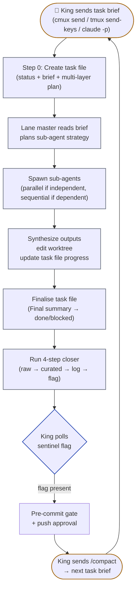
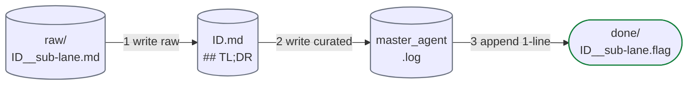
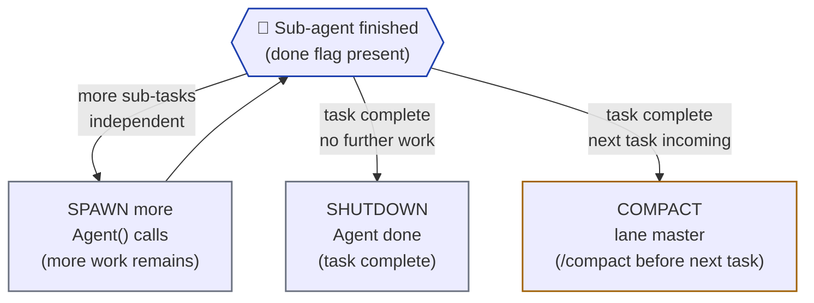

# workers.md — Worker role + 4-step closer

Workers are the autonomous task-execution lanes (`worker-1`, `worker-2`, …). Each runs a long-lived Claude Code teammate in its own `git worktree` on its own `worker-N` branch. Workers pick claimable sub-tasks from the project's task source, execute via their own sub-agent fleet, and signal the King with the 4-step closer.

See [`index.md`](index.md) for entry-point context, [`kings.md`](kings.md) for who dispatches and gates worker work, [`co-workers.md`](co-workers.md) and [`watchmans.md`](watchmans.md) for the other lane roles, [`git.md`](git.md) for branch model.

---

## Spawning sub-agents — Tab vs Agent decision

A lane master spawns sub-agents in one of three ways. **Default since v0.15.0: model-tiered** — cheap fan-outs go headless (`Agent()`), expensive work goes visible (`tab`).

### Spawn-cost reality

| Mode | Spawn cost | When it's worth it |
|---|---|---|
| 🐱 `Agent(run_in_background=true)` | **~2s** (in-process call) | Cheap reads, parallel fan-outs of >3, anything where you don't need to watch the work happen |
| 📑 `cmux tab-action --action new-terminal-right` + boot Claude | **~10–20s** (full Claude session boot) | Long-running work (>30s) where progress visibility matters; Opus calls that are expensive enough to deserve a window |
| 🪟 `cmux new-split right` | Same as tab | Side-by-side comparison of ≤2 sub-agents. Rare. |

A 5-Haiku Layer-1 fan-out costs ~10s headless vs ~100s as tabs. Default to headless for cheap models.

### Model-tiered defaults (kingdom.json.cmux.subAgentSpawnByModel)

```json
"subAgentSpawnByModel": {
  "haiku":  "background",   // always cheap → Agent()
  "sonnet": "background",   // default cheap; override per-task to "tab" for visibility
  "opus":   "tab"           // expensive + slow → deserves visibility
}
```

The master looks up the spawn mode by the sub-agent's model:

```bash
SPAWN_MODE=$(jq -r ".cmux.subAgentSpawnByModel.${SUB_MODEL} // .cmux.subAgentSpawnFallback // \"tab\"" "$KJSON")
case "$SPAWN_MODE" in
  background) spawn_as_agent "$SUB_MODEL" "$BRIEF" ;;
  tab)        spawn_as_tab   "$SUB_MODEL" "$BRIEF" ;;
  split)      spawn_as_split "$SUB_MODEL" "$BRIEF" ;;
esac
```

### Per-task override

The dispatch brief can explicitly request a non-default mode. Master honours the override:

```text
worker-1 task BE-AUTH-3:
  Brief: refactor auth middleware...
  Spawn mode: tab          # Ter wants to watch the Sonnet sub-agents work
```

Common reasons to override:

| Override | When |
|---|---|
| `spawn_mode: tab` (force visible) | Long-running Sonnet work, debugging, "show me what worker-1 is doing" |
| `spawn_mode: background` (force headless) | Ter wants speed, doesn't care to watch; cost-sensitive fan-out of >5 sub-agents |
| `spawn_mode: split` (rare) | Pair-style "do A and B side-by-side" |

### Auto-close still applies (Tab-spawned)

Tab-spawned sub-agents run the **5-step closer** (Step 5 = `cmux tab-action --action close --surface "$CMUX_SURFACE_ID"`). Tabs self-destruct after sentinel. Watchman has an orphan-tab sweep as belt-and-suspenders (v0.14.9).

Agent-spawned sub-agents run the **4-step closer** only — no Step 5 (no tab to close).

### Visual fan-out example

When worker-1 hits Layer 3 (Execution) and decides to spawn 3 parallel Sonnet sub-agents for separate code chunks:

```text
Master worker-1 dispatches Layer 3 fan-out (subAgentSpawnDefault=tab):

  cmux.app sidebar (workspace `👷 worker-1`):
    ├── 📑 worker-1 (master Claude session, the long-lived worker)
    ├── 📑 🐱 sub · Sonnet · auth-controller   ← spawned, running
    ├── 📑 🐱 sub · Sonnet · jwt-service       ← spawned, running
    └── 📑 🐱 sub · Sonnet · auth-tests        ← spawned, running

When each sub-agent finishes (writes sentinel + Step 5 self-close):

  cmux.app sidebar (workspace `👷 worker-1`):
    └── 📑 worker-1   ← master synthesises the 3 outputs, continues Layer 4
```

Ter SEES the parallelism happen. Tabs appear, do work, disappear cleanly.

---

## Worker lane role

- **Generic autonomous task workers.** No preset focus, no path locks. Every worker starts as identical capacity — `worker-1` and `worker-2` are interchangeable. The King assigns each task at dispatch time; the same worker can be doing backend today and frontend tomorrow.
- Lane master itself runs **Opus** by default (override per-lane in `kingdom.json.workers[i].model` if you want Sonnet for cost reasons). Executes via its own sub-agent fleet (P1 Sonnet / P2 Haiku / P3 Opus, unbounded parallel — see Spawn rights below).
- **Domain-agnostic.** A worker can edit code, run financial-model checks, run lab notebooks, draft manuscripts — whatever the task brief describes. The kingdom's only assumption is that work is versioned in git.
- Signals the King via the standard 4-step closer (raw + curated + log + sentinel flag). Sub-agents spawned as **Tabs** add Step 5 (auto-close own tab) — see § "5-step closer for tab-spawned sub-agents" below.
- Cross-lane conflict prevention happens at the King's level — Layer 1 planning detects overlapping tasks before dispatch, and the FINAL `git merge-tree` check at the push gate catches anything that slipped through. Workers don't need configured `ownsPaths` to stay out of each other's way.

---

## Task claiming

Before assigning a sub-task to a lane, **King** writes a claim file:

```bash
echo "worker-1 | $(date -u +%Y-%m-%dT%H:%M:%SZ)" > "$LOGS/claims/$SUBTASK_ID.lane"
```

- Path: `<LOGS>/claims/<sub-task-id>.lane` (e.g., `BE-P0-CICD.1.lane`)
- Contents: `<lane-name> | <UTC>`
- Cleared when the lane's PR is merged
- King checks `<LOGS>/claims/` before picking any new task — if a claim exists, skip that sub-task

Workers don't write claims. King does. Workers just receive their assignment via the dispatch prompt — see [`kings.md`](kings.md) → "Dispatch brief schema" for what King sends to each worker.

---

## Task-artifact naming — strict (every artifact carries the lane)

**The lane name appears in every per-task artifact filename**, so a single `grep`/`ls` finds everything that lane touched across the kingdom's history. Workers are generic capacity, but each task file/log/raw/sentinel is a **snapshot** of the lane assignment at THAT moment. If worker-3 does BE-AUTH-3 this week and FE-ICONS-9 next week, both task files have `worker-3` in their name.

| Artifact | Filename | Lane location |
|---|---|---|
| Task file | `<workspace>/.kingdom/<project>/tasks/<UTC>__<lane>__<sub-task-id>.md` | `<lane>` (segment 2) |
| Raw output | `<LOGS>/raw/<UTC>__<sub>-<lane>__<sub-task-id>.md` | `<sub>-<lane>` (segment 2 — model-prefix + lane) |
| Curated digest | `<LOGS>/<UTC>__<lane>__<sub-task-id>.md` | `<lane>` (segment 2) |
| Sentinel flag | `<LOGS>/done/<UTC>__<sub>-<lane>__<sub-task-id>.flag` | `<sub>-<lane>` (segment 2) |
| Test report (King) | `<project>/docs/test-reports/KING_<UTC>__<lane>__<sub-task-id>.md` | `<lane>` (segment 2 of the name part) |

### Continuation grep patterns

```bash
# All artifacts from worker-3 (any task, any time)
ls "$WS"/.kingdom/<project>/tasks/*__worker-3__*.md
ls "$WS"/.kingdom/<project>/logs/*__worker-3__*.md
ls "$WS"/.kingdom/<project>/logs/raw/*-worker-3__*.md
ls "$WS"/.kingdom/<project>/logs/done/*-worker-3__*.flag
ls "$PROJ"/docs/test-reports/KING_*__worker-3__*.md

# Just today's worker-3 work
ls "$WS"/.kingdom/<project>/tasks/$(date -u +%Y-%m-%d)*__worker-3__*.md

# Most recent worker-3 task file
ls -1t "$WS"/.kingdom/<project>/tasks/*__worker-3__*.md | head -1
```

### Anti-patterns

- ❌ Task file without lane in name (e.g., `2026-05-18T0443Z__other__sonnet__fe-found-7-seo-metadata.md` — lane missing, can't grep)
- ❌ Lane name in different positions across artifacts (must always be segment 2 for shell glob consistency)
- ❌ Renaming a task file after creation (it's a frozen snapshot — write once)
- ❌ Putting two lanes' work in one task file (one lane, one file, period)
- ❌ **Implementing without exhaustive pattern grep first.** "I assume the project doesn't have X" is not allowed without grep evidence proving it. Use sub-agents — capacity is unlimited. The lazy-implementor failure mode caught by v0.17.2: worker added `metadata: Metadata = { canonical: "https://webshop.bonfire.gg/" }` at module top-level (hardcoded literal) when the project's `lib/brand-defaults.ts` had a comment block explicitly documenting "Read by `app/layout.tsx` via `process.env.X ?? BRAND_Y` pattern. Env reads live INSIDE the async RootLayout function so Next.js doesn't inline at build." Worker read the brief but didn't read the convention docs alongside.
- ❌ **Saying "scripts/foo.sh doesn't seed X" without grepping all of `scripts/`.** Real failure: King said "compose.stateless.yml and 000_superscript.sh don't seed APP_BASE_URL" → user pushed back → King discovered `scripts/026_provision_frontend_env.sh` DOES seed it. **Don't claim absence without exhaustive grep.**

### `/kingdom:update` and other non-lane artifacts

Some artifacts aren't lane-attached:

- `/kingdom:update` curated digest: `<LOGS>/kingdom-update-<UTC>.md` — no lane (it's King-dispatched, not lane work)
- `/kingdom:update` specialist sub-digests: `<LOGS>/audit-{A,B,C,D}-<UTC>.md` — no lane
- King planning task files: `<workspace>/.kingdom/<project>/tasks/<UTC>__king-plan__<short-slug>.md` — `king-plan` IS the "lane" slot (constant)
- Watchman reports: `<project>/docs/test-reports/WATCH_<UTC>__<event-class>.md` — no lane (always watchman-N implicit)

For these non-lane artifacts, the filename's segment-2 slot carries the artifact TYPE instead of a lane name (`king-plan`, audit-A through audit-D, WATCH_*). The grep contract still holds: any file with a lane in segment 2 IS lane-attached; anything else isn't.

---

## Task file (mandatory — first thing the lane writes)

Every task assigned to a lane gets its own **task file** — checkbox doc tracking the multi-layer plan, in-progress progress, and final summary. It's the audit trail for HOW the work happened. Lane master is the sole writer; sub-agents and others read only.

**Path:** `<workspace>/.kingdom/<project>/tasks/<UTC>__<lane>__<sub-task-id>.md`
**Example:** `2026-05-17T1430Z__worker-1__BE-P0-CICD.1.md`

**Step 0 of every task** (before any sub-agent dispatch): the lane master creates the task file from this template:

```
# Task: <sub-task-id> — <one-line summary>

## Status
- [ ] planning → [ ] executing → [ ] verifying → [ ] done | blocked

## Brief
<2-4 lines from the King's dispatch prompt: what to do + acceptance criteria>

## Plan (multi-layer)

### Layer 1 — Discovery (MANDATORY exhaustive pattern search before any implementation)

> **The "lazy implementor antidote" rule (v0.17.2+):** Before deciding "no existing pattern exists" or "I'll invent a new approach", the worker MUST exhaustively grep the project for existing references, conventions, env handling, scripts, and doc comments. Capacity is unlimited — fan out 5-10 Haiku scanners in parallel if needed. Default stance: **the project HAS a pattern; my job is to find it. Burden of proof is on me to demonstrate one doesn't exist.**

- [ ] **Pattern grep — fan-out N× Agent(haiku) in parallel:**
  - [ ] `grep -rln "<key-term>" --include='*.{ts,tsx,js,py,sh,yml,yaml,json,md,env,env.example}' .` (any file types relevant)
  - [ ] Read every `.env*` and `.env.example` in the relevant subtree — these encode env conventions
  - [ ] Read all `scripts/` files matching the topic — they often seed env / fixtures / provisioning
  - [ ] Read all `lib/*-defaults.{ts,js,py}` / `lib/brand-defaults.*` / similar config-default files — they often have HOW-TO comments
  - [ ] Read `compose.*.yml` / `docker-compose*.yml` for container env contracts
  - [ ] Read `CLAUDE.md` (project) for project-specific conventions
- [ ] **Synthesise findings — list in task file Step 1:**
  - "Pattern found: `<file:line>` shows `<approach>` is the convention. Reusing it." → follow the pattern
  - OR: "No pattern found. Grepped <N> files; checked <list>. Confirming new approach is safe with King before implementing." → escalate to King; do NOT silently invent
- [ ] **Read any flagged comment-docs** — if `lib/<X>-defaults.ts` says "Read by `app/layout.tsx` via `process.env.X ?? BRAND_Y` pattern", THAT IS THE PATTERN. Follow it.

### Layer 2 — Strategy
- [ ] Based on Layer 1, decide approach
- [ ] (optional) Spawn 1× Agent(opus) for sensitive design review

### Layer 3 — Execution
- [ ] Spawn N× Agent(sonnet) for parallel edits — one per logical chunk
- [ ] Run lane-local typecheck after each chunk

### Layer 4 — Verification
- [ ] Run lane-local smoke tests
- [ ] Self-review: does the diff match the brief's acceptance criteria?
- [ ] Run 4-step closer

## Progress notes
<append date-stamped entries as work happens>

## Final summary
<written when status → done OR blocked. covers: what landed, what didn't, why, follow-ups>
```

The status checkboxes are flipped sequentially as work progresses. Each Layer's bullets are checked off as their sub-agents complete. Progress notes are appended freely (one paragraph per layer-completion or significant event).

### Live workspace description (PRIMARY mode)

After every checkbox flip / layer transition, the worker updates its own cmux workspace description so the sidebar shows current state at a glance:

```bash
cmux_set_state () {
  cmux workspace-action --action set-description \
    --workspace "$CMUX_WORKSPACE_ID" \
    --description "$1 $2" 2>/dev/null
}

# At Step 0 (task file just created)
cmux_set_state "▶" "$SUBTASK_ID · ▱▱▱▱ initialising"

# Layer transitions
cmux_set_state "▶" "$SUBTASK_ID · ▰▱▱▱ L1 Discovery"
cmux_set_state "▶" "$SUBTASK_ID · ▰▰▱▱ L2 Strategy"
cmux_set_state "▶" "$SUBTASK_ID · ▰▰▰▱ L3 Execution"
cmux_set_state "▶" "$SUBTASK_ID · ▰▰▰▰ L4 Verify"

# Closer Step 4 (sentinel written)
cmux_set_state "✅" "$SUBTASK_ID done · sentinel written"

# Idle (no claim for >5 min)
cmux_set_state "🐾" "Awaiting dispatch"
```

Description updates are **optional but recommended** — failures are silent and don't block work. See [`cmux.md`](cmux.md) → § "Dynamic workspace descriptions" for the full schema (state-emoji vocabulary, progress-bar convention, update-site table per role).

**Lifecycle:**
- **Created** in Step 0 of every task. Lane never starts sub-agent dispatch without writing the task file first.
- **Updated** continuously — check boxes off, append progress notes, refine plan as discovery yields surprises.
- **Finalised** when status → done or blocked: lane writes the "Final summary" section, then runs the 4-step closer.
- **Never deleted, never reused.** New task = new task file.

**Read access:** anyone (King, sub-agents, Watchman for context, Ter). **Write access:** lane master only. Sub-agents report progress via their own 4-step closer; lane master ingests their curated output and reflects it in the task file's progress notes / checkboxes.

---

## Spawn rights inside a lane — NO ECO MODE (applies to ALL models)

**The lane master itself runs Opus** (high-quality coding inside the lane). The sub-agents it spawns follow the P1/P2/P3 chain: **Sonnet** by default (P1), **Haiku** for bulk reads (P2), **Opus** for sensitive files (P3). The lane master's model is separate from the sub-agent chain.

Each lane master is a full Claude Code process and has the **Agent tool available**. Inside a single task it can:

- Spawn **as many** parallel sub-agents as the work needs — **across every model in the chain**, not just Haiku. The count comes from the work's *structure*, not from a 1:1 mapping. Examples of trade-offs:
  - 12 isolated file edits with no shared context → fan out 6-12 parallel `Agent(model="sonnet")` calls (one per file or per logical chunk).
  - 12 files where edits need consistent style / cross-file naming → maybe just 1-2 `Agent(model="sonnet")` calls each handling 6 files, because shared context produces a more coherent result than 12 isolated agents working blind.
  - Same logic for `haiku` (bulk reads — sometimes 1 agent with all 12 files in context summarises better than 12 isolated digests) and `opus` (sensitive work — 1 agent across related files often beats N isolated agents).
- Mix models freely per the P1/P2/P3 chain. A single task can fan out a mixed batch — e.g., 5 Sonnet edits + 2 Haiku digests + 1 Opus secret-rotation, all spawned in one message.
- Spawn sequentially when later work depends on earlier work, or in parallel when independent.
- **Never cap or "eco-throttle" for cost reasons** — but also don't max-out parallel just because you can. **Pick N from the work's structure: maximum that still gives the BEST RESULT.** Coherence > raw parallelism when work has cross-file dependencies.

Each layer's spawn pattern is captured in the task file's plan section (see Multi-layer planning below).

The only spawn rules binding a lane master are the P1/P2/P3 model-selection rules (see [`index.md`](index.md) → Sub-agent model priority) and the 4-step closer (below).

---

## Multi-layer planning (recursive fan-out)

Lane masters **plan before executing.** Planning produces 2-4 layers in the task file; each layer is a fan-out + synthesise step. Typical structure:

| Layer | Purpose | Typical model + count | Output |
|---|---|---|---|
| **1 — Discovery** | Read relevant code/docs | Agent(haiku) × N (one per file/module) | File inventory + summaries |
| **2 — Strategy** | Decide approach | Agent(sonnet) × 1 for design help; Agent(opus) × 1 if sensitive files involved | Refined plan in task file |
| **3 — Execution** | Make the edits | Agent(sonnet) × N (one per logical chunk; can be Opus for sensitive code) | Code changes in the lane's worktree |
| **4 — Verification** | Local checks before signalling done | Sometimes none (lane master runs typecheck itself); sometimes Agent(sonnet) × 1 for review | Confirm 4-step closer's curated digest is honest |

Each layer's sub-agents follow the 4-step closer themselves (raw + curated + log + flag). Lane master polls THEIR flags, reads their curated TL;DRs, synthesises, then ticks the layer's checkboxes in the task file before moving to the next layer.

Depth >4 is usually a sign of unclear scope — surface to King/Ter rather than spiral deeper.

**Spawn rules within a layer are unchanged** — see "Spawn rights" above. N is chosen for best result, not 1:1 with files. Coherence > raw parallelism when work has cross-file dependencies.

---

## Task sequencing inside a lane — sequential tasks, parallel sub-agents

A lane runs **one task at a time** (no two task briefs from the King in flight against the same lane). But **within that task**, the lane master self-plans its sub-agent fan-out and parallelises freely.

Sequence:

0. King sends task brief → lane pane. **Lane master creates the task file** (`<workspace>/.kingdom/<project>/tasks/<UTC>__<lane>__<sub-task-id>.md`) with status, brief, and multi-layer plan filled in. No sub-agent is dispatched until the task file exists.
1. King sends task brief → lane pane (via `cmux send` / `tmux send-keys` / `claude -p`).
2. Lane master reads the brief, analyzes the work, plans its sub-agent strategy (recorded in the task file).
3. Lane master spawns its sub-agents — parallel where independent, sequential where dependent.
4. Lane master synthesizes sub-agent outputs, makes edits to the lane's worktree, updates task file progress notes and checkboxes.
5. Lane master finalises the task file (writes Final summary, flips status → done/blocked), then runs the 4-step closer.
6. King polls the sentinel flag, runs pre-commit gate → push approval (see [`kings.md`](kings.md) → Push approval gate).
7. Lane master receives `/compact` from King, then the next task brief — back to step 0.

Task lifecycle within a lane:



Lanes never receive a "queue" of multiple tasks; the King serialises task-to-lane assignment. This keeps the lane's reasoning context focused and the gate boundaries clean.

---

## Slug convention

- **Lane master itself** uses slug `<role>-<n>` (e.g., `opus-worker-1`).
- **Sub-agents spawned by lane master** use **dot-suffixed** slugs: `worker-1.a`, `worker-1.b`, `worker-1.docs`, `worker-1.tests` — chosen by the lane master per its internal partition.
- The shared `<LOGS>/` already disambiguates because the task `<ID>` is unique per dispatch.

---

## The 4-step closer (mandatory for every worker task)

The worker prompt has **four mandatory closing actions** done at the end of each task, in this order:

> **Note:** The task file (see "Task file" section above) is an auxiliary parallel artifact — like the claim file, it runs alongside the task lifecycle. The task file's "Final summary" section is written and status flipped to done/blocked **before step 1 of the closer fires.** The closer itself is always exactly 4 steps.

1. **Write raw** → `<LOGS>/raw/<UTC>__<sub>-<lane-name>__<sub-task-id>.md` (full raw output; lane embedded for grep)
2. **Write curated** → `<LOGS>/<UTC>__<lane-name>__<sub-task-id>.md` with `## TL;DR` at top (machine-readable digest; lane embedded)
3. **Append 1-line status** → `<LOGS>/master_agent.log` (line includes lane name)
4. **Touch sentinel flag** → `<LOGS>/done/<UTC>__<sub>-<lane-name>__<sub-task-id>.flag` — AND fire two `cmux notify` calls (mandatory in PRIMARY mode):
   - `cmux notify --surface "$CMUX_SURFACE_ID" --title "👷 <lane> done" --subtitle "<ID>" --body "<one-line TL;DR from curated digest>"` — gives this pane a blue ring + tab lights up in cmux.app
   - `cmux notify --workspace "$KING_WS" --title "👷 <lane> done" --subtitle "<ID>" --body "<one-line TL;DR>"` — King's sidebar entry gets a badge + bell-icon panel logs the event
   `$KING_WS` is sourced from `<LOGS>/workspace-refs.env`. See `cmux.md` → § Notification system for visual targeting reference.

4-step write chain:



Master writes nothing under `<LOGS>/`. The worker is the only writer for its task's artifacts.

### 5-step closer for tab-spawned sub-agents (PRIMARY mode only)

When a master spawns a sub-agent as a **visible tab** (the default since v0.14.9 — see § "Spawning sub-agents — Tab vs Agent decision"), the sub-agent's closer gets one extra step:

5. **Close own tab** — `cmux tab-action --action close --surface "$CMUX_SURFACE_ID"` (the env var is auto-set in every cmux terminal)

The tab self-destructs after the sentinel flag is written. The master doesn't need to clean up; the sidebar/tab-strip stays tidy automatically.

**Robustness:** Step 5 must fire on EVERY exit path — successful task done, blocked task, errored task. The sub-agent's prompt template includes Step 5 inside a `trap` / `finally`-style wrapper so failures still close the tab:

```bash
# In the sub-agent's brief (added by the master):
# After Steps 1-4 (raw + curated + log + sentinel), ALWAYS run:
cmux tab-action --action close --surface "$CMUX_SURFACE_ID" 2>/dev/null
# Errors are swallowed because by this point the sentinel is already
# written — the master sees the work as done regardless of whether the
# tab close succeeds.
```

**Orphan tab sweep:** Watchman has a duty (since v0.14.9) to detect tabs that DID write a sentinel but DIDN'T close — sweeps them every `/loop` tick. Belt-and-suspenders for the rare case where Step 5 fails (cmux unreachable, network glitch, killed process). See [`watchmans.md`](watchmans.md) → "Orphan-tab sweep".

For **Agent-spawned** sub-agents (the cheap-fan-out exception — background, no UI), Step 5 is a no-op because `$CMUX_SURFACE_ID` isn't set in the Agent's process context.

### Required curated-artifact header (mandatory schema)

Every curated `.md` (single-worker self-curate OR archivist merge) must start with `## TL;DR` so master can read only the first ~15 lines via `Read(file_path, limit=15)`:

```markdown
# <Title>

## TL;DR
- **Status:** done | partial | failed
- <key finding 1 — one line>
- <key finding 2 — one line>
- <key finding 3 — one line, optional>
- **Next action:** <what master should do next, if anything>

---

- **Date (UTC):** <ISO>
- **Project:** <project basename>
- **Task type:** <doc-pull | code-survey | audit | migration-plan | …>
- **Sub-agent(s):** <lane-name> (worker) [+ archivist when multi-worker]
- **Mode / worker slugs:** standalone / a,b,c   (or CMUX / worker-1, worker-2, worker-3)
- **Inputs:** (list of raw paths used)
- **Master log refs:** `[<UTC>]`, …
- **Follow-up artifacts:** (links to other `<LOGS>/*.md` if any)

## Summary
<2–10 bullets — what was learned>

## Result
<merged content / table / synthesis>

## Followups / TODO
<bullets that should land in CLAUDE.md / <NAME>.md / a ticket>
```

Rules:

- `## TL;DR` is **mandatory** and must be the first section after the title (before the metadata block) so `Read(limit=15)` always sees it.
- Master's default read pattern: `Read(<ID>.md, limit=15)` first → only re-read without `limit` if the TL;DR is insufficient.
- The 4-step closer applies whether the worker was spawned via Agent / cmux teammate / tmux pane / claude -p. Same artifact layout in all dispatch modes.

---

## Shared `<ID>` rule (strict)

Every task gets one `<ID>` generated by the master. Raw + curated share it.

```text
<ID>  =  YYYY-MM-DDTHHMMZ__<task-type>__<sub-agent>__<kebab-slug>

raw      <LOGS>/raw/<ID>__<sub>-<lane-name>.md      ← one file per worker
curated  <LOGS>/<ID>.md                              ← worker self-curates (single) or archivist merges (multi)
flag     <LOGS>/done/<ID>__<sub>-<lane-name>.flag    ← sentinel
```

| Field | Rule | Example |
|---|---|---|
| `YYYY-MM-DDTHHMMZ` | UTC, `T`-separated, **no colons**, trailing `Z`. Sortable. | `2026-04-29T1914Z` |
| `task-type` | `doc-pull`, `code-survey`, `audit`, `migration-plan`, `e2e-run`, `bug-repro`, `refactor-plan`, `release-notes`, `kb`, `other`. Lowercase kebab. | `doc-pull` |
| `sub-agent` | `sonnet` / `haiku` / `opus` / `mixed` / `solo` | `sonnet` |
| `kebab-slug` | 2-6 lowercase words, hyphen-separated. **No paths.** | `repo-architecture-pull` |
| Worker suffix (raw) | `__<sub>-<lane-name>` where lane-name = `worker-N` / `co-worker-N` / `watchman-N` (CMUX mode) or short tag like `a`/`b`/`c` (standalone parallel fan-out). | `__opus-worker-1` |
| Separator | **Double underscore `__`** between fields (single `-` for date and slug). | |

---

## Path / ID helpers (master generates IDs; worker uses paths in its prompt)

```bash
# Workspace + project anchors — set once per session.
WS=/Users/ter/Desktop/Bonfire                       # workspace root
PROJ_NAME=<project>                                  # project directory basename
LOGS="$WS/.kingdom/$PROJ_NAME/logs"                 # this project's logs dir under .kingdom/

# Generate the shared ID for a task. Master calls this once per task.
make_artifact_id() {     # usage: make_artifact_id <task-type> <sub-agent> <slug>
  printf '%s__%s__%s__%s' \
    "$(date -u +%Y-%m-%dT%H%MZ)" "$1" "$2" "$3"
}

# Compute a worker's raw path (no I/O — just the path string).
raw_path() {             # usage: raw_path <logs_dir> <ID> <sub-agent> <worker-slug>
  printf '%s/raw/%s__%s-%s.md' "$1" "$2" "$3" "$4"
}

# Compute the curated path (shared across all workers in a task).
curated_path() {         # usage: curated_path <logs_dir> <ID>
  printf '%s/%s.md' "$1" "$2"
}
```

There is no `log_master` helper — master writes nothing. The worker prompt embeds its own `echo … >> master_agent.log` line as step 3 of the closer.

---

## Worker dispatch — Single-worker self-curate (most common)

Master dispatches via the `Agent` tool (standalone) or `cmux send` / `tmux send-keys` (kingdom mode). The lane master runs **Opus**; sub-agents it spawns follow the P1/P2/P3 chain (default = Sonnet for sub-agents).

```bash
# Master-side setup (Bash) — generate IDs and paths.
WS=/Users/ter/Desktop/Bonfire
PROJ=$WS/<project>
LOGS=$WS/.kingdom/$(basename "$PROJ")/logs
ID="$(make_artifact_id doc-pull opus docs-summary)"
mkdir -p "$LOGS/raw" "$LOGS/done"

SUB=opus
SLUG=solo                                # synthetic worker tag (single worker)
RAW="$(raw_path "$LOGS" "$ID" "$SUB" "$SLUG")"
CURATED="$(curated_path "$LOGS" "$ID")"
TASK_TYPE=doc-pull
```

Master issues the `Agent` call with the closer baked in:

```text
Agent(model="opus", prompt="""
Read <PROJ>/docs/ARCHITECTURE.md and produce a 5-bullet summary.

You MUST do FOUR things, in this exact order, before replying:

1) Write the full raw output to: <RAW>

2) Write a curated digest to: <CURATED>
   The curated file MUST start with this header (no exceptions):

   # <Title>

   ## TL;DR
   - **Status:** done | partial | failed
   - <key finding 1>
   - <key finding 2>
   - **Next action:** <next step>

   ---
   - **Date (UTC):** <ISO>
   - **Project:** <PROJ basename>
   - **Task type:** <TASK_TYPE>
   - **Sub-agent:** opus-<SLUG>
   - **Inputs:** <RAW>

   ## Summary
   <2-10 bullets>

   ## Result
   <merged content>

   ## Followups / TODO
   <bullets>

3) Append exactly one line to <LOGS>/master_agent.log:
   echo "[$(date -u +%Y-%m-%dT%H:%M:%SZ)] task=<TASK_TYPE> id=<ID> sub=opus-<SLUG> status=<pass|fail> raw=raw/$(basename <RAW>) curated=$(basename <CURATED>)" >> <LOGS>/master_agent.log

4) Touch the done flag: touch <LOGS>/done/<ID>__opus-<SLUG>.flag

Reply with only: saved: <CURATED>
""")
```

After issuing, master blocks on the done flag (see [`kings.md`](kings.md) → Master idle policy).

### Kingdom-mode variant (lane runs inside a worktree)

When the kingdom is active (primary via cmux.app or fallback via raw tmux), the worker runs inside a lane worktree:

1. **Create** worktree: `git worktree add -b "worker-N" "$PROJ/.worktrees/worker-N" "origin/$BASE"` (run once at kingdom startup).
   **Resume** existing worktree: `cd "$PROJ/.worktrees/worker-N"` (worktree already exists).
2. Worker prompt uses **absolute paths** to `<workspace-root>/.kingdom/<project>/logs/` — that path is identical from primary checkout and from every worktree.

Filenames become:
```text
raw       <WS>/.kingdom/<project>/logs/raw/<ID>__opus-worker-1.md
curated   <WS>/.kingdom/<project>/logs/<ID>.md
flag      <WS>/.kingdom/<project>/logs/done/<ID>__opus-worker-1.flag
```

After the flag appears, the King decides: `cmux merge` (if commits to keep + Ter approves push) → carve `feature/<topic>` → push. See [`git.md`](git.md) → Commit flow.

---

## Multi-worker tasks

For parallel fan-outs, master issues multiple `Agent` calls (one per worker, each with its own slug) in **a single message** so they run concurrently. Each worker runs the same 4-step closer with its own slug. The curated path is shared (`<LOGS>/<ID>.md`) — the **last** worker to finish overwrites the previous one's `<ID>.md`, which is why multi-worker tasks require an archivist merge.

### Multi-worker archivist — required when ≥2 workers share an `<ID>`

When multiple workers contribute to the same `<ID>`, each writes its own raw and a per-worker curated, but they all overwrite the same `<ID>.md`. To get a coherent merged digest, spawn an archivist sub-agent as the **last step**. One-shot — no recycling.

Default archivist model = **Sonnet** (P1). Pick Haiku only if per-worker curated files are unusually large (≥10 KB each). Opus is not appropriate for archivist work unless the underlying task was already Opus-sensitive.

```bash
# 1. Wait for all worker done flags
for SLUG in a b c; do
  until [ -f "$LOGS/done/${ID}__opus-${SLUG}.flag" ]; do sleep 5; done
done

# 2. Compose the archivist prompt
INPUTS="a,b,c"
CURATE="Read every file in ${LOGS}/raw/ matching the prefix '${ID}__'.
Merge them into ONE curated artifact at:

  ${LOGS}/${ID}.md

This OVERWRITES whatever the per-worker self-curates wrote there. Use the
exact header from the 'Required curated-artifact header' section above
(## TL;DR first, then metadata, then ## Summary / ## Result / ## Followups).
The TL;DR must synthesise across all workers, not just one.

Then close out by appending ONE line to ${LOGS}/master_agent.log :

  echo \"[\$(date -u +%Y-%m-%dT%H:%M:%SZ)] task=doc-pull id=${ID} sub=sonnet-archivist status=merged curated=${ID}.md inputs=${INPUTS}\" >> ${LOGS}/master_agent.log

And touch the merge-done flag:

  touch ${LOGS}/done/${ID}__archivist.flag

Reply with only: saved: ${LOGS}/${ID}.md"

# 3. Issue archivist (standalone recommended; no worktree needed for archivist work):
Agent(model="sonnet", prompt=$CURATE)   # archivist stays Sonnet (P1); only the lane master is Opus

# 4. Master blocks on merge flag, then reads:
until [ -f "$LOGS/done/${ID}__archivist.flag" ]; do sleep 5; done
tail -n 5 "$LOGS/master_agent.log"
```

---

## When NOT to write artifacts

The 4-step closer is **mandatory for every information-producing worker task**. The only exemptions:

- **Pure orchestration plumbing by master** (cmux.app/tmux commands, parallel `Agent` dispatch, log tailing) — master-side shell/tool commands, not worker tasks.
- **Master-side `tail` / `Read` of existing artifacts** — reading is free, no new artifact needed.
- **Throw-away one-line probes** master runs itself (e.g., `ls`, `docker ps`) — not worker tasks; if you find yourself wanting to log them, you're probably missing a worker dispatch.

If a worker runs and produces any reasoning / analysis / file content, **all four closer steps are required** — don't skip the curated digest "to save time", because that's exactly what costs Opus tokens later when master has to read raw instead.

---

## What workers DO NOT do (King-only operations)

| ❌ Forbidden for workers | ✅ Belongs to King |
|---|---|
| `git push` | King runs all pushes — see [`kings.md`](kings.md) → Push approval gate |
| `feature/*` branch creation | King carves `feature/<topic>` from lane branch tip |
| `gh pr create` | King opens PRs after Ter's "push" OK + FINAL conflict check |
| FINAL conflict check against `origin/develop` | King runs `git merge-tree` after Ter approves |
| Authoritative pre-commit gate | King runs the gate; workers may run fast feedback tests internally but those are hygiene, not gating |
| Reuse task files across tasks | New task = new task file. Task files are never reused or overwritten for a subsequent task. |

Workers DO: read, edit, commit locally to `<role>-<n>`, spawn their own sub-agents (P1/P2/P3, no eco cap), run the 4-step closer, signal completion via the sentinel flag (+ optional `cmux notify` for sidebar badge). Everything else is the King.

---

## Sub-agent lifecycle inside a lane

A lane master is itself long-lived (across multiple tasks). Its sub-agents (`Agent(model=...)` calls it issues) are short-lived (one task per Agent call).

Lifecycle: what the lane master decides after each sub-agent's done flag appears.



For lane master itself (long-lived across tasks): `/compact` between tasks is mandatory. Without it, lane context accumulates and pollutes the next task's reasoning. The King's per-task closing sequence ends with sending `/compact` to the lane pane via `cmux send` (or `tmux send-keys`).

For sub-agents spawned by lane master: each `Agent()` call is one-shot; it returns when done. The lane master collects results, synthesises, then moves to the next dispatch within the same task (or completes the task and runs the 4-step closer).

**Forbidden:**
- ❌ Lane master idle / "wait and see" without `/compact` — old context pollutes the next task.
- ❌ Repeat-round-trip polling — use one bash call with internal loop.
- ❌ Recycling a lane master across unrelated tasks without `/compact` first.
