# 👑 kingdom — roadmap (v0.13 → v1.0)

Strategic plan: **be better than Composio's `agent-orchestrator` while staying true to kingdom's identity.**

The goal is not feature parity. The goal is to take the genuinely useful ideas from fleet-ops orchestrators (reactions, status visibility, notifier pluggability) and re-shape them as **King-mediated, terminal-only, audit-first** flavours — keeping every kingdom guardrail intact.

---

## Identity guardrails (never compromised)

1. **In-terminal, no new runtime.** No Node daemon, no web server, no DB. Markdown + bash + Claude Code only.
2. **Human-in-the-loop on every push.** No auto-merge. King always asks.
3. **Audit-first.** Everything greppable in flat files months later.
4. **Single-user discipline.** Opinionated cap (≤10 lanes). Not chasing fleet scale.
5. **Claude-Code-native.** No multi-backend (Codex/Aider/Cursor). We ARE a CC plugin.
6. **Domain-agnostic.** Generic workers, arbitrary gate keys. Works for finance/science/writing, not just code.

Any feature that breaks one of these is automatically out, even if Composio has it.

---

## What we take from Composio (re-shaped)

| Their feature | Our take | Why |
|---|---|---|
| **Reactions** — CI fail / review comment routes back to agent | ✅ ADOPT — King-mediated (default: ask), not autonomous | Same auto-routing benefit, keeps human gate |
| **Dashboard view** | ✅ ADOPT as `/kingdom:status` — terminal-rendered, no web server | Same fleet visibility, no daemon |
| **Multi-channel notifier** (Slack/Discord) | ✅ ADOPT — webhook URL in `kingdom.json`, piggybacks on `cmux notify` | Easy extension, no new infrastructure |
| **Configurable retry policies** | ✅ ADOPT as `kingdom.json.reactions.retry` | Useful + small |
| **Plugin slots architecture** | ❌ SKIP — markdown-as-code stays our model | Different shape, intentional |
| **Auto-merge** | ❌ SKIP — violates human-gated push principle | Identity guardrail #2 |
| **30-agent fleet ops** | ❌ SKIP — opinionated cap stays | Identity guardrail #4 |
| **Multi-agent-CLI** (Codex/Aider/Cursor) | ❌ SKIP — Claude Code native is our identity | Identity guardrail #5 |
| **Web UI** | ❌ SKIP — terminal only | Identity guardrail #1 |

---

## Roadmap (updated 2026-05-23 — reconciled against v0.31.1 shipped state)

> **Reality check (2026-05-23).** The Composio-response arc this doc originally planned —
> Reactions → `/kingdom:status` → Slack/Discord notifiers → domain templates →
> `/kingdom:archive` / `/kingdom:tour` → `/kingdom:migrate` → perf pass → docs polish —
> **has not shipped.** Between v0.13.0 and v0.31.1 the project poured its effort into *internal
> robustness* instead: the working-tree overlay branch model, a two-tier gate with a mandatory
> review surface, a 45-rule priority-tiered rules system with call-site hard gates, a 4-command
> surface, a card display library, per-task skill routing, and an autonomous watchman. The version
> numbers v0.14–v0.21 all exist in `CHANGELOG.md`, but they describe that robustness work — not
> the features once pencilled against them. This section now tells the truth about what shipped,
> then re-plots a realistic path to v1.0.

```mermaid
graph LR
    subgraph shipped["✅ Shipped (v0.13.0 → v0.31.1)"]
        direction LR
        S1([v0.13–0.14<br/>cmux 3-tier hierarchy +<br/>graceful teardown])
        S2([v0.15–0.17<br/>overlay branch model +<br/>two-tier gate + review staging])
        S3([v0.18–0.21<br/>daily ritual + rules.md +<br/>README/docs split])
        S4([v0.22–0.27<br/>card library + skill routing +<br/>dispatcher hardening])
        S5([v0.28–0.31.1<br/>4-command surface +<br/>autonomous watchman + hard gates])
        S1 --> S2 --> S3 --> S4 --> S5
    end
    subgraph remaining["🔭 Remaining → v1.0 (projected)"]
        direction LR
        R1([🕵️ Reactions])
        R2([📊 /kingdom:status])
        R3([🔔 Notifiers])
        R4([🎨 Domain templates])
        R5([🗄 archive + 🗺 tour])
        R6([🔁 migrate · ⚡ perf · 💎 docs])
        R1 --> R2 --> R3 --> R4 --> R5 --> R6
    end
    V100([🎉 v1.0<br/>contract locked])
    S5 --> R1
    R6 --> V100

    classDef shippedNode fill:#d1fae5,stroke:#10b981,stroke-width:2px
    classDef plannedNode stroke:#a78bfa,stroke-width:2px
    classDef stable stroke:#10b981,stroke-width:3px
    class S1,S2,S3,S4,S5 shippedNode
    class R1,R2,R3,R4,R5,R6 plannedNode
    class V100 stable
```



### What actually shipped (v0.13.0 → v0.31.1)

| Version | Theme (what landed) |
|---|---|
| **v0.13.0** ✅ | Three-tier cmux hierarchy (Workspace → Tab → Split) + new `cmux.md` central reference; PRIMARY mode made to work for the first time |
| **v0.14.0** ✅ | `/kingdom:exit` — graceful teardown (later **replaced** by `/kingdom:save` in v0.29.0) |
| v0.14.1–.13 | A run of cmux + 4-step-closer fixes; tab spawn becomes the visible default (5-step closer) |
| **v0.15.0** | Model-tiered sub-agent spawn defaults (Haiku/Sonnet headless, Opus tab) |
| v0.15.1 | Kingdom-as-review-staging — mandatory merge-to-kingdom *before* any push |
| v0.15.2 | Every artifact carries the lane name (strict, greppable naming) |
| **v0.16.0** | 60/40 conservative+industrial scheduler; two-tier gate formalised (Tier 1 lane typecheck, Tier 2 kingdom tests/smoke/lint) |
| v0.16.3 | `feature/<topic>` = `worker-N` tip, byte-for-byte |
| **v0.17.0** ⚠ | **BREAKING** — kingdom is a working-tree overlay; never commits. Review surface = the Changes tab, not commit history |
| v0.17.2 | "Lazy implementor antidote" — mandatory exhaustive pattern grep before implementing |
| **v0.18.0** | `/kingdom:day` + pre-warmed sub-agent pool + auto-generated PR bodies from task files |
| **v0.19.0** | Priority-tiered `rules.md` (R1–R28) + `_primitives.md`; post-merge resync (R26) + watchman PR-number backfill (R27) + parallel-by-default (R28) |
| v0.19.1 | R29 — post-push overlay discard |
| **v0.20.0** | `/kingdom:day` promoted to THE daily ritual; `target=N-M/<period>` + `cap=N` args |
| **v0.21.0** | README slimmed 739→~210 lines; long-form content split into `docs/` (8 files) |
| **v0.22.0** | 19-card display library; all commands render via cards |
| **v0.23.0** | Per-task skill routing (`skill-routing.md` + `pick_skills_for_task`) |
| **v0.24.0** | R30/R31/R32 — King-is-dispatcher hardening (60s dispatch budget, lane-readiness gate) |
| **v0.25.0** | Resume queue + R33 (King reads existing task state before dispatch) |
| **v0.26.0** | R34/R35 + self-detect protocol (Tier-1 rules override memory; no cross-worktree `cp`) |
| **v0.27.0** | Multi-window cmux.app support |
| **v0.28.0** | Visible-first execution + interactive no-args mode (R36/R37/R38) |
| **v0.29.0** | Hard-break: 6 commands collapse to 4 (`/kingdom:work`, `/kingdom:save`, `/kingdom:init`, `/kingdom:self-care`); autonomous watchman (R39); Haiku cap (R40) |
| v0.29.3 | Skill-aware execution (R41) + routing-table expansion |
| **v0.30.0** | Open-thread cleanup + R42 (every parallel fan-out uses `_bounded_wait`) |
| **v0.31.0** | Hard gates beat prose — 5 call-site guard helpers; Tier 1 capped at exactly 10 rules; R43/R44 |
| **v0.31.1** | Consumer-test fixes + R45 (doc-orientation first); watchman senior-dev review; mandatory worker smoke-test reports |

### The original v0.14–v0.21 plan vs reality

Every feature once pencilled against v0.14–v0.21 is still **unbuilt**. The version slots were spent on the robustness work above. None of these are dead — they're re-plotted into the "Remaining path to v1.0" below, under the same identity guardrails.

| Originally planned (this doc, 2026-05-18) | Status | Re-plotted as |
|---|---|---|
| Reactions framework (CI fail / review-comment → King) | ❌ not shipped | Stream A · Tier 1 |
| `/kingdom:status` terminal dashboard | ❌ not shipped | Stream A · Tier 1 |
| Notifier extensibility (Slack/Discord webhooks) | ❌ not shipped | Stream A · Tier 1 |
| Domain templates (finance/science/writing) | ❌ not shipped | Stream A · Tier 2 |
| `/kingdom:archive` + `/kingdom:tour` | ❌ not shipped | Stream A · Tier 2 |
| `/kingdom:migrate` (schema upgrades) | ❌ not shipped | Stream A · Tier 3 |
| Performance pass (huge-project profiling) | ❌ not shipped | Stream A · Tier 3 |
| Docs polish / honest comparison page | ⏳ partial | Stream A · Tier 3 (README + `docs/` split landed in v0.21.0; case studies + comparison page remain) |

---

## Remaining path to v1.0

Two streams feed the path to v1.0:

- **Stream A — deferred Composio-response features.** Planned here in 2026-05-18, never built, still valid under the identity guardrails. Re-plotted to projected post-v0.31 slots in tier order (Tier 1 = highest impact).
- **Stream B — internal-contract hardening.** Threads that emerged from consumer testing, tracked in the repo's `CLAUDE.md` "Open threads". Mostly small point-release work that lands interleaved with Stream A.

v1.0 locks the contract once both streams settle. Version numbers below are **projected**, not committed — the actual ship order follows the same real-feedback-driven discipline that produced v0.14–v0.31.

> **Touch-point note.** Where the original specs listed "Files to edit", those lists named commands that no longer exist — `/kingdom:update`, `/kingdom:start`, `commands/start.md` were collapsed into `/kingdom:work` (`commands/work.md`) in v0.29.0. Touch points below are updated to the current 4-command surface.

### Stream A · Tier 1 — direct response to Composio's strengths

#### 🕵️ Reactions framework (projected v0.32.0)

The single highest-impact thing we can take from Composio. They use it for autonomy; we use it for **King-mediated routing**.

**New section in `kingdom.json`:**

```json
"reactions": {
  "ciFail": "ask",             // ask | auto-dispatch | ignore
  "reviewComment": "ask",      // ask | auto-dispatch | ignore
  "developBreak": "alert",     // alert | auto-pause-lanes
  "prMergeable": "alert",      // alert | ignore
  "retry": {
    "ciFail": 2,
    "backoffMinutes": 5
  }
}
```

**Watchman extends to** (already runs `/loop` autonomously since v0.29.0 / R39):

- Detect CI fail on `feature/*` branches we pushed → write `WATCH_<UTC>__pr-<N>_CI_failed.md` + `cmux notify` to King.
- Detect review comments on our PRs via `gh pr view <N> --json comments` → parse new comments since last tick → log each.
- Detect `origin/develop` broken → alert (extends the `gate.smoke` already on each tick).
- Detect `mergeable + green + lead-approved + idle≥30m` → alert.

**King reads the alerts and applies the policy:**

| Reaction policy | Behaviour |
|---|---|
| `ciFail = "ask"` (default) | King asks the user: "PR #123 CI failed on `worker-1`'s push. Dispatch fix-task to worker-1?" |
| `ciFail = "auto-dispatch"` | King creates the fix-task immediately, dispatches to the lane that originally pushed; still asks before push of the fix |
| `ciFail = "ignore"` | Watchman logs only, no King action |
| `reviewComment = "ask"` | "PR #123 has 2 new review comments. Dispatch as a task?" |
| `reviewComment = "auto-dispatch"` | King creates the address-comments task automatically |
| `developBreak = "alert"` | Watchman writes `WATCH_<UTC>__develop_RED__*.md` + `cmux notify`; lanes continue (King may pause manually) |
| `developBreak = "auto-pause-lanes"` | King auto-pauses lanes mid-task; resumes when watchman reports develop green |
| `prMergeable = "alert"` | Watchman alerts "PR #N ready to merge" (never auto-merges — guardrail #2) |
| `retry.ciFail = 2` | King retries fix-dispatches up to 2 times before escalating to "needs human" |

**Touch points (current surface):** `kingdom.json` template (`reactions` block) · `watchmans.md` (reactions-detection in `/loop` body) · `kings.md` (reaction-handling: read tagged events + `WATCH_*.md`, apply policy, log with `[reaction: ciFail]` tag) · `commands/work.md` (report resolved `reactions.*` policy) · `commands/init.md` (inherit from template) · README + CHANGELOG.

**Demoability:** "When CI fails on a PR you pushed, the King automatically asks if you want to dispatch a fix-task back to the lane that pushed it. No dashboard needed — the King handles routing in your existing chat. Configure `kingdom.json.reactions` to make it more or less autonomous."

#### 📊 `/kingdom:status` — terminal dashboard (projected v0.33.0)

What Composio shows in a web dashboard, we show in chat. Same info, no web server, no extra deps.

```
/kingdom:status              # current project (cwd basename)
/kingdom:status <project>    # specific project
/kingdom:status --all        # every project under .kingdom/
/kingdom:status --watch      # refresh every 30s (single Bash loop, zero idle tokens)
```

**Sample output:**

```
👑 Kingdom Status — my-app @ 2026-05-23T01:30Z

  Lanes:
    👷 worker-1     · busy   · BE-AUTH-3 (layer 3/4, 73% boxes ticked)
    👷 worker-2     · idle   · last task BE-DB-7 closed 2h ago
    👷 worker-3     · idle   · awaiting dispatch
    🧑‍💼 co-worker-1 · paired · UI-CHK-12 (user active)
    🕵️ watchman-1   · monitoring · last tick 02:15Z · develop green

  Open PRs:
    #234 feature/auth-refactor    · ✅ CI green · 1 review-comment unaddressed
    #235 feature/checkout-flow    · 🟡 CI running
    #236 feature/db-migrate       · ❌ CI failed (3 retries · last 01:20Z)

  Develop tip: a1b2c3d4 (origin/develop, 02:10Z fetched)

  Recent gaps (last watchman doc-audit scan 01:00Z):
    A · 2 project-says-done with no kingdom record
    B · 1 kingdom-shipped, docs not updated

  Last 5 log lines:
    [02:15Z] 🕵️ watchman-1 develop green
    [02:10Z] 👷 worker-1 layer 3 done: 12 files touched, typecheck pass
    [01:55Z] 👑 King push approved for feature/auth-refactor
    ...

Next suggested action:
  → Address 1 review-comment on PR #234 (reactions=ask)
```

One command, fleet visibility, no daemon. `--watch` uses a single blocking Bash loop (zero idle tokens; see `kings.md` → "Master idle policy"). Reads the existing audit substrate — `master_agent.log`, sentinel flags, task files, `watchman_state.json` — so it adds no new state.

**Touch points (current surface):** new `commands/status.md` · README slash-command table + example · CHANGELOG.

#### 🔔 Notifier extensibility — Slack / Discord (projected v0.34.0)

Composio integrates with Slack/Discord; today we rely on `cmux notify`. Add webhook posting:

```json
"notifiers": {
  "slackWebhook": "https://hooks.slack.com/...",
  "discordWebhook": "https://discord.com/api/webhooks/...",
  "alertLevels": ["develop-red", "pr-mergeable", "ci-fail"],
  "_comment": "Watchman + King POST structured alerts to these webhooks alongside cmux notify. alertLevels filters which events get posted. No infrastructure beyond curl."
}
```

**Behaviour:**

- Each alert is Markdown: title + 2–3 context lines + link to the relevant PR/log.
- Posts run via `curl -X POST` from inside watchman / King — no external service.
- A failed POST is logged but never blocks the kingdom (watchman keeps ticking).
- `alertLevels` is a whitelist; events outside it still write `WATCH_*.md` + `cmux notify`, just no webhook.

**Touch points (current surface):** `kingdom.json` template (`notifiers` block, optional/empty default) · `watchmans.md` + `kings.md` (post structured events) · `commands/init.md` (optional webhook prompt) · README + CHANGELOG.

### Stream A · Tier 2 — polish what makes us distinct

#### 🎨 Domain templates (projected v0.35.0)

Composio is single-domain (coding). Our biggest distinct claim is "works for finance/science/writing." Make it concrete with templates.

```
/kingdom:init my-app --template=dev      # default — pnpm typecheck/test/smoke/lint
/kingdom:init my-app --template=finance  # validate/audit/cross-check/format gates
/kingdom:init my-app --template=science  # reproduce/peer-review/lint-notebook/data-integrity
/kingdom:init my-app --template=writing  # spellcheck/fact-check/link-check/style
/kingdom:init my-app --template=blank    # empty gate.*, fill yourself
```

**Touch points (current surface):** `kingdom.json` template variants (`.dev` / `.finance` / `.science` / `.writing` / `.blank`) · `commands/init.md` (`--template=<name>` parsing) · README (3 case studies). Existing `/kingdom:init` calls without `--template` default to `dev`.

#### 🗄 `/kingdom:archive` + 🗺 `/kingdom:tour` (projected v0.36.0)

**`/kingdom:archive <project>`** — manual archive of old task files (watchman flags candidates in its doc-audit report; this command does the move).

```
/kingdom:archive my-app          # all candidates flagged in the watchman doc-audit report
/kingdom:archive my-app --older-than=30d
/kingdom:archive my-app --dry-run
```

Moves matching files to `tasks/archive/<YYYY-Qn>/`. King is the only role that touches `tasks/archive/`.

**`/kingdom:tour`** — interactive walkthrough for first-time users: (1) workspace vs project, (2) the 5 roles (👑 King · 👷 Worker · 🧑‍💼 Co-worker · 🕵️ Watchman · 🐱 Sub-agent), (3) first dispatch (dry-run lane), (4) first audit, (5) first push (mock gate + FINAL conflict check + "push?" prompt). Composio drops you in a dashboard; we walk you through the discipline.

**Touch points (current surface):** new `commands/archive.md` + `commands/tour.md` · README slash-command table · CHANGELOG.

### Stream A · Tier 3 — long-term

#### 🔁 `/kingdom:migrate` (projected v0.37.0)

Schema migrations between kingdom versions. e.g. v0.5.0 → v0.6.0 dropped `focus`+`ownsPaths` (manual edit per CHANGELOG today); v0.29.0 collapsed 6 commands to 4. `/kingdom:migrate` should automate the workspace-side re-sync.

```
/kingdom:migrate my-app          # detect current version, apply all migrations to target = latest
/kingdom:migrate my-app --to=0.32.0
/kingdom:migrate my-app --dry-run
```

Idempotent migration scripts live in `.kingdom/migrations/<from>-to-<to>.sh` (shipped with the plugin).

#### ⚡ Performance pass (projected v0.38.0)

Profile `/kingdom:work` on huge projects (1000+ docs): chunk the R45 doc-orientation fan-out smarter, cache Layer-1 results per session, consider Haiku scanner memoization for unchanged files.

#### 💎 Documentation polish (projected v0.39.0)

- 3 written case studies (finance audit team, ML research lab, technical-writing team).
- Honest comparison page: kingdom vs Composio vs Cursor multi-agent vs Aider farm — when each is right.
- Cross-reference sweep of role docs (`kingdom.json` schema docs, etc.).

(README slim + `docs/` split already landed in v0.21.0; this is the remaining case-studies + comparison work.)

### Stream B — internal-contract hardening (emergent, from consumer testing)

Tracked in the repo's `CLAUDE.md` "Open threads". Small, mostly mechanical, lands interleaved with Stream A point releases:

- **Per-rule heading sweep for the Tier-1 cap.** v0.31.0's legend declares exactly 10 iron-clad rules, but ~19 demoted rules still carry `— Tier 1` suffixes in their headings. Mechanical edit.
- **Wire `guard_no_king_session_worktree_cd`.** Helper exists in `_primitives.md` but no role doc calls it yet; add at the few remaining `cd "$PROJ/.worktrees/..."` sites in `kings.md`.
- **Pre-commit hook install at `/kingdom:init`.** Install `guard_worker_commit_branch` as a real `.git/hooks/pre-commit` per lane worktree, so the failure mode is caught even if a script forgets to call the guard. (R45 candidate, deferred pending consumer test of the v0.31.0 helpers.)
- **R34 session-start memory-vs-Tier-1 conflict scan.** Today R34 says "rules win"; the King must self-detect conflicts. Design needed for a non-turn-eating scan output.
- **Stale `cmux send` / `cmux notify` / `cmux tree` reference audit.** Live cmux accepts these as undocumented subcommands, but `cmux capabilities` lists the RPC methods as the documented surface. Standardize (v0.32.0 candidate).
- **Companion-app discussion (open, no decision).** Thin read-only web dashboard over the audit files vs upstreaming richer notifications to cmux.app. A web dashboard must not become a runtime dependency (guardrail #1) — read-only-over-flat-files keeps it honest.

### v1.0.0 — Stable (contract lock-in)

Lock in, with a versioned migration story:

- **`kingdom.json` schema** — fields, defaults, `gate.*` keys (`/kingdom:migrate` covers upgrades).
- **The 4-command surface** — `/kingdom:work`, `/kingdom:save`, `/kingdom:init`, `/kingdom:self-care` — names + signatures.
- **Role doc structure** — 5 roles (King, Worker, Co-worker, Watchman, Sub-agent), a written contract for each.
- **The rules system** — the Tier-1 cap (exactly 10 iron-clad rules) + the call-site hard-gate helpers in `_primitives.md`.
- **The branch model** — kingdom is a working-tree overlay (never commits); `feature/<topic>` = `worker-N` tip byte-for-byte; lane branches local-only.
- **The 4-step closer + smoke-test report** artifact contract.
- **Filename conventions** — `WATCH_*` / `LANE_*` / `KING_*` reports + the lane-in-segment-2 grep contract.
- **The card display library** contract (GitHub-alert-wrapped, no ANSI).
- **Backwards-compatibility commitment** for at least minor versions.

---

## What's NOT on the roadmap (and why)

| Idea | Why skipped |
|---|---|
| Web dashboard | Violates "no new runtime" guardrail. `/kingdom:status` does the same job in chat. |
| Auto-merge of PRs | Violates "every push human-gated" guardrail. Audit trails stay honest because the human gate is non-negotiable. |
| Multi-agent-CLI support (Codex/Aider/Cursor as drop-in replacements) | We're a Claude Code plugin — that's identity, not just convenience. Other CLIs would need their own plugin. |
| Plugin slots architecture (Composio-style) | Markdown-as-code is our distinctive shape. 7 plugin slots is heavy for what we're doing. |
| 30+ agent lane support | `sanityCap=10` is opinionated. If you need 30 agents, use Composio. We optimise for the single-user / small-team case. |
| GitHub Issues auto-claim | Out of scope for now. `kingdom.json.taskSource` is a user-configured pointer; the lanes don't auto-pull from a tracker. Future maybe. |
| Multi-user team mode | Single-user identity. Multi-user requires DB / dashboard / auth — none of which we want. |

---

## Headline pitch evolution

| Version | Pitch |
|---|---|
| v0.31.1 (today) | "Auditable parallel work for any git-versioned domain. King + N lanes, working-tree overlay review, every push human-gated, a 45-rule discipline, an audit trail you'll thank yourself for next quarter." |
| + Stream A Tier 1 | "…CI fails route back to the King. Review comments become tasks. Fleet status in a single chat line, no web app. Everything terminal, everything greppable, every push gated by you." |
| + Stream A Tier 2 | "…for any domain that uses git. Code, research, finance, science, manuscripts. Domain templates ship with the kit. Slack/Discord alerts when you want them." |
| v1.0 (stable) | "The disciplined alternative to dashboard-driven AI fleet ops. Single user, every push human-gated, audit trail you'll thank yourself for next quarter." |

---

## How to decide whether to add a feature

Before any feature lands, it must answer YES to:

1. Does it work in-terminal with no new runtime?
2. Does it preserve the human-in-the-loop push gate?
3. Does it produce greppable audit artifacts?
4. Does it work for non-code domains (finance/science/writing)?
5. Does it fit within ≤10 lanes per project?
6. Is it Claude-Code-native (not requiring a different agent CLI)?

If any answer is NO, the feature compromises an identity guardrail — either reshape it or skip it.

---

## Decision log

| Date | Decision | Rationale |
|---|---|---|
| 2026-05-18 | Adopt reactions framework (King-mediated, not autonomous) | Most impactful Composio idea; preserves human gate |
| 2026-05-18 | Reject web dashboard in favour of `/kingdom:status` | Identity guardrail #1 (no new runtime) |
| 2026-05-18 | Reject auto-merge | Identity guardrail #2 (human-gated push) |
| 2026-05-18 | Reject multi-agent-CLI support | Identity guardrail #5 (CC-native) |
| 2026-05-18 | Adopt Slack/Discord webhooks via curl POST | Same notifier benefit, no infrastructure |
| 2026-05-18 | Adopt domain templates | Makes "domain-agnostic" concrete; biggest distinct claim |
| 2026-05-23 | Prioritise internal robustness over the Composio-response arc (retroactive) | v0.14–v0.31.1 spent every slot on the overlay branch model, two-tier gate, rules system, 4-command surface, cards, skill routing, and autonomous watchman. Real-feedback-driven; the planned features were never the bottleneck — discipline was. |
| 2026-05-23 | Re-plot the planned features as Stream A (Tier 1–3), un-versioned-then-projected to v0.32+ | They remain valid under the guardrails; none were rejected, only deferred behind robustness work |

---

**Next action:** the kingdom shipped through **v0.31.1** on the robustness path. The Composio-response features (Stream A) are still unbuilt — start with **🕵️ Reactions** (projected v0.32.0, highest impact) when you give the word, or pick off a Stream B hardening thread (the Tier-1 heading sweep is the cheapest) in the meantime.
