# 👑 kingdom — roadmap (v0.13 → v1.0)

Strategic plan: **be better than Composio's `agent-orchestrator` while staying true to kingdom's identity.**

The goal is not feature parity. The goal is to take the genuinely useful ideas from fleet-ops orchestrators (reactions, status visibility, notifier pluggability) and re-shape them as **King-mediated, terminal-only, audit-first** flavours — keeping every kingdom guardrail intact.

---

## Identity guardrails (never compromised)

1. **In-terminal, no new runtime.** No Node daemon, no web server, no DB. Markdown + bash + Claude Code only.
2. **Human-in-the-loop on every push.** No auto-merge. King always asks.
3. **Audit-first.** Everything greppable in flat files months later.
4. **Single-user discipline.** Opinionated cap (≤10 lanes). Not chasing fleet scale.
5. **Claude-Code-native.** No multi-backend (Codex/Aider/Cursor). We ARE a CC plugin.
6. **Domain-agnostic.** Generic workers, arbitrary gate keys. Works for finance/science/writing, not just code.

Any feature that breaks one of these is automatically out, even if Composio has it.

---

## What we take from Composio (re-shaped)

| Their feature | Our take | Why |
|---|---|---|
| **Reactions** — CI fail / review comment routes back to agent | ✅ ADOPT — King-mediated (default: ask), not autonomous | Same auto-routing benefit, keeps human gate |
| **Dashboard view** | ✅ ADOPT as `/kingdom:status` — terminal-rendered, no web server | Same fleet visibility, no daemon |
| **Multi-channel notifier** (Slack/Discord) | ✅ ADOPT — webhook URL in `kingdom.json`, piggybacks on `cmux notify` | Easy extension, no new infrastructure |
| **Configurable retry policies** | ✅ ADOPT as `kingdom.json.reactions.retry` | Useful + small |
| **Plugin slots architecture** | ❌ SKIP — markdown-as-code stays our model | Different shape, intentional |
| **Auto-merge** | ❌ SKIP — violates human-gated push principle | Identity guardrail #2 |
| **30-agent fleet ops** | ❌ SKIP — opinionated cap stays | Identity guardrail #4 |
| **Multi-agent-CLI** (Codex/Aider/Cursor) | ❌ SKIP — Claude Code native is our identity | Identity guardrail #5 |
| **Web UI** | ❌ SKIP — terminal only | Identity guardrail #1 |

---

## Roadmap (updated 2026-05-18 after v0.13.0 ship)

```mermaid
graph LR
    V013([v0.13 ✅ SHIPPED<br/>cmux 3-tier hierarchy +<br/>central cmux.md reference])
    V014([v0.14 · 🕵️ Reactions<br/>CI fail / review-comment → King])
    V015([v0.15 · 📊 /kingdom:status<br/>terminal dashboard])
    V016([v0.16 · 🔔 Notifiers<br/>Slack/Discord webhooks])
    V017([v0.17 · 🎨 Domain templates<br/>finance/science/writing])
    V018([v0.18 · 🗄 /kingdom:archive +<br/>🗺 /kingdom:tour])
    V019([v0.19 · 🔁 /kingdom:migrate<br/>schema upgrades])
    V020([v0.20 · ⚡ Performance pass<br/>huge-project profiling])
    V021([v0.21 · 💎 Docs polish<br/>case studies · comparison])
    V100([🎉 v1.0<br/>stable])

    V013 --> V014 --> V015 --> V016 --> V017 --> V018 --> V019 --> V020 --> V021 --> V100

    classDef shipped fill:#d1fae5,stroke:#10b981,stroke-width:3px
    classDef tier1 stroke:#a78bfa,stroke-width:2px
    classDef tier2 stroke:#60a5fa,stroke-width:2px
    classDef tier3 stroke:#34d399,stroke-width:1.5px
    classDef stable stroke:#10b981,stroke-width:3px

    class V013 shipped
    class V014,V015,V016 tier1
    class V017,V018 tier2
    class V019,V020,V021 tier3
    class V100 stable
```



### v0.13.0 ✅ Shipped (originally planned as v0.12.1 cmux hotfix + v0.13 Reactions)

Scope grew during real-test feedback: spec was referencing several commands from a different cmux tool entirely (`craigsc/cmux`, not `manaflow/cmux`). Full cmux integration rewrite + new `cmux.md` central reference. Reactions framework pushed to v0.14.

What landed:

- 🏢 **Workspace per master** in PRIMARY mode (`cmux new-workspace --command "claude"`)
- 📑 **Tab spawn for visible sub-agents** with 5-step closer auto-close
- 🪟 **Split layout for watchman** (top: claude, bottom: `gh pr list --watch`)
- 📄 **`.kingdom/.setting/reference/cmux.md`** — central reference for every role
- 🔧 Doctor Check 1 verifies the 9 specific cmux commands kingdom uses
- 🐛 Fixed: `cmux claude-teams`, `cmux pin-pane`, `cmux current-workspace`, `cmux send --lane` — all wrong refs replaced

---

## Tier 1 — direct response to Composio's strengths

### ✅ v0.14.0 — `/kingdom:exit` (shipped 2026-05-18)

Graceful teardown command. 6-step flow: resolve → in-flight check (always-ask) → optional audit → notify lanes → `/clear` per lane → close lane workspaces → session-end log line. Keeps King by default; `--include-king` for full teardown. Pushed Reactions to v0.15.

### 🆕 v0.15.0 — Reactions framework

The single highest-impact thing we can take from Composio. They use it for autonomy; we use it for **King-mediated routing**.

**New section in `kingdom.json`:**

```json
"reactions": {
  "ciFail": "ask",            // ask | auto-dispatch | ignore
  "reviewComment": "ask",      // ask | auto-dispatch | ignore
  "developBreak": "alert",     // alert | auto-pause-lanes
  "prMergeable": "alert",      // alert | ignore
  "retry": {
    "ciFail": 2,
    "backoffMinutes": 5
  }
}
```

**Watchman extends to:**

- Detect CI fail on `feature/*` branches we pushed → write `WATCH_<UTC>__pr-<N>_CI_failed.md` + post `cmux notify` to King.
- Detect review comments on our PRs via `gh pr view <N> --json comments` → parse new comments since last tick → log each.
- Detect `origin/develop` broken → alert (uses `gate.smoke` already on each tick — extend output).
- Detect `mergeable + green + lead-approved + idle≥30m` → alert (already partially in `/loop` body).

**King reads the alerts and:**

| Reaction policy | Behaviour |
|---|---|
| `ciFail = "ask"` (default) | King tells Ter: "PR #123 CI failed on `worker-1`'s push. Dispatch fix-task to worker-1?" |
| `ciFail = "auto-dispatch"` | King creates the fix-task immediately, dispatches to the lane that originally pushed; still asks Ter before push of the fix |
| `ciFail = "ignore"` | Watchman logs only, no King action |
| `reviewComment = "ask"` | "PR #123 has 2 new review comments. Dispatch as a task?" |
| `reviewComment = "auto-dispatch"` | King creates the address-comments task automatically |
| `developBreak = "alert"` | Watchman writes `WATCH_<UTC>__develop_RED__*.md` + `cmux notify`; lanes continue working (King may pause manually) |
| `developBreak = "auto-pause-lanes"` | King automatically pauses lanes mid-task; resumes when watchman reports develop green again |
| `prMergeable = "alert"` | Watchman alerts Ter "PR #N ready to merge" |
| `retry.ciFail = 2` | King retries fix-dispatches up to 2 times before escalating to "needs human" |

**Files to edit:**

- `.kingdom/templates/kingdom.json.template` — add the `reactions` block with the defaults above.
- `.kingdom/.setting/roles/watchman.md` — new "Reactions detection" section in `/loop` body: detect CI fail / review comments / develop break / mergeable; write WATCH artifacts; post `cmux notify` events tagged with the reaction type.
- `.kingdom/.setting/roles/king.md` — new "Reaction handling" section: King reads tagged `cmux notify` events + `WATCH_*.md` reports; applies the policy from `kingdom.json.reactions.*`; logs each reaction-driven dispatch in `master_agent.log` with a `[reaction: ciFail]` tag.
- `commands/start.md` — Phase 1 reads + reports the `reactions.*` policy in the resolved plan output.
- `commands/init.md` — pass the reactions block through (just inherits from template).
- `README.md` — new section in role descriptions: how watchman → King reactions work; example flow.
- `CHANGELOG.md` — `[0.13.0]` entry.

**Default policies:**

- `ciFail: "ask"` — most users want to know before fix-dispatch
- `reviewComment: "ask"` — same; review comments often need scoping
- `developBreak: "alert"` — auto-pausing lanes is invasive; alert-first by default
- `prMergeable: "alert"` — never auto-merge (identity guardrail #2)

**Demoability after v0.13 ships:**

> "When CI fails on a PR you pushed, the King automatically asks if you want to dispatch a fix-task back to the lane that pushed it. No dashboard needed — the King handles the routing in your existing chat. Configure `kingdom.json.reactions` to make it more or less autonomous."

---

### 🆕 v0.16.0 — `/kingdom:status` (terminal dashboard)

What Composio shows in their web dashboard, we show in chat. Same info, no web server, no extra deps.

**Command surface:**

```
/kingdom:status              # current project (cwd basename)
/kingdom:status <project>    # specific project
/kingdom:status --all        # every project under .kingdom/
/kingdom:status --watch      # refresh every 30s (single Bash loop, zero idle tokens)
```

**Sample output:**

```
👑 Kingdom Status — bfg-swt @ 2026-05-18T01:30Z

  Lanes:
    👷 worker-1     · busy   · BE-AUTH-3 (layer 3/4, 73% boxes ticked)
    👷 worker-2     · idle   · last task BE-DB-7 closed 2h ago
    👷 worker-3     · idle   · awaiting dispatch
    🧑‍💼 co-worker-1 · paired · UI-CHK-12 (Ter active)
    🕵️ watchman-1   · monitoring · last tick 02:15Z · develop green

  Open PRs:
    #234 feature/auth-refactor    · ✅ CI green · 1 review-comment unaddressed
    #235 feature/checkout-flow    · 🟡 CI running
    #236 feature/db-migrate       · ❌ CI failed (3 retries · last 01:20Z)

  Develop tip: a1b2c3d4 (origin/develop, 02:10Z fetched)

  Recent gaps (last WATCH_DOCS_AUDIT scan 01:00Z):
    A · 2 project-says-done with no kingdom record
    B · 1 kingdom-shipped, docs not updated

  Last 5 log lines:
    [02:15Z] 🕵️ watchman-1 develop green
    [02:10Z] 👷 worker-1 layer 3 done: 12 files touched, typecheck pass
    [01:55Z] 👑 King push approved for feature/auth-refactor
    ...

Next suggested action:
  → Address 1 review-comment on PR #234 (reactions=ask)
```

One command, fleet visibility, no daemon. Composio gives you a web tab; we give you a chat line. The `--watch` flag uses a single blocking Bash loop (zero idle tokens while waiting; see `king.md` → "Master idle policy").

**Files to add/edit:**

- `commands/status.md` — new slash command spec.
- `README.md` — slash command table + new "/kingdom:status" example block.
- `CHANGELOG.md` — `[0.14.0]` entry.

---

### 🆕 v0.17.0 — Notifier extensibility (Slack / Discord)

Composio integrates with Slack/Discord; we currently rely on `cmux notify`. Add webhook posting:

**New section in `kingdom.json`:**

```json
"notifiers": {
  "slackWebhook": "https://hooks.slack.com/...",
  "discordWebhook": "https://discord.com/api/webhooks/...",
  "alertLevels": ["develop-red", "pr-mergeable", "ci-fail"],
  "_comment": "Watchman + King POST structured alerts to these webhooks alongside cmux notify. alertLevels filters which events get posted; ['develop-red', 'pr-mergeable', 'ci-fail'] are sensible defaults. No infrastructure beyond curl."
}
```

**Behaviour:**

- Each alert is Markdown-formatted: title + 2-3 context lines + link to the relevant PR/log.
- Posts run via `curl -X POST` from inside watchman / King — no external service.
- Failure to POST a webhook is logged but does not block the kingdom (watchman keeps ticking).
- `alertLevels` is a whitelist; events outside it are not webhook'd (but still write `WATCH_*.md` + `cmux notify`).

**Files to add/edit:**

- `.kingdom/templates/kingdom.json.template` — add `notifiers` block (optional; defaults to empty).
- `.kingdom/.setting/roles/watchman.md` — new "Webhook notifiers" section: post structured events.
- `.kingdom/.setting/roles/king.md` — same for King-level alerts (push success, gate fail).
- `commands/init.md` — interactive prompt for webhook URLs (optional; skip if user just presses enter).
- `README.md` — notifier section in install/setup.
- `CHANGELOG.md` — `[0.15.0]` entry.

---

## Tier 2 — polish what makes us distinct

### v0.16.0 — Domain templates (lean into domain-agnostic)

Composio is single-domain (coding). Our biggest distinct claim is "works for finance/science/writing." Make it concrete with templates.

**Command surface:**

```
/kingdom:init my-app --template=dev      # default — pnpm typecheck/test/smoke/lint
/kingdom:init my-app --template=finance  # validate/audit/cross-check/format gates
/kingdom:init my-app --template=science  # reproduce/peer-review/lint-notebook/data-integrity
/kingdom:init my-app --template=writing  # spellcheck/fact-check/link-check/style
/kingdom:init my-app --template=blank    # empty gate.*, fill yourself
```

**Files to add:**

- `.kingdom/templates/kingdom.json.template.dev` (rename current default)
- `.kingdom/templates/kingdom.json.template.finance`
- `.kingdom/templates/kingdom.json.template.science`
- `.kingdom/templates/kingdom.json.template.writing`
- `.kingdom/templates/kingdom.json.template.blank`
- `commands/init.md` — `--template=<name>` arg parsing
- `README.md` — 3 example case studies (one finance, one science, one writing) showing how the same kingdom kit applies

**Compatibility:** existing `/kingdom:init` calls without `--template` default to `dev` (current behaviour).

---

### v0.17.0 — `/kingdom:archive` + `/kingdom:tour`

**`/kingdom:archive <project>`** — manual archive of old task files. Watchman currently flags candidates (`WATCH_DOCS_AUDIT.md` → archive candidates), `/kingdom:update` re-flags them; this command does the action.

```
/kingdom:archive my-app          # all candidates flagged in WATCH_DOCS_AUDIT.md
/kingdom:archive my-app --older-than=30d
/kingdom:archive my-app --dry-run
```

Moves matching files to `tasks/archive/<YYYY-Qn>/`. King is the only role that touches `tasks/archive/`.

**`/kingdom:tour`** — interactive walkthrough for first-time users. Steps through:

1. What a workspace is (vs a project)
2. Role intros (👑 King, 👷 Worker, 🧑‍💼 Co-worker, 🕵️ Watchman, 🐱 Sub-agent)
3. First dispatch (with a dry-run lane)
4. First audit (with a sample `/kingdom:update` run)
5. First push (mock gate + FINAL conflict check + "push?" prompt)

Composio drops you in a dashboard; we walk you through the discipline.

**Files:**

- `commands/archive.md` — new.
- `commands/tour.md` — new.
- `README.md` — slash command table updates.
- `CHANGELOG.md` — `[0.17.0]` entry.

---

## Tier 3 — long-term

### v0.18.0 — `/kingdom:migrate`

Schema migrations between major kingdom versions. e.g., v0.5.0 → v0.6.0 dropped `focus`+`ownsPaths`; today that's a manual edit per CHANGELOG. `/kingdom:migrate` should automate.

```
/kingdom:migrate my-app         # detect current version, apply all migrations to target = latest
/kingdom:migrate my-app --to=0.7.0
/kingdom:migrate my-app --dry-run
```

Migration scripts live in `.kingdom/migrations/<from>-to-<to>.sh` (shipped with the plugin). Each script is idempotent.

### v0.19.0 — Performance pass

Profile `/kingdom:update` on huge projects (1000+ docs); chunk smarter; cache Layer-1 results per session; consider Haiku scanner result memoization for unchanged files.

### v0.20.0 — Documentation polish

- 3 written case studies (finance audit team, ML research lab, technical-writing team)
- Comparison page that honestly contrasts kingdom vs Composio vs Cursor multi-agent vs Aider farm — when each is right
- Video walkthrough (optional)
- Migrate role docs cross-references (kingdom.json schema docs etc)

### v1.0.0 — Stable

Lock in:

- `kingdom.json` schema (with versioned migration story)
- Slash command names + signatures
- Role doc structure (5 roles, written contract for each)
- 4-step closer artifact contract
- `WATCH_*.md` filename conventions
- Backwards compatibility commitment for at least minor versions

---

## What's NOT on the roadmap (and why)

| Idea | Why skipped |
|---|---|
| Web dashboard | Violates "no new runtime" guardrail. `/kingdom:status` does the same job in chat. |
| Auto-merge of PRs | Violates "every push human-gated" guardrail. Audit trails stay honest because the human gate is non-negotiable. |
| Multi-agent-CLI support (Codex/Aider/Cursor as drop-in replacements) | We're a Claude Code plugin — that's identity, not just convenience. Other CLIs would need their own plugin. |
| Plugin slots architecture (Composio-style) | Markdown-as-code is our distinctive shape. 7 plugin slots is heavy for what we're doing. |
| 30+ agent lane support | `sanityCap=10` is opinionated. If you need 30 agents, use Composio. We optimise for the single-user / small-team case. |
| GitHub Issues auto-claim | Out of scope for now. `kingdom.json.taskSource` is a user-configured pointer; the lanes don't auto-pull from a tracker. Future maybe. |
| Multi-user team mode | Single-user identity. Multi-user requires DB / dashboard / auth — none of which we want. |

---

## Headline pitch evolution

| Version | Pitch |
|---|---|
| v0.12 (today) | "Auditable parallel work for solo devs. King + N lanes + audit trail." |
| v0.15 (after Tier 1) | "Auditable parallel work for solo devs. CI fails route back to the King. Review comments become tasks. Everything terminal, everything greppable, every push gated by you." |
| v0.17 (after Tier 2) | "Auditable parallel work for any domain that uses git. Code, research, finance, science, manuscripts. King-mediated reactions. Domain templates ship with the kit." |
| v1.0 (stable) | "The disciplined alternative to dashboard-driven AI fleet ops. Single user, every push human-gated, audit trail you'll thank yourself for next quarter." |

---

## How to decide whether to add a feature

Before any feature lands, it must answer YES to:

1. Does it work in-terminal with no new runtime?
2. Does it preserve the human-in-the-loop push gate?
3. Does it produce greppable audit artifacts?
4. Does it work for non-code domains (finance/science/writing)?
5. Does it fit within ≤10 lanes per project?
6. Is it Claude-Code-native (not requiring a different agent CLI)?

If any answer is NO, the feature compromises an identity guardrail — either reshape it or skip it.

---

## Decision log

| Date | Decision | Rationale |
|---|---|---|
| 2026-05-18 | Adopt reactions framework (King-mediated, not autonomous) | Most impactful Composio idea; preserves human gate |
| 2026-05-18 | Reject web dashboard in favour of `/kingdom:status` | Identity guardrail #1 (no new runtime) |
| 2026-05-18 | Reject auto-merge | Identity guardrail #2 (human-gated push) |
| 2026-05-18 | Reject multi-agent-CLI support | Identity guardrail #5 (CC-native) |
| 2026-05-18 | Adopt Slack/Discord webhooks via curl POST | Same notifier benefit, no infrastructure |
| 2026-05-18 | Adopt domain templates (v0.16) | Makes "domain-agnostic" concrete; biggest distinct claim |

---

**Next action:** start v0.13.0 (Reactions framework) when you give the word.
