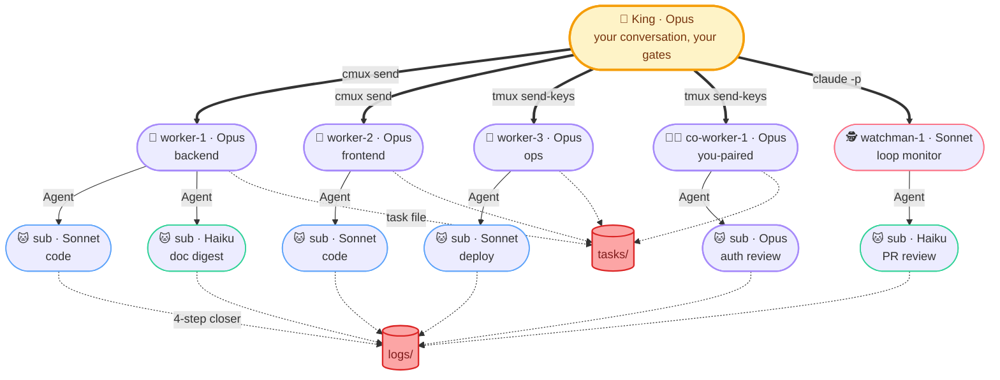

<!--
kingdom: Multi-agent orchestration kit for Claude Code (a Claude Code plugin).
Parallel AI coding with git worktrees, native cmux.app integration, audit-first
design, and human-in-the-loop push gates.

Keywords: claude code plugin, multi-agent orchestration, ai agent fleet,
parallel ai coding, git worktree, claude sub-agents, claude code teammates,
cmux integration, ai code review, autonomous coding agent, agent orchestrator,
claude opus sonnet haiku, ai pair programming, claude code teams alternative,
composio agent-orchestrator alternative, anthropic claude plugin.
-->

<div align="center">

# 👑 kingdom

### Multi-agent orchestration kit for Claude Code

**One King. N workers in Senior-led story pods. Auditable parallel work, any domain you version with git.**

**🔥 Fire 50-100 PRs a working week, on a single Claude Max plan. 🚀**


[Quick start](#-quick-start) · [Install](#-install) · [Contract](#-the-contract) · [Cost](#-what-it-costs-to-run) · [Slash commands](#-slash-commands) · [Docs](#-docs)

<br/>


<sub>A live kingdom in cmux.app: one King, 8 autonomous workers, 2 paired co-workers, 1 watchman; each lane its own colour-coded workspace, all driven from a single chat with the King.</sub>

</div>

---

## ⚡ Quick start

```bash
# 1. Install (in any Claude Code session)
/plugin marketplace add chatthong/kingdom
/plugin install kingdom@kingdom

/kingdom:init my-app          # scaffold once: workspace + git worktrees (~90s)
/kingdom:self-care            # check prereqs once: cmux.app, tmux, jq, gh, git

/kingdom:work my-app          # daily: audit, spawn, dispatch, poll
/kingdom:save my-app          # end of session: snapshot state, close lane workspaces
```

`/kingdom:work` is the daily ritual. It audits the project, spawns lanes, prints a kickoff brief with your local date+time and a Suggested next task, then auto-dispatches and gates work until something needs your approval. You stay in one chat with the King. At end of day, `/kingdom:save` snapshots lane + task state so the next `/kingdom:work` picks up where you left off.

```bash
# ── default daily ────────────────────────────────────────────────
/kingdom:work my-app                          # use kingdom.json shape

# ── shape: per-role (singular; plural like workers= also accepted) ─
/kingdom:work my-app worker=1                 # solo prototype: 1 autonomous worker
/kingdom:work my-app worker=2 co-worker=1     # mixed: 2 autonomous + 1 paired
/kingdom:work my-app worker=0 co-worker=2     # pair-programming day, no auto work
/kingdom:work my-app worker=5 watchman=2      # unattended overnight, heavy monitoring

# ── shape: total budget (King auto-composes the split; pins honored) ─
/kingdom:work my-app lane=8                   # King picks 8 lanes (workers + 1 watchman)
/kingdom:work my-app lane=8 watchman=1        # 1 watchman pinned + 7 lanes the King fills
/kingdom:work my-app lane=12 senior=2         # 2 Senior-led story pods + the rest workers

# ── story pods: Senior-led, reviewed as a unit, one PR per story ──
/kingdom:work my-app worker=6 senior=2        # 2 pods of 3 workers; each story reviewed as a whole
/kingdom:work my-app worker=3 senior=1        # 1 pod: 3 workers on one story, one Senior reviews

# ── limits: independent hard ceilings (count PRs/pods, not sub-tasks) ─
/kingdom:work my-app pr-limit=5               # stop after 5 PRs (a 3-worker pod = 1, not 3)
/kingdom:work my-app pod-limit=3              # stop after 3 pods (stories/tasks/issues)
/kingdom:work my-app lane=12 pr-limit=5       # 12 lanes, stop after 5 PRs
```

**Pick a shape by situation:**

| Situation | Recommended | Why |
|---|---|---|
| Solo prototype / one-person repo | `worker=1 co-worker=0 watchman=0` | Minimal overhead; one autonomous lane |
| Standard day (default) | `worker=3 co-worker=1 watchman=1` | 3 autonomous + 1 paired + monitoring |
| UI/design session | `worker=0 co-worker=2 watchman=1` | All paired with you; watchman covers `develop` |
| Heavy autonomous batch | `worker=5 co-worker=0 watchman=2` | Maximum parallelism; double watchmen for safety |
| Quick focused session | `worker=2 pr-limit=3` | 2 lanes, stop after 3 PRs |
| Let the King decide | `lane=8` | King composes 8 lanes for you (workers + 1 watchman) |
| Parallel story (pod) | `worker=6 senior=2` | 2 Senior-led pods; each story reviewed as a unit, shipped as one PR |

You now have, in cmux.app's sidebar: 👑 King, 🎓 1 senior (leads a story pod), 3× 👷 workers, 1× 🧑‍💼 co-worker, 1× 🕵️ watchman, each in its own colour-coded workspace, all coordinated through your one chat with the King.



A Claude Code plugin that turns one session into a coordinated team: each lane in its own git worktree, each branch isolated until you approve the push. The King gates every commit, writes audit artifacts you can grep next month, and never touches your main checkout. No new runtime, no daemons.

**Domain-agnostic by design.** Anything you version in git, the kingdom can orchestrate: code, research, finance models, scientific notebooks, manuscripts. Workers are generic capacity; `gate.*` commands are arbitrary bash. Same kit whether your "tests" run `pytest`, `Rscript`, or `pandoc --validate`.

### 🎓 Story pods (v0.32.0)

For a unit of work that needs several workers, the King assigns it to a **Senior** (🎓 Opus). The Senior owns the story end to end: it splits the work across its pod, merges each worker's branch into a local `story/<id>` branch, reviews the assembled story in an autonomous loop (routing fixes back to the owning worker), then hands it to the King as **one** push-eligible PR.


Quality and speed come from clean specialization: the **King** owns cross-story coordination (partition scopes, sequence dependencies, resolve drift at push), each **Senior** owns within-story review, and review never happens twice on the same code. Gate is three-tier: worker typecheck, story-branch tests, Senior review, then your push. Story branches stay local; only the final `story/<id> -> develop` PR reaches origin. Full details: [`docs/story-pods.md`](docs/story-pods.md).

> [!WARNING]
> **Spinning up a kingdom isn't instant, but it pays for itself fast.**
>
> - 🥶 **Cold start** (first `/kingdom:work`): **~30-60 min** to create worktrees, spawn lane workspaces, boot each Claude session, run the audit + doc-orientation fan-outs, then the first dispatch.
> - ♻️ **Resume** (next `/kingdom:work` after a `/kingdom:save`): **~15-30 min** to respawn workspaces from `state.json`, reload context, pick up in-flight tasks.
> - ⚡ **After that, it's light speed.** Lanes run fully parallel, the King gates continuously, and you spend your time reviewing PRs instead of waiting on setup.
>
> Budget the warm-up once per session; the sustained throughput (see [What it costs to run](#-what-it-costs-to-run)) is what you're paying that warm-up for.

---

## ✨ Why kingdom?

- **Real parallelism:** 3-10 lanes editing different branches simultaneously, isolated by `git worktree`
- **Story pods (v0.32.0):** several workers on one story, merged + reviewed as a unit by a Senior, shipped as one PR. King owns cross-story; Senior owns within-story; review never happens twice
- **One conversation:** you talk to the King; the King talks to the lanes; you never juggle panes
- **Native cmux.app feel:** every role gets its own colour-coded workspace; notifications fire as blue rings, badges, and bell-panel entries
- **Full audit trail:** every task leaves a 4-step closer artifact: raw log, curated digest, master log line, sentinel flag
- **Zero new runtime:** cmux + tmux + jq + gh are standard dev tooling; the protocol is plain text
- **Skill-aware:** King and lanes auto-pick from the Claude Code skill catalog (`nextjs-best-practices`, `prisma-cli`, `superpowers:test-driven-development`, etc) per-task. Domain-routed via [`skill-routing.md`](.kingdom/.setting/reference/skill-routing.md), with auto-discovery fallback when the routing table doesn't match.

---

## 🚀 Install

```bash
/plugin marketplace add chatthong/kingdom
/plugin install kingdom@kingdom
/kingdom:self-care
```

`/kingdom:self-care` tells you what's missing (cmux.app, tmux, jq, gh, settings.json keys) and offers to fix it.

### 🖥 Terminal & workspaces

kingdom drives one terminal workspace per lane. Two supported setups:

- **macOS (primary): [cmux.app](https://github.com/manaflow-ai/cmux).** Download it from [manaflow-ai/cmux](https://github.com/manaflow-ai/cmux). Gives you native, colour-coded workspaces, desktop notifications, and the live sidebar. This is the richest experience; the screenshot above is cmux.app.
- **Linux and macOS (fallback): tmux + [Ghostty](https://github.com/ghostty-org/ghostty).** Lanes run as tmux windows inside [Ghostty](https://github.com/ghostty-org/ghostty), a fast, GPU-accelerated terminal. No native sidebar, but the full work cycle runs the same.

`/kingdom:self-care` detects which you have and sets things up accordingly.

---

## 🛡 The contract (what kingdom won't touch)

- ❌ Your project files outside `.worktrees/<lane>/`: main checkout untouched until you say "push"
- ❌ `develop` and `main`: read-only; only `feature/<topic>` reaches origin
- ❌ Pushes: never without your explicit "push?" approval
- ❌ Your `~/.zshrc`, `~/.gitconfig`, PATH, shell hooks: zero modifications
- ❌ Your `.gitignore`: kingdom adds ONE line (`.worktrees/`) and stops there
- ✅ `rm -rf .kingdom/ .worktrees/` removes the kingdom; your project, git history, branches survive intact

---

## 💸 What it costs to run

The kingdom is a fleet of **real Claude Code sessions**, one per lane, each in its own cmux workspace. That's what buys real parallelism, and it spends two real budgets: your Mac's **RAM** and your Claude plan's **tokens**. Both numbers below are measured on a live run (2026-05-23 · macOS · Claude Code v2.1.150 · Opus 4.7).

### 🧠 RAM: one live session per lane

Each lane is a booted Claude Code session (Claude core + its own MCP servers). Measured with `cmux memory --all`:

| Shape | Live sessions | RAM (child RSS) |
|---|---:|---:|
| 👑 King only (all lanes closed) | 1 | ~0.6 GB |
| 👑 King + 8 workers + 2 co-workers + 1 watchman | 12 | ~6.3 GB |
| 👑 King + 12 workers + 2 co-workers + 1 watchman | 16 | ~7.1 GB |

Rule of thumb: **budget ~0.5 GB per booted lane**, roughly 0.2 GB for a fresh idle worker, more once it loads MCP servers or starts heavy work. A 16-lane kingdom is comfortable on a 16 GB Mac; on 32 GB+ you won't notice it.

**Reclaim it with `/kingdom:save`.** End of session, close the workspaces and get the RAM back; worktrees and branches stay on disk (cheap), and the next `/kingdom:work` respawns the sidebar from `state.json`.

> [!TIP]
> ```
> ╭─ /kingdom:save · close lane workspaces, free Mac RAM ───╮
> │  Each lane = a live Claude session ≈ 0.2-0.5 GB         │
> │  Measured: closing 11 lanes freed ~5.7 GB               │
> │           (6.3 GB ▸ 0.6 GB, back to King-only)          │
> │  .worktrees/* stay  (small · just files)                │
> │  Branches stay      (local + remote)                    │
> │  Next /kingdom:work respawns the sidebar from state.json│
> ╰─────────────────────────────────────────────────────────╯
> ```

### 🔥 Tokens: what a Max plan feeds it

On a **Claude Max (5×)** subscription, an Opus-only kingdom running ~12 hours/day sustains **~250-290M tokens/day**, almost all Opus, almost all cache reads (90%+), which is exactly why a billion-token week stays economical. One real 7-day window (full [`ccusage`](https://github.com/ryoppippi/ccusage) report in [`token-2026-05-23.md`](token-2026-05-23.md)):

| Day | Total tokens | Equivalent API value |
|---|---:|---:|
| Mon | 245.6M | $209 |
| Tue | 257.3M | $220 |
| Wed | 192.5M | $153 |
| Thu | 282.5M | $198 |
| Fri | **291.0M** | $203 |
| **5-day work week** | **~1.27B** | **~$983** |

**🔥 A Claude Max 5× plan (not even the 20× tier) fed nearly 300M Opus tokens in a single day.**

> The dollar figures are the *equivalent metered API cost* (what these tokens would bill at API rates). On a Max subscription it's flat-rate, so this is value unlocked, not a bill.

**So you choose how to spend that throughput:**

| Mode | What it looks like |
|---|---|
| 🎯 **Quality Max** | Fewer lanes, deep work: exhaustive discovery, Opus design review on every sensitive change, watchman cross-checks. Spend the tokens going *deep*. |
| 🔥 **Fire PRs like mad** | Many lanes, wide fan-out: a sustained **~50-100 PRs per working week**. Spend the tokens going *wide*. |

Same kit, same plan. Dial `worker=N` / `lane=N` and `pr-limit=N` to sit anywhere on that spectrum.

---

## 🎭 Roles at a glance

| Role | Model | What it does | Spec |
|---|---|---|---|
| 👑 **King** | Opus | Orchestrator. Holds your conversation. Sole pusher. Owns cross-story coordination. Never edits files. | [`king.md`](.kingdom/.setting/roles/king.md) |
| 🎓 **Senior** | Opus | Per-story sub-orchestrator + sole within-story reviewer. Owns a worker pod, merges into a story branch, reviews in a loop, marks push-eligible. Never pushes, never edits. | [`senior.md`](.kingdom/.setting/roles/senior.md) |
| 👷 **Worker** | Opus | Autonomous lane. Picks + executes sub-tasks (from King or its Senior). Spawns own sub-agents (no eco cap). | [`worker.md`](.kingdom/.setting/roles/worker.md) |
| 🧑‍💼 **Co-worker** | Opus | Paired with you. Dormant until you signal. | [`co-worker.md`](.kingdom/.setting/roles/co-worker.md) |
| 🕵️ **Watchman** | Sonnet | Passive monitor (`/loop`, 5-15 min). Smoke + PR babysitting. Never edits, never pushes. | [`watchman.md`](.kingdom/.setting/roles/watchman.md) |
| 🐱 **Sub-agent** | Sonnet/Haiku/Opus | One-shot via `Agent(model=…)`. Spawned by King or a lane. | [`worker.md`](.kingdom/.setting/roles/worker.md) |

Full role write-ups: [`docs/roles.md`](docs/roles.md).

---

## 🔧 Slash commands

| Command | What it does |
|---|---|
| **`/kingdom:work [<project>] [lane=N] [worker=N] [co-worker=N] [watchman=N] [senior=N] [pr-limit=N] [pod-limit=N]`** | **THE daily ritual.** Audit + spawn + kickoff brief (local date+time + Suggested next task) + auto-gate-poll loop. **Shape:** either per-role (`worker=` / `co-worker=` / `watchman=` / `senior=`, plural also accepted) or `lane=N` for a total budget the King auto-composes. **Limits:** `pr-limit=N` (stop after N PRs) and `pod-limit=N` (stop after N pods = units of work); both count things that become a PR, not sub-tasks. The one command you type every morning. |
| `/kingdom:init [<project>]` | **Scaffold only, no flags.** Creates the workspace + project `kingdom.json` (defaults) + `tasks/` + `logs/`. Tune the shape later at `/kingdom:work` or by editing `kingdom.json`. See [`docs/configuration.md`](docs/configuration.md). |
| `/kingdom:self-care` | Check prerequisites: cmux.app, tmux, jq, gh, git ≥ 2.5, settings.json keys. Re-run anytime. |
| `/kingdom:save [<project>]` | State snapshot. Writes current lane + task state to `state.json`; closes lane workspaces. Keeps King's workspace by default. No commits or pushes; those go through the normal push-approval gate. |

---

## 📚 Docs

| Topic | Where |
|---|---|
| Work cycle: first-time setup, every-day command, plugin updates | [`docs/work-cycle.md`](docs/work-cycle.md) |
| Configuration: project shapes, `kingdom.json`, `gate.*` keys | [`docs/configuration.md`](docs/configuration.md) |
| Roles: King, workers, co-workers, watchmen, sub-agents | [`docs/roles.md`](docs/roles.md) |
| Branch model: lifecycle, overlay, two-tier gate, three rules | [`docs/branch-model.md`](docs/branch-model.md) |
| Story pods: Senior role, story branch, three-tier gate (v0.32.0) | [`docs/story-pods.md`](docs/story-pods.md) |
| cmux.app integration: sidebar, notifications, three-tier hierarchy | [`docs/cmux-integration.md`](docs/cmux-integration.md) |
| How it works: King's role, lane mechanics, 4-step closer | [`docs/how-it-works.md`](docs/how-it-works.md) |
| Why: the problem kingdom solves | [`docs/why.md`](docs/why.md) |
| FAQ | [`docs/faq.md`](docs/faq.md) |
| Internal role specs (King reads these at session start) | [`.kingdom/.setting/`](.kingdom/.setting/) |
| Rules: priority-tiered enforceable rules | [`.kingdom/.setting/rules.md`](.kingdom/.setting/rules.md) |
| Changelog | [`CHANGELOG.md`](CHANGELOG.md) |

---

## 🧑‍💼 Contributing

The kingdom is opinionated by design; most defaults exist because of a specific failure mode. Before changing a rule, read the role file that owns it ([`.kingdom/.setting/`](.kingdom/.setting/)).

Especially welcome:

- Brew tap formula (`brew install chatthong/tap/kingdom`)
- Linux dev-container preset
- Per-stack `kingdom.json` examples (Rust, Go, Python+Django, Next.js+TRPC, etc.)
- VS Code task definitions that wrap `/kingdom:work`

---

## 📜 License

See [LICENSE](LICENSE).

---

<div align="center">

<sub>Built on [manaflow-ai/cmux](https://github.com/manaflow-ai/cmux), git worktrees (built-in ≥ git 2.5), and Claude Code's experimental agent-teams mode.</sub>

<sub>The kingdom is Claude-only. Codex/Kimi/other-CLI integration is out of scope.</sub>

<br/>

If this saves you time, ⭐ the repo.

</div>
