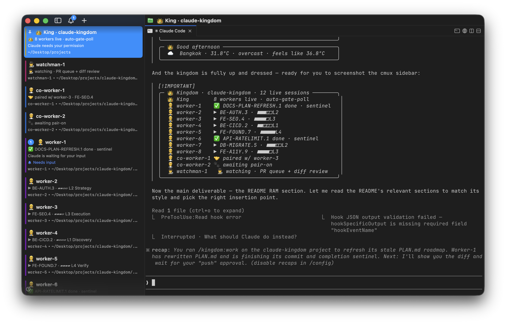
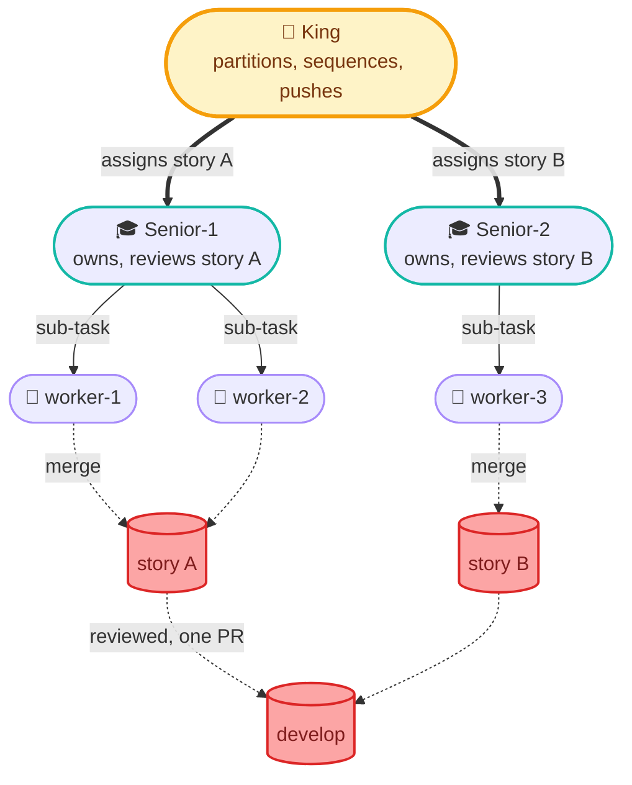

<!--
kingdom: Multi-agent orchestration kit for Claude Code (a Claude Code plugin).
Parallel AI coding with git worktrees, native cmux.app integration, audit-first
design, and human-in-the-loop push gates.

Keywords: claude code plugin, multi-agent orchestration, ai agent fleet,
parallel ai coding, git worktree, claude sub-agents, claude code teammates,
cmux integration, ai code review, autonomous coding agent, agent orchestrator,
claude opus sonnet haiku, ai pair programming, claude code teams alternative,
composio agent-orchestrator alternative, anthropic claude plugin.
-->

<div align="center">

# 👑 kingdom

### Multi-agent orchestration for Claude Code — one King, N workers, real git worktrees.

**🔥 Fire 50-100 PRs a working week, on a single Claude Max plan. 🚀**


[Quick start](#-quick-start) · [Why kingdom](#-why-kingdom) · [Roles](#-roles-at-a-glance) · [Commands](#-slash-commands) · [Cost](#-what-it-costs-to-run) · [Contract](#-the-contract-what-kingdom-wont-touch) · [Docs](#-docs)

<br/>



<sub>A live kingdom in cmux.app: one King, 8 autonomous workers, 2 paired co-workers, 1 watchman; each lane its own colour-coded workspace, all driven from a single chat with the King.</sub>

</div>

---

## 🤔 What is this?

**kingdom is a Claude Code plugin that turns one chat session into a coordinated team of AI agents.** You talk to one King (Opus); the King spawns N lanes — each a real Claude Code session in its own `git worktree`, on its own local branch — and dispatches, gates, and audits their work in parallel. Every commit waits behind your explicit push approval, and your main checkout is never touched.

It's **shape-only**: role specs, slash commands, card templates, and helper bash. There's **no new runtime to install** — it runs on tooling you already have (Claude Code + git worktrees + `cmux`/`tmux` + `jq` + `gh`). And it's **domain-agnostic**: anything you version in git — code, research, finance models, manuscripts — since `gate.*` commands are arbitrary bash.

---

## ⚡ Quick start

```bash
# Install — in any Claude Code session (2 lines)
/plugin marketplace add chatthong/kingdom
/plugin install kingdom@kingdom
```

```bash
/kingdom:self-care            # check prereqs once: cmux.app / tmux, jq, gh, git
/kingdom:init my-app          # scaffold once: workspace + git worktrees (~90s)

/kingdom:work my-app          # daily ritual: audit → spawn lanes → dispatch → gate-poll
/kingdom:save my-app          # end of session: snapshot state, free RAM, close lanes

/kingdom:update               # after a plugin update: migrate kit + configs (preview + confirm)
```

> [!TIP]
> `/kingdom:work` is the one command you type every morning. It audits the project, spawns lanes, prints a kickoff brief (local date+time + a Suggested next task), then auto-dispatches and gates work until something needs your approval. You stay in **one** chat with the King. `/kingdom:save` at night so the next `/kingdom:work` resumes where you left off.

**Want a different fleet shape?** Pass per-role counts or a total `lane=N` budget — the cheat sheet and full examples are folded in below.

<details>
<summary><b>📐 Pick a shape by situation — matrix + advanced <code>/kingdom:work</code> examples</b></summary>

<br/>

| Situation | Recommended | Why |
|---|---|---|
| Solo prototype / one-person repo | `worker=1 co-worker=0 watchman=0` | Minimal overhead; one autonomous lane |
| Standard day (default) | `worker=3 co-worker=1 watchman=1` | 3 autonomous + 1 paired + monitoring |
| UI/design session | `worker=0 co-worker=2 watchman=1` | All paired with you; watchman covers `develop` |
| Heavy autonomous batch | `worker=5 co-worker=0 watchman=2` | Maximum parallelism; double watchmen for safety |
| Quick focused session | `worker=2 pr-limit=3` | 2 lanes, stop after 3 PRs |
| Let the King decide | `lane=8` | King composes 8 lanes for you (workers + 1 watchman) |
| Parallel story (pod) | `worker=6 senior=2` | 2 Senior-led pods; each story reviewed as a unit, shipped as one PR |

```bash
# ── default daily ────────────────────────────────────────────────
/kingdom:work my-app                          # use kingdom.json shape

# ── shape: per-role (singular; plural like workers= also accepted) ─
/kingdom:work my-app worker=1                 # solo prototype: 1 autonomous worker
/kingdom:work my-app worker=2 co-worker=1     # mixed: 2 autonomous + 1 paired
/kingdom:work my-app worker=0 co-worker=2     # pair-programming day, no auto work
/kingdom:work my-app worker=5 watchman=2      # unattended overnight, heavy monitoring

# ── shape: total budget (King auto-composes the split; pins honored) ─
/kingdom:work my-app lane=8                   # King picks 8 lanes (workers + 1 watchman)
/kingdom:work my-app lane=8 watchman=1        # 1 watchman pinned + 7 lanes the King fills
/kingdom:work my-app lane=12 senior=2         # 2 Senior-led story pods + the rest workers

# ── story pods: Senior-led, reviewed as a unit, one PR per story ──
/kingdom:work my-app worker=6 senior=2        # 2 pods of 3 workers; each story reviewed as a whole
/kingdom:work my-app worker=3 senior=1        # 1 pod: 3 workers on one story, one Senior reviews

# ── limits: independent hard ceilings (count PRs/pods, not sub-tasks) ─
/kingdom:work my-app pr-limit=5               # stop after 5 PRs (a 3-worker pod = 1, not 3)
/kingdom:work my-app pod-limit=3              # stop after 3 pods (stories/tasks/issues)
/kingdom:work my-app lane=12 pr-limit=5       # 12 lanes, stop after 5 PRs
```

</details>

> [!WARNING]
> **Spinning up a kingdom isn't instant, but it pays for itself fast.**
> - 🥶 **Cold start** (first `/kingdom:work`): **~30-60 min** to create worktrees, spawn + boot lane sessions, run the audit + doc-orientation fan-outs, then dispatch.
> - ♻️ **Resume** (next `/kingdom:work` after `/kingdom:save`): **~15-30 min** to respawn from `state.json` and pick up in-flight tasks.
> - ⚡ **After that, it's light speed.** Lanes run fully parallel, the King gates continuously, and you spend your time reviewing PRs instead of waiting on setup.

---

## 🛰 How the fleet runs

The King talks to lanes over whichever backend is live (cmux on macOS, tmux otherwise); each lane fans heavy work out to its own one-shot sub-agents — through the Workflow tool's live `/workflows` view when the session has it (R53), otherwise bounded `Agent()` — and leaves an audit trail in `tasks/` + `logs/`.


### 🎓 Story pods

When a unit of work needs several workers, the King hands it to a **Senior** that owns the story end to end — it splits the work across its pod, merges each branch into a local `story/<id>` branch, reviews the assembled story in an autonomous loop, then hands the King **one** push-eligible PR.



Quality and speed come from clean specialization: the **King** owns cross-story coordination (partition scopes, sequence dependencies, resolve drift at push), each **Senior** owns within-story review, and review never happens twice on the same code. The gate is three-tier — worker typecheck → story-branch tests → Senior review → your push. Story branches stay local; only the final `story/<id> → develop` PR reaches origin. Full details: [`docs/story-pods.md`](docs/story-pods.md).

---

## ✨ Why kingdom?

- **🧵 Real parallelism** — 3-10 lanes editing different branches simultaneously, isolated by `git worktree`. Not in-process sub-agents pretending to be parallel.
- **📺 Visible sub-agent armies (v0.43.0)** — when the session exposes the Workflow tool, each task's parallel sub-agent fan-out runs through it, so you watch the whole army live in Claude Code's `/workflows` view (phases, per-agent tokens/time) — one run per task. Falls back to bounded `Agent()` where the tool isn't present (R53).
- **🎓 Story pods** — several workers on one story, merged and reviewed as a unit by a Senior, shipped as one PR. King owns cross-story coordination; the Senior owns within-story review.
- **💬 One conversation** — you talk to the King; the King talks to the lanes; you never juggle panes.
- **🎨 Native cmux/tmux feel** — every role gets its own colour-coded workspace (cmux) or status-bar window (tmux); notifications fire as blue rings, badges, and bell-panel entries.
- **🧾 Full audit trail** — every task leaves a 4-step closer artifact: raw log, curated digest, master log line, sentinel flag. Grep it next month.
- **🕵️ Smart watchman (v0.42.0)** — more than a monitor: a Sonnet `/loop` running 8 surveillance duties (incl. migration/sequence-collision, config-drift, and missing-test detection) through a findings ledger that dedups, escalates unactioned issues, auto-resolves, and surfaces one actionable "King's next action" per tick. Change-gated duties + a `WATCH_*` retention sweep + a deep-quiet cadence tier keep it cheap on a still repo, so it runs unattended for weeks.
- **📦 Zero new runtime** — cmux + tmux + jq + gh are standard dev tooling; the protocol is plain text.
- **🧠 Skill-aware** — King and lanes auto-pick from the Claude Code skill catalog (`nextjs-best-practices`, `prisma-cli`, `test-driven-development`, etc.) per-task. Domain-routed via [`skill-routing.md`](.kingdom/.setting/reference/skill-routing.md), with auto-discovery fallback.

---

## 🎭 Roles at a glance

| Role | Model | What it does | Spec |
|---|---|---|---|
| 👑 **King** | Opus | Orchestrator. Holds your conversation. Sole pusher. Owns cross-story coordination. Never edits files. | [`king.md`](.kingdom/.setting/roles/king.md) |
| 🎓 **Senior** | Opus | Per-story sub-orchestrator + sole within-story reviewer. Owns a worker pod, merges into a story branch, reviews in a loop, marks push-eligible. Never pushes, never edits. | [`senior.md`](.kingdom/.setting/roles/senior.md) |
| 👷 **Worker** | Opus | Autonomous lane. Picks + executes sub-tasks (from King or its Senior). Spawns own sub-agents. | [`worker.md`](.kingdom/.setting/roles/worker.md) |
| 🧑‍💼 **Co-worker** | Opus | Paired with you. Dormant until you signal. | [`co-worker.md`](.kingdom/.setting/roles/co-worker.md) |
| 🕵️ **Watchman** | Sonnet | Autonomous `/loop` safety net (5-15 min on churn, backing off to a 30-min deep-quiet tier when still): develop-health + PR babysitting + 8 Haiku surveillance duties (review · CVE · cross-lane conflict · cross-story drift · sequence-collision · config/secret parity · missing-tests · git hygiene) feeding a findings ledger. Change-gated + self-pruning. Read-only; never edits, never pushes. | [`watchman.md`](.kingdom/.setting/roles/watchman.md) |
| 🐱 **Sub-agent** | Sonnet/Haiku/Opus | One-shot via `Agent(model=…)`. Spawned by King or a lane. | [`worker.md`](.kingdom/.setting/roles/worker.md) |

Full role write-ups: [`docs/roles.md`](docs/roles.md).

---

## 🔧 Slash commands

| Command | What it does |
|---|---|
| **`/kingdom:work [<project>] [lane=N] [worker=N] [co-worker=N] [watchman=N] [senior=N] [pr-limit=N] [pod-limit=N]`** | **THE daily ritual.** Audit + spawn + kickoff brief (local date+time + Suggested next task) + auto-gate-poll loop. **Shape:** either per-role (`worker=` / `co-worker=` / `watchman=` / `senior=`, plural also accepted) or `lane=N` for a total budget the King auto-composes. **Limits:** `pr-limit=N` and `pod-limit=N` count things that become a PR, not sub-tasks. |
| `/kingdom:init [<project>]` | **Scaffold a NEW workspace, no flags.** Creates the workspace + project `kingdom.json` (defaults) + `tasks/` + `logs/`. Tune the shape later at `/kingdom:work` or by editing `kingdom.json`. To upgrade an existing workspace, use `/kingdom:update`. See [`docs/configuration.md`](docs/configuration.md). |
| `/kingdom:self-care` | Check prerequisites: cmux.app, tmux, jq, gh, git ≥ 2.5, settings.json keys — plus kit version-drift (Check 12) and project-memory drift (Check 13, read-only). Re-run anytime. |
| `/kingdom:save [<project>]` | State snapshot. Writes current lane + task state to `state.json`; closes lane workspaces (frees RAM). Keeps King's workspace by default. No commits or pushes. |
| **`/kingdom:update [<project>]`** | **Migrate a live workspace after a plugin update (v0.38.0).** Re-syncs the kit (`.kingdom/.setting/`) and additively merges new schema keys into each `kingdom.json` (your values always win), leaving `tasks/`, `logs/`, `state.json`, and memory untouched. Previews the full delta and asks for an explicit `update` before any write; backs up everything first. |
| **`/kingdom:archive [<project>] [--older-than=Nd] [--dry-run]`** | **Keep a long-running King fast (v0.42.0).** Moves aged/closed task files + logs to `tasks/archive/<YYYY-Qn>/`, sweeps old `WATCH_*` heartbeats, rotates `master_agent.log`. Never touches in-flight tasks, `state.json`, config, or memory; `--dry-run` previews. |
| **`/kingdom:self-<role>`** — `self-king` · `self-worker` · `self-co-worker` · `self-watchman` · `self-senior` | **Re-ground a role from disk (v0.39.0, R52).** Re-reads the canonical rules + that role's spec from `.kingdom/.setting/` and prints a grounding card. The King injects the matching one as each lane's **first message at spawn**, so a lane never inherits the King's drift; run it yourself any time a role has wandered. Read-only. |

---

## 🛡 The contract (what kingdom won't touch)

- ❌ Your project files outside `.worktrees/<lane>/`: main checkout untouched until you say "push"
- ❌ `develop` and `main`: read-only; only `feature/<topic>` reaches origin
- ❌ Pushes: never without your explicit "push?" approval (single-shot + PR-specific)
- ❌ Your `~/.zshrc`, `~/.gitconfig`, PATH, shell hooks: zero modifications
- ❌ Your `.gitignore`: kingdom adds ONE line (`.worktrees/`) and stops there
- ❌ Your `tasks/`, `logs/`, `state.json`, tuned `kingdom.json` values, or memory: `/kingdom:update` never touches them
- ✅ `rm -rf .kingdom/ .worktrees/` removes the kingdom; your project, git history, branches survive intact

---

## 🖥 Requirements & terminal

kingdom drives one terminal workspace per lane. The backend is **auto-detected at runtime** — cmux.app when you're inside it, tmux otherwise — so you never flip a switch.

- **macOS (primary): [cmux.app](https://github.com/manaflow-ai/cmux).** Native, colour-coded workspaces, desktop notifications, and the live sidebar — the richest experience (the screenshot above is cmux.app). Full walkthrough: [`CMUX-Guide.md`](CMUX-Guide.md).
- **Linux & non-cmux macOS (fallback): tmux + [Ghostty](https://github.com/ghostty-org/ghostty).** Lanes run as tmux windows; the status-bar window list stands in for the sidebar, and the full work cycle runs the same. Setup + the full cmux→tmux mapping: [`TMUX-Guide.md`](TMUX-Guide.md).

`/kingdom:self-care` detects which you have and tells you what's missing (cmux.app, tmux, jq, gh, settings.json keys), then offers to fix it.

---

## 💸 What it costs to run

The kingdom is a fleet of **real Claude Code sessions**, one per lane. That's what buys real parallelism, and it spends two real budgets: your Mac's **RAM** and your Claude plan's **tokens**. Numbers below are measured on a live run (2026-05-23 · macOS · Claude Code v2.1.150 · Opus 4.7).

<details>
<summary><b>🧠 RAM — one live session per lane (table + the <code>/kingdom:save</code> reclaim box)</b></summary>

<br/>

Each lane is a booted Claude Code session (Claude core + its own MCP servers). Measured with `cmux memory --all`:

| Shape | Live sessions | RAM (child RSS) |
|---|---:|---:|
| 👑 King only (all lanes closed) | 1 | ~0.6 GB |
| 👑 King + 8 workers + 2 co-workers + 1 watchman | 12 | ~6.3 GB |
| 👑 King + 12 workers + 2 co-workers + 1 watchman | 16 | ~7.1 GB |

Rule of thumb: **budget ~0.5 GB per booted lane**. A 16-lane kingdom is comfortable on a 16 GB Mac; on 32 GB+ you won't notice it. **Reclaim it with `/kingdom:save`** — close the workspaces and get the RAM back; worktrees and branches stay on disk (cheap), and the next `/kingdom:work` respawns the sidebar from `state.json`.

```
╭─ /kingdom:save · close lane workspaces, free Mac RAM ───╮
│  Each lane = a live Claude session ≈ 0.2-0.5 GB         │
│  Measured: closing 11 lanes freed ~5.7 GB               │
│           (6.3 GB ▸ 0.6 GB, back to King-only)          │
│  .worktrees/* stay  (small · just files)                │
│  Branches stay      (local + remote)                    │
│  Next /kingdom:work respawns the sidebar from state.json│
╰─────────────────────────────────────────────────────────╯
```

</details>

<details>
<summary><b>🔥 Tokens — what a Max plan feeds it (~1.27B/week) + Quality-Max vs Fire-PRs</b></summary>

<br/>

On a **Claude Max (5×)** subscription, an Opus-only kingdom running ~12 hours/day sustains **~250-290M tokens/day**, almost all Opus, almost all cache reads (90%+) — which is exactly why a billion-token week stays economical. One real 7-day window (full [`ccusage`](https://github.com/ryoppippi/ccusage) report in [`token-2026-05-23.md`](token-2026-05-23.md)):

| Day | Total tokens | Equivalent API value |
|---|---:|---:|
| Mon | 245.6M | $209 |
| Tue | 257.3M | $220 |
| Wed | 192.5M | $153 |
| Thu | 282.5M | $198 |
| Fri | **291.0M** | $203 |
| **5-day work week** | **~1.27B** | **~$983** |

**🔥 A Claude Max 5× plan (not even the 20× tier) fed nearly 300M Opus tokens in a single day.**

> The dollar figures are the *equivalent metered API cost* (what these tokens would bill at API rates). On a Max subscription it's flat-rate, so this is value unlocked, not a bill.

**So you choose how to spend that throughput:**

| Mode | What it looks like |
|---|---|
| 🎯 **Quality Max** | Fewer lanes, deep work: exhaustive discovery, Opus design review on every sensitive change, watchman cross-checks. Spend the tokens going *deep*. |
| 🔥 **Fire PRs like mad** | Many lanes, wide fan-out: a sustained **~50-100 PRs per working week**. Spend the tokens going *wide*. |

Same kit, same plan. Dial `worker=N` / `lane=N` and `pr-limit=N` to sit anywhere on that spectrum.

</details>

---

## 📚 Docs

| Topic | Where |
|---|---|
| Work cycle: first-time setup, every-day command, plugin updates | [`docs/work-cycle.md`](docs/work-cycle.md) |
| Configuration: project shapes, `kingdom.json`, `gate.*` keys | [`docs/configuration.md`](docs/configuration.md) |
| Roles: King, workers, co-workers, watchmen, sub-agents | [`docs/roles.md`](docs/roles.md) |
| Branch model: lifecycle, overlay, two-tier gate | [`docs/branch-model.md`](docs/branch-model.md) |
| Story pods: Senior role, story branch, three-tier gate | [`docs/story-pods.md`](docs/story-pods.md) |
| cmux.app integration: sidebar, notifications, hierarchy | [`docs/cmux-integration.md`](docs/cmux-integration.md) |
| cmux.app guide: what cmux is + how the kingdom uses it (primary host) | [`CMUX-Guide.md`](CMUX-Guide.md) |
| tmux fallback guide: the full cmux→tmux mapping | [`TMUX-Guide.md`](TMUX-Guide.md) |
| How it works: King's role, lane mechanics, 4-step closer | [`docs/how-it-works.md`](docs/how-it-works.md) |
| Why: the problem kingdom solves | [`docs/why.md`](docs/why.md) |
| FAQ | [`docs/faq.md`](docs/faq.md) |
| Rules: priority-tiered enforceable rules | [`.kingdom/.setting/rules.md`](.kingdom/.setting/rules.md) |
| Internal role specs (King reads these at session start) | [`.kingdom/.setting/`](.kingdom/.setting/) |
| Changelog | [`CHANGELOG.md`](CHANGELOG.md) |

---

## 🧑‍💼 Contributing

The kingdom is opinionated by design; most defaults exist because of a specific failure mode. Before changing a rule, read the role file that owns it ([`.kingdom/.setting/`](.kingdom/.setting/)).

Especially welcome:

- Brew tap formula (`brew install chatthong/tap/kingdom`)
- Linux dev-container preset
- Per-stack `kingdom.json` examples (Rust, Go, Python+Django, Next.js+tRPC, etc.)
- VS Code task definitions that wrap `/kingdom:work`

---

## 📜 License

See [LICENSE](LICENSE).

---

<div align="center">

<sub>Built on [manaflow-ai/cmux](https://github.com/manaflow-ai/cmux), git worktrees (built-in ≥ git 2.5), and Claude Code's experimental agent-teams mode.</sub>

<sub>The kingdom is Claude-only. Codex/Kimi/other-CLI integration is out of scope.</sub>

<br/>

**If this saves you time, ⭐ the repo.**

</div>
