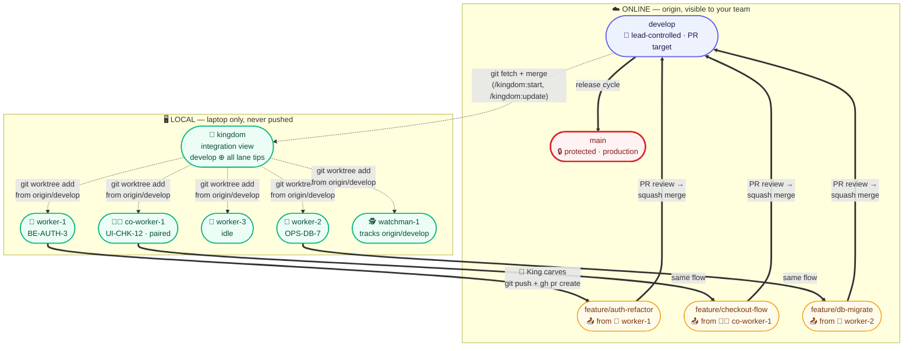

<div align="center">

# 👑 kingdom

**One King. N workers. Auditable parallel work with Claude Code — any domain you version with git.**


[Install](#-install-30-seconds) · [Setup](#-first-time-setup-90-seconds) · [Shapes](#kingdom-new----pick-your-shape) · [Roles](#-meet-the-king----and-the-masters-that-work-for-it) · [FAQ](#-faq)

</div>


A Claude Code plugin that turns one Claude session into a coordinated team — each lane in its own git worktree on its own branch. **You stay in one chat with the King.** The King runs gates, asks before every push, and writes audit artifacts you can grep next month. No new runtime, no daemons. Just Claude + git worktrees + a clean discipline.

**Domain-agnostic by design.** Code, research, finance models, scientific notebooks, manuscripts — anything you version in git, the kingdom can orchestrate. Workers are generic capacity; `gate.*` commands are arbitrary bash. Same kit works whether your "tests" run `pytest`, `Rscript`, or `pandoc --validate`.

---

## ✨ Why kingdom?

- **Real parallelism** — 3–10 lanes editing different branches simultaneously, isolated by `git worktree`
- **One conversation** — you talk to the King; the King talks to the lanes; you never juggle panes
- **Full audit trail** — every task leaves a 4-step closer artifact: raw log → curated digest → master log line → sentinel flag
- **Zero new runtime** — cmux + tmux + jq + gh are standard dev tooling; the protocol is plain text

---

## 🚀 Install (30 seconds)

In **any** Claude Code session, register the marketplace then install the plugin:

```
/plugin marketplace add chatthong/kingdom
/plugin install kingdom@kingdom
```

> First command adds this repo as a marketplace; second installs the plugin from it (plugin-name @ marketplace-name). Local-path install also works for development: `/plugin install /path/to/kingdom`.

Then run the doctor to verify your machine:

```
/kingdom:doctor
```

`/kingdom:doctor` checks `cmux.app`, `tmux`, `jq`, `gh`, and `~/.claude/settings.json`. For anything missing it prints the exact `brew install` command. For `settings.json` it shows a diff and asks before patching. **It never auto-installs system deps.**

Dependencies (`/kingdom:start` auto-detects PRIMARY → FALLBACK → HEADLESS and dispatches accordingly):

```bash
brew tap manaflow-ai/cmux && brew install --cask cmux   # macOS primary dispatch
brew install tmux jq gh                                   # CLI helpers
gh auth login                                             # for PR babysitting
```

> **About worktrees:** The kingdom uses `git worktree` directly — built into git ≥ 2.5. No wrapper CLI needed.

Update anytime:

```
/plugin update kingdom
```

---

## 🏗 First-time setup (90 seconds)

Pick a **workspace root** — a directory whose subdirectories have their own `.git/`. **Not a git repo itself.**

```bash
mkdir -p ~/code/my-workspace
cd ~/code/my-workspace
# clone your projects into subfolders: bfg-swt/, my-app/, whatever

claude                   # launch Claude Code AT THE WORKSPACE ROOT
```

Inside Claude, scaffold the workspace (once) AND your first project — same command, args-driven:

```
/kingdom:init my-app
```

This single call does **both** layers:
- **Workspace layer** (once per workspace): creates `.kingdom/.setting/` with the 6 role docs + verifies `.claude/settings.json` has the sub-agent permissions allow-list.
- **Project layer** (per project): creates `.kingdom/my-app/kingdom.json` + `.kingdom/my-app/{logs,tasks}/`. Default shape: **3 workers + 1 co-worker + 1 watchman**.

Or run them separately if you prefer:

```
/kingdom:init                # workspace layer only
/kingdom:init my-app         # project layer (workspace done already)
/kingdom:init other-app      # another project, same workspace
```

Idempotent — re-running on existing scaffolding just prints status.

---

## 🔁 Resume work (5 seconds)

Day 2+: the kingdom is already scaffolded. Two flows depending on how you left things.

### If you closed your terminal but kept cmux.app open

cmux.app persists workspaces across reboots. Just click back into the 👑 King pane and keep typing — all worktrees, panes, and lane sessions are exactly where you left them.

### If you closed cmux.app (or weren't using it)

```bash
cd ~/code/my-workspace
claude                    # start the King
```

Inside Claude:

```
/kingdom:start my-app     # idempotent — resumes existing worktrees, re-spawns lanes
```

The King reads `.kingdom/my-app/{kingdom.json, tasks/, logs/}` to know:
- Which sub-tasks were claimed (`logs/claims/*.lane`)
- What shipped already (`master_agent.log`)
- Which lanes are mid-task (task files with unchecked boxes)

Tell the King "what's the state?" for a summary, or just continue: "👷 worker-1 — keep going on BE-AUTH-3" and the King re-dispatches.

### When you've been away a while (weekend, vacation)

```
/kingdom:update my-app    # audit sweep before resuming
```

The 4-specialist fan-out surfaces:
- **Gap A** — project docs claim work was done; kingdom has no log of it (out-of-band commits while you were away)
- **Gap B** — kingdom shipped work but project docs didn't get updated
- Stale task files, orphan logs, broken cross-refs

Run this on Monday morning. Then `/kingdom:start` to spin lanes back up.

---

## `/kingdom:init <project>` — pick your shape

```
/kingdom:init <project> [workers=N] [co-workers=M] [watchman=K]
```

Each parameter is independent — set what you need, the rest fall to defaults.

#### 🏢 Mid-size project — the default

```
/kingdom:init my-app
```

Equivalent to `workers=3 co-workers=1 watchman=1`. One worker per component (backend / frontend / ops), one paired lane reserved for you, one watchman over everything. **Start here unless you have a specific reason not to.**

#### 🏭 Large project — specialized workers

```
/kingdom:init my-app workers=5 co-workers=2 watchman=1
```

Five autonomous workers (e.g., backend / frontend / mobile / infra / docs), two paired tracks (e.g., design exploration + content review), one watchman. Useful when one developer is steering many concurrent threads.

#### 🚀 Solo side-project — single autonomous lane

```
/kingdom:init my-app workers=1 co-workers=0 watchman=0
```

One worker, no monitoring, no paired track. Best for rapid prototypes or one-person repos where parallelism + audit overhead isn't worth it.

#### 🎨 UI-heavy day — everything paired

```
/kingdom:init my-app workers=0 co-workers=2 watchman=1
```

No autonomous work — every lane is paired with you (e.g., redesigning the navbar in `co-worker-1` while iterating on the checkout flow in `co-worker-2`). One watchman keeps you informed of anything moving on `develop`.

#### 🌙 Unattended overnight — autonomous + heavy monitoring

```
/kingdom:init my-app workers=3 co-workers=0 watchman=2
```

Three workers grinding a sub-task queue; two watchmen (one on backend smoke, one on frontend smoke). No paired track — you're not at the keyboard. `WATCH_*.md` reports give you the morning recap.

---

### What each parameter does

| Param | Role | Default | What it spawns |
|---|---|---|---|
| `workers=N` | Autonomous task lanes | `3` | `worker-1` … `worker-N` — each picks a sub-task and works it without your involvement |
| `co-workers=M` | Paired lanes for hands-on work | `1` | `co-worker-1` … `co-worker-M` — dormant by default; activate with *"pair on co-worker-1"* |
| `watchman=K` | Continuous monitors | `1` | `watchman-1` … `watchman-K` — each runs `/loop` to track `origin/develop` + babysit open PRs |

Soft cap: total lanes ≤ `sanityCap` (default `10`). Past 10 the UI gets cramped and the King has too much to juggle. Override in `kingdom.json`.

---

### What happens when you run `/kingdom:init <project>`

1. **Creates** `.kingdom/<project>/kingdom.json` from the template, shape pre-filled.
2. **Creates** `.kingdom/<project>/{logs,tasks}/` directories — the audit-trail homes.
3. **Prints** the resulting JSON for you to review.

**Declare ≠ launch.** `/kingdom:init <project>` only *declares* the shape. Before running `/kingdom:start my-app`, open the generated `kingdom.json` and customise:

- `gate.*` command lists — what King runs before every push. Keys are arbitrary — dev stacks use `typecheck`/`tests`/`smoke`/`lint`; finance work might use `validate`/`audit`; science work might use `reproduce`/`peer-review`. Rename / add / remove freely.
- `git.base` — your PR target branch (default `develop`; many repos use `main`)

That's the entire customisation surface. **Workers are generic capacity** — no preset focus or path locks. The King assigns each task at dispatch time (see [`kings.md`](.kingdom/.setting/kings.md) → "Dispatch brief schema"), so `worker-1` and `worker-2` are interchangeable. Same worker can do backend today, frontend tomorrow, financial-model audit the day after.

> **Re-running `/kingdom:init <project>` on an existing project** shows the existing config and asks before overwriting. Re-running replaces the whole file — back up your `gate.*` customisations first if you've filled them in.

---

## 👋 Meet the King — and the masters that work for it

One King, N masters. You talk to the King; the King talks to the masters; the masters do the work. Each is a real Claude Code session — no daemons, no orchestrator runtime, no magic. Just role discipline.

### 👑 The King — Opus

Lives in your primary checkout on a local-only `kingdom` branch. **Holds your conversation.** Plans. Gates. Pushes. **Never edits files directly.** When you say "King, plan today's work," the King spawns parallel planning agents (Haiku to scan tasks, Sonnet to triage), writes its own task file with the multi-layer plan, then dispatches sub-tasks to the masters. Before any `git push`, the King runs the pre-commit gate (typecheck + tests + dry-merge + cross-lane overlap), reports back to you, and waits for explicit approval. **It's the only role with push authority — and only after you say "push."**

### 👷 Workers — Opus, autonomous masters

Three (or N) parallel lanes, each a long-lived Claude Code session inside its own `git worktree` on its own local-only `worker-N` branch. Workers pick claimable sub-tasks from your task source (`TODO_Master.csv`, GitHub issues — whatever you configure), then **plan first**: every assignment begins with a task file capturing the multi-layer plan (Discovery → Strategy → Execution → Verification) before any code change happens. Inside each layer, workers spawn their own sub-agent fleet (Sonnet for edits, Haiku for bulk reads, Opus for sensitive files) with no eco-mode cap — N is chosen for best result, not for parallelism's sake. When done, the worker signals the King via a 4-step closer.

### 🧑‍💼 Co-workers — Opus, paired with you

The lanes you drive yourself. Dormant by default; activate when you say *"pair on co-worker-1 — I'll redesign the checkout flow."* Inside that pane you type the brief, the co-worker assists interactively, you make the calls. Same task file convention. Same pre-commit gate. Same push approval. The difference: **you** set the scope, **you** set the pace.

### 🕵️ Watchmen — Sonnet, always-on monitors

Passive. Continuous. Each watchman runs `/loop` in dynamic-pacing mode (5–15 min). It watches `origin/develop` tip, runs your smoke tests on every advance, babysits open PRs (CI rollup, review state, mergeability), and writes `WATCH_*.md` reports + sidebar notifications. **Read-only + test-runner + alerter.** Never edits, never pushes.

### 🐱 Sub-agents — Sonnet / Haiku / Opus, one-shot

The leaves of the tree. Spawned by the King (for planning) or by any master (for execution). `Agent(model=…)` calls — short-lived, single-task. Each runs its own 4-step closer. Model picked per task: Sonnet for standard work (P1), Haiku for bulk reads (P2), Opus for sensitive files (P3). Lane masters fan them out in parallel and synthesise the outputs.

---

**The pattern in one sentence:** the King reasons about WHAT, the masters reason about HOW, and the sub-agents do the doing. You stay in one chat. Everything else is the kingdom.

---

## 🎭 Roles at a glance

| Role | Model | What it does | Spec |
|---|---|---|---|
| 👑 **King** | Opus | Orchestrator. Holds your conversation. Sole pusher. Never edits files. | [`kings.md`](.kingdom/.setting/kings.md) |
| 👷 **Worker** | Opus | Autonomous lane. Picks + executes sub-tasks. Spawns own sub-agents (no eco cap). | [`workers.md`](.kingdom/.setting/workers.md) |
| 🧑‍💼 **Co-worker** | Opus | Paired with you. Dormant until you signal. | [`co-workers.md`](.kingdom/.setting/co-workers.md) |
| 🕵️ **Watchman** | Sonnet | Passive monitor (`/loop`, 5–15 min). Smoke + PR babysitting. Never edits, never pushes. | [`watchmans.md`](.kingdom/.setting/watchmans.md) |
| 🐱 **Sub-agent** | Sonnet/Haiku/Opus | One-shot via `Agent(model=…)`. Spawned by King or a lane. | [`workers.md`](.kingdom/.setting/workers.md) |

---

## 🌳 Branch model

Five 🖥️ LOCAL-only branches never leave your laptop. Only `feature/<topic>` ever reaches origin. The King is the **sole pusher** — lanes are private workshops, features are the public surface.

### Worked example — 3 lanes in flight



### What lives where

| Branch | Lives | Lifetime | Touched by | Reaches origin? |
|---|---|---|---|---|
| `main` | online (protected) | permanent | release manager | ✅ origin/main |
| `develop` | online | permanent | lead via PR merge | ✅ origin/develop |
| `feature/<topic>` | online | one PR, then deleted | 👑 King (carve + push + PR) | ✅ origin/feature/* |
| `kingdom` | local only | permanent | 👑 King (fetch + merge from origin/develop) | ❌ never |
| `worker-N` | local only | slot identity — reset per PR | 👷 worker-N | ❌ never |
| `co-worker-N` | local only | slot identity — reset per PR | 🧑‍💼 co-worker-N | ❌ never |
| `watchman-N` | local only | reset every `/loop` tick to `origin/develop` | 🕵️ watchman-N (read-only) | ❌ never |

### The two-surface decoupling

**Work surface** (`worker-N`, `co-worker-N`) — long-lived local slots. They get hard-reset to a fresh tip per PR, but the slot itself persists across many tasks. Same `worker-1` does BE-AUTH-3 this week and FE-ICONS-9 next week.

**PR surface** (`feature/<topic>`) — one PR, one branch. Carved fresh at push time, deleted after merge. The branch name is descriptive (`feature/auth-refactor`, not `feature/worker-1-week-15`) so reviewers see what they're reviewing, not who.

This decoupling means lane numbers are **operational identifiers** (which tmux pane, which worktree directory) — not **content identifiers**. The repo history stays clean because no `worker-N` ever leaves the laptop.

Full commit flow + push gate + FINAL conflict check: [`git.md`](.kingdom/.setting/git.md).

---

## ⚙️ Configure your project

`/kingdom:init <project>` creates `.kingdom/<project>/kingdom.json`. Edit it before running `/kingdom:start`:

```json
{
  "shape": { "workers": 3, "co-workers": 1, "watchman": 1, "sanityCap": 10 },
  "git":   { "base": "develop", "integrationBranch": "kingdom", "pushPolicy": "always-ask" },
  "workers":   [ { "slug": "worker-1", "model": "opus" },
                 { "slug": "worker-2", "model": "opus" },
                 { "slug": "worker-3", "model": "opus" } ],
  "coworkers": [ { "slug": "co-worker-1", "model": "opus" } ],
  "watchmen":  [ { "slug": "watchman-1", "model": "sonnet", "docsAudit": true } ],
  "gate": {
    "typecheck": ["pnpm -r typecheck"],
    "tests":     ["pnpm -r test", "pytest -q"],
    "smoke":     ["bash scripts/smoke.sh"],
    "lint":      ["pnpm -r lint", "ruff check ."]
  }
}
```

The King reads this at `/kingdom:start` to:
- Spawn the right number of lanes (`shape` counts)
- Pick a model per lane (Opus for masters, Sonnet for watchman — override if you want cheaper)
- Run YOUR exact gate commands inside each lane's worktree before any PR

> **Workers are generic.** No per-worker `focus` or `ownsPaths` — the King assigns scope at dispatch time (any worker can do any task; same worker does backend today, frontend tomorrow). `gate.*` keys are arbitrary — rename for non-dev domains (`validate`/`audit` for finance, `reproduce`/`peer-review` for science).

---

## 🔧 Slash commands

| Command | What it does |
|---|---|
| `/kingdom:doctor` | Check prerequisites — `cmux.app`, `tmux`, `jq`, `gh`, `git ≥ 2.5`, user-global + workspace `settings.json` (auto-patches both with diff + ask), `tasks/` writable, orphan audit artifacts, git state across projects. 10 checks. Re-run anytime. |
| `/kingdom:init` | Workspace scaffold only — `.kingdom/.setting/` role docs + `.claude/settings.json` permissions. |
| `/kingdom:init <project> [workers=N] [co-workers=M] [watchman=K] [base=<branch>]` | Workspace scaffold (if missing) + project scaffold — `.kingdom/<project>/kingdom.json` + `tasks/` + `logs/`. |
| `/kingdom:start <project>` | Spawn the lanes for `<project>` — git worktrees + cmux/tmux/headless dispatch + sidebar tags + watchman `/loop`. Reads shape from `kingdom.json` (no override args — change shape via `kingdom.json` or `/kingdom:init`). Idempotent — re-running resumes existing worktrees. |
| `/kingdom:update [project=<name>] [--force]` | Audit sweep — auto-switches to `kingdom` branch + spawns 4 parallel specialists + Haiku scanner fan-out. Surfaces gaps between project doc claims and kingdom logs. Idempotent. Current project only. |
| `/kingdom:exit [project=<name>] [--force] [--include-king] [--audit]` | Graceful teardown — checks in-flight work (asks before force-closing), notifies each lane, gracefully exits Claude in each workspace, closes lane workspaces, writes session-end log line. Keeps King's workspace by default. |

---

## 🔄 Updating the plugin

Two layers, different routines:

```bash
/plugin update kingdom    # 1. pull new plugin code (slash commands + templates)
/kingdom:doctor           # 2. (optional) check for new env requirements
/kingdom:init             # 3. (optional) re-sync workspace role docs from new templates
```

| Asset | Survives plugin update? |
|---|---|
| Slash commands | replaced by new version (immediate) |
| Role doc templates (in plugin) | replaced by new version |
| Workspace `.kingdom/.setting/*.md` | ✅ untouched — re-run `/kingdom:init` to sync |
| Your `kingdom.json` configs | ✅ untouched |
| `tasks/` + `logs/` audit trail | ✅ untouched (your work is safe) |
| `.claude/settings.json` permissions | ✅ untouched |

If a release changes the `kingdom.json` schema (e.g., v0.5.0 dropped `focus`+`ownsPaths`), the CHANGELOG entry for that version tells you what to edit. Schema migrations are manual edits right now — a future `/kingdom:migrate` command may automate this.

---

## 🧠 How it works

The King is a long-lived Claude Opus session in your project's primary checkout, on a local-only `kingdom` branch (an integration view: `develop` ⊕ every lane's tip). It **never edits files** — its job is orchestration: read `kingdom.json`, pick sub-tasks, dispatch via `cmux send` (primary), `tmux send-keys` (fallback), or `claude -p` (headless).

Each lane is a Claude teammate inside its own plain `git worktree` on its own local-only `<role>-<n>` branch. Workers pick claimable sub-tasks, execute via their own sub-agent fleet (Sonnet/Haiku/Opus, **unbounded parallel** — N chosen for *best result*, not 1:1 with files), and signal completion via a **4-step closer**:

```
1. Raw output      →  <LOGS>/raw/<ID>__<lane>.md
2. Curated digest  →  <LOGS>/<ID>.md            (## TL;DR · first 15 lines)
3. Master log line →  <LOGS>/master_agent.log   (append-only)
4. Sentinel flag   →  <LOGS>/done/<ID>__<lane>.flag  (+ optional cmux notify)
```

Where `<LOGS> = <workspace>/.kingdom/<project>/logs/` — outside any project's git, so no `.gitignore` entries leak.

Before any sub-agent dispatch, the lane master writes a **task file** at `.kingdom/<project>/tasks/<UTC>__<lane>__<sub-task-id>.md` — a checkbox doc with the multi-layer plan (Discovery → Strategy → Execution → Verification), live progress, and final summary. It's the human-readable audit trail of HOW the work happened.

The King polls the sentinel, runs your **pre-commit gate** (typecheck + tests + dry-merge against develop + cross-lane file-overlap check), writes a per-lane test report, and asks you "push?". On approval, it runs a **FINAL conflict check** against `origin/develop` via `git merge-tree` (a plumbing dry-merge with zero side effects — catches drift if the lead merged something while you were deciding), carves a fresh `feature/<topic>` branch from the lane tip, and pushes. After PR merge, the lane resets for the next sub-task.

The **Watchman** is separate: a `/loop` agent (dynamic 5–15 min) that tracks `origin/develop` tip and babysits open PRs — runs smoke when develop advances, alerts on CI transitions, posts notifications when a PR is ready to merge. Read-only + test runner + alerter. Never edits, never pushes.

Full role specs: [`.kingdom/.setting/index.md`](.kingdom/.setting/index.md).

---

## 🤔 Why?

**Problem:** running multiple Claude sessions in parallel means each one editing the same files, fighting over git state, broken builds, lost work.

**Existing fixes:** `git worktree` gives isolated checkouts but no orchestration. Manual tmux gives panes but no audit trail. Headless `claude -p` chains give batch but no visibility.

**kingdom:** an opinionated stack that puts these together:

- `git worktree` for isolation (built into git ≥ 2.5)
- tmux-protocol for dispatch (via cmux.app's `__tmux-compat`)
- Claude Code's experimental agent-teams mode for native team-spawn
- 4-step closer artifact discipline so every task leaves a paper trail

**You get:**
- Real parallelism (3–10 lanes editing different branches simultaneously)
- One conversation (you talk to the King; the King talks to lanes)
- One audit trail (`tail -n 50 <workspace>/.kingdom/*/logs/master_agent.log` — all projects, one command)
- Zero new runtime (cmux + tmux + jq + gh are common dev tooling)
- macOS-native via cmux.app; Linux/remote-fallback via raw tmux

---

## ❓ FAQ

<details>
<summary><strong>Does this require Opus?</strong></summary>

Yes for the King, Workers, and Co-workers. Watchmen are Sonnet (P1) by default. Sub-agents use Sonnet (P1) / Haiku (P2) / Opus (P3) — lane masters choose based on task weight.

</details>

<details>
<summary><strong>Does this work on Linux?</strong></summary>

The "primary" path (cmux.app) is macOS-only. The "fallback" path uses raw tmux and works on Linux — git worktrees are built-in everywhere. Same artifact protocol on both paths; just the dispatch mechanism differs. See [`TMUX-Guide.md`](TMUX-Guide.md).

</details>

<details>
<summary><strong>What if my project uses different commands?</strong></summary>

Edit `kingdom.json` → `gate.*` arrays per project. The King runs whatever you put there — `cargo check`, `pytest`, `mvn verify`, anything.

</details>

<details>
<summary><strong>Can I have 7 workers?</strong></summary>

Yes. Set `kingdom.json` → `shape.workers = 7`. Soft cap is 10 lanes total (`sanityCap`); the workspace gets cramped past that. Override `sanityCap` in `kingdom.json` if you really want more.

</details>

<details>
<summary><strong>Does it work with squash merge?</strong></summary>

Yes. `kingdom.json` → `git.mergeStyle` can be `merge-commit` (default) or `squash`. The King carves clean feature branches either way.

</details>

<details>
<summary><strong>Can I commit <code>.kingdom/</code> to my workspace?</strong></summary>

`.kingdom/` is outside any project's git by design (workspace root is not a repo). If your workspace IS a repo, gitignore `.kingdom/<project>/logs/` — the config file (`.kingdom/<project>/kingdom.json`) is fine to commit and useful for onboarding new agents.

</details>

<details>
<summary><strong>What's a task file?</strong></summary>

Every assignment to a lane creates one at `.kingdom/<project>/tasks/<UTC>__<lane>__<sub-task-id>.md`. It's a checkbox markdown doc with the multi-layer plan, progress notes, and final summary. Lane master writes; sub-agents and you can read it to follow along. Never deleted, never reused. Full schema in [`workers.md`](.kingdom/.setting/workers.md) → "Task file".

</details>

<details>
<summary><strong>What happens if a lane crashes?</strong></summary>

State persists in the worktree filesystem. Re-running `/kingdom:start <project>` detects existing worktrees and `cd`s into them (resume) instead of `git worktree add` (create). The 4-step closer's sentinel flag is the source of truth — if the flag is present, the lane finished; if not, dispatch a fix-task.

</details>

<details>
<summary><strong>Can I run this without manaflow/cmux?</strong></summary>

Yes. `/kingdom:start` auto-detects what's available. If cmux.app isn't running, it falls back to raw tmux automatically — no config change, no extra tools required.

</details>

<details>
<summary><strong>What is `/kingdom:update` for?</strong></summary>

A forced audit sweep. Spawns a Sonnet sub-agent that re-reads every task file in `.kingdom/<project>/tasks/`, cross-checks each checkbox against `git log`, backfills orphan raw artifacts (raw with no curated digest), repairs missing `master_agent.log` summary lines, and flags higher-risk items (stale digests to rewrite, task files to merge, suspect "claimed-done-but-no-commit" entries) for King review. Idempotent — safe to run any time. Watchman does the same low-risk fixes continuously during idle `/loop` time; `/kingdom:update` is the explicit one-shot version.

</details>

<details>
<summary><strong>Does the watchman edit my files?</strong></summary>

Only audit artifacts under `.kingdom/<project>/{tasks,logs}/`, and only for **low-risk** fixes (tick a stale checkbox when a matching commit is found, backfill a missing log line, fix a dead `[[name]]` link). It NEVER edits project source code, role specs, `kingdom.json`, or `.git/`. **High-risk** changes (digest rewrites, task-file merges, archive moves) are flagged to `WATCH_DOCS_AUDIT.md` — King decides + acts. Full split in [`watchmans.md`](.kingdom/.setting/watchmans.md) → "Docs audit duty".

</details>

---

## 🧑‍💼 Contributing

The kingdom is opinionated by design — most defaults exist because of a specific failure mode. Before changing a rule, read the role file that owns it ([`.kingdom/.setting/`](.kingdom/.setting/)).

Especially welcome:

- Brew tap formula (`brew install chatthong/tap/kingdom`)
- Linux dev-container preset
- Per-stack `kingdom.json` examples (Rust, Go, Python+Django, Next.js+TRPC, etc.)
- VS Code task definitions that wrap `/kingdom:start`

---

## 📜 License

See [LICENSE](LICENSE).

---

<div align="center">

<sub>Built on [manaflow-ai/cmux](https://github.com/manaflow-ai/cmux), git worktrees (built-in ≥ git 2.5), and Claude Code's experimental agent-teams mode.</sub>

<sub>The kingdom is Claude-only — Codex/Kimi/other-CLI integration is out of scope.</sub>

<br/>

If this saves you time, ⭐ the repo.

</div>
