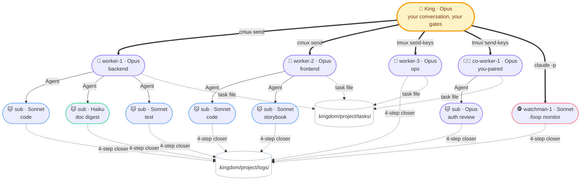

<!--
kingdom — Multi-agent orchestration kit for Claude Code (a Claude Code plugin).
Parallel AI coding with git worktrees, native cmux.app integration, audit-first
design, and human-in-the-loop push gates.

Keywords: claude code plugin, multi-agent orchestration, ai agent fleet,
parallel ai coding, git worktree, claude sub-agents, claude code teammates,
cmux integration, ai code review, autonomous coding agent, agent orchestrator,
claude opus sonnet haiku, ai pair programming, claude code teams alternative,
composio agent-orchestrator alternative, anthropic claude plugin.
-->

<div align="center">

# 👑 kingdom

### Multi-agent orchestration kit for Claude Code

**One King. N workers. Auditable parallel work, any domain you version with git.**


[Quick start](#-quick-start) · [Install](#-install) · [Contract](#-the-contract) · [Slash commands](#-slash-commands) · [Docs](#-docs)

</div>

---

## ⚡ Quick start

```bash
# 1. Install (in any Claude Code session)
/plugin marketplace add chatthong/kingdom
/plugin install kingdom@kingdom

# 2. Scaffold a workspace, once per workspace (~90s)
/kingdom:init my-app

# 3. Run the day, the ONE command you type every morning
/kingdom:day my-app
```

`/kingdom:day` is the canonical daily ritual. It audits the project, spawns the lanes, prints a kickoff brief with your local date+time and a Suggested next task, then auto-dispatches + auto-gates work until something needs your approval. You stay in one chat with the King.

```bash
# Optional caps + targets
/kingdom:day my-app cap=5                  # hard stop at 5 task-completions today
/kingdom:day my-app target=30-50/week      # soft budget; auto-splits to ~6-10/day
/kingdom:day my-app target=30-50/day       # auto-splits to ~150-250/week
```

You now have **5 AI agents** in cmux.app's sidebar: 👑 King, 3× 👷 workers, 1× 🧑‍💼 co-worker, 1× 🕵️ watchman, each in its own colour-coded workspace, all coordinated through your one chat with the King.



A Claude Code plugin that turns one Claude session into a coordinated team: each lane in its own git worktree on its own branch. **You stay in one chat with the King.** The King runs gates, asks before every push, and writes audit artifacts you can grep next month. No new runtime, no daemons. Just Claude + git worktrees + a clean discipline.

**Domain-agnostic by design.** Code, research, finance models, scientific notebooks, manuscripts: anything you version in git, the kingdom can orchestrate. Workers are generic capacity; `gate.*` commands are arbitrary bash. Same kit works whether your "tests" run `pytest`, `Rscript`, or `pandoc --validate`.

---

## ✨ Why kingdom?

- **Real parallelism** — 3-10 lanes editing different branches simultaneously, isolated by `git worktree`
- **One conversation** — you talk to the King; the King talks to the lanes; you never juggle panes
- **Native cmux.app feel** — every role gets its own colour-coded workspace; notifications fire as blue rings, badges, and bell-panel entries
- **Full audit trail** — every task leaves a 4-step closer artifact: raw log, curated digest, master log line, sentinel flag
- **Zero new runtime** — cmux + tmux + jq + gh are standard dev tooling; the protocol is plain text

---

## 🚀 Install

```bash
/plugin marketplace add chatthong/kingdom
/plugin install kingdom@kingdom
/kingdom:doctor
```

`/kingdom:doctor` tells you what's missing (cmux.app, tmux, jq, gh, settings.json keys) and offers to fix it.

---

## 🛡 The contract (what kingdom won't touch)

- ❌ Your project files outside `.worktrees/<lane>/` — main checkout untouched until you say "push"
- ❌ `develop` and `main` — read-only; only `feature/<topic>` reaches origin
- ❌ Pushes — never without your explicit "push?" approval
- ❌ Your `~/.zshrc`, `~/.gitconfig`, PATH, shell hooks — zero modifications
- ❌ Your `.gitignore` — kingdom adds ONE line (`.worktrees/`) and stops there
- ✅ `rm -rf .kingdom/ .worktrees/` removes the kingdom; your project, git history, branches survive intact

---

## 🎭 Roles at a glance

| Role | Model | What it does | Spec |
|---|---|---|---|
| 👑 **King** | Opus | Orchestrator. Holds your conversation. Sole pusher. Never edits files. | [`kings.md`](.kingdom/.setting/kings.md) |
| 👷 **Worker** | Opus | Autonomous lane. Picks + executes sub-tasks. Spawns own sub-agents (no eco cap). | [`workers.md`](.kingdom/.setting/workers.md) |
| 🧑‍💼 **Co-worker** | Opus | Paired with you. Dormant until you signal. | [`co-workers.md`](.kingdom/.setting/co-workers.md) |
| 🕵️ **Watchman** | Sonnet | Passive monitor (`/loop`, 5-15 min). Smoke + PR babysitting. Never edits, never pushes. | [`watchmans.md`](.kingdom/.setting/watchmans.md) |
| 🐱 **Sub-agent** | Sonnet/Haiku/Opus | One-shot via `Agent(model=…)`. Spawned by King or a lane. | [`workers.md`](.kingdom/.setting/workers.md) |

Full role write-ups: [`docs/roles.md`](docs/roles.md).

---

## 🔧 Slash commands

| Command | What it does |
|---|---|
| **`/kingdom:day [project] [target=N-M/<day\|week\|month>] [cap=N]`** | **THE daily ritual.** Audit + spawn + kickoff brief (local date+time + Suggested next task) + auto-gate-poll loop. `target=` is a soft budget; `cap=` is a hard daily ceiling. The one command you type every morning. |
| `/kingdom:init [<project>] [workers=N] [co-workers=M] [watchman=K]` | Workspace + optional project scaffold. See [`docs/configuration.md`](docs/configuration.md) for shape choices. |
| `/kingdom:doctor` | Check prerequisites: cmux.app, tmux, jq, gh, git ≥ 2.5, settings.json keys. Re-run anytime. |
| `/kingdom:exit [project]` | Graceful teardown. Closes lane workspaces; keeps King's workspace by default. |
| `/kingdom:start <project>` | *(Building block, `/kingdom:day` invokes this.)* Spawn lanes only. Idempotent. Use standalone for resume-after-crash. |
| `/kingdom:update [project]` | *(Building block, `/kingdom:day` invokes this.)* Audit-only pass. Use standalone for mid-day re-audit. |

---

## 📚 Docs

| Topic | Where |
|---|---|
| Daily ritual: first-time setup, every-day command, plugin updates | [`docs/daily-ritual.md`](docs/daily-ritual.md) |
| Configuration: project shapes, `kingdom.json`, `gate.*` keys | [`docs/configuration.md`](docs/configuration.md) |
| Roles: King, workers, co-workers, watchmen, sub-agents | [`docs/roles.md`](docs/roles.md) |
| Branch model: lifecycle, overlay, two-tier gate, three rules | [`docs/branch-model.md`](docs/branch-model.md) |
| cmux.app integration: sidebar, notifications, three-tier hierarchy | [`docs/cmux-integration.md`](docs/cmux-integration.md) |
| How it works: King's role, lane mechanics, 4-step closer | [`docs/how-it-works.md`](docs/how-it-works.md) |
| Why: the problem kingdom solves | [`docs/why.md`](docs/why.md) |
| FAQ | [`docs/faq.md`](docs/faq.md) |
| Internal role specs (King reads these at session start) | [`.kingdom/.setting/`](.kingdom/.setting/) |
| Rules: priority-tiered enforceable rules | [`.kingdom/.setting/rules.md`](.kingdom/.setting/rules.md) |
| Changelog | [`CHANGELOG.md`](CHANGELOG.md) |

---

## 🧑‍💼 Contributing

The kingdom is opinionated by design; most defaults exist because of a specific failure mode. Before changing a rule, read the role file that owns it ([`.kingdom/.setting/`](.kingdom/.setting/)).

Especially welcome:

- Brew tap formula (`brew install chatthong/tap/kingdom`)
- Linux dev-container preset
- Per-stack `kingdom.json` examples (Rust, Go, Python+Django, Next.js+TRPC, etc.)
- VS Code task definitions that wrap `/kingdom:day`

---

## 📜 License

See [LICENSE](LICENSE).

---

<div align="center">

<sub>Built on [manaflow-ai/cmux](https://github.com/manaflow-ai/cmux), git worktrees (built-in ≥ git 2.5), and Claude Code's experimental agent-teams mode.</sub>

<sub>The kingdom is Claude-only. Codex/Kimi/other-CLI integration is out of scope.</sub>

<br/>

If this saves you time, ⭐ the repo.

</div>
