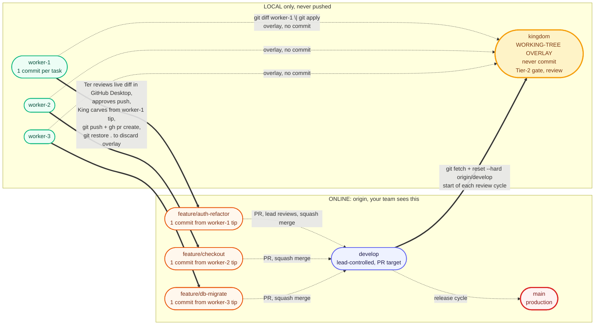

# 🌳 Branch model

> Part of the [kingdom](../README.md) docs.

## TL;DR

Lanes work on `worker-N` (local). King overlays their changes onto `kingdom`'s working tree as **UNCOMMITTED files**, never as commits, so you can review every line in GitHub Desktop's Changes tab. Tier-2 gate runs against the overlay. After you approve, King carves `feature/<topic>` from the `worker-N` tip byte-for-byte and pushes that one-commit branch as a PR to `develop`. **Only `feature/<topic>` ever reaches origin.** After push, King discards the kingdom overlay (`git restore .`); kingdom is back to clean `origin/develop`.

## The lifecycle



## What you see in GitHub Desktop after King overlays

After the King overlays 3 lanes onto `kingdom`, GitHub Desktop's **Changes** tab shows all the modified files at once, line-by-line, ready to click through:

```text
Changes (11)
─────────────────────────────────────────────────────
   .gitignore                                      +3
   TODO.md                                         +1 −1
   ROADMAP.md                                      +1 −1
   docs/feature-x.md                               +30 −17
   src/app/account/layout.tsx                      +7
   src/app/admin/layout.tsx                        +8
   src/app/shop/README.md                          +21  (new)
   src/app/shop/layout.tsx                         +7
   src/app/shop/middleware.ts                      +111 (new)
   docs/test-reports/README.md                     +1
   docs/test-reports/SMOKE_2026-05-18.md           +189 (new)
─────────────────────────────────────────────────────
```

Click any file to see the diff in the right pane. No commit history to navigate. No "History tab" detour. Every change for every in-flight lane is right there, uncommitted, in one place.

## Three rules to remember

1. **Lane branches stay local.** `worker-N` / `co-worker-N` / `watchman-N` never reach origin. They live only on your laptop, accumulating one commit per completed task.
2. **`kingdom` is a local working-tree overlay. Never commit on it.** King resets `kingdom` to `origin/develop`, then overlays each in-flight lane's changes onto the working tree (via `git diff worker-N | git apply` or `git checkout worker-N -- <files>`). Result: every change shows up as UNCOMMITTED in GitHub Desktop's "Changes" tab, VS Code's source-control panel, or `git status`. Review files line-by-line in one view. Tier-2 gate runs on this overlay. After push, `git restore .` discards the overlay; `kingdom` is clean for the next cycle. `kingdom` is never pushed AND never commits.
3. **PRs carve from `worker-N` tip, not from `kingdom`, and stay byte-for-byte identical.** Each `feature/<topic>` is a fast-forward checkout of the lane's tip; no commits are added on the feature branch after carving. Whatever's on `worker-N` IS what ships. If you want extra content in the PR, put it on `worker-N` first (worker commits it) or open a separate PR (different concern, different PR). Adding commits to `feature/*` after carving breaks the kingdom-as-truth-of-what-ships invariant.

## What lives where

| Branch | Lives | Lifetime | Touched by | Reaches origin? |
|---|---|---|---|---|
| `main` | online (protected) | permanent | release manager | ✅ origin/main |
| `develop` | online | permanent | lead via PR merge | ✅ origin/develop |
| `feature/<topic>` | online | one PR, then deleted | 👑 King (carve from worker-N tip + push + PR) | ✅ origin/feature/* |
| `kingdom` | **local only · no commits** | permanent branch, transient working-tree overlay (reset to origin/develop, overlay lanes, review, discard) | 👑 King (reset + overlay + Tier-2 gate + discard) | ❌ never |
| `worker-N` | **local only** | slot identity; same lane does many tasks over time | 👷 worker-N | ❌ never |
| `co-worker-N` | **local only** | slot identity | 🧑‍💼 co-worker-N | ❌ never |
| `watchman-N` | **local only** | reset every `/loop` tick to `origin/develop` | 🕵️ watchman-N (read-only on source) | ❌ never |

## Two-tier gate (v0.16.0+)

The kingdom is both review staging AND the test environment. Gates run at two tiers:

| Tier | Where | What runs | Speed | Catches |
|---|---|---|---|---|
| **Tier 1** | `.worktrees/worker-N` | `gate.typecheck` only | seconds | Obvious in-lane breakage (typecheck error, import miss) |
| **Tier 2** | `kingdom` (after merge) | `gate.tests` + `gate.smoke` + `gate.lint` on the integrated state | minutes | Cross-lane integration bugs Tier 1 misses |

Push approval requires Tier-2 pass. The single-lane Tier-1 gate is fast feedback; the kingdom-integrated Tier-2 gate is the trust gate.

## Why this design

**Work surface** (`worker-N`, `co-worker-N`) = long-lived local slots. Same `worker-1` does BE-AUTH-3 this week and FE-ICONS-9 next week. Slot persists; tasks rotate through it.

**PR surface** (`feature/<topic>`) = one PR, one branch, one commit, descriptive name. Reviewers see what they're reviewing (`feature/auth-refactor`), not who did it (`feature/worker-1-week-15`).

**Integration surface** (`kingdom`) = the local staging area where all in-flight lane work integrates as UNCOMMITTED working-tree changes before any byte reaches origin. Tier-2 gate runs against the overlay. You review file-by-file in GitHub Desktop's Changes tab (or any diff tool). After push, the overlay is discarded. The `kingdom` branch itself never accumulates commits, never gets pushed.

Full commit flow + push gate + FINAL conflict check details: [`git.md`](../.kingdom/.setting/reference/git.md) and [`king.md`](../.kingdom/.setting/roles/king.md).

## See also

- [`how-it-works.md`](how-it-works.md): the run-time mechanics behind the branch dance
- [`roles.md`](roles.md): who's allowed to touch which branch
- [`work-cycle.md`](work-cycle.md): how `/kingdom:work` exercises all of this
