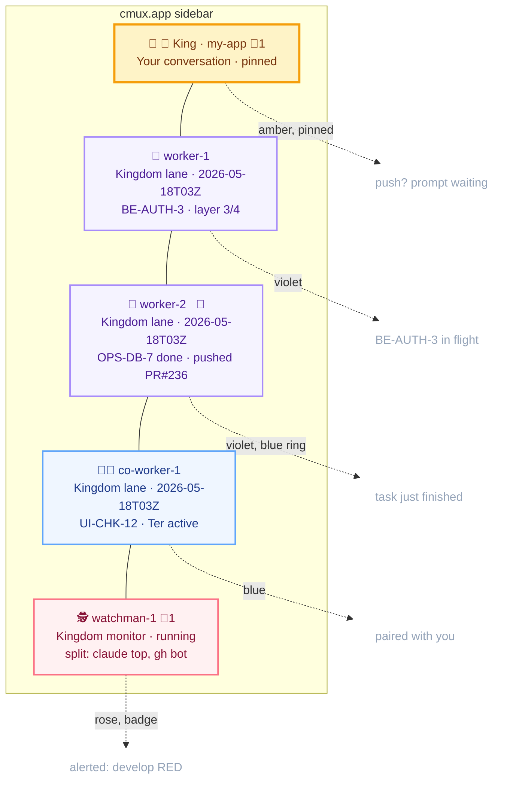
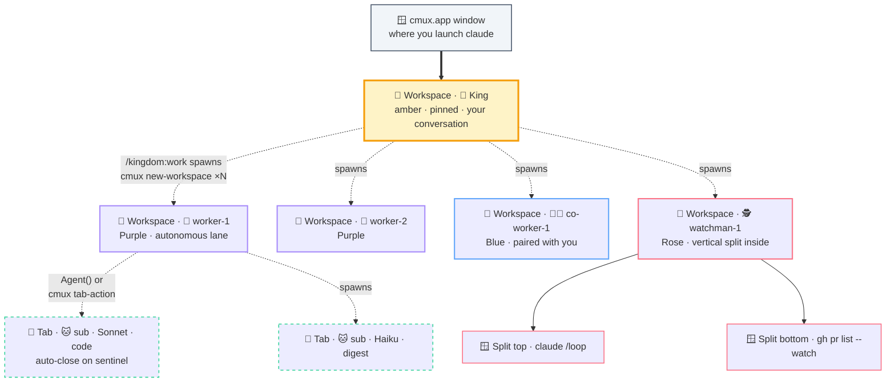

# 🪟 cmux.app integration

> Part of the [kingdom](../README.md) docs.

The kingdom is built for **manaflow/cmux.app** as the PRIMARY mode (raw tmux + headless `claude -p` are graceful fallbacks). When you run `/kingdom:work my-app`, cmux.app's sidebar fills with one **workspace per role**, each in its own colour, each with its own Claude session, each notify-able independently.



## Three visible cmux notification surfaces, all wired in

| Visual | When | Where |
|---|---|---|
| 🔵 **Blue ring on pane** | Worker finishes a task, sub-agent closer fires, gate fails | The pane that needs attention NOW |
| 🔔 **Sidebar badge** | Watchman alerts, push-ready prompts, cross-workspace events | The workspace card that has news |
| 📋 **Bell-icon panel** | Auto-aggregated | Scrollable list at top of sidebar, jump-to-most-recent |

cmux fires native macOS notifications too. The kingdom always passes role-emoji-prefixed titles (`👷 worker-1 done`, `🕵️ watchman-1 · develop RED`, `👑 King · push?`) so the bell panel stays scan-able. Notifications fire on **8 canonical events**; full schema in [`cmux.md`](../.kingdom/.setting/cmux.md) § Notification system.

## Three-tier visual hierarchy



**What the arrows mean:**
- `══>` solid bold: you launch the King inside cmux.app (start of your conversation)
- `-.->` dashed: **spawn** relationships. King spawns lane workspaces via `/kingdom:work`; lane masters spawn sub-agent tabs via `Agent()` (background) or `cmux tab-action --action new-terminal-right` (visible).
- `-->` solid plain: internal split layout (watchman's dual-view top/bottom).

All 6 workspaces (King + 5 lanes) are siblings in cmux.app's actual topology (under the same window), but the King is the **dispatcher** that creates the lane workspaces. The diagram shows the spawn relationship rather than the flat sibling layout.

| Tier | Used for | cmux command | Auto-closes? |
|---|---|---|---|
| 🏢 **Workspace** | One per master (King + every worker + co-worker + watchman) | `cmux new-workspace --name --cwd --command "claude"` + `cmux workspace-action --action set-color` | No, survives across sessions |
| 📑 **Tab** | Visible sub-agent spawn (default: headless `Agent(...)`; tab only when visibility wanted) | `cmux tab-action --action new-terminal-right` | ✅ Auto-closes on sentinel via 5-step closer Step 5 |
| 🪟 **Split** | Watchman dual-view (claude + `gh pr watch`); optional paired-coworker editor | `cmux new-workspace --layout '{…}'` OR `cmux new-split` post-creation | No, same lifetime as parent workspace |

## Other cmux features the kingdom uses

- **Workspace colours**: applied per role from `kingdom.json.cmux.workspaceColors` (defaults: King=amber, Worker=violet, Co-worker=blue, Watchman=rose). Left-edge colour bars in the sidebar make roles distinguishable at 2 metres.
- **Workspace pinning**: `kingdom.json.cmux.pinKingWorkspace: true` keeps the King's workspace at the top of the sidebar even when you spawn more lanes.
- **Workspace descriptions**: set per spawn (`Kingdom lane · <name> · <UTC>`); shows as smaller text under the workspace name. King's description gets updated each session: `Your conversation · pinned · <UTC>`.
- **Layout JSON**: watchman workspaces ship a pre-defined vertical split (top: claude `/loop`, bottom: `gh pr list --watch --interval 30`). Set `kingdom.json.cmux.watchmanLayout` to `null` for a single-pane watchman.
- **`cmux send --workspace <ref>`**: King dispatches task briefs by workspace ref (stable across the session, persisted to `<LOGS>/workspace-refs.env`). No tab-name guessing, no escaping fights.
- **`cmux tree --all`**: King's introspection tool for verifying the layout after spawn or resume.

## What `/kingdom:work` does in PRIMARY mode (spawn phase)

```bash
/kingdom:work my-app
```

Behind the scenes:

1. Reads shape from `.kingdom/my-app/kingdom.json` (workers / co-workers / watchman counts)
2. Renames + recolours + pins your current workspace → `👑 King · my-app` (amber, pinned)
3. For each worker / co-worker / watchman: spawns a workspace via `cmux new-workspace --command "claude"` with the right colour
4. For the watchman: applies the dual-view split layout
5. Persists all workspace refs to `<LOGS>/workspace-refs.env`
6. Reports the resulting sidebar layout

Everything below (task dispatch, gates, audit, push approval, exit) uses those workspace refs. No `cmux claude-teams`, no manual tab juggling.

Note: spawn is Step 0.4 of `/kingdom:work` — it runs automatically when you invoke [`/kingdom:work`](../commands/work.md).

## See also

- [`branch-model.md`](branch-model.md): lifecycle + integration model
- [`roles.md`](roles.md): what each lane actually does
- [`../.kingdom/.setting/cmux.md`](../.kingdom/.setting/cmux.md): full cmux command reference for all roles
